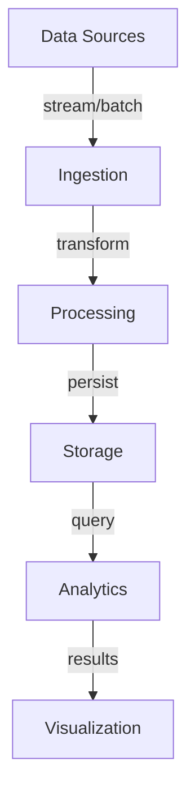

# Partitioning and Bucketing

## System Overview

Comprehensive coverage of partitioning and bucketing in modern data analytics systems.

**Scale Metrics:**
- Petabyte-scale analytics, sub-second queries, 1000s QPS

## Architecture

## Core Concepts

Key aspects of partitioning and bucketing:
- Performance optimization strategies
- Scalability considerations
- Real-world implementation patterns
- Trade-offs and best practices

## Functional Requirements

1. **Data Ingestion** - Multiple data sources
2. **Transformation** - ETL/ELT pipelines
3. **Querying** - Efficient analytics queries
4. **Aggregation** - Pre-computed results
5. **Reporting** - Dashboards and reports
6. **Analysis** - Exploratory analytics

## Non-Functional Requirements

1. **Performance** - Sub-second query latency
2. **Scalability** - Petabyte capacity
3. **Throughput** - 1000s concurrent queries
4. **Availability** - 99.9%+ uptime
5. **Consistency** - Eventual consistency
6. **Cost** - Optimize $/GB

## Back-of-the-Envelope

- 1M users, 100 events/user/day = 100M events
- 1KB per event = 100GB/day
- 3TB/month, 36TB/year
- 10:1 compression = 3.6TB compressed
- 7-year retention = 25TB

## Interview Questions

### Q1: Core design principles?
**Answer:** Focus on partitioning, columnar storage, materialized views, and query optimization to achieve sub-second latency at scale.

### Q2: Performance optimization?
**Answer:** Combine partitioning, column projection, predicate pushdown, and distributed execution for optimal query performance.

### Q3: Scalability strategy?
**Answer:** Horizontal scaling with distributed query execution, data partitioning, and caching layers.

## Technology Stack

- **Warehouses**: Snowflake, BigQuery, Redshift
- **Lakes**: Delta Lake, Iceberg
- **Processing**: Spark, Presto
- **Ingestion**: Kafka, Dataflow
- **Viz**: Tableau, Looker

## Lessons Learned

1. Partition everything - critical for performance
2. Columnar storage - 10x scan speedup
3. Materialized views - fast reporting
4. Monitor costs - storage grows quickly
5. Test at scale - plan ahead
