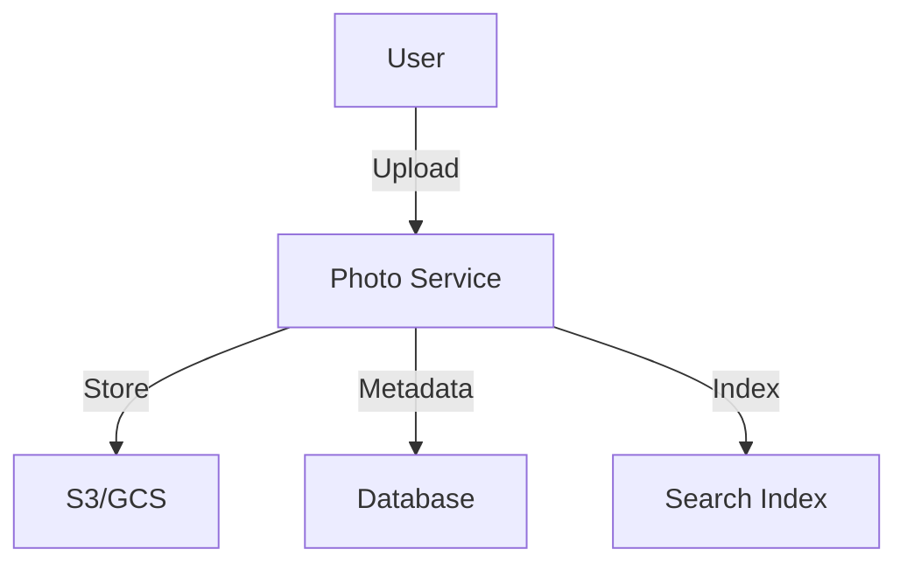
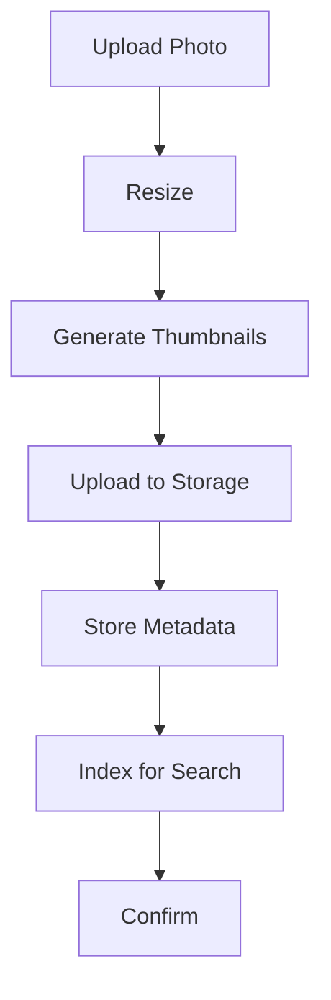

# Photo Sharing Platform

## Problem Statement
Design a photo sharing system with upload, storage, CDN, and thumbnail generation.

**Operations:**
- `uploadPhoto(user_id, file)` — Upload photo
- `getPhoto(photo_id, size)` — Get photo
- `deletePhoto(user_id, photo_id)` — Delete photo
- `getAlbum(album_id)` — Get album

## Design

### Upload Pipeline

```
1. Upload to blob storage (S3)
2. Queue thumbnail generation
3. Generate thumbnails (multiple sizes)
4. Update metadata DB
5. Invalidate CDN cache
```

### CDN Delivery

```
Original → Origin
Thumbnails → Edge cache
User request → Closest edge
Fallback to origin on miss
```

### Storage Optimization

```
Thumbnail compression: 70% size reduction
Original archival: Cheaper tier
Metadata indexing: Fast search
Deduplication: Same photo detected
```


## Architecture Diagram

```
┌──────────────────────────────────────┐
│   Photo Sharing Platform             │
│  ┌──────────────────────────────────┐  │
│  │ Upload Pipeline                  │  │
│  │ - Multipart form (resumable)     │  │
│  │ - Virus scan, EXIF strip         │  │
│  │ - Compression (multiple sizes)   │  │
│  │ Storage & CDN                    │  │
│  │ - S3 + CloudFront               │  │
│  │ Metadata (ElasticSearch)         │  │
│  │ - Search by tags, location       │  │
│  └──────────────────────────────────┘  │
└──────────────────────────────────────────┘
```

## Common Questions & Answers

**Q: Image resizing—when?** A: On-demand first, cache. Pre-resize for popular (expensive). Background worker for bulk.

**Q: Storage cost—how to optimize?** A: Compress lossy (JPEG 75%), delete old/unused, archive to cold storage.

**Q: EXIF data—privacy?** A: Strip location data (privacy), keep upload timestamp/camera (non-sensitive).

**Q: DRM for photos?** A: Watermarking, view-only, disable save. Trade UX vs protection.

## Back-of-Envelope Calculations

1B photos, 2MB avg = 2EB. Resizing: thumbnail (100KB), medium (500KB), original. CDN: 10M req/day, 99% hit rate.

## Design Choice Comparison

| Approach | Pros | Cons |
|----------|------|------|
| On-demand resize | Saves storage | Slower first load |
| Pre-resize all | Fast load | Storage overhead |
| Tiered sizing | Balance both | More complex |

## Follow-up Interview Questions

1. Handle massive upload spike? 2. Copyright detection (similar photos)? 3. Privacy (make private/public)? 4. Analytics (hot photos)? 5. Cost per user?

## Example Scenario Walkthrough

[Describe a concrete example with step-by-step execution]

### Architecture Diagram



### Flow Diagram



## Complexity

| Operation | Time |
|-----------|------|
| Upload | O(n) |
| Thumbnail gen | O(n) async |
| Get | O(1) cache |

## Python Implementation

```python
from dataclasses import dataclass, field
from typing import List, Dict, Optional
from datetime import datetime
import uuid

@dataclass
class Photo:
    photo_id: str
    user_id: str
    url: str
    caption: str
    likes: int = 0
    comments: List[str] = field(default_factory=list)
    created_at: datetime = field(default_factory=datetime.now)

class PhotoSharingService:
    def __init__(self):
        self._photos: Dict[str, Photo] = {}
        self._user_photos: Dict[str, List[str]] = {}
        self._follows: Dict[str, set] = {}

    def upload(self, user_id: str, url: str, caption: str) -> Photo:
        photo = Photo(str(uuid.uuid4())[:8], user_id, url, caption)
        self._photos[photo.photo_id] = photo
        self._user_photos.setdefault(user_id, []).append(photo.photo_id)
        return photo

    def like(self, photo_id: str) -> int:
        self._photos[photo_id].likes += 1
        return self._photos[photo_id].likes

    def comment(self, photo_id: str, text: str):
        self._photos[photo_id].comments.append(text)

    def follow(self, follower_id: str, followee_id: str):
        self._follows.setdefault(follower_id, set()).add(followee_id)

    def get_feed(self, user_id: str, limit: int = 20) -> List[Photo]:
        followees = self._follows.get(user_id, set())
        all_photos = []
        for uid in followees:
            for pid in self._user_photos.get(uid, []):
                all_photos.append(self._photos[pid])
        return sorted(all_photos, key=lambda p: p.created_at, reverse=True)[:limit]

# Usage
svc = PhotoSharingService()
svc.follow("alice", "bob")
p = svc.upload("bob", "https://cdn.example.com/photo.jpg", "Sunset!")
svc.like(p.photo_id)
print(p.likes, p.caption)  # 1 Sunset!
feed = svc.get_feed("alice")
print(len(feed))  # 1
```

## Java Implementation

```java
import java.util.*;

public class PhotoSharingService {
    record Photo(String id, String userId, String url, String caption) {}

    private Map<String, Photo> photos = new HashMap<>();
    private Map<String, List<String>> userPhotos = new HashMap<>();
    private Map<String, Set<String>> follows = new HashMap<>();
    private Map<String, Integer> likes = new HashMap<>();
    private int counter = 0;

    public Photo upload(String userId, String url, String caption) {
        Photo p = new Photo("P-" + (++counter), userId, url, caption);
        photos.put(p.id(), p);
        userPhotos.computeIfAbsent(userId, k -> new ArrayList<>()).add(p.id());
        return p;
    }

    public void follow(String from, String to) {
        follows.computeIfAbsent(from, k -> new HashSet<>()).add(to);
    }

    public int like(String photoId) {
        return likes.merge(photoId, 1, Integer::sum);
    }

    public List<Photo> getFeed(String userId) {
        return follows.getOrDefault(userId, Set.of()).stream()
            .flatMap(uid -> userPhotos.getOrDefault(uid, List.of()).stream())
            .map(photos::get).filter(Objects::nonNull).toList();
    }
}
```
