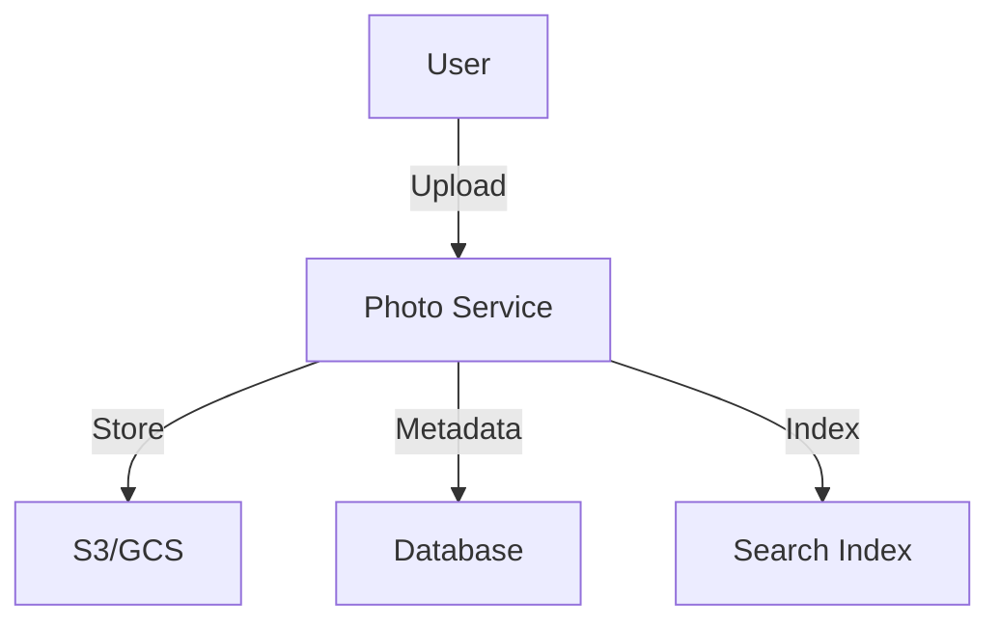
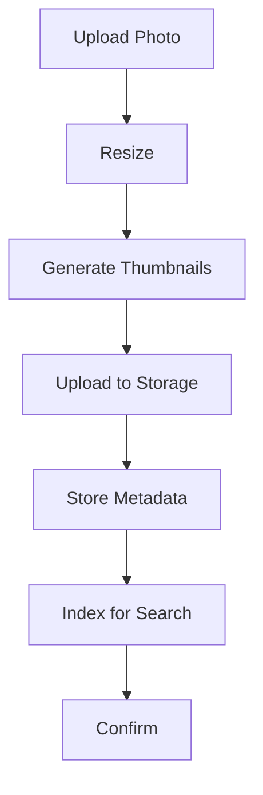

# Photo Sharing Platform

## Problem Statement
Design a photo sharing system with upload, storage, CDN, and thumbnail generation.

**Operations:**
- `uploadPhoto(user_id, file)` — Upload photo
- `getPhoto(photo_id, size)` — Get photo
- `deletePhoto(user_id, photo_id)` — Delete photo
- `getAlbum(album_id)` — Get album

## Design

### Upload Pipeline

```
1. Upload to blob storage (S3)
2. Queue thumbnail generation
3. Generate thumbnails (multiple sizes)
4. Update metadata DB
5. Invalidate CDN cache
```

### CDN Delivery

```
Original → Origin
Thumbnails → Edge cache
User request → Closest edge
Fallback to origin on miss
```

### Storage Optimization

```
Thumbnail compression: 70% size reduction
Original archival: Cheaper tier
Metadata indexing: Fast search
Deduplication: Same photo detected
```


## Architecture Diagram

```
┌──────────────────────────────────────┐
│   Photo Sharing Platform             │
│  ┌──────────────────────────────────┐  │
│  │ Upload Pipeline                  │  │
│  │ - Multipart form (resumable)     │  │
│  │ - Virus scan, EXIF strip         │  │
│  │ - Compression (multiple sizes)   │  │
│  │ Storage & CDN                    │  │
│  │ - S3 + CloudFront               │  │
│  │ Metadata (ElasticSearch)         │  │
│  │ - Search by tags, location       │  │
│  └──────────────────────────────────┘  │
└──────────────────────────────────────────┘
```

## Common Questions & Answers

**Q: Image resizing—when?** A: On-demand first, cache. Pre-resize for popular (expensive). Background worker for bulk.

**Q: Storage cost—how to optimize?** A: Compress lossy (JPEG 75%), delete old/unused, archive to cold storage.

**Q: EXIF data—privacy?** A: Strip location data (privacy), keep upload timestamp/camera (non-sensitive).

**Q: DRM for photos?** A: Watermarking, view-only, disable save. Trade UX vs protection.

## Back-of-Envelope Calculations

1B photos, 2MB avg = 2EB. Resizing: thumbnail (100KB), medium (500KB), original. CDN: 10M req/day, 99% hit rate.

## Design Choice Comparison

| Approach | Pros | Cons |
|----------|------|------|
| On-demand resize | Saves storage | Slower first load |
| Pre-resize all | Fast load | Storage overhead |
| Tiered sizing | Balance both | More complex |

## Follow-up Interview Questions

1. Handle massive upload spike? 2. Copyright detection (similar photos)? 3. Privacy (make private/public)? 4. Analytics (hot photos)? 5. Cost per user?

## Example Scenario Walkthrough

[Describe a concrete example with step-by-step execution]

### Architecture Diagram



### Flow Diagram



## Complexity

| Operation | Time |
|-----------|------|
| Upload | O(n) |
| Thumbnail gen | O(n) async |
| Get | O(1) cache |
