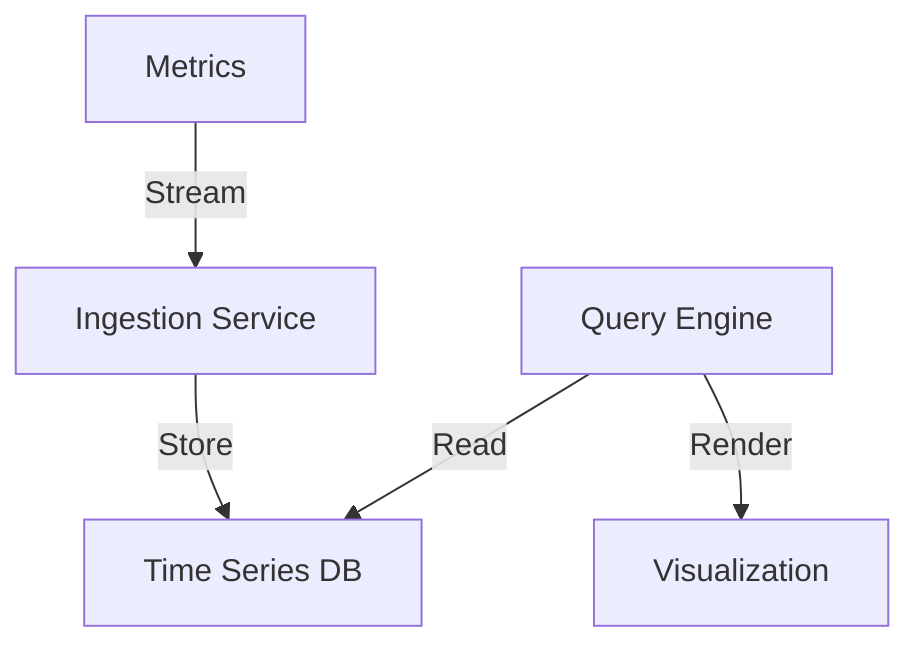
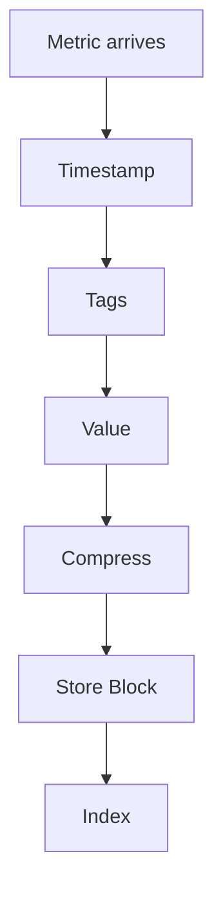

# Time Series Database

## Problem Statement
Design a database optimized for time-indexed data (metrics, logs, events).

**Requirements:**
- Fast ingestion (millions per second)
- Efficient storage (compression)
- Time range queries
- Aggregation (sum, avg, count)


## Code Explanation (Detailed)

### Sharding Key Selection
Hash-based: shard_id = hash(key) % num_shards
- Even distribution (no hot shards from skew)
- Consistent hashing minimizes resharding

### Query Routing
1. Compute shard_id from key
2. Route to master (write) or replica (read)
3. Async replication to other replicas

### Handling Hot Shards
1. Detect via monitoring (QPS per shard)
2. Solutions:
   - Add more replicas (read scaling)
   - Cache hot keys locally (in-process)
   - Split shard (expensive but permanent)

### Resharding Data
1. Dual-write: write to old and new
2. Migrate: copy data to new shards
3. Verify: checksums match
4. Switch: route to new
5. Cleanup: remove old shards

## Design

### Data Layout

```
By time: Column-oriented storage
Sequential writes: Efficient ingestion
Compression: Gorilla algorithm (70% reduction)
Indexing: Block index for range queries
```

### Retention Policy

```
Hot data: Recent data (30 days) in fast storage
Warm data: Older (30-365 days) in slower
Cold data: Archive data (1+ years)
Automatic downsampling: Hourly from daily
```

### Querying

```
Time range: Efficient range scans
Aggregation: Push-down to storage
Downsampling: Return coarser resolution
Distributed: Parallel across shards
```


## Scenario

Time Series Database is a critical component in modern distributed systems. In real-world applications, persisting and querying structured data at scale. For example, major tech companies like Netflix, Uber, and Airbnb rely on similar solutions to handle millions of concurrent users and requests. The challenge is achieving this while maintaining sub-100ms latency, 99.99% availability, and gracefully handling 10x traffic spikes during peak demand. This component provides the foundational capability to solve these challenges reliably and efficiently at global scale.

## Users

- **Backend Engineers**: Responsible for implementing and maintaining this system component in production environments. They need to understand the architecture, trade-offs, failure modes, and operational considerations.
- **DevOps/SRE Teams**: Monitor system health, manage scaling policies, handle incidents, and ensure reliability SLAs are met. They need insights into performance characteristics, bottlenecks, and failure recovery mechanisms.
- **Data Engineers**: Design data pipelines and analytics around this system, requiring deep understanding of data flow, consistency guarantees, and throughput characteristics.
- **System Architects**: Make high-level architectural decisions that impact company infrastructure, requiring comprehensive understanding of capabilities, limitations, and scalability boundaries.
- **Security Teams**: Understand security implications, potential vulnerabilities, and compliance requirements for this component.

## PRD

### Functional Requirements
- Partition data across multiple shards
- Route queries to correct shard
- Replicate within each shard
- Support resharding (add/remove shards)
- Cross-shard scatter-gather queries

### Non-Functional Requirements
- Scalability: 100+ shards, petabyte scale
- Availability: 99.99%, auto-failover
- Latency: < 100ms single-shard, < 500ms cross-shard
- Consistency: strong within shard, eventual across shards
- Operational simplicity: auto-rebalance, monitoring

### Success Metrics
- Even data distribution (< 10% skew)
- Even traffic distribution (< 10% skew)
- Resharding in < 1 hour
- Query routing overhead < 1ms


## Flow

The typical operational flow for this system involves these key phases:

1. **Request Arrival**: Client/upstream system sends request with required parameters and context
2. **Validation & Routing**: System validates request format, authentication, and routes to correct handler/shard/instance
3. **Core Processing**: Execute the main algorithm, database query, or business logic on the data/state
4. **State Management**: Update internal state (caches, indexes, counters, logs) with proper atomicity and locking
5. **Response Generation**: Format results and return to requester with relevant metadata (timing, version info)
6. **Observability**: Record metrics (latency, throughput, errors), logs (for debugging), and traces (for performance analysis)

This flow repeats thousands or millions of times per second in production. Each operation's efficiency compounds across the entire system, making careful optimization essential. Bottlenecks at any phase can cascade to impact overall system performance.

## Architecture Diagram

```
┌───────────────────────────────┐
│   Time Series Data Storage   │
│  Ingestion (InfluxDB)         │
│  - Write-optimized            │
│  - Append-only, no updates    │
│  Compression                  │
│  - Delta-of-delta encoding    │
│  - XOR float (8x savings)     │
│  Querying                     │
│  - Range queries O(log n)     │
│  - Aggregations (SUM, AVG)    │
│  - Downsampled data           │
└───────────────────────────────┘
```

## Back-of-Envelope Calculations

1M servers, 1K metrics/server, 1 sample/min. Ingestion: 1B metrics/min. Storage: 8GB/min raw, 1GB/min compressed = 400TB/month.
## Design Choice Comparison

| Approach | Pros | Cons |
|----------|------|------|
| General DB | Flexible | Poor compression |
| TSDB | Optimized | Less flexible |
| Data warehouse | Analytics | Slower |

## Follow-up Interview Questions

1. Query across timezones? 2. Real-time alerts? 3. Out-of-order writes? 4. Ingestion bottleneck? 5. Cold storage migration?

## Example Scenario Walkthrough

[Describe a concrete example with step-by-step execution]

### Architecture Diagram



### Flow Diagram



## Complexity

| Operation | Time |
|-----------|------|
| Write | O(1) |
| Range query | O(log n + k) |
| Aggregation | O(k) |

## Python Implementation

```python
from dataclasses import dataclass, field
from typing import List, Dict, Tuple, Optional
from collections import defaultdict
import bisect

@dataclass
class DataPoint:
    timestamp: int  # Unix ms
    value: float
    tags: Dict[str, str] = field(default_factory=dict)

class TimeSeries:
    def __init__(self, name: str):
        self.name = name
        self._timestamps: List[int] = []
        self._values: List[float] = []

    def write(self, ts: int, value: float):
        idx = bisect.bisect_left(self._timestamps, ts)
        self._timestamps.insert(idx, ts)
        self._values.insert(idx, value)

    def query(self, start: int, end: int) -> List[Tuple[int, float]]:
        lo = bisect.bisect_left(self._timestamps, start)
        hi = bisect.bisect_right(self._timestamps, end)
        return list(zip(self._timestamps[lo:hi], self._values[lo:hi]))

    def aggregate(self, start: int, end: int, fn: str = "avg") -> Optional[float]:
        points = [v for _, v in self.query(start, end)]
        if not points:
            return None
        if fn == "avg": return sum(points) / len(points)
        if fn == "sum": return sum(points)
        if fn == "max": return max(points)
        if fn == "min": return min(points)
        return None

class TimeSeriesDB:
    def __init__(self):
        self._series: Dict[str, TimeSeries] = {}

    def write(self, metric: str, ts: int, value: float):
        if metric not in self._series:
            self._series[metric] = TimeSeries(metric)
        self._series[metric].write(ts, value)

    def query(self, metric: str, start: int, end: int) -> List[Tuple[int, float]]:
        return self._series.get(metric, TimeSeries(metric)).query(start, end)

# Usage
db = TimeSeriesDB()
for i, v in enumerate([12.5, 13.0, 11.8, 14.2]):
    db.write("cpu.usage", 1000 + i * 1000, v)
print(db.query("cpu.usage", 1000, 4000))
```

## Java Implementation

```java
import java.util.*;

public class TimeSeriesDB {
    private Map<String, TreeMap<Long, Double>> series = new HashMap<>();

    public void write(String metric, long timestamp, double value) {
        series.computeIfAbsent(metric, k -> new TreeMap<>()).put(timestamp, value);
    }

    public NavigableMap<Long, Double> query(String metric, long start, long end) {
        TreeMap<Long, Double> ts = series.getOrDefault(metric, new TreeMap<>());
        return ts.subMap(start, true, end, true);
    }

    public OptionalDouble aggregate(String metric, long start, long end, String fn) {
        Collection<Double> values = query(metric, start, end).values();
        return switch (fn) {
            case "avg" -> values.stream().mapToDouble(d -> d).average();
            case "max" -> values.stream().mapToDouble(d -> d).max();
            case "min" -> values.stream().mapToDouble(d -> d).min();
            default -> OptionalDouble.empty();
        };
    }
}
```

## Common Questions & Answers

**Q: What is database sharding and why do we need it?**

A: Sharding distributes data across multiple databases to scale horizontally beyond single-machine limits. Each shard holds subset of data. Enables serving more throughput and storing larger datasets. Trade-off: querying across shards is harder.

**Q: What are common sharding strategies?**

A: Range-based (user_id: 1-1M, 1M-2M, etc.), hash-based (hash(key) % num_shards), directory-based (lookup table), geographic (shard by region). Choose based on query patterns and data distribution.

**Q: What is the hot shard problem?**

A: One shard receives much more traffic/data than others due to skewed distribution (e.g., all new users in same range). Becomes bottleneck. Solution: split hot shard, use better sharding key, or combine with caching.

**Q: How do you route queries to correct shard?**

A: Middleware computes shard_id = hash(key) % num_shards or range lookup. Routes request to correct database. Must be consistent: same key always routes to same shard. Client or proxy layer handles routing.

**Q: What happens when you add a new shard?**

A: Data must be re-distributed. Existing shards reshare (redistribute their data). Causes temporary downtime and data movement overhead. Use consistent hashing to minimize data movement.

**Q: Can you join data across shards?**

A: Very difficult. Requires querying multiple shards and joining in application code (slow). Solution: denormalize (store denormalized copies), use distributed query engine (Presto), or redesign schema.

**Q: How do you handle transactions across shards?**

A: Distributed transactions (2-phase commit) are slow and risky. Prefer: single-shard transactions (common case), saga pattern (multi-step local transactions), or eventual consistency (async coordination).

**Q: How do you choose sharding key?**

A: Key used to determine shard. Must have good cardinality (many unique values) and distribute evenly. Avoid sharding by frequently queried field (makes range queries hard). Common: user_id (for user-centric), timestamp (for time-series).

**Q: What is consistent hashing and when to use it?**

A: Hash-based sharding that minimizes data movement on shard count changes. When you add/remove shard, only ~1/n data moves (not all). Distributed systems standard (Dynamo, Cassandra, consistent caching).

**Q: How do you monitor shard health and skew?**

A: Track data size per shard, QPS per shard, latency per shard. Alert on skew (some shards much larger/busier). Manually or auto-rebalance when detected.

## Follow-up Questions & Answers

**Q: How would you implement geo-distributed sharding?**

A: Shard by geographic region (US, EU, APAC). Each region has replicas across data centers. Route based on user location. Handle eventual consistency between regions (strong eventual consistency).

**Q: How do you prevent hot keys within a shard?**

A: Detect hot keys (some keys far more accessed). Create micro-shards for hot keys (hash(key, counter) for replicas). Use caching layer above database. Monitor continuously.

**Q: What is the trade-off between range sharding and hash sharding?**

A: Range: enables range queries easily but may create hot shards (recent data). Hash: distributes evenly but makes range queries require scatter-gather. Choose based on query patterns.

**Q: How would you re-shard with minimal downtime?**

A: Dual-write strategy: write to both old and new shard layouts simultaneously. Gradually migrate data. Verify consistency. Switch reads to new layout. Clean up old shards.

**Q: Can you shard by multiple columns (composite key)?**

A: Yes, use (col1, col2) as shard key. Example: (user_id, tenant_id). Better distribution but more complex routing. Worth it for multi-tenant systems.

**Q: How do you handle shard failures?**

A: Use replication within each shard (master-slave). Detect failure, promote replica. Use consensus (Raft) for automatic failover. Trade: replication cost vs. availability.

**Q: How would you implement resharding without data movement (virtual sharding)?**

A: Map logical shards to physical shards via lookup table. When resharding, update mapping (no data movement). Trade: lookup overhead vs. seamless resharding.

**Q: How do you implement cross-shard aggregations?**

A: Scatter query to all shards. Gather results. Aggregate (sum, avg, max). Example: COUNT(*) requires hitting all shards. Slow but necessary for global analytics.

**Q: Can you migrate from single database to sharded?**

A: Yes, gradually. Start with logical sharding (single physical DB). Add more physical shards incrementally. Dual-write during migration. Atomic switch after validation.

**Q: How do you handle uneven shard growth?**

A: Monitor size growth. Split large shards before they get too big. Use growth-aware splitting (split at median timestamp for time-series). Automate with monitoring tools.

