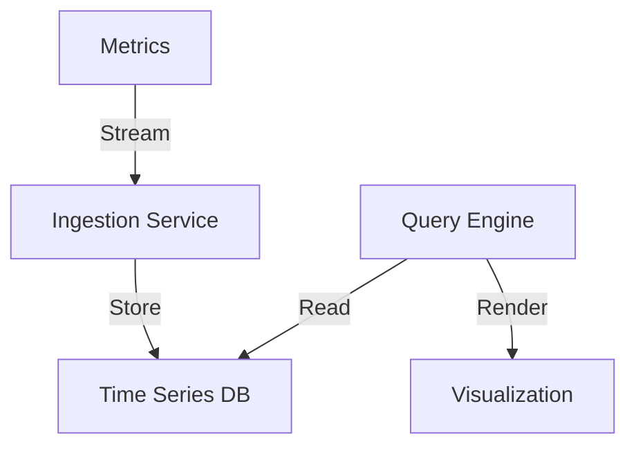
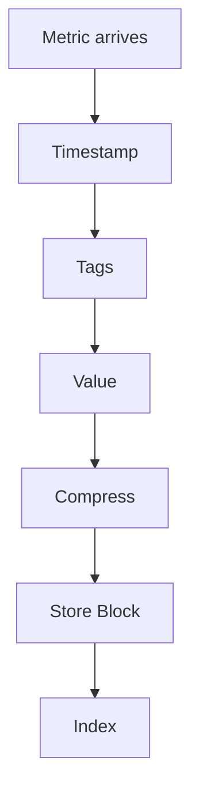

# Time Series Database

## Problem Statement
Design a database optimized for time-indexed data (metrics, logs, events).

**Requirements:**
- Fast ingestion (millions per second)
- Efficient storage (compression)
- Time range queries
- Aggregation (sum, avg, count)

## Design

### Data Layout

```
By time: Column-oriented storage
Sequential writes: Efficient ingestion
Compression: Gorilla algorithm (70% reduction)
Indexing: Block index for range queries
```

### Retention Policy

```
Hot data: Recent data (30 days) in fast storage
Warm data: Older (30-365 days) in slower
Cold data: Archive data (1+ years)
Automatic downsampling: Hourly from daily
```

### Querying

```
Time range: Efficient range scans
Aggregation: Push-down to storage
Downsampling: Return coarser resolution
Distributed: Parallel across shards
```


## Architecture Diagram

```
┌───────────────────────────────┐
│   Time Series Data Storage   │
│  Ingestion (InfluxDB)         │
│  - Write-optimized            │
│  - Append-only, no updates    │
│  Compression                  │
│  - Delta-of-delta encoding    │
│  - XOR float (8x savings)     │
│  Querying                     │
│  - Range queries O(log n)     │
│  - Aggregations (SUM, AVG)    │
│  - Downsampled data           │
└───────────────────────────────┘
```

## Common Questions & Answers

**Q: Retention policy?** A: Raw: 7-30 days. Downsampled: 1 year. Archive cold storage. Trade recency vs cost.

**Q: Cardinality explosion?** A: Limit label combos. Use aggregation. Avoid high-cardinality labels.

**Q: Aggregation efficiency?** A: Pre-aggregate at write. Store 1min, rollup to 1h at query. Parallelization.

## Back-of-Envelope Calculations

1M servers, 1K metrics/server, 1 sample/min. Ingestion: 1B metrics/min. Storage: 8GB/min raw, 1GB/min compressed = 400TB/month.
## Design Choice Comparison

| Approach | Pros | Cons |
|----------|------|------|
| General DB | Flexible | Poor compression |
| TSDB | Optimized | Less flexible |
| Data warehouse | Analytics | Slower |

## Follow-up Interview Questions

1. Query across timezones? 2. Real-time alerts? 3. Out-of-order writes? 4. Ingestion bottleneck? 5. Cold storage migration?

## Example Scenario Walkthrough

[Describe a concrete example with step-by-step execution]

### Architecture Diagram



### Flow Diagram



## Complexity

| Operation | Time |
|-----------|------|
| Write | O(1) |
| Range query | O(log n + k) |
| Aggregation | O(k) |
