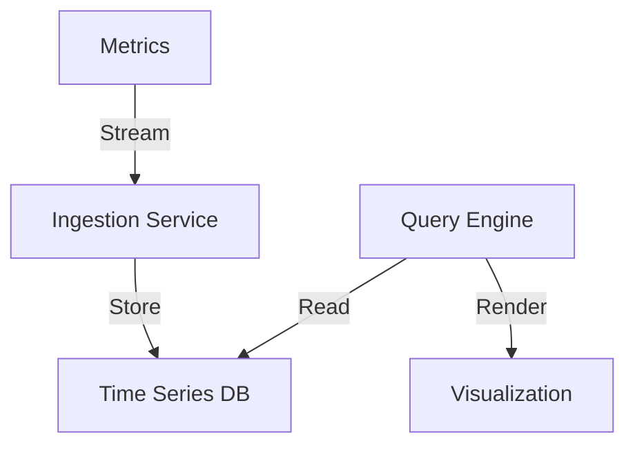
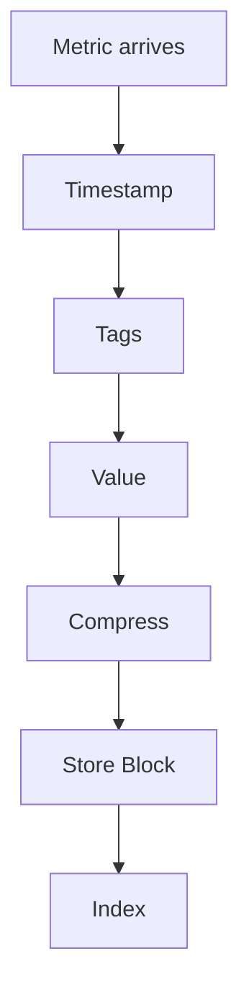

# Time Series Database

## Problem Statement
Design a database optimized for time-indexed data (metrics, logs, events).

**Requirements:**
- Fast ingestion (millions per second)
- Efficient storage (compression)
- Time range queries
- Aggregation (sum, avg, count)

## Design

### Data Layout

```
By time: Column-oriented storage
Sequential writes: Efficient ingestion
Compression: Gorilla algorithm (70% reduction)
Indexing: Block index for range queries
```

### Retention Policy

```
Hot data: Recent data (30 days) in fast storage
Warm data: Older (30-365 days) in slower
Cold data: Archive data (1+ years)
Automatic downsampling: Hourly from daily
```

### Querying

```
Time range: Efficient range scans
Aggregation: Push-down to storage
Downsampling: Return coarser resolution
Distributed: Parallel across shards
```


## Architecture Diagram

```
┌───────────────────────────────┐
│   Time Series Data Storage   │
│  Ingestion (InfluxDB)         │
│  - Write-optimized            │
│  - Append-only, no updates    │
│  Compression                  │
│  - Delta-of-delta encoding    │
│  - XOR float (8x savings)     │
│  Querying                     │
│  - Range queries O(log n)     │
│  - Aggregations (SUM, AVG)    │
│  - Downsampled data           │
└───────────────────────────────┘
```

## Common Questions & Answers

**Q: Retention policy?** A: Raw: 7-30 days. Downsampled: 1 year. Archive cold storage. Trade recency vs cost.

**Q: Cardinality explosion?** A: Limit label combos. Use aggregation. Avoid high-cardinality labels.

**Q: Aggregation efficiency?** A: Pre-aggregate at write. Store 1min, rollup to 1h at query. Parallelization.

## Back-of-Envelope Calculations

1M servers, 1K metrics/server, 1 sample/min. Ingestion: 1B metrics/min. Storage: 8GB/min raw, 1GB/min compressed = 400TB/month.
## Design Choice Comparison

| Approach | Pros | Cons |
|----------|------|------|
| General DB | Flexible | Poor compression |
| TSDB | Optimized | Less flexible |
| Data warehouse | Analytics | Slower |

## Follow-up Interview Questions

1. Query across timezones? 2. Real-time alerts? 3. Out-of-order writes? 4. Ingestion bottleneck? 5. Cold storage migration?

## Example Scenario Walkthrough

[Describe a concrete example with step-by-step execution]

### Architecture Diagram



### Flow Diagram



## Complexity

| Operation | Time |
|-----------|------|
| Write | O(1) |
| Range query | O(log n + k) |
| Aggregation | O(k) |

## Python Implementation

```python
from dataclasses import dataclass, field
from typing import List, Dict, Tuple, Optional
from collections import defaultdict
import bisect

@dataclass
class DataPoint:
    timestamp: int  # Unix ms
    value: float
    tags: Dict[str, str] = field(default_factory=dict)

class TimeSeries:
    def __init__(self, name: str):
        self.name = name
        self._timestamps: List[int] = []
        self._values: List[float] = []

    def write(self, ts: int, value: float):
        idx = bisect.bisect_left(self._timestamps, ts)
        self._timestamps.insert(idx, ts)
        self._values.insert(idx, value)

    def query(self, start: int, end: int) -> List[Tuple[int, float]]:
        lo = bisect.bisect_left(self._timestamps, start)
        hi = bisect.bisect_right(self._timestamps, end)
        return list(zip(self._timestamps[lo:hi], self._values[lo:hi]))

    def aggregate(self, start: int, end: int, fn: str = "avg") -> Optional[float]:
        points = [v for _, v in self.query(start, end)]
        if not points:
            return None
        if fn == "avg": return sum(points) / len(points)
        if fn == "sum": return sum(points)
        if fn == "max": return max(points)
        if fn == "min": return min(points)
        return None

class TimeSeriesDB:
    def __init__(self):
        self._series: Dict[str, TimeSeries] = {}

    def write(self, metric: str, ts: int, value: float):
        if metric not in self._series:
            self._series[metric] = TimeSeries(metric)
        self._series[metric].write(ts, value)

    def query(self, metric: str, start: int, end: int) -> List[Tuple[int, float]]:
        return self._series.get(metric, TimeSeries(metric)).query(start, end)

# Usage
db = TimeSeriesDB()
for i, v in enumerate([12.5, 13.0, 11.8, 14.2]):
    db.write("cpu.usage", 1000 + i * 1000, v)
print(db.query("cpu.usage", 1000, 4000))
```

## Java Implementation

```java
import java.util.*;

public class TimeSeriesDB {
    private Map<String, TreeMap<Long, Double>> series = new HashMap<>();

    public void write(String metric, long timestamp, double value) {
        series.computeIfAbsent(metric, k -> new TreeMap<>()).put(timestamp, value);
    }

    public NavigableMap<Long, Double> query(String metric, long start, long end) {
        TreeMap<Long, Double> ts = series.getOrDefault(metric, new TreeMap<>());
        return ts.subMap(start, true, end, true);
    }

    public OptionalDouble aggregate(String metric, long start, long end, String fn) {
        Collection<Double> values = query(metric, start, end).values();
        return switch (fn) {
            case "avg" -> values.stream().mapToDouble(d -> d).average();
            case "max" -> values.stream().mapToDouble(d -> d).max();
            case "min" -> values.stream().mapToDouble(d -> d).min();
            default -> OptionalDouble.empty();
        };
    }
}
```
