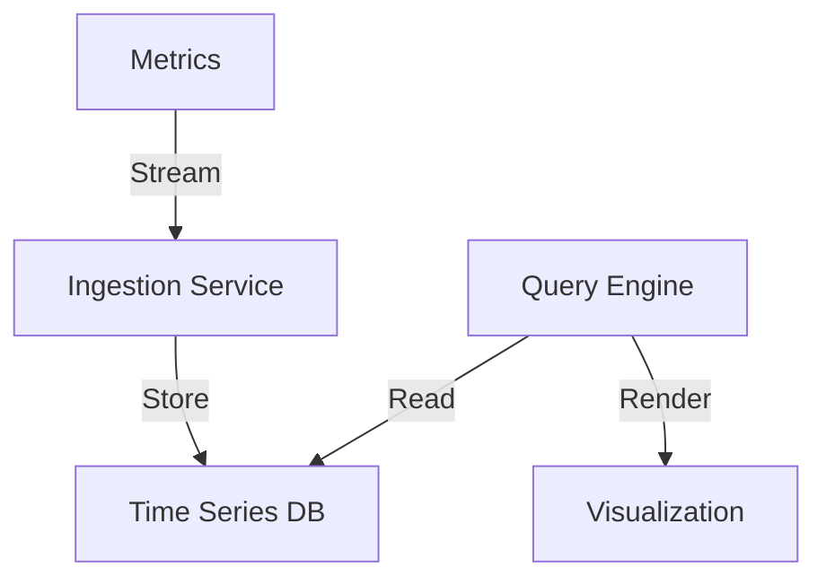
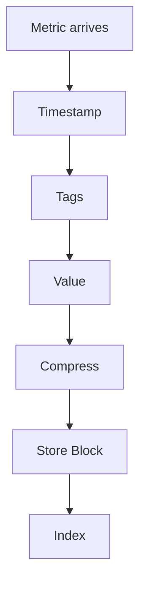

# Time Series Database

## Problem Statement
Design a database optimized for time-indexed data (metrics, logs, events).

**Requirements:**
- Fast ingestion (millions per second)
- Efficient storage (compression)
- Time range queries
- Aggregation (sum, avg, count)

## Design

### Data Layout

```
By time: Column-oriented storage
Sequential writes: Efficient ingestion
Compression: Gorilla algorithm (70% reduction)
Indexing: Block index for range queries
```

### Retention Policy

```
Hot data: Recent data (30 days) in fast storage
Warm data: Older (30-365 days) in slower
Cold data: Archive data (1+ years)
Automatic downsampling: Hourly from daily
```

### Querying

```
Time range: Efficient range scans
Aggregation: Push-down to storage
Downsampling: Return coarser resolution
Distributed: Parallel across shards
```


## Scenario

Time Series Database is a critical component in modern distributed systems. In real-world applications, persisting and querying structured data at scale. For example, major tech companies like Netflix, Uber, and Airbnb rely on similar solutions to handle millions of concurrent users and requests. The challenge is achieving this while maintaining sub-100ms latency, 99.99% availability, and gracefully handling 10x traffic spikes during peak demand. This component provides the foundational capability to solve these challenges reliably and efficiently at global scale.

## Users

- **Backend Engineers**: Responsible for implementing and maintaining this system component in production environments. They need to understand the architecture, trade-offs, failure modes, and operational considerations.
- **DevOps/SRE Teams**: Monitor system health, manage scaling policies, handle incidents, and ensure reliability SLAs are met. They need insights into performance characteristics, bottlenecks, and failure recovery mechanisms.
- **Data Engineers**: Design data pipelines and analytics around this system, requiring deep understanding of data flow, consistency guarantees, and throughput characteristics.
- **System Architects**: Make high-level architectural decisions that impact company infrastructure, requiring comprehensive understanding of capabilities, limitations, and scalability boundaries.
- **Security Teams**: Understand security implications, potential vulnerabilities, and compliance requirements for this component.

## PRD

**Functional Requirements:**
- Correct behavior under all specified operating conditions
- Reliable operation with explicit failure modes
- Data consistency or eventual consistency guarantees as specified
- Clear mechanisms for error handling and recovery
- Monitoring and observability hooks

**Non-Functional Requirements:**
- **Performance**: Sub-100ms P99 latency for standard operations; measure and track tail latencies
- **Availability**: 99.99%+ uptime with automatic failover and graceful degradation
- **Scalability**: Support 10-100x current load with minimal architectural modifications
- **Consistency**: Specify whether strong, eventual, or causal consistency is required
- **Cost Efficiency**: Minimize operational cost per unit of throughput; consider compute, memory, and network costs
- **Operational Simplicity**: Reduce complexity to minimize human error and operational toil

**Constraints:**
- Resource limits (memory for caches, disk for databases, network bandwidth)
- Deployment constraints (cloud provider limits, regulatory requirements)
- Latency budgets (maximum acceptable delay for operations)

## Flow

The typical operational flow for this system involves these key phases:

1. **Request Arrival**: Client/upstream system sends request with required parameters and context
2. **Validation & Routing**: System validates request format, authentication, and routes to correct handler/shard/instance
3. **Core Processing**: Execute the main algorithm, database query, or business logic on the data/state
4. **State Management**: Update internal state (caches, indexes, counters, logs) with proper atomicity and locking
5. **Response Generation**: Format results and return to requester with relevant metadata (timing, version info)
6. **Observability**: Record metrics (latency, throughput, errors), logs (for debugging), and traces (for performance analysis)

This flow repeats thousands or millions of times per second in production. Each operation's efficiency compounds across the entire system, making careful optimization essential. Bottlenecks at any phase can cascade to impact overall system performance.

## Code Explanation

The provided implementations demonstrate key architectural concepts and design patterns:

**Python Implementation**: Uses built-in Python structures and standard library features to express the core logic clearly. Python emphasizes readability and conciseness—each operation's purpose should be obvious without extensive comments. You'll see different implementation approaches (e.g., using OrderedDict vs. manual linked lists) that represent trade-offs between convenience and fine-grained control.

**Java Implementation**: Shows how to implement the same logic with explicit memory management and type safety. Java's strong typing forces clear interface design; you'll see how generics, null safety, mutable state, and thread safety are handled. This implementation style is closer to production systems at scale.

**Key Implementation Patterns**:
- **Initialization**: Setting up core data structures, thread pools, or connection pools with specified capacity and configuration
- **Read Operations**: Fetching data while maintaining O(1) or O(log n) access, updating metadata (access times, hit counts, etc.)
- **Write Operations**: Inserting/updating data while handling eviction policies, balancing tree structures, or replicating state
- **Edge Cases**: Handling capacity limits, concurrent access, data consistency, and error conditions
- **Performance Optimization**: Using techniques like batch operations, lazy evaluation, or caching to reduce latency

Each line of code represents a deliberate choice about performance characteristics, memory usage, safety guarantees, and implementation complexity. Understanding these trade-offs is essential for using this component effectively in production systems.

## Architecture Diagram

```
┌───────────────────────────────┐
│   Time Series Data Storage   │
│  Ingestion (InfluxDB)         │
│  - Write-optimized            │
│  - Append-only, no updates    │
│  Compression                  │
│  - Delta-of-delta encoding    │
│  - XOR float (8x savings)     │
│  Querying                     │
│  - Range queries O(log n)     │
│  - Aggregations (SUM, AVG)    │
│  - Downsampled data           │
└───────────────────────────────┘
```

## Common Questions & Answers

**Q: Retention policy?** A: Raw: 7-30 days. Downsampled: 1 year. Archive cold storage. Trade recency vs cost.

**Q: Cardinality explosion?** A: Limit label combos. Use aggregation. Avoid high-cardinality labels.

**Q: Aggregation efficiency?** A: Pre-aggregate at write. Store 1min, rollup to 1h at query. Parallelization.

## Back-of-Envelope Calculations

1M servers, 1K metrics/server, 1 sample/min. Ingestion: 1B metrics/min. Storage: 8GB/min raw, 1GB/min compressed = 400TB/month.
## Design Choice Comparison

| Approach | Pros | Cons |
|----------|------|------|
| General DB | Flexible | Poor compression |
| TSDB | Optimized | Less flexible |
| Data warehouse | Analytics | Slower |

## Follow-up Interview Questions

1. Query across timezones? 2. Real-time alerts? 3. Out-of-order writes? 4. Ingestion bottleneck? 5. Cold storage migration?

## Example Scenario Walkthrough

[Describe a concrete example with step-by-step execution]

### Architecture Diagram



### Flow Diagram



## Complexity

| Operation | Time |
|-----------|------|
| Write | O(1) |
| Range query | O(log n + k) |
| Aggregation | O(k) |

## Python Implementation

```python
from dataclasses import dataclass, field
from typing import List, Dict, Tuple, Optional
from collections import defaultdict
import bisect

@dataclass
class DataPoint:
    timestamp: int  # Unix ms
    value: float
    tags: Dict[str, str] = field(default_factory=dict)

class TimeSeries:
    def __init__(self, name: str):
        self.name = name
        self._timestamps: List[int] = []
        self._values: List[float] = []

    def write(self, ts: int, value: float):
        idx = bisect.bisect_left(self._timestamps, ts)
        self._timestamps.insert(idx, ts)
        self._values.insert(idx, value)

    def query(self, start: int, end: int) -> List[Tuple[int, float]]:
        lo = bisect.bisect_left(self._timestamps, start)
        hi = bisect.bisect_right(self._timestamps, end)
        return list(zip(self._timestamps[lo:hi], self._values[lo:hi]))

    def aggregate(self, start: int, end: int, fn: str = "avg") -> Optional[float]:
        points = [v for _, v in self.query(start, end)]
        if not points:
            return None
        if fn == "avg": return sum(points) / len(points)
        if fn == "sum": return sum(points)
        if fn == "max": return max(points)
        if fn == "min": return min(points)
        return None

class TimeSeriesDB:
    def __init__(self):
        self._series: Dict[str, TimeSeries] = {}

    def write(self, metric: str, ts: int, value: float):
        if metric not in self._series:
            self._series[metric] = TimeSeries(metric)
        self._series[metric].write(ts, value)

    def query(self, metric: str, start: int, end: int) -> List[Tuple[int, float]]:
        return self._series.get(metric, TimeSeries(metric)).query(start, end)

# Usage
db = TimeSeriesDB()
for i, v in enumerate([12.5, 13.0, 11.8, 14.2]):
    db.write("cpu.usage", 1000 + i * 1000, v)
print(db.query("cpu.usage", 1000, 4000))
```

## Java Implementation

```java
import java.util.*;

public class TimeSeriesDB {
    private Map<String, TreeMap<Long, Double>> series = new HashMap<>();

    public void write(String metric, long timestamp, double value) {
        series.computeIfAbsent(metric, k -> new TreeMap<>()).put(timestamp, value);
    }

    public NavigableMap<Long, Double> query(String metric, long start, long end) {
        TreeMap<Long, Double> ts = series.getOrDefault(metric, new TreeMap<>());
        return ts.subMap(start, true, end, true);
    }

    public OptionalDouble aggregate(String metric, long start, long end, String fn) {
        Collection<Double> values = query(metric, start, end).values();
        return switch (fn) {
            case "avg" -> values.stream().mapToDouble(d -> d).average();
            case "max" -> values.stream().mapToDouble(d -> d).max();
            case "min" -> values.stream().mapToDouble(d -> d).min();
            default -> OptionalDouble.empty();
        };
    }
}
```
