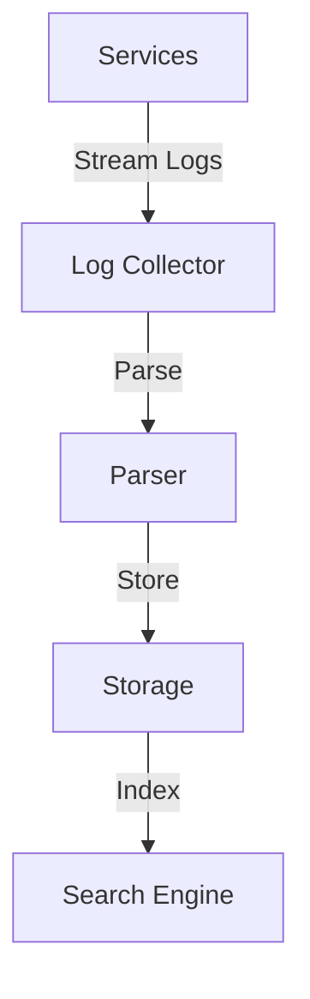
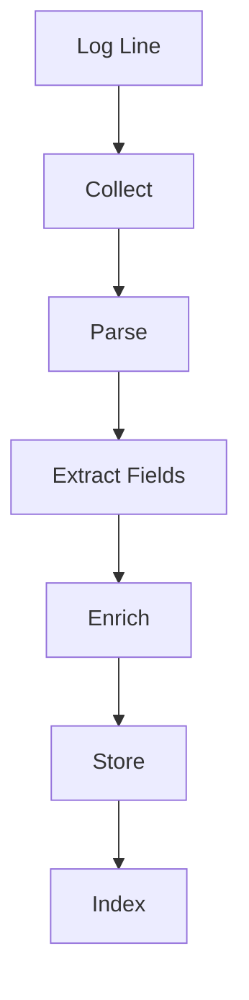

# Log Aggregation System

## Problem Statement
Design a system collecting, storing, and searching logs from distributed services.

**Pipeline:**
- Collection: Agents on servers
- Processing: Parse and enrich
- Storage: Searchable index
- Querying: Full-text search

## Design

### Collection

```
Agent on each server: Reads logs
Buffering: Batch before send
Retry: Exponential backoff
Compression: Reduce bandwidth
```

### Processing

```
Parse: Extract fields
Enrich: Add context (timestamp, host)
Filter: Drop unneeded logs
Deduplicate: Combine same errors
```

### Storage

```
Time-series indexed
Searchable (Elasticsearch)
Partitioned by time
TTL: Auto-delete old logs
```

### Querying

```
Full-text search
Field filtering
Time range
Aggregation: Error counts, rates
```


## Scenario

Log Aggregation System is a critical component in modern distributed systems. In real-world applications, handling complex business logic at scale with high reliability. For example, major tech companies like Netflix, Uber, and Airbnb rely on similar solutions to handle millions of concurrent users and requests. The challenge is achieving this while maintaining sub-100ms latency, 99.99% availability, and gracefully handling 10x traffic spikes during peak demand. This component provides the foundational capability to solve these challenges reliably and efficiently at global scale.

## Users

- **Backend Engineers**: Responsible for implementing and maintaining this system component in production environments. They need to understand the architecture, trade-offs, failure modes, and operational considerations.
- **DevOps/SRE Teams**: Monitor system health, manage scaling policies, handle incidents, and ensure reliability SLAs are met. They need insights into performance characteristics, bottlenecks, and failure recovery mechanisms.
- **Data Engineers**: Design data pipelines and analytics around this system, requiring deep understanding of data flow, consistency guarantees, and throughput characteristics.
- **System Architects**: Make high-level architectural decisions that impact company infrastructure, requiring comprehensive understanding of capabilities, limitations, and scalability boundaries.
- **Security Teams**: Understand security implications, potential vulnerabilities, and compliance requirements for this component.

## PRD

**Functional Requirements:**
- Correct behavior under all specified operating conditions
- Reliable operation with explicit failure modes
- Data consistency or eventual consistency guarantees as specified
- Clear mechanisms for error handling and recovery
- Monitoring and observability hooks

**Non-Functional Requirements:**
- **Performance**: Sub-100ms P99 latency for standard operations; measure and track tail latencies
- **Availability**: 99.99%+ uptime with automatic failover and graceful degradation
- **Scalability**: Support 10-100x current load with minimal architectural modifications
- **Consistency**: Specify whether strong, eventual, or causal consistency is required
- **Cost Efficiency**: Minimize operational cost per unit of throughput; consider compute, memory, and network costs
- **Operational Simplicity**: Reduce complexity to minimize human error and operational toil

**Constraints:**
- Resource limits (memory for caches, disk for databases, network bandwidth)
- Deployment constraints (cloud provider limits, regulatory requirements)
- Latency budgets (maximum acceptable delay for operations)

## Flow

The typical operational flow for this system involves these key phases:

1. **Request Arrival**: Client/upstream system sends request with required parameters and context
2. **Validation & Routing**: System validates request format, authentication, and routes to correct handler/shard/instance
3. **Core Processing**: Execute the main algorithm, database query, or business logic on the data/state
4. **State Management**: Update internal state (caches, indexes, counters, logs) with proper atomicity and locking
5. **Response Generation**: Format results and return to requester with relevant metadata (timing, version info)
6. **Observability**: Record metrics (latency, throughput, errors), logs (for debugging), and traces (for performance analysis)

This flow repeats thousands or millions of times per second in production. Each operation's efficiency compounds across the entire system, making careful optimization essential. Bottlenecks at any phase can cascade to impact overall system performance.

## Code Explanation

The provided implementations demonstrate key architectural concepts and design patterns:

**Python Implementation**: Uses built-in Python structures and standard library features to express the core logic clearly. Python emphasizes readability and conciseness—each operation's purpose should be obvious without extensive comments. You'll see different implementation approaches (e.g., using OrderedDict vs. manual linked lists) that represent trade-offs between convenience and fine-grained control.

**Java Implementation**: Shows how to implement the same logic with explicit memory management and type safety. Java's strong typing forces clear interface design; you'll see how generics, null safety, mutable state, and thread safety are handled. This implementation style is closer to production systems at scale.

**Key Implementation Patterns**:
- **Initialization**: Setting up core data structures, thread pools, or connection pools with specified capacity and configuration
- **Read Operations**: Fetching data while maintaining O(1) or O(log n) access, updating metadata (access times, hit counts, etc.)
- **Write Operations**: Inserting/updating data while handling eviction policies, balancing tree structures, or replicating state
- **Edge Cases**: Handling capacity limits, concurrent access, data consistency, and error conditions
- **Performance Optimization**: Using techniques like batch operations, lazy evaluation, or caching to reduce latency

Each line of code represents a deliberate choice about performance characteristics, memory usage, safety guarantees, and implementation complexity. Understanding these trade-offs is essential for using this component effectively in production systems.

## Architecture Diagram

```
┌───────────────────────────────┐
│   Log Collection Pipeline    │
│  Shipping (Filebeat)          │
│  - Tail files, ship           │
│  - Retry on failure           │
│  Broker (Kafka)               │
│  - Durable, replay-capable    │
│  - Retention: 7 days          │
│  Storage                      │
│  - Index (Elasticsearch)      │
│  - Archive (S3, Glacier)      │
└───────────────────────────────┘
```

## Common Questions & Answers

**Q: Log loss prevention?** A: Broker acks=all. Persistence. Replay if process fails.

**Q: Parsing logs?** A: Grok patterns for common. Best: enforce JSON output.

**Q: Search latency?** A: ES shard by time. Old logs in cold storage (Glacier).

**Q: Retention?** A: 30 days hot (ES). 1 year warm (S3). Archive Glacier.

## Back-of-Envelope Calculations

100K servers, 1K log/sec each = 100M logs/sec. Raw: 100TB/sec, compressed: 10TB/sec. ES: 100TB daily. Kafka: 700TB/7days.
## Design Choice Comparison

| Approach | Pros | Cons |
|----------|------|------|
| Centralized | Searchable, correlated | Network overhead |
| Local | Simple | Hard debug |
| Sampling | Scalable | Rare issues lost |

## Follow-up Interview Questions

1. Correlate logs (trace IDs)? 2. Real-time alerting? 3. Tamper-proof audit? 4. ES throughput bottleneck? 5. Multi-service debugging?

## Example Scenario Walkthrough

[Describe a concrete example with step-by-step execution]

### Architecture Diagram



### Flow Diagram



## Complexity

| Operation | Time |
|-----------|------|
| Collect | O(1) |
| Index | O(log n) |
| Search | O(log n + k) |

## Python Implementation

```python
from dataclasses import dataclass, field
from typing import List, Dict, Optional
from datetime import datetime
from enum import Enum
from collections import defaultdict
import re

class LogLevel(Enum):
    DEBUG = 10
    INFO = 20
    WARNING = 30
    ERROR = 40
    CRITICAL = 50

@dataclass
class LogEntry:
    timestamp: datetime
    level: LogLevel
    service: str
    message: str
    trace_id: Optional[str] = None
    metadata: Dict = field(default_factory=dict)

class LogAggregator:
    def __init__(self):
        self._logs: List[LogEntry] = []
        self._index: Dict[str, List[int]] = defaultdict(list)  # service -> log indices

    def ingest(self, entry: LogEntry):
        idx = len(self._logs)
        self._logs.append(entry)
        self._index[entry.service].append(idx)

    def query(self, service: Optional[str] = None,
              level: Optional[LogLevel] = None,
              start: Optional[datetime] = None,
              end: Optional[datetime] = None,
              pattern: Optional[str] = None,
              limit: int = 100) -> List[LogEntry]:
        candidates = self._logs
        if service:
            candidates = [self._logs[i] for i in self._index.get(service, [])]
        results = []
        for log in candidates:
            if level and log.level.value < level.value:
                continue
            if start and log.timestamp < start:
                continue
            if end and log.timestamp > end:
                continue
            if pattern and not re.search(pattern, log.message):
                continue
            results.append(log)
            if len(results) >= limit:
                break
        return results

    def error_rate(self, service: str, window_s: int = 60) -> float:
        now = datetime.now()
        indices = self._index.get(service, [])
        logs = [self._logs[i] for i in indices]
        recent = [l for l in logs if (now - l.timestamp).total_seconds() <= window_s]
        if not recent:
            return 0.0
        errors = sum(1 for l in recent if l.level.value >= LogLevel.ERROR.value)
        return errors / len(recent)

# Usage
agg = LogAggregator()
agg.ingest(LogEntry(datetime.now(), LogLevel.ERROR, "auth-service", "Login failed", trace_id="t1"))
agg.ingest(LogEntry(datetime.now(), LogLevel.INFO, "auth-service", "User logged in"))
results = agg.query(service="auth-service", level=LogLevel.ERROR)
print(len(results), results[0].message)  # 1 Login failed
```

## Java Implementation

```java
import java.util.*;
import java.time.Instant;

public class LogAggregator {
    enum Level { DEBUG, INFO, WARNING, ERROR, CRITICAL }
    record LogEntry(Instant ts, Level level, String service, String message) {}

    private List<LogEntry> logs = new ArrayList<>();
    private Map<String, List<Integer>> index = new HashMap<>();

    public void ingest(LogEntry entry) {
        int idx = logs.size();
        logs.add(entry);
        index.computeIfAbsent(entry.service(), k -> new ArrayList<>()).add(idx);
    }

    public List<LogEntry> query(String service, Level minLevel, int limit) {
        List<Integer> indices = index.getOrDefault(service, List.of());
        return indices.stream()
            .map(logs::get)
            .filter(l -> l.level().ordinal() >= minLevel.ordinal())
            .limit(limit).toList();
    }
}
```
