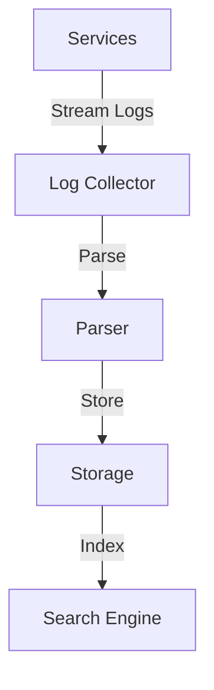
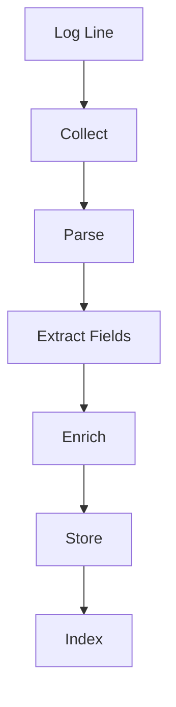

# Log Aggregation System

## Problem Statement
Design a system collecting, storing, and searching logs from distributed services.

**Pipeline:**
- Collection: Agents on servers
- Processing: Parse and enrich
- Storage: Searchable index
- Querying: Full-text search

## Design

### Collection

```
Agent on each server: Reads logs
Buffering: Batch before send
Retry: Exponential backoff
Compression: Reduce bandwidth
```

### Processing

```
Parse: Extract fields
Enrich: Add context (timestamp, host)
Filter: Drop unneeded logs
Deduplicate: Combine same errors
```

### Storage

```
Time-series indexed
Searchable (Elasticsearch)
Partitioned by time
TTL: Auto-delete old logs
```

### Querying

```
Full-text search
Field filtering
Time range
Aggregation: Error counts, rates
```


## Architecture Diagram

```
┌───────────────────────────────┐
│   Log Collection Pipeline    │
│  Shipping (Filebeat)          │
│  - Tail files, ship           │
│  - Retry on failure           │
│  Broker (Kafka)               │
│  - Durable, replay-capable    │
│  - Retention: 7 days          │
│  Storage                      │
│  - Index (Elasticsearch)      │
│  - Archive (S3, Glacier)      │
└───────────────────────────────┘
```

## Common Questions & Answers

**Q: Log loss prevention?** A: Broker acks=all. Persistence. Replay if process fails.

**Q: Parsing logs?** A: Grok patterns for common. Best: enforce JSON output.

**Q: Search latency?** A: ES shard by time. Old logs in cold storage (Glacier).

**Q: Retention?** A: 30 days hot (ES). 1 year warm (S3). Archive Glacier.

## Back-of-Envelope Calculations

100K servers, 1K log/sec each = 100M logs/sec. Raw: 100TB/sec, compressed: 10TB/sec. ES: 100TB daily. Kafka: 700TB/7days.
## Design Choice Comparison

| Approach | Pros | Cons |
|----------|------|------|
| Centralized | Searchable, correlated | Network overhead |
| Local | Simple | Hard debug |
| Sampling | Scalable | Rare issues lost |

## Follow-up Interview Questions

1. Correlate logs (trace IDs)? 2. Real-time alerting? 3. Tamper-proof audit? 4. ES throughput bottleneck? 5. Multi-service debugging?

## Example Scenario Walkthrough

[Describe a concrete example with step-by-step execution]

### Architecture Diagram



### Flow Diagram



## Complexity

| Operation | Time |
|-----------|------|
| Collect | O(1) |
| Index | O(log n) |
| Search | O(log n + k) |

## Python Implementation

```python
from dataclasses import dataclass, field
from typing import List, Dict, Optional
from datetime import datetime
from enum import Enum
from collections import defaultdict
import re

class LogLevel(Enum):
    DEBUG = 10
    INFO = 20
    WARNING = 30
    ERROR = 40
    CRITICAL = 50

@dataclass
class LogEntry:
    timestamp: datetime
    level: LogLevel
    service: str
    message: str
    trace_id: Optional[str] = None
    metadata: Dict = field(default_factory=dict)

class LogAggregator:
    def __init__(self):
        self._logs: List[LogEntry] = []
        self._index: Dict[str, List[int]] = defaultdict(list)  # service -> log indices

    def ingest(self, entry: LogEntry):
        idx = len(self._logs)
        self._logs.append(entry)
        self._index[entry.service].append(idx)

    def query(self, service: Optional[str] = None,
              level: Optional[LogLevel] = None,
              start: Optional[datetime] = None,
              end: Optional[datetime] = None,
              pattern: Optional[str] = None,
              limit: int = 100) -> List[LogEntry]:
        candidates = self._logs
        if service:
            candidates = [self._logs[i] for i in self._index.get(service, [])]
        results = []
        for log in candidates:
            if level and log.level.value < level.value:
                continue
            if start and log.timestamp < start:
                continue
            if end and log.timestamp > end:
                continue
            if pattern and not re.search(pattern, log.message):
                continue
            results.append(log)
            if len(results) >= limit:
                break
        return results

    def error_rate(self, service: str, window_s: int = 60) -> float:
        now = datetime.now()
        indices = self._index.get(service, [])
        logs = [self._logs[i] for i in indices]
        recent = [l for l in logs if (now - l.timestamp).total_seconds() <= window_s]
        if not recent:
            return 0.0
        errors = sum(1 for l in recent if l.level.value >= LogLevel.ERROR.value)
        return errors / len(recent)

# Usage
agg = LogAggregator()
agg.ingest(LogEntry(datetime.now(), LogLevel.ERROR, "auth-service", "Login failed", trace_id="t1"))
agg.ingest(LogEntry(datetime.now(), LogLevel.INFO, "auth-service", "User logged in"))
results = agg.query(service="auth-service", level=LogLevel.ERROR)
print(len(results), results[0].message)  # 1 Login failed
```

## Java Implementation

```java
import java.util.*;
import java.time.Instant;

public class LogAggregator {
    enum Level { DEBUG, INFO, WARNING, ERROR, CRITICAL }
    record LogEntry(Instant ts, Level level, String service, String message) {}

    private List<LogEntry> logs = new ArrayList<>();
    private Map<String, List<Integer>> index = new HashMap<>();

    public void ingest(LogEntry entry) {
        int idx = logs.size();
        logs.add(entry);
        index.computeIfAbsent(entry.service(), k -> new ArrayList<>()).add(idx);
    }

    public List<LogEntry> query(String service, Level minLevel, int limit) {
        List<Integer> indices = index.getOrDefault(service, List.of());
        return indices.stream()
            .map(logs::get)
            .filter(l -> l.level().ordinal() >= minLevel.ordinal())
            .limit(limit).toList();
    }
}
```
