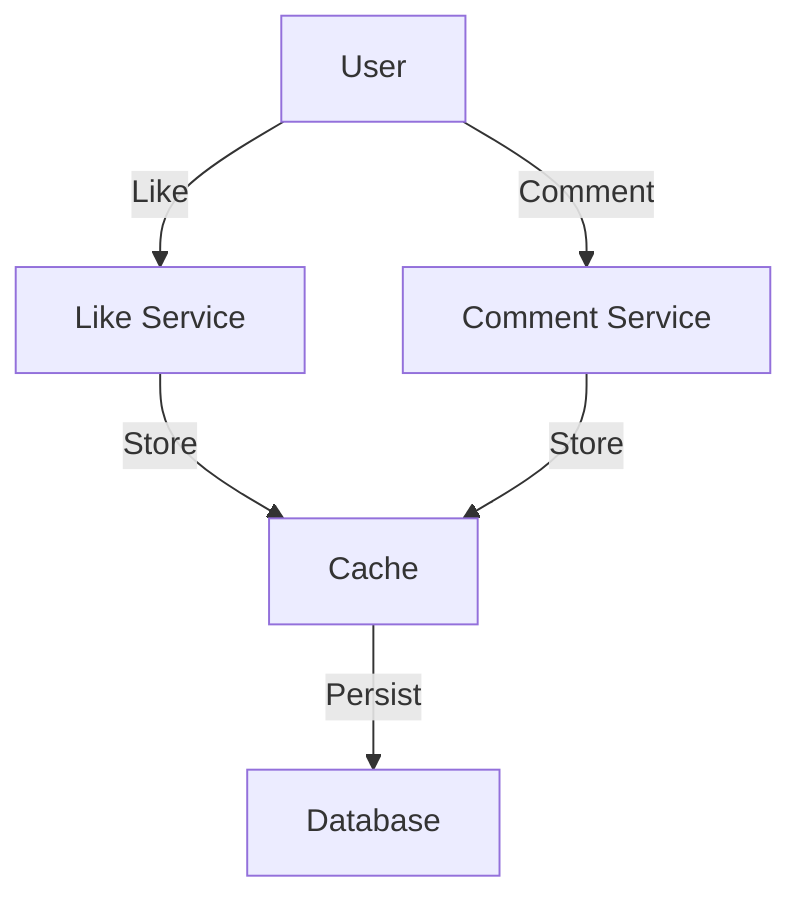
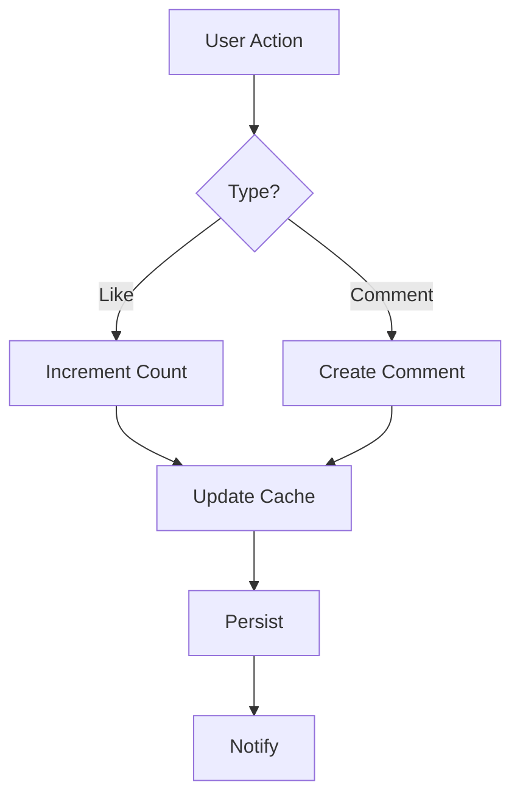

# Like/Comment System

## Problem Statement
Design a system for social interactions (likes, comments) at scale.

**Operations:**
- `like(user_id, post_id)` — Like post
- `unlike(user_id, post_id)` — Unlike post
- `comment(user_id, post_id, text)` — Add comment
- `deleteComment(comment_id)` — Delete comment
- `getLikeCount(post_id)` — Get like count

## Design

### Like Counter

```
Atomic increment: Redis INCR
Batch write: Eventually consistent
Denormalized: Cache in post doc
Eventual consistency: Async update to DB
```

### Comment Storage

```
Ordered by timestamp
Indexed by post_id
Pagination: Get top K comments
Sorting: Top comments (likes)
```

### Real-time Updates

```
WebSocket push: New likes/comments
Counter update: Client + server
Caching: Popular posts cached
```


## Architecture Diagram

```
┌──────────────────────────────────────┐
│   Like/Comment Engine                │
│  ┌──────────────────────────────────┐  │
│  │ Like Counter                     │  │
│  │ - Redis atomic increment         │  │
│  │ - Persist to DB (async)          │  │
│  │ Comments                         │  │
│  │ - Threaded (parent_id)           │  │
│  │ - Sorted by time/score           │  │
│  │ Notification on engagement       │  │
│  │ - Publish event (Kafka)          │  │
│  └──────────────────────────────────┘  │
└──────────────────────────────────────────┘
```

## Common Questions & Answers

**Q: Double-like prevention?** A: Check if user already liked (set membership). If yes, unlike. If no, add to set.

**Q: Like count accuracy vs speed?** A: Cache in Redis (fast but stale), sync to DB hourly (accurate). Acceptable lag.

**Q: Comment moderation?** A: ML classifier (toxicity), manual review for borderline. Hide pending review.

**Q: Comment ordering—best first?** A: By score (likes - reports). Time-decay: recent higher. Controversial (mixed opinions) interesting.

## Back-of-Envelope Calculations

1B items, 1K likes avg = 1T likes. Like updates: 10 req/sec per item = 100K global. Cache 1B items × 4B = 4GB Redis.

## Design Choice Comparison

| Approach | Pros | Cons |
|----------|------|------|
| Count-only | Simple, fast | No like history |
| Set-based (track users) | De-duplicate, per-user prefs | Higher memory |
| Sorted set (scored) | Complex ranking | More storage |

## Follow-up Interview Questions

1. Spam like detection? 2. Sort comments optimally? 3. Like propagation (friend feed update)? 4. Sensitivity (hide counts)? 5. Verification (real accounts)?

## Example Scenario Walkthrough

[Describe a concrete example with step-by-step execution]

### Architecture Diagram



### Flow Diagram



## Complexity

| Operation | Time |
|-----------|------|
| Like | O(1) |
| Comment | O(1) |
| Get count | O(1) cached |
| Get comments | O(k) |

## Python Implementation

```python
from dataclasses import dataclass, field
from typing import Dict, Set, List, Optional
from datetime import datetime

@dataclass
class Comment:
    comment_id: str
    user_id: str
    content_id: str
    text: str
    created_at: datetime = field(default_factory=datetime.now)
    parent_id: Optional[str] = None  # For replies

class LikeCommentService:
    def __init__(self):
        self._likes: Dict[str, Set[str]] = {}          # content_id -> set of user_ids
        self._comments: Dict[str, Comment] = {}         # comment_id -> comment
        self._content_comments: Dict[str, List[str]] = {}  # content_id -> comment_ids
        self._counter = 0

    def like(self, user_id: str, content_id: str) -> int:
        self._likes.setdefault(content_id, set()).add(user_id)
        return len(self._likes[content_id])

    def unlike(self, user_id: str, content_id: str) -> int:
        self._likes.get(content_id, set()).discard(user_id)
        return len(self._likes.get(content_id, set()))

    def like_count(self, content_id: str) -> int:
        return len(self._likes.get(content_id, set()))

    def has_liked(self, user_id: str, content_id: str) -> bool:
        return user_id in self._likes.get(content_id, set())

    def comment(self, user_id: str, content_id: str, text: str,
                parent_id: Optional[str] = None) -> Comment:
        self._counter += 1
        c = Comment(f"C-{self._counter}", user_id, content_id, text, parent_id=parent_id)
        self._comments[c.comment_id] = c
        self._content_comments.setdefault(content_id, []).append(c.comment_id)
        return c

    def get_comments(self, content_id: str) -> List[Comment]:
        ids = self._content_comments.get(content_id, [])
        return [self._comments[i] for i in ids]

# Usage
svc = LikeCommentService()
svc.like("alice", "post1")
svc.like("bob", "post1")
print(svc.like_count("post1"))  # 2
c = svc.comment("alice", "post1", "Great post!")
print(c.text, svc.get_comments("post1")[0].text)  # Great post! Great post!
```

## Java Implementation

```java
import java.util.*;

public class LikeCommentService {
    record Comment(String id, String userId, String contentId, String text) {}

    private Map<String, Set<String>> likes = new HashMap<>();
    private Map<String, List<Comment>> comments = new HashMap<>();
    private int counter = 0;

    public int like(String userId, String contentId) {
        return likes.computeIfAbsent(contentId, k -> new HashSet<>()).size();
    }

    public void unlike(String userId, String contentId) {
        likes.getOrDefault(contentId, Set.of()).remove(userId);
    }

    public int likeCount(String contentId) {
        return likes.getOrDefault(contentId, Set.of()).size();
    }

    public Comment comment(String userId, String contentId, String text) {
        Comment c = new Comment("C-" + (++counter), userId, contentId, text);
        comments.computeIfAbsent(contentId, k -> new ArrayList<>()).add(c);
        return c;
    }

    public List<Comment> getComments(String contentId) {
        return comments.getOrDefault(contentId, List.of());
    }
}
```
