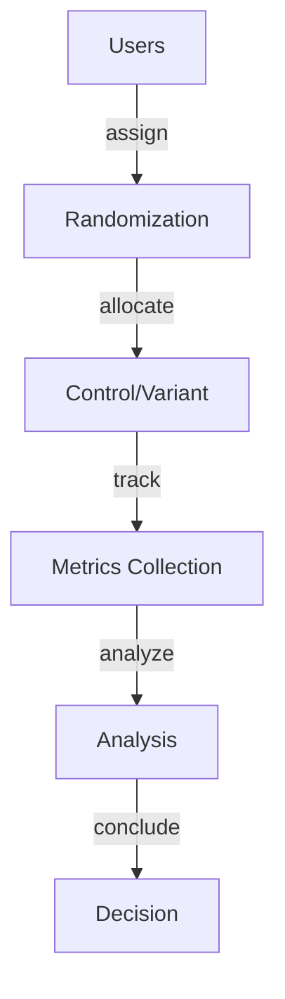

# A/B Testing

## System Overview

Comprehensive coverage of A/B testing in modern data analytics systems.

**Scale Metrics:**
- Petabyte-scale analytics, sub-second queries, 1000s QPS

## Architecture

## Core Concepts

Key aspects of A/B testing:
- Proper randomization and assignment
- Sample size calculation for statistical power
- Metric definition and collection
- Statistical significance testing
- Multiple comparison correction
- Confidence interval estimation

## Functional Requirements

1. **Randomization** - Fair user assignment to variants
2. **Tracking** - Reliable metric collection
3. **Analysis** - Statistical significance testing
4. **Reporting** - Clear results presentation
5. **Monitoring** - Real-time experiment tracking
6. **Compliance** - User privacy protection

## Non-Functional Requirements

1. **Accuracy** - Statistically valid results
2. **Speed** - Quick experiment setup
3. **Reliability** - No data loss during experiment
4. **Scalability** - Handle millions of users
5. **Cost** - Efficient metric collection
6. **Privacy** - Comply with data protection

## Back-of-the-Envelope

- 10M daily active users
- 50% allocated to experiment
- 5M per variant (5M control, 5M variant)
- 10% baseline conversion rate
- 50K daily conversions per variant
- 2-week experiment duration = 700K conversions per variant

## Interview Questions

### Q1: How do you calculate sample size?
**Answer:** Use power analysis: need enough samples to detect minimum effect size with 80% power and 5% significance level.

### Q2: How do you handle multiple comparisons?
**Answer:** Bonferroni correction divides significance threshold by number of tests.

### Q3: What are common pitfalls?
**Answer:** Peeking at results, not accounting for multiple comparisons, insufficient sample size, and user overlap.

## Technology Stack

- **Platforms**: Optimizely, LaunchDarkly, VWO
- **Analytics**: R, Python, Tableau
- **Stats**: scipy.stats, statsmodels

## Lessons Learned

1. Power calculation essential - prevents underpowered tests
2. Longer experiments better - captures user heterogeneity
3. Monitor for bugs - data quality issues hidden at scale
4. Consider novelty effect - short-term behavior changes
5. Statistical vs practical significance - 1% improvement might not matter
