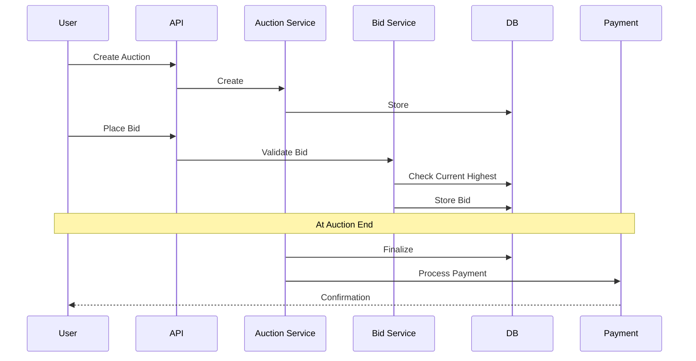

# Auction System

## Problem Statement
Design an auction platform with bidding, time management, and winner determination.

**Operations:**
- `createAuction(item, start_price, end_time)` — Create
- `placeBid(user_id, auction_id, amount)` — Bid
- `getHighestBid(auction_id)` — Current highest
- `finalizeAuction(auction_id)` — Determine winner

## Design

### Bid Validation

```
Amount > current highest
User not seller
Auction still active
User has sufficient funds
```

### Winner Selection

```
Highest bidder wins
Sealed-bid: Don't reveal other bids
Open-bid: Public bidding
Auto-bidding: Proxy bidder
```

### Settlement

```
Charge winner
Refund other bidders
Payment processing
Shipment generation
```

### Scalability

```
Auction sharding: By auction_id
Bid queue: Handle spikes
Real-time updates: WebSocket bids
```


## Scenario

Auction System is a critical component in modern distributed systems. In real-world applications, handling complex business logic at scale with high reliability. For example, major tech companies like Netflix, Uber, and Airbnb rely on similar solutions to handle millions of concurrent users and requests. The challenge is achieving this while maintaining sub-100ms latency, 99.99% availability, and gracefully handling 10x traffic spikes during peak demand. This component provides the foundational capability to solve these challenges reliably and efficiently at global scale.

## Users

- **Backend Engineers**: Responsible for implementing and maintaining this system component in production environments. They need to understand the architecture, trade-offs, failure modes, and operational considerations.
- **DevOps/SRE Teams**: Monitor system health, manage scaling policies, handle incidents, and ensure reliability SLAs are met. They need insights into performance characteristics, bottlenecks, and failure recovery mechanisms.
- **Data Engineers**: Design data pipelines and analytics around this system, requiring deep understanding of data flow, consistency guarantees, and throughput characteristics.
- **System Architects**: Make high-level architectural decisions that impact company infrastructure, requiring comprehensive understanding of capabilities, limitations, and scalability boundaries.
- **Security Teams**: Understand security implications, potential vulnerabilities, and compliance requirements for this component.

## PRD

**Functional Requirements:**
- Correct behavior under all specified operating conditions
- Reliable operation with explicit failure modes
- Data consistency or eventual consistency guarantees as specified
- Clear mechanisms for error handling and recovery
- Monitoring and observability hooks

**Non-Functional Requirements:**
- **Performance**: Sub-100ms P99 latency for standard operations; measure and track tail latencies
- **Availability**: 99.99%+ uptime with automatic failover and graceful degradation
- **Scalability**: Support 10-100x current load with minimal architectural modifications
- **Consistency**: Specify whether strong, eventual, or causal consistency is required
- **Cost Efficiency**: Minimize operational cost per unit of throughput; consider compute, memory, and network costs
- **Operational Simplicity**: Reduce complexity to minimize human error and operational toil

**Constraints:**
- Resource limits (memory for caches, disk for databases, network bandwidth)
- Deployment constraints (cloud provider limits, regulatory requirements)
- Latency budgets (maximum acceptable delay for operations)

## Flow

The typical operational flow for this system involves these key phases:

1. **Request Arrival**: Client/upstream system sends request with required parameters and context
2. **Validation & Routing**: System validates request format, authentication, and routes to correct handler/shard/instance
3. **Core Processing**: Execute the main algorithm, database query, or business logic on the data/state
4. **State Management**: Update internal state (caches, indexes, counters, logs) with proper atomicity and locking
5. **Response Generation**: Format results and return to requester with relevant metadata (timing, version info)
6. **Observability**: Record metrics (latency, throughput, errors), logs (for debugging), and traces (for performance analysis)

This flow repeats thousands or millions of times per second in production. Each operation's efficiency compounds across the entire system, making careful optimization essential. Bottlenecks at any phase can cascade to impact overall system performance.

## Code Explanation

The provided implementations demonstrate key architectural concepts and design patterns:

**Python Implementation**: Uses built-in Python structures and standard library features to express the core logic clearly. Python emphasizes readability and conciseness—each operation's purpose should be obvious without extensive comments. You'll see different implementation approaches (e.g., using OrderedDict vs. manual linked lists) that represent trade-offs between convenience and fine-grained control.

**Java Implementation**: Shows how to implement the same logic with explicit memory management and type safety. Java's strong typing forces clear interface design; you'll see how generics, null safety, mutable state, and thread safety are handled. This implementation style is closer to production systems at scale.

**Key Implementation Patterns**:
- **Initialization**: Setting up core data structures, thread pools, or connection pools with specified capacity and configuration
- **Read Operations**: Fetching data while maintaining O(1) or O(log n) access, updating metadata (access times, hit counts, etc.)
- **Write Operations**: Inserting/updating data while handling eviction policies, balancing tree structures, or replicating state
- **Edge Cases**: Handling capacity limits, concurrent access, data consistency, and error conditions
- **Performance Optimization**: Using techniques like batch operations, lazy evaluation, or caching to reduce latency

Each line of code represents a deliberate choice about performance characteristics, memory usage, safety guarantees, and implementation complexity. Understanding these trade-offs is essential for using this component effectively in production systems.

## Architecture Diagram

```
┌──────────────────────────────────────┐
│   Auction/Bidding System             │
│  ┌──────────────────────────────────┐  │
│  │ Auction State Machine            │  │
│  │ - Open, Active, Closed, Settled  │  │
│  │ Current Bid Tracking             │  │
│  │ - Redis sorted set (price)       │  │
│  │ Bid Validation                   │  │
│  │ - > current, min increment       │  │
│  │ Winner Determination             │  │
│  │ - Highest bid at close time      │  │
│  └──────────────────────────────────┘  │
└──────────────────────────────────────────┘
```

## Common Questions & Answers

**Q: Bid race condition—same bid twice?** A: Use versioning or CAS (compare-and-swap). Increment version on bid.

**Q: Auction end-time manipulation?** A: Record exact close time in DB. If bid arrives within 5s of close, extend by 5s (prevent sniping).

**Q: Automatic bidding (proxy bid)?** A: Store max bid, auto-bid up to that. Reveal gradually to encourage competition.

**Q: Payment guarantee?** A: Escrow: winner pays into escrow, seller ships, then escrow releases. Reduces fraud.

## Back-of-Envelope Calculations

eBay: 10M concurrent auctions, 100K bids/sec. Bid validation O(1). State transition O(1). Close processing: batch hourly, 100K winners.

## Design Choice Comparison

| Approach | Pros | Cons |
|----------|------|------|
| Simple highest-bid | Easy, fast | No auto-bidding |
| Proxy bid auction | Fair, encourages bidding | More state |
| Dutch auction | Price decreases | Different mechanics |

## Follow-up Interview Questions

1. Shill bidding detection (fake bids)? 2. Reserve price (hidden minimum)? 3. Multiple winners (buy-it-now)? 4. Dispute resolution? 5. International (currency conversion)?

## UML Diagram

```
┌────────────────────────┐
│      Auction           │
├────────────────────────┤
│- id: int               │
│- status: AuctionStatus │
│- highestBid: double    │
│- highestBidder: int    │
│- endTime: long         │
├────────────────────────┤
│+ placeBid(bid)         │
│+ finalize(): Winner     │
└────────────────────────┘
         △
         │ contains
         │
┌────────────────────────┐
│        Bid             │
├────────────────────────┤
│- userId: int           │
│- amount: double        │
│- timestamp: long       │
└────────────────────────┘
```

## Flow Diagram



## Implementation

### Python Implementation

```python
from dataclasses import dataclass
from enum import Enum
import time
from typing import Optional

class AuctionStatus(Enum):
    OPEN = "open"
    ACTIVE = "active"
    CLOSED = "closed"
    SETTLED = "settled"

@dataclass
class Bid:
    user_id: int
    amount: float
    timestamp: float

class AuctionSystem:
    def __init__(self):
        self.auctions = {}
        self.bids = {}

    def create_auction(self, auction_id: int, item: str, start_price: float, duration: int):
        self.auctions[auction_id] = {
            'item': item,
            'start_price': start_price,
            'end_time': time.time() + duration,
            'status': AuctionStatus.OPEN,
            'highest_bid': start_price,
            'highest_bidder': None
        }
        self.bids[auction_id] = []

    def place_bid(self, auction_id: int, user_id: int, amount: float) -> bool:
        if auction_id not in self.auctions:
            return False
        auction = self.auctions[auction_id]
        if time.time() > auction['end_time']:
            return False
        if amount <= auction['highest_bid']:
            return False
        auction['highest_bid'] = amount
        auction['highest_bidder'] = user_id
        self.bids[auction_id].append(Bid(user_id, amount, time.time()))
        return True

    def finalize_auction(self, auction_id: int) -> Optional[dict]:
        if auction_id not in self.auctions:
            return None
        auction = self.auctions[auction_id]
        if auction['highest_bidder']:
            auction['status'] = AuctionStatus.SETTLED
            return {
                'winner': auction['highest_bidder'],
                'amount': auction['highest_bid']
            }
        return None
```

### Java Implementation

```java
import java.util.*;

class AuctionSystem {
    enum AuctionStatus { OPEN, ACTIVE, CLOSED, SETTLED }

    static class Bid {
        int userId;
        double amount;
        long timestamp;

        Bid(int userId, double amount, long timestamp) {
            this.userId = userId;
            this.amount = amount;
            this.timestamp = timestamp;
        }
    }

    static class Auction {
        String item;
        double highestBid;
        int highestBidder;
        long endTime;
        AuctionStatus status;
        List<Bid> bids = new ArrayList<>();
    }

    private Map<Integer, Auction> auctions = new HashMap<>();

    public void createAuction(int id, String item, double startPrice, long duration) {
        Auction a = new Auction();
        a.item = item;
        a.highestBid = startPrice;
        a.highestBidder = -1;
        a.endTime = System.currentTimeMillis() + duration;
        a.status = AuctionStatus.OPEN;
        auctions.put(id, a);
    }

    public boolean placeBid(int auctionId, int userId, double amount) {
        Auction a = auctions.get(auctionId);
        if (a == null || System.currentTimeMillis() > a.endTime) return false;
        if (amount <= a.highestBid) return false;

        a.highestBid = amount;
        a.highestBidder = userId;
        a.bids.add(new Bid(userId, amount, System.currentTimeMillis()));
        return true;
    }

    public Map<String, Object> finalizeAuction(int auctionId) {
        Auction a = auctions.get(auctionId);
        if (a == null) return null;

        a.status = AuctionStatus.SETTLED;
        Map<String, Object> result = new HashMap<>();
        result.put("winner", a.highestBidder);
        result.put("amount", a.highestBid);
        return result;
    }
}
```

## Example Scenario Walkthrough

**Scenario**: eBay user auction flow

1. Seller creates auction: `createAuction(123, "iPhone 15", 500, 86400)` — 24-hour duration
2. Bidder A places bid: `placeBid(123, user_A, 550)` — Success, A is highest
3. Bidder B places bid: `placeBid(123, user_B, 520)` — Failed, less than current 550
4. Bidder B places bid: `placeBid(123, user_B, 600)` — Success, B is highest
5. At auction close time: `finalizeAuction(123)` — Winner: user_B, amount: 600
6. Payment processing and shipment initiated

## Complexity

| Operation | Time |
|-----------|------|
| Place bid | O(1) |
| Get highest | O(1) |
| Finalize | O(1) |
