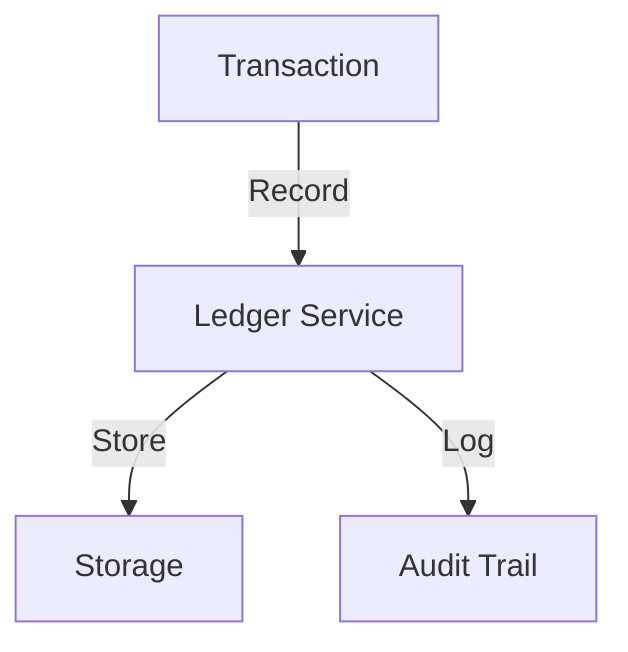
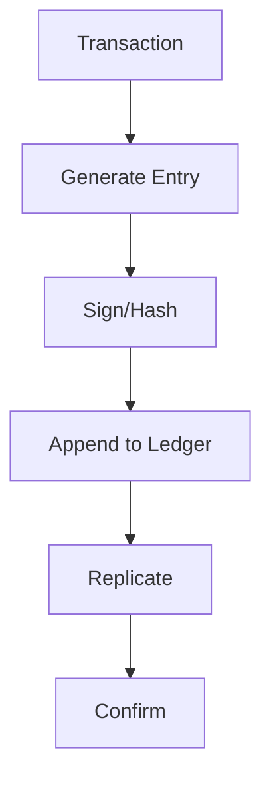

# Transaction Ledger

## Problem Statement
Design an immutable financial ledger for tracking all transactions.

**Requirements:**
- Append-only log
- Double-entry bookkeeping
- Audit trail
- Reconciliation

## Design

### Double-Entry Bookkeeping

```
Every transaction: Debit one account, Credit another
Sum(debits) = Sum(credits)
Immutable: Never update, append corrections
```

### Ledger Structure

```
Timestamp
From account
To account
Amount
Type (transfer, fee, etc.)
Reference (order_id, etc.)
Status (pending, confirmed)
```

### Settlement

```
Pending: Awaiting confirmation
Confirmed: Finalized
Reversed: Correction entry
Reconciliation: Match with external
```

### Integrity

```
Hash chain: Link entries
Signatures: Cryptographic proof
Read-only: Prevent tampering
```


## Architecture Diagram

```
┌──────────────────────────────────────┐
│   Immutable Transaction Log          │
│  ┌──────────────────────────────────┐  │
│  │ Append-Only Log                  │  │
│  │ - Never update/delete            │  │
│  │ - Hash chain (blockchain-like)   │  │
│  │ Snapshots (for fast restart)     │  │
│  │ - Hourly checkpoint              │  │
│  │ Balance Derivation               │  │
│  │ - Replay log = current balance   │  │
│  └──────────────────────────────────┘  │
└──────────────────────────────────────────┘
```

## Common Questions & Answers

**Q: Why append-only?** A: Immutable audit trail. Corruption detectable (hash breaks). Replaying gives any point-in-time state.

**Q: Ledger bloat—retention?** A: Archive old entries (S3), keep recent (hot DB). Snapshots reduce replay time.

**Q: Balance query performance?** A: Materialized view (balance table), updated via ledger replay. Or cache at query time.

**Q: Reconciliation audits?** A: Periodic: replay ledger, compare balance snapshot. Detects bugs or data corruption.

## Back-of-Envelope Calculations

1M users, 10 txns/day avg = 10M ledger entries/day. Storage: 10M × 200B = 2GB/day = 730GB/year. Snapshot: hourly.

## Design Choice Comparison

| Approach | Pros | Cons |
|----------|------|------|
| Append-only log | Immutable, auditable | Slower queries |
| Update-in-place | Fast, simple | Loses history, harder audit |
| Event sourcing | Full history, replay | Complex, large storage |

## Follow-up Interview Questions

1. Query balance at specific timestamp? 2. Exporting ledger for tax/audit? 3. Compliance (GDPR retention)? 4. Corruption detection? 5. Performance at scale?

## Example Scenario Walkthrough

[Describe a concrete example with step-by-step execution]

### Architecture Diagram



### Flow Diagram



## Complexity

| Operation | Time |
|-----------|------|
| Append | O(1) |
| Query | O(log n) |
| Reconcile | O(n) |

## Python Implementation

```python
from dataclasses import dataclass, field
from typing import List, Dict, Optional
from decimal import Decimal
from datetime import datetime
from enum import Enum
import uuid

class EntryType(Enum):
    DEBIT = "debit"
    CREDIT = "credit"

@dataclass
class LedgerEntry:
    entry_id: str
    account_id: str
    entry_type: EntryType
    amount: Decimal
    description: str
    timestamp: datetime = field(default_factory=datetime.now)
    reference_id: Optional[str] = None

class TransactionLedger:
    def __init__(self):
        self._entries: List[LedgerEntry] = []
        self._account_entries: Dict[str, List[int]] = {}
        self._balances: Dict[str, Decimal] = {}

    def _add_entry(self, account_id: str, entry_type: EntryType,
                   amount: Decimal, description: str, ref_id: Optional[str] = None) -> LedgerEntry:
        entry = LedgerEntry(str(uuid.uuid4())[:8], account_id, entry_type, amount, description, reference_id=ref_id)
        idx = len(self._entries)
        self._entries.append(entry)
        self._account_entries.setdefault(account_id, []).append(idx)
        if entry_type == EntryType.CREDIT:
            self._balances[account_id] = self._balances.get(account_id, Decimal(0)) + amount
        else:
            self._balances[account_id] = self._balances.get(account_id, Decimal(0)) - amount
        return entry

    def transfer(self, from_account: str, to_account: str, amount: Decimal, description: str) -> str:
        txn_id = str(uuid.uuid4())[:8]
        self._add_entry(from_account, EntryType.DEBIT, amount, description, txn_id)
        self._add_entry(to_account, EntryType.CREDIT, amount, description, txn_id)
        return txn_id

    def balance(self, account_id: str) -> Decimal:
        return self._balances.get(account_id, Decimal(0))

    def history(self, account_id: str) -> List[LedgerEntry]:
        indices = self._account_entries.get(account_id, [])
        return [self._entries[i] for i in indices]

# Usage
ledger = TransactionLedger()
ledger._add_entry("acc1", EntryType.CREDIT, Decimal("1000"), "Initial deposit")
txn = ledger.transfer("acc1", "acc2", Decimal("250"), "Payment")
print(ledger.balance("acc1"), ledger.balance("acc2"))  # 750 250
```

## Java Implementation

```java
import java.math.BigDecimal;
import java.util.*;

public class TransactionLedger {
    enum EntryType { DEBIT, CREDIT }
    record Entry(String id, String accountId, EntryType type, BigDecimal amount, String desc) {}

    private List<Entry> entries = new ArrayList<>();
    private Map<String, BigDecimal> balances = new HashMap<>();

    public void addEntry(String accountId, EntryType type, BigDecimal amount, String desc) {
        entries.add(new Entry(UUID.randomUUID().toString().substring(0, 8), accountId, type, amount, desc));
        BigDecimal sign = type == EntryType.CREDIT ? amount : amount.negate();
        balances.merge(accountId, sign, BigDecimal::add);
    }

    public void transfer(String from, String to, BigDecimal amount, String desc) {
        addEntry(from, EntryType.DEBIT, amount, desc);
        addEntry(to, EntryType.CREDIT, amount, desc);
    }

    public BigDecimal balance(String accountId) {
        return balances.getOrDefault(accountId, BigDecimal.ZERO);
    }
}
```
