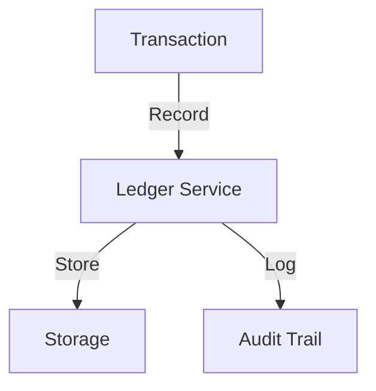
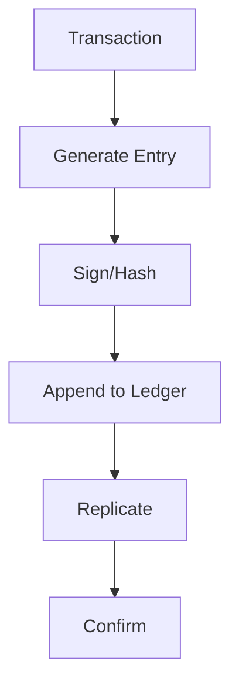

# Transaction Ledger

## Problem Statement
Design an immutable financial ledger for tracking all transactions.

**Requirements:**
- Append-only log
- Double-entry bookkeeping
- Audit trail
- Reconciliation

## Design

### Double-Entry Bookkeeping

```
Every transaction: Debit one account, Credit another
Sum(debits) = Sum(credits)
Immutable: Never update, append corrections
```

### Ledger Structure

```
Timestamp
From account
To account
Amount
Type (transfer, fee, etc.)
Reference (order_id, etc.)
Status (pending, confirmed)
```

### Settlement

```
Pending: Awaiting confirmation
Confirmed: Finalized
Reversed: Correction entry
Reconciliation: Match with external
```

### Integrity

```
Hash chain: Link entries
Signatures: Cryptographic proof
Read-only: Prevent tampering
```


## Architecture Diagram

```
┌──────────────────────────────────────┐
│   Immutable Transaction Log          │
│  ┌──────────────────────────────────┐  │
│  │ Append-Only Log                  │  │
│  │ - Never update/delete            │  │
│  │ - Hash chain (blockchain-like)   │  │
│  │ Snapshots (for fast restart)     │  │
│  │ - Hourly checkpoint              │  │
│  │ Balance Derivation               │  │
│  │ - Replay log = current balance   │  │
│  └──────────────────────────────────┘  │
└──────────────────────────────────────────┘
```

## Common Questions & Answers

**Q: Why append-only?** A: Immutable audit trail. Corruption detectable (hash breaks). Replaying gives any point-in-time state.

**Q: Ledger bloat—retention?** A: Archive old entries (S3), keep recent (hot DB). Snapshots reduce replay time.

**Q: Balance query performance?** A: Materialized view (balance table), updated via ledger replay. Or cache at query time.

**Q: Reconciliation audits?** A: Periodic: replay ledger, compare balance snapshot. Detects bugs or data corruption.

## Back-of-Envelope Calculations

1M users, 10 txns/day avg = 10M ledger entries/day. Storage: 10M × 200B = 2GB/day = 730GB/year. Snapshot: hourly.

## Design Choice Comparison

| Approach | Pros | Cons |
|----------|------|------|
| Append-only log | Immutable, auditable | Slower queries |
| Update-in-place | Fast, simple | Loses history, harder audit |
| Event sourcing | Full history, replay | Complex, large storage |

## Follow-up Interview Questions

1. Query balance at specific timestamp? 2. Exporting ledger for tax/audit? 3. Compliance (GDPR retention)? 4. Corruption detection? 5. Performance at scale?

## Example Scenario Walkthrough

[Describe a concrete example with step-by-step execution]

### Architecture Diagram



### Flow Diagram



## Complexity

| Operation | Time |
|-----------|------|
| Append | O(1) |
| Query | O(log n) |
| Reconcile | O(n) |
