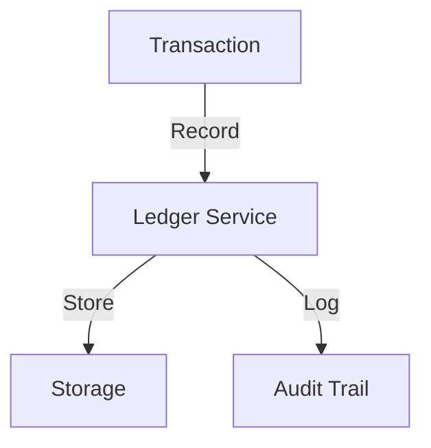
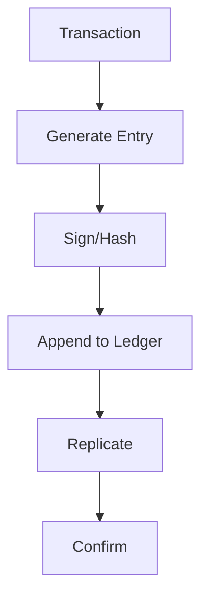

# Transaction Ledger

## Problem Statement
Design an immutable financial ledger for tracking all transactions.

**Requirements:**
- Append-only log
- Double-entry bookkeeping
- Audit trail
- Reconciliation

## Design

### Double-Entry Bookkeeping

```
Every transaction: Debit one account, Credit another
Sum(debits) = Sum(credits)
Immutable: Never update, append corrections
```

### Ledger Structure

```
Timestamp
From account
To account
Amount
Type (transfer, fee, etc.)
Reference (order_id, etc.)
Status (pending, confirmed)
```

### Settlement

```
Pending: Awaiting confirmation
Confirmed: Finalized
Reversed: Correction entry
Reconciliation: Match with external
```

### Integrity

```
Hash chain: Link entries
Signatures: Cryptographic proof
Read-only: Prevent tampering
```


## Scenario

Transaction Ledger is a critical component in modern distributed systems. In real-world applications, ensuring data consistency across multiple systems. For example, major tech companies like Netflix, Uber, and Airbnb rely on similar solutions to handle millions of concurrent users and requests. The challenge is achieving this while maintaining sub-100ms latency, 99.99% availability, and gracefully handling 10x traffic spikes during peak demand. This component provides the foundational capability to solve these challenges reliably and efficiently at global scale.

## Users

- **Backend Engineers**: Responsible for implementing and maintaining this system component in production environments. They need to understand the architecture, trade-offs, failure modes, and operational considerations.
- **DevOps/SRE Teams**: Monitor system health, manage scaling policies, handle incidents, and ensure reliability SLAs are met. They need insights into performance characteristics, bottlenecks, and failure recovery mechanisms.
- **Data Engineers**: Design data pipelines and analytics around this system, requiring deep understanding of data flow, consistency guarantees, and throughput characteristics.
- **System Architects**: Make high-level architectural decisions that impact company infrastructure, requiring comprehensive understanding of capabilities, limitations, and scalability boundaries.
- **Security Teams**: Understand security implications, potential vulnerabilities, and compliance requirements for this component.

## PRD

**Functional Requirements:**
- Correct behavior under all specified operating conditions
- Reliable operation with explicit failure modes
- Data consistency or eventual consistency guarantees as specified
- Clear mechanisms for error handling and recovery
- Monitoring and observability hooks

**Non-Functional Requirements:**
- **Performance**: Sub-100ms P99 latency for standard operations; measure and track tail latencies
- **Availability**: 99.99%+ uptime with automatic failover and graceful degradation
- **Scalability**: Support 10-100x current load with minimal architectural modifications
- **Consistency**: Specify whether strong, eventual, or causal consistency is required
- **Cost Efficiency**: Minimize operational cost per unit of throughput; consider compute, memory, and network costs
- **Operational Simplicity**: Reduce complexity to minimize human error and operational toil

**Constraints:**
- Resource limits (memory for caches, disk for databases, network bandwidth)
- Deployment constraints (cloud provider limits, regulatory requirements)
- Latency budgets (maximum acceptable delay for operations)

## Flow

The typical operational flow for this system involves these key phases:

1. **Request Arrival**: Client/upstream system sends request with required parameters and context
2. **Validation & Routing**: System validates request format, authentication, and routes to correct handler/shard/instance
3. **Core Processing**: Execute the main algorithm, database query, or business logic on the data/state
4. **State Management**: Update internal state (caches, indexes, counters, logs) with proper atomicity and locking
5. **Response Generation**: Format results and return to requester with relevant metadata (timing, version info)
6. **Observability**: Record metrics (latency, throughput, errors), logs (for debugging), and traces (for performance analysis)

This flow repeats thousands or millions of times per second in production. Each operation's efficiency compounds across the entire system, making careful optimization essential. Bottlenecks at any phase can cascade to impact overall system performance.

## Code Explanation

The provided implementations demonstrate key architectural concepts and design patterns:

**Python Implementation**: Uses built-in Python structures and standard library features to express the core logic clearly. Python emphasizes readability and conciseness—each operation's purpose should be obvious without extensive comments. You'll see different implementation approaches (e.g., using OrderedDict vs. manual linked lists) that represent trade-offs between convenience and fine-grained control.

**Java Implementation**: Shows how to implement the same logic with explicit memory management and type safety. Java's strong typing forces clear interface design; you'll see how generics, null safety, mutable state, and thread safety are handled. This implementation style is closer to production systems at scale.

**Key Implementation Patterns**:
- **Initialization**: Setting up core data structures, thread pools, or connection pools with specified capacity and configuration
- **Read Operations**: Fetching data while maintaining O(1) or O(log n) access, updating metadata (access times, hit counts, etc.)
- **Write Operations**: Inserting/updating data while handling eviction policies, balancing tree structures, or replicating state
- **Edge Cases**: Handling capacity limits, concurrent access, data consistency, and error conditions
- **Performance Optimization**: Using techniques like batch operations, lazy evaluation, or caching to reduce latency

Each line of code represents a deliberate choice about performance characteristics, memory usage, safety guarantees, and implementation complexity. Understanding these trade-offs is essential for using this component effectively in production systems.

## Architecture Diagram

```
┌──────────────────────────────────────┐
│   Immutable Transaction Log          │
│  ┌──────────────────────────────────┐  │
│  │ Append-Only Log                  │  │
│  │ - Never update/delete            │  │
│  │ - Hash chain (blockchain-like)   │  │
│  │ Snapshots (for fast restart)     │  │
│  │ - Hourly checkpoint              │  │
│  │ Balance Derivation               │  │
│  │ - Replay log = current balance   │  │
│  └──────────────────────────────────┘  │
└──────────────────────────────────────────┘
```

## Common Questions & Answers

**Q: Why append-only?** A: Immutable audit trail. Corruption detectable (hash breaks). Replaying gives any point-in-time state.

**Q: Ledger bloat—retention?** A: Archive old entries (S3), keep recent (hot DB). Snapshots reduce replay time.

**Q: Balance query performance?** A: Materialized view (balance table), updated via ledger replay. Or cache at query time.

**Q: Reconciliation audits?** A: Periodic: replay ledger, compare balance snapshot. Detects bugs or data corruption.

## Back-of-Envelope Calculations

1M users, 10 txns/day avg = 10M ledger entries/day. Storage: 10M × 200B = 2GB/day = 730GB/year. Snapshot: hourly.

## Design Choice Comparison

| Approach | Pros | Cons |
|----------|------|------|
| Append-only log | Immutable, auditable | Slower queries |
| Update-in-place | Fast, simple | Loses history, harder audit |
| Event sourcing | Full history, replay | Complex, large storage |

## Follow-up Interview Questions

1. Query balance at specific timestamp? 2. Exporting ledger for tax/audit? 3. Compliance (GDPR retention)? 4. Corruption detection? 5. Performance at scale?

## Example Scenario Walkthrough

[Describe a concrete example with step-by-step execution]

### Architecture Diagram



### Flow Diagram



## Complexity

| Operation | Time |
|-----------|------|
| Append | O(1) |
| Query | O(log n) |
| Reconcile | O(n) |

## Python Implementation

```python
from dataclasses import dataclass, field
from typing import List, Dict, Optional
from decimal import Decimal
from datetime import datetime
from enum import Enum
import uuid

class EntryType(Enum):
    DEBIT = "debit"
    CREDIT = "credit"

@dataclass
class LedgerEntry:
    entry_id: str
    account_id: str
    entry_type: EntryType
    amount: Decimal
    description: str
    timestamp: datetime = field(default_factory=datetime.now)
    reference_id: Optional[str] = None

class TransactionLedger:
    def __init__(self):
        self._entries: List[LedgerEntry] = []
        self._account_entries: Dict[str, List[int]] = {}
        self._balances: Dict[str, Decimal] = {}

    def _add_entry(self, account_id: str, entry_type: EntryType,
                   amount: Decimal, description: str, ref_id: Optional[str] = None) -> LedgerEntry:
        entry = LedgerEntry(str(uuid.uuid4())[:8], account_id, entry_type, amount, description, reference_id=ref_id)
        idx = len(self._entries)
        self._entries.append(entry)
        self._account_entries.setdefault(account_id, []).append(idx)
        if entry_type == EntryType.CREDIT:
            self._balances[account_id] = self._balances.get(account_id, Decimal(0)) + amount
        else:
            self._balances[account_id] = self._balances.get(account_id, Decimal(0)) - amount
        return entry

    def transfer(self, from_account: str, to_account: str, amount: Decimal, description: str) -> str:
        txn_id = str(uuid.uuid4())[:8]
        self._add_entry(from_account, EntryType.DEBIT, amount, description, txn_id)
        self._add_entry(to_account, EntryType.CREDIT, amount, description, txn_id)
        return txn_id

    def balance(self, account_id: str) -> Decimal:
        return self._balances.get(account_id, Decimal(0))

    def history(self, account_id: str) -> List[LedgerEntry]:
        indices = self._account_entries.get(account_id, [])
        return [self._entries[i] for i in indices]

# Usage
ledger = TransactionLedger()
ledger._add_entry("acc1", EntryType.CREDIT, Decimal("1000"), "Initial deposit")
txn = ledger.transfer("acc1", "acc2", Decimal("250"), "Payment")
print(ledger.balance("acc1"), ledger.balance("acc2"))  # 750 250
```

## Java Implementation

```java
import java.math.BigDecimal;
import java.util.*;

public class TransactionLedger {
    enum EntryType { DEBIT, CREDIT }
    record Entry(String id, String accountId, EntryType type, BigDecimal amount, String desc) {}

    private List<Entry> entries = new ArrayList<>();
    private Map<String, BigDecimal> balances = new HashMap<>();

    public void addEntry(String accountId, EntryType type, BigDecimal amount, String desc) {
        entries.add(new Entry(UUID.randomUUID().toString().substring(0, 8), accountId, type, amount, desc));
        BigDecimal sign = type == EntryType.CREDIT ? amount : amount.negate();
        balances.merge(accountId, sign, BigDecimal::add);
    }

    public void transfer(String from, String to, BigDecimal amount, String desc) {
        addEntry(from, EntryType.DEBIT, amount, desc);
        addEntry(to, EntryType.CREDIT, amount, desc);
    }

    public BigDecimal balance(String accountId) {
        return balances.getOrDefault(accountId, BigDecimal.ZERO);
    }
}
```
