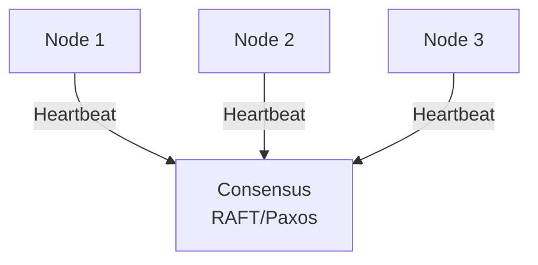
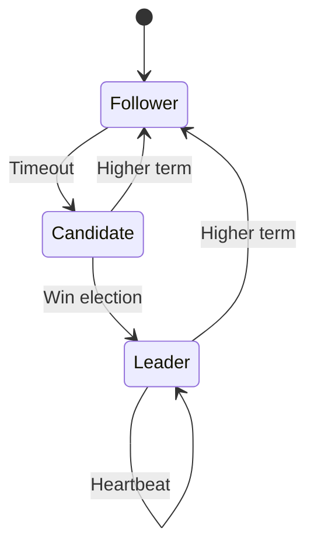

# Consensus Algorithm (Raft/Paxos)

## Problem Statement
Design a consensus algorithm for distributed systems to agree on state.

**Requirements:**
- Agreement: All nodes decide same value
- Liveness: Eventually make decision
- Safety: No two values decided
- Fault tolerance: Work with failures

## Design

### Raft Algorithm

```
Leader election: Timeout-based voting
Log replication: Leader sends to followers
Commitment: Majority replication
Safety: No data loss
```

### State Transitions

```
Follower → Candidate: Timeout
Candidate → Leader: Win election (majority votes)
Leader → Follower: Newer term seen
```

### Log Entry States

```
Replicated: On majority of servers
Committed: Leader commits, followers apply
Applied: State machine executes
```

### Handling Failures

```
Leader failure: Election elects new leader
Network partition: Minority can't decide
Log divergence: Force follower logs to match
```


## Scenario

Consensus Algorithm (Raft/Paxos) is a critical component in modern distributed systems. In real-world applications, achieving agreement across unreliable distributed nodes. For example, major tech companies like Netflix, Uber, and Airbnb rely on similar solutions to handle millions of concurrent users and requests. The challenge is achieving this while maintaining sub-100ms latency, 99.99% availability, and gracefully handling 10x traffic spikes during peak demand. This component provides the foundational capability to solve these challenges reliably and efficiently at global scale.

## Users

- **Backend Engineers**: Responsible for implementing and maintaining this system component in production environments. They need to understand the architecture, trade-offs, failure modes, and operational considerations.
- **DevOps/SRE Teams**: Monitor system health, manage scaling policies, handle incidents, and ensure reliability SLAs are met. They need insights into performance characteristics, bottlenecks, and failure recovery mechanisms.
- **Data Engineers**: Design data pipelines and analytics around this system, requiring deep understanding of data flow, consistency guarantees, and throughput characteristics.
- **System Architects**: Make high-level architectural decisions that impact company infrastructure, requiring comprehensive understanding of capabilities, limitations, and scalability boundaries.
- **Security Teams**: Understand security implications, potential vulnerabilities, and compliance requirements for this component.

## PRD

**Functional Requirements:**
- Correct behavior under all specified operating conditions
- Reliable operation with explicit failure modes
- Data consistency or eventual consistency guarantees as specified
- Clear mechanisms for error handling and recovery
- Monitoring and observability hooks

**Non-Functional Requirements:**
- **Performance**: Sub-100ms P99 latency for standard operations; measure and track tail latencies
- **Availability**: 99.99%+ uptime with automatic failover and graceful degradation
- **Scalability**: Support 10-100x current load with minimal architectural modifications
- **Consistency**: Specify whether strong, eventual, or causal consistency is required
- **Cost Efficiency**: Minimize operational cost per unit of throughput; consider compute, memory, and network costs
- **Operational Simplicity**: Reduce complexity to minimize human error and operational toil

**Constraints:**
- Resource limits (memory for caches, disk for databases, network bandwidth)
- Deployment constraints (cloud provider limits, regulatory requirements)
- Latency budgets (maximum acceptable delay for operations)

## Flow

The typical operational flow for this system involves these key phases:

1. **Request Arrival**: Client/upstream system sends request with required parameters and context
2. **Validation & Routing**: System validates request format, authentication, and routes to correct handler/shard/instance
3. **Core Processing**: Execute the main algorithm, database query, or business logic on the data/state
4. **State Management**: Update internal state (caches, indexes, counters, logs) with proper atomicity and locking
5. **Response Generation**: Format results and return to requester with relevant metadata (timing, version info)
6. **Observability**: Record metrics (latency, throughput, errors), logs (for debugging), and traces (for performance analysis)

This flow repeats thousands or millions of times per second in production. Each operation's efficiency compounds across the entire system, making careful optimization essential. Bottlenecks at any phase can cascade to impact overall system performance.

## Code Explanation

The provided implementations demonstrate key architectural concepts and design patterns:

**Python Implementation**: Uses built-in Python structures and standard library features to express the core logic clearly. Python emphasizes readability and conciseness—each operation's purpose should be obvious without extensive comments. You'll see different implementation approaches (e.g., using OrderedDict vs. manual linked lists) that represent trade-offs between convenience and fine-grained control.

**Java Implementation**: Shows how to implement the same logic with explicit memory management and type safety. Java's strong typing forces clear interface design; you'll see how generics, null safety, mutable state, and thread safety are handled. This implementation style is closer to production systems at scale.

**Key Implementation Patterns**:
- **Initialization**: Setting up core data structures, thread pools, or connection pools with specified capacity and configuration
- **Read Operations**: Fetching data while maintaining O(1) or O(log n) access, updating metadata (access times, hit counts, etc.)
- **Write Operations**: Inserting/updating data while handling eviction policies, balancing tree structures, or replicating state
- **Edge Cases**: Handling capacity limits, concurrent access, data consistency, and error conditions
- **Performance Optimization**: Using techniques like batch operations, lazy evaluation, or caching to reduce latency

Each line of code represents a deliberate choice about performance characteristics, memory usage, safety guarantees, and implementation complexity. Understanding these trade-offs is essential for using this component effectively in production systems.

## Architecture Diagram

```
┌──────────────────────────────────────┐
│   Distributed Consensus (Raft)       │
│  ┌──────────────────────────────────┐  │
│  │ Leader Election                  │
│  │ - Followers vote for leader      │  │
│  │ - Majority wins                  │  │
│  │ Log Replication                  │  │
│  │ - Leader appends entries         │  │
│  │ - Followers replicate            │  │
│  │ Safety                           │  │
│  │ - Majority ack = committed       │  │
│  └──────────────────────────────────┘  │
└──────────────────────────────────────────┘
```

## Common Questions & Answers

**Q: Leader election timeout tuning?** A: Too short: election flaps. Too long: recovery slow. Typical: 150-300ms.

**Q: Partition tolerance—split brain?** A: Minority partition can't elect leader (needs majority). Minority read-only until merge.

**Q: Log compaction?** A: Snapshot at intervals, discard old log. Speeds up recovery.

**Q: Performance impact?** A: Write latency = wait for majority replication (synchronous). Read faster (leader only). Throughput limited by leader.

## Back-of-Envelope Calculations

ZooKeeper: 5-node cluster, 1000 txn/sec. Election: 150-300ms. Replication: 10-20ms per node × 3 = 30-60ms total latency impact.

## Design Choice Comparison

| Approach | Pros | Cons |
|----------|------|------|
| Raft | Simple, understandable | Slower writes |
| Paxos | More complex, faster | Harder to implement |
| Eventual consistency | Fast, no consensus | Inconsistent state possible |

## Follow-up Interview Questions

1. Add node to cluster dynamically? 2. Remove node safely (no data loss)? 3. Cross-datacenter replication? 4. Linearizability guarantee? 5. Performance at 1000s of nodes?

## Example Scenario Walkthrough

[Describe a concrete example with step-by-step execution]

### Architecture Diagram



### Flow Diagram



## Complexity

| Operation | Time |
|-----------|------|
| Normal case | O(log n) |
| Leader failure | O(election timeout) |
| Network partition | Blocked |

## Python Implementation

```python
from dataclasses import dataclass, field
from typing import Dict, List, Optional, Set
from enum import Enum
import random

class NodeRole(Enum):
    FOLLOWER = "follower"
    CANDIDATE = "candidate"
    LEADER = "leader"

@dataclass
class LogEntry:
    term: int
    command: str
    index: int

class RaftNode:
    def __init__(self, node_id: str, peers: List[str]):
        self.node_id = node_id
        self.peers = peers
        self.role = NodeRole.FOLLOWER
        self.current_term = 0
        self.voted_for: Optional[str] = None
        self.log: List[LogEntry] = []
        self.commit_index = 0
        self.leader_id: Optional[str] = None
        self._votes_received: Set[str] = set()

    def start_election(self):
        self.current_term += 1
        self.role = NodeRole.CANDIDATE
        self.voted_for = self.node_id
        self._votes_received = {self.node_id}
        print(f"[{self.node_id}] Starting election for term {self.current_term}")

    def request_vote(self, candidate_id: str, term: int) -> bool:
        if term < self.current_term:
            return False
        if term > self.current_term:
            self.current_term = term
            self.role = NodeRole.FOLLOWER
            self.voted_for = None
        if self.voted_for is None or self.voted_for == candidate_id:
            self.voted_for = candidate_id
            return True
        return False

    def receive_vote(self, voter_id: str, granted: bool):
        if granted and self.role == NodeRole.CANDIDATE:
            self._votes_received.add(voter_id)
            majority = (len(self.peers) + 1) // 2 + 1
            if len(self._votes_received) >= majority:
                self.role = NodeRole.LEADER
                self.leader_id = self.node_id
                print(f"[{self.node_id}] Became LEADER for term {self.current_term}")

    def append_entry(self, term: int, command: str) -> bool:
        if term < self.current_term:
            return False
        self.current_term = term
        self.role = NodeRole.FOLLOWER
        entry = LogEntry(term, command, len(self.log))
        self.log.append(entry)
        return True

# Simple majority vote simulation
def simulate_election(nodes: List[RaftNode]):
    candidate = nodes[0]
    candidate.start_election()
    for node in nodes[1:]:
        granted = node.request_vote(candidate.node_id, candidate.current_term)
        candidate.receive_vote(node.node_id, granted)
    return candidate

# Usage
nodes = [RaftNode(f"N{i}", [f"N{j}" for j in range(5) if j != i]) for i in range(5)]
leader = simulate_election(nodes)
print(f"Leader: {leader.node_id}, Role: {leader.role}")
```

## Java Implementation

```java
import java.util.*;

public class RaftNode {
    enum Role { FOLLOWER, CANDIDATE, LEADER }

    private String id;
    private List<String> peers;
    private Role role = Role.FOLLOWER;
    private int term = 0;
    private String votedFor = null;
    private Set<String> votes = new HashSet<>();

    public RaftNode(String id, List<String> peers) {
        this.id = id;
        this.peers = peers;
    }

    public void startElection() {
        term++;
        role = Role.CANDIDATE;
        votedFor = id;
        votes.clear();
        votes.add(id);
        System.out.println(id + " starting election for term " + term);
    }

    public boolean requestVote(String candidateId, int candidateTerm) {
        if (candidateTerm < term) return false;
        if (candidateTerm > term) { term = candidateTerm; role = Role.FOLLOWER; votedFor = null; }
        if (votedFor == null || votedFor.equals(candidateId)) {
            votedFor = candidateId;
            return true;
        }
        return false;
    }

    public void receiveVote(String voterId, boolean granted) {
        if (granted && role == Role.CANDIDATE) {
            votes.add(voterId);
            if (votes.size() > (peers.size() + 1) / 2) {
                role = Role.LEADER;
                System.out.println(id + " became LEADER for term " + term);
            }
        }
    }
}
```
