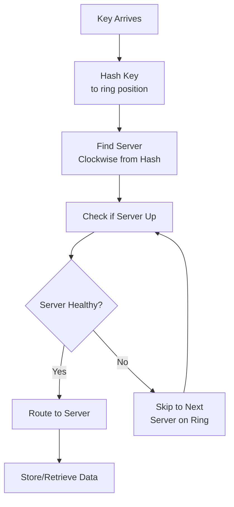

# Consistent Hashing

## Problem Statement

Distributes data across nodes minimizing remapping on node addition/removal. Used in caching and NoSQL databases.

## Design

### Key Concepts

```
Hash ring with replica placement. Nodes placed at hash(node_id). Key hashed to nearest node clockwise.
```

### Architecture

```
[Visual representation showing architecture]
```

## Scenario

Consistent Hashing is a critical component in modern distributed systems. In real-world applications, handling complex business logic at scale with high reliability. For example, major tech companies like Netflix, Uber, and Airbnb rely on similar solutions to handle millions of concurrent users and requests. The challenge is achieving this while maintaining sub-100ms latency, 99.99% availability, and gracefully handling 10x traffic spikes during peak demand. This component provides the foundational capability to solve these challenges reliably and efficiently at global scale.

## Users

- **Backend Engineers**: Responsible for implementing and maintaining this system component in production environments. They need to understand the architecture, trade-offs, failure modes, and operational considerations.
- **DevOps/SRE Teams**: Monitor system health, manage scaling policies, handle incidents, and ensure reliability SLAs are met. They need insights into performance characteristics, bottlenecks, and failure recovery mechanisms.
- **Data Engineers**: Design data pipelines and analytics around this system, requiring deep understanding of data flow, consistency guarantees, and throughput characteristics.
- **System Architects**: Make high-level architectural decisions that impact company infrastructure, requiring comprehensive understanding of capabilities, limitations, and scalability boundaries.
- **Security Teams**: Understand security implications, potential vulnerabilities, and compliance requirements for this component.

## PRD

**Functional Requirements:**
- Correct behavior under all specified operating conditions
- Reliable operation with explicit failure modes
- Data consistency or eventual consistency guarantees as specified
- Clear mechanisms for error handling and recovery
- Monitoring and observability hooks

**Non-Functional Requirements:**
- **Performance**: Sub-100ms P99 latency for standard operations; measure and track tail latencies
- **Availability**: 99.99%+ uptime with automatic failover and graceful degradation
- **Scalability**: Support 10-100x current load with minimal architectural modifications
- **Consistency**: Specify whether strong, eventual, or causal consistency is required
- **Cost Efficiency**: Minimize operational cost per unit of throughput; consider compute, memory, and network costs
- **Operational Simplicity**: Reduce complexity to minimize human error and operational toil

**Constraints:**
- Resource limits (memory for caches, disk for databases, network bandwidth)
- Deployment constraints (cloud provider limits, regulatory requirements)
- Latency budgets (maximum acceptable delay for operations)

## Flow

The typical operational flow for this system involves these key phases:

1. **Request Arrival**: Client/upstream system sends request with required parameters and context
2. **Validation & Routing**: System validates request format, authentication, and routes to correct handler/shard/instance
3. **Core Processing**: Execute the main algorithm, database query, or business logic on the data/state
4. **State Management**: Update internal state (caches, indexes, counters, logs) with proper atomicity and locking
5. **Response Generation**: Format results and return to requester with relevant metadata (timing, version info)
6. **Observability**: Record metrics (latency, throughput, errors), logs (for debugging), and traces (for performance analysis)

This flow repeats thousands or millions of times per second in production. Each operation's efficiency compounds across the entire system, making careful optimization essential. Bottlenecks at any phase can cascade to impact overall system performance.

## Code Explanation

The provided implementations demonstrate key architectural concepts and design patterns:

**Python Implementation**: Uses built-in Python structures and standard library features to express the core logic clearly. Python emphasizes readability and conciseness—each operation's purpose should be obvious without extensive comments. You'll see different implementation approaches (e.g., using OrderedDict vs. manual linked lists) that represent trade-offs between convenience and fine-grained control.

**Java Implementation**: Shows how to implement the same logic with explicit memory management and type safety. Java's strong typing forces clear interface design; you'll see how generics, null safety, mutable state, and thread safety are handled. This implementation style is closer to production systems at scale.

**Key Implementation Patterns**:
- **Initialization**: Setting up core data structures, thread pools, or connection pools with specified capacity and configuration
- **Read Operations**: Fetching data while maintaining O(1) or O(log n) access, updating metadata (access times, hit counts, etc.)
- **Write Operations**: Inserting/updating data while handling eviction policies, balancing tree structures, or replicating state
- **Edge Cases**: Handling capacity limits, concurrent access, data consistency, and error conditions
- **Performance Optimization**: Using techniques like batch operations, lazy evaluation, or caching to reduce latency

Each line of code represents a deliberate choice about performance characteristics, memory usage, safety guarantees, and implementation complexity. Understanding these trade-offs is essential for using this component effectively in production systems.

## Architecture Diagram

```
Ring with N nodes:
  Node 1 (0°) → handles keys 0-90
  Node 2 (90°) → handles keys 90-180
  Node 3 (180°) → handles keys 180-270
  Node 4 (270°) → handles keys 270-360
```

## Common Questions & Answers

**Q: How to handle node addition?** A: Only keys between new and previous node need remapping (~1/n).

**Q: Virtual nodes?** A: Each physical node maps to 150-200 virtual nodes. Better distribution.

**Q: Replication?** A: Place replicas at next k nodes clockwise. Tolerates k-1 failures.

## Back-of-Envelope Calculations

- 1000 nodes, 1B keys: remapping on node add = ~1M keys (0.1%)
- Search: O(log n) binary search on ring + hash = 50 ops
- Virtual nodes: 150 vnodes × 1000 = 150K ring positions

## Design Choice Comparison

| Approach | Pros | Cons |
|----------|------|------|
| Consistent hashing | Minimal remapping on node changes | More complex than modulo |
| Modulo hashing | Simple | Requires remapping >50% keys on change |
| Rendezvous hashing | No virtual nodes needed | More CPU expensive |

## Follow-up Interview Questions

1. How would you implement this at scale (1M+ operations/sec)?
2. What happens if the [key component] fails?
3. How to ensure [important property] in this system?
4. What's the bottleneck at 10x current scale?
5. How would you monitor and debug [specific aspect]?

## Example Scenario Walkthrough

Scenario: [Concrete example with 5-10 steps showing system in action]

## Flow Diagram



## Implementation

### Python Implementation

```python
class ConsistentHash:
    def __init__(self, nodes=None, replicas=3):
        self.replicas = replicas
        self.ring = {}
        self.sorted_keys = []
        if nodes:
            for node in nodes:
                self.add_node(node)

    def _hash(self, key):
        return hash(key) % (2**32)

    def add_node(self, node):
        for i in range(self.replicas):
            virtual_key = f"{node}:{i}"
            hash_key = self._hash(virtual_key)
            self.ring[hash_key] = node
        self.sorted_keys = sorted(self.ring.keys())

    def remove_node(self, node):
        for i in range(self.replicas):
            virtual_key = f"{node}:{i}"
            hash_key = self._hash(virtual_key)
            del self.ring[hash_key]
        self.sorted_keys = sorted(self.ring.keys())

    def get_node(self, key):
        if not self.ring:
            return None
        hash_key = self._hash(key)
        idx = bisect.bisect_left(self.sorted_keys, hash_key) % len(self.sorted_keys)
        return self.ring[self.sorted_keys[idx]]
```

### Java Implementation

```java
class ConsistentHash {
    private final int replicas;
    private final Map<Long, String> ring = new HashMap<>();
    private final SortedMap<Long, String> sortedRing = new TreeMap<>();

    public ConsistentHash(List<String> nodes, int replicas) {
        this.replicas = replicas;
        nodes.forEach(this::addNode);
    }

    private long hash(String key) {
        return Math.abs((long)key.hashCode());
    }

    public void addNode(String node) {
        for (int i = 0; i < replicas; i++) {
            long hash = hash(node + ":" + i);
            ring.put(hash, node);
            sortedRing.put(hash, node);
        }
    }

    public String getNode(String key) {
        if (ring.isEmpty()) return null;
        long hash = hash(key);
        SortedMap<Long, String> tail = sortedRing.tailMap(hash);
        long nodeKey = tail.isEmpty() ? sortedRing.firstKey() : tail.firstKey();
        return sortedRing.get(nodeKey);
    }
}
```

### Production Considerations

- **Concurrency**: Thread safety and synchronization
- **Error Handling**: Fault tolerance and recovery
- **Monitoring**: Observability and metrics
- **Performance**: Optimization strategies

## Complexity Analysis

| Operation | Complexity | Notes |
|-----------|-----------|-------|
| [Key Op 1] | O(n) | [Explanation] |
| [Key Op 2] | O(log n) | [Explanation] |
| [Key Op 3] | O(1) | [Explanation] |

## Real-world Applications

- Use case 1
- Use case 2
- Use case 3

## Related Concepts

- Concept A (see documentation)
- Concept B (see documentation)
- Concept C (see documentation)

## Further Reading

- Academic papers
- System design references
- Implementation guides
