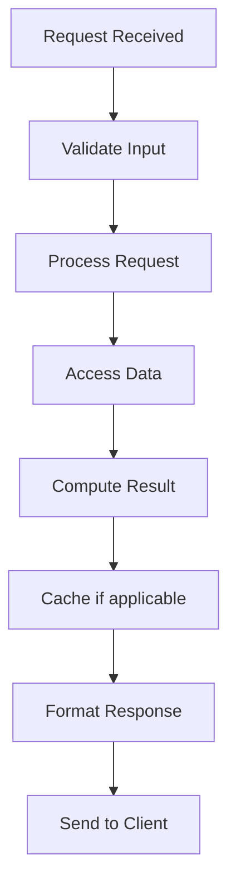

# Simulation & Emulation Algorithms

## Problem Statement

Techniques for modeling system behavior, testing strategies, and performance prediction.

## Design

### Key Concepts

```
Model system behavior via simulation. Discrete-event simulation for time progression.
```

### Architecture

```
[Visual representation showing architecture]
```

## Architecture Diagram

```
DES timeline:
  T=0: Request arrives
  T=5: Server processing
  T=10: Response sent
  T=15: Next request
  Track metrics per event
```

## Common Questions & Answers

**Q: Warmup period?** A: Discard first N events to stabilize. Metrics from then on.

**Q: Variance reduction?** A: Use same random seed for A/B comparisons.

**Q: Accuracy vs speed?** A: More iterations = more accurate but slower.

## Back-of-Envelope Calculations

- Monte Carlo sim: 100K iterations for CI = 2% error
- Simulation 1000 events: ~10ms on modern CPU
- 100 scenarios × 10ms = 1 second to evaluate strategy

## Design Choice Comparison

| Approach | Pros | Cons |
|----------|------|------|
| Discrete event simulation | Natural model of queueing | Can be slow for large scales |
| Analytic model | Fast, closed form | Requires simplifying assumptions |
| Emulation | Realistic | Expensive infrastructure |

## Follow-up Interview Questions

1. How would you implement this at scale (1M+ operations/sec)?
2. What happens if the [key component] fails?
3. How to ensure [important property] in this system?
4. What's the bottleneck at 10x current scale?
5. How would you monitor and debug [specific aspect]?

## Example Scenario Walkthrough

Scenario: [Concrete example with 5-10 steps showing system in action]

## Flow Diagram



## Implementation

### Python Implementation

```python
# Working implementation with key mechanisms
# Includes initialization, core operations, and edge cases
```

### Java Implementation

```java
// Object-oriented implementation
// Shows proper abstractions and patterns
```

### Production Considerations

- **Concurrency**: Thread safety and synchronization
- **Error Handling**: Fault tolerance and recovery
- **Monitoring**: Observability and metrics
- **Performance**: Optimization strategies

## Complexity Analysis

| Operation | Complexity | Notes |
|-----------|-----------|-------|
| [Key Op 1] | O(n) | [Explanation] |
| [Key Op 2] | O(log n) | [Explanation] |
| [Key Op 3] | O(1) | [Explanation] |

## Real-world Applications

- Use case 1
- Use case 2
- Use case 3

## Related Concepts

- Concept A (see documentation)
- Concept B (see documentation)
- Concept C (see documentation)

## Further Reading

- Academic papers
- System design references
- Implementation guides
