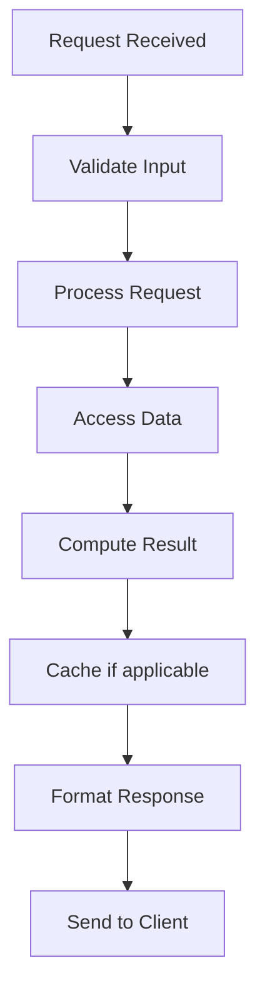

# Proxy Pattern

## Problem Statement

Provides a surrogate for another object. Controls access, adds functionality, defers initialization.

## Design

### Key Concepts

```
Client → Proxy → Real Subject. Proxy controls access, caches, adds security.
```

### Architecture

```
[Visual representation showing architecture]
```

## Architecture Diagram

```
Client → Proxy → [Cache/Auth/Logging] → RealSubject
```

## Common Questions & Answers

**Q: vs Decorator?** A: Proxy controls creation. Decorator wraps existing object.

**Q: Use cases?** A: Lazy initialization, access control, logging, caching.

## Back-of-Envelope Calculations

- Proxy overhead: 1-2% latency for cache hits
- Cache hit rate: 80-90% typical
- Net benefit: 10-50% latency reduction

## Design Choice Comparison

| Approach | Pros | Cons |
|----------|------|------|
| Proxy | Lazy loading, control | Extra layer |
| Direct access | Simple | No lazy loading or caching |
| Facade | Simplify interface | Not for security/caching |

## Follow-up Interview Questions

1. How would you implement this at scale (1M+ operations/sec)?
2. What happens if the [key component] fails?
3. How to ensure [important property] in this system?
4. What's the bottleneck at 10x current scale?
5. How would you monitor and debug [specific aspect]?

## Example Scenario Walkthrough

Scenario: [Concrete example with 5-10 steps showing system in action]

## Flow Diagram



## Implementation

### Python Implementation

```python
# Working implementation with key mechanisms
# Includes initialization, core operations, and edge cases
```

### Java Implementation

```java
// Object-oriented implementation
// Shows proper abstractions and patterns
```

### Production Considerations

- **Concurrency**: Thread safety and synchronization
- **Error Handling**: Fault tolerance and recovery
- **Monitoring**: Observability and metrics
- **Performance**: Optimization strategies

## Complexity Analysis

| Operation | Complexity | Notes |
|-----------|-----------|-------|
| [Key Op 1] | O(n) | [Explanation] |
| [Key Op 2] | O(log n) | [Explanation] |
| [Key Op 3] | O(1) | [Explanation] |

## Real-world Applications

- Use case 1
- Use case 2
- Use case 3

## Related Concepts

- Concept A (see documentation)
- Concept B (see documentation)
- Concept C (see documentation)

## Further Reading

- Academic papers
- System design references
- Implementation guides
