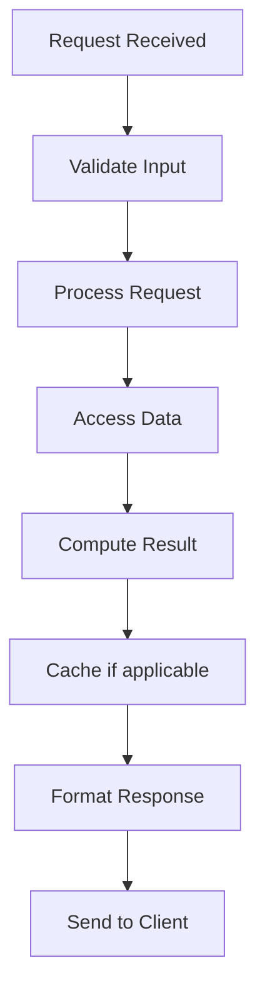

# Composite Pattern

## Problem Statement

Composes objects into tree structures. Treats individual objects and compositions uniformly.

## Design

### Key Concepts

```
Tree of objects. Leaf and Composite have same interface. Operations propagate down.
```

### Architecture

```
[Visual representation showing architecture]
```

## Architecture Diagram

```
Composite
  ├─ Leaf
  ├─ Composite
  │  ├─ Leaf
  │  └─ Leaf
  └─ Leaf
```

## Common Questions & Answers

**Q: vs inheritance?** A: Composition over inheritance. Flexible structure.

**Q: Traversal?** A: DFS or iterator pattern.

## Back-of-Envelope Calculations

- Tree with 1M nodes, 10 levels: traversal = ~10M ops
- Memory: 50 bytes/node = 50MB for 1M nodes

## Design Choice Comparison

| Approach | Pros | Cons |
|----------|------|------|
| Composite | Natural hierarchy | Extra overhead |
| Flat list | Simple | No structure |
| OOP inheritance | Type safety | Rigid structure |

## Follow-up Interview Questions

1. How would you implement this at scale (1M+ operations/sec)?
2. What happens if the [key component] fails?
3. How to ensure [important property] in this system?
4. What's the bottleneck at 10x current scale?
5. How would you monitor and debug [specific aspect]?

## Example Scenario Walkthrough

Scenario: [Concrete example with 5-10 steps showing system in action]

## Flow Diagram



## Implementation

### Python Implementation

```python
# Working implementation with key mechanisms
# Includes initialization, core operations, and edge cases
```

### Java Implementation

```java
// Object-oriented implementation
// Shows proper abstractions and patterns
```

### Production Considerations

- **Concurrency**: Thread safety and synchronization
- **Error Handling**: Fault tolerance and recovery
- **Monitoring**: Observability and metrics
- **Performance**: Optimization strategies

## Complexity Analysis

| Operation | Complexity | Notes |
|-----------|-----------|-------|
| [Key Op 1] | O(n) | [Explanation] |
| [Key Op 2] | O(log n) | [Explanation] |
| [Key Op 3] | O(1) | [Explanation] |

## Real-world Applications

- Use case 1
- Use case 2
- Use case 3

## Related Concepts

- Concept A (see documentation)
- Concept B (see documentation)
- Concept C (see documentation)

## Further Reading

- Academic papers
- System design references
- Implementation guides
