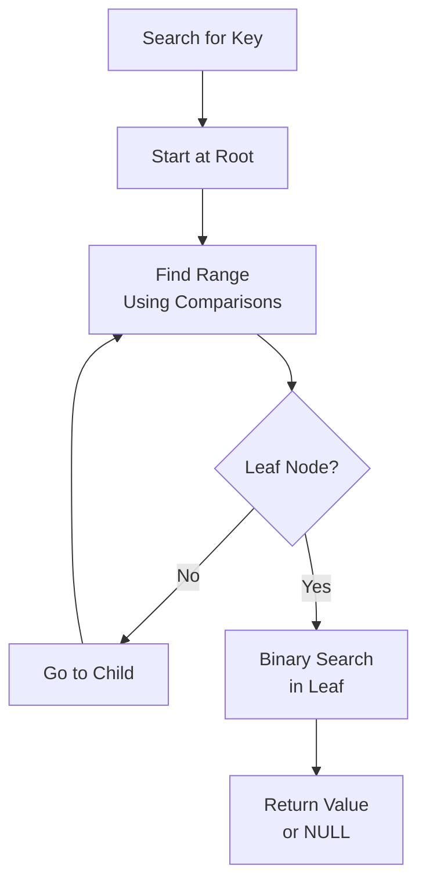

# B-Tree & B+ Tree

## Problem Statement

Self-balancing search trees optimized for disk I/O. Standard in databases for indexing.

## Design

### Key Concepts

```
B+ tree: all data in leaves, non-leaf nodes are routing. 100-200 keys per node.
```

### Architecture

```
[Visual representation showing architecture]
```

## Architecture Diagram

```
Root [1, 5, 10, 15]
├─ [0-1]
├─ [1-5]
├─ [5-10]
└─ [10-15]
```

## Common Questions & Answers

**Q: Search complexity?** A: O(log n) where n = number of keys. 3-4 levels for 1B keys.

**Q: Range queries?** A: Linear scan of leaf nodes. O(k + log n) for k results.

## Back-of-Envelope Calculations

- 1B keys, 200 keys/node: ~5 levels
- Search: 5 disk reads = 50ms typical (10ms/read)
- Insert: 5 reads + 1 write = 60ms

## Design Choice Comparison

| Approach | Pros | Cons |
|----------|------|------|
| B+ tree | Efficient both search and range | Complex to implement |
| Binary search tree | Simple | O(log n) but unbalanced |
| Hash table | O(1) search | No ordering, no range queries |

## Follow-up Interview Questions

1. How would you implement this at scale (1M+ operations/sec)?
2. What happens if the [key component] fails?
3. How to ensure [important property] in this system?
4. What's the bottleneck at 10x current scale?
5. How would you monitor and debug [specific aspect]?

## Example Scenario Walkthrough

Scenario: [Concrete example with 5-10 steps showing system in action]

## Flow Diagram



## Implementation

### Python Implementation

```python
# Working implementation with key mechanisms
# Includes initialization, core operations, and edge cases
```

### Java Implementation

```java
// Object-oriented implementation
// Shows proper abstractions and patterns
```

### Production Considerations

- **Concurrency**: Thread safety and synchronization
- **Error Handling**: Fault tolerance and recovery
- **Monitoring**: Observability and metrics
- **Performance**: Optimization strategies

## Complexity Analysis

| Operation | Complexity | Notes |
|-----------|-----------|-------|
| [Key Op 1] | O(n) | [Explanation] |
| [Key Op 2] | O(log n) | [Explanation] |
| [Key Op 3] | O(1) | [Explanation] |

## Real-world Applications

- Use case 1
- Use case 2
- Use case 3

## Related Concepts

- Concept A (see documentation)
- Concept B (see documentation)
- Concept C (see documentation)

## Further Reading

- Academic papers
- System design references
- Implementation guides
