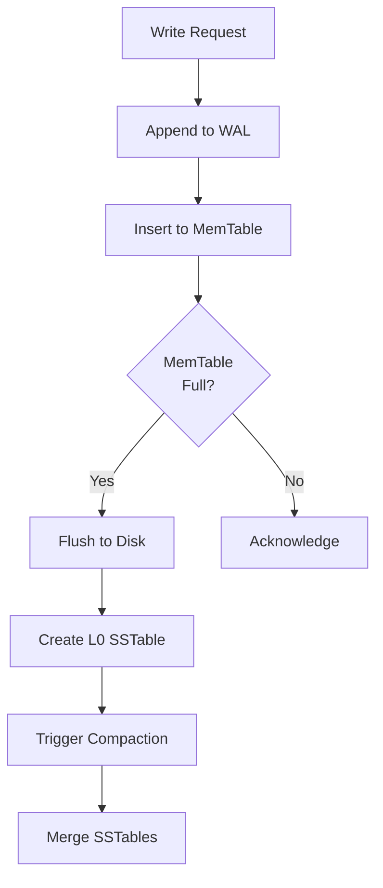

# LSM Tree (Log-Structured Merge)

## Problem Statement

Optimizes writes via sequential disk I/O. Used in LevelDB, RocksDB, Cassandra.

## Design

### Key Concepts

```
In-memory MemTable → disk Levels. Compaction merges SSTables.
```

### Architecture

```
[Visual representation showing architecture]
```

## Architecture Diagram

```
Writes:
  In-memory MemTable (64MB)
  ↓ when full
  Level 0 (10 SSTables)
  ↓ compaction
  Level 1 (100MB)
  ↓ compaction
  Level N (TBs)
```

## Common Questions & Answers

**Q: Write amplification?** A: 10-50× due to compaction. O(log n) but slower constants.

**Q: Read penalties?** A: Check MemTable, then L0 (may have many), then Li.

## Back-of-Envelope Calculations

- Write throughput: 100K writes/sec
- Compaction CPU: 20-30% of total
- Read latency: 10-50ms depending on where key is

## Design Choice Comparison

| Approach | Pros | Cons |
|----------|------|------|
| LSM tree | Fast writes | Slower reads, write amplification |
| B+ tree | Balanced reads/writes | Slower writes |
| Hybrid | Tuneable | More complex |

## Follow-up Interview Questions

1. How would you implement this at scale (1M+ operations/sec)?
2. What happens if the [key component] fails?
3. How to ensure [important property] in this system?
4. What's the bottleneck at 10x current scale?
5. How would you monitor and debug [specific aspect]?

## Example Scenario Walkthrough

Scenario: [Concrete example with 5-10 steps showing system in action]

## Flow Diagram



## Implementation

### Python Implementation

```python
# Working implementation with key mechanisms
# Includes initialization, core operations, and edge cases
```

### Java Implementation

```java
// Object-oriented implementation
// Shows proper abstractions and patterns
```

### Production Considerations

- **Concurrency**: Thread safety and synchronization
- **Error Handling**: Fault tolerance and recovery
- **Monitoring**: Observability and metrics
- **Performance**: Optimization strategies

## Complexity Analysis

| Operation | Complexity | Notes |
|-----------|-----------|-------|
| [Key Op 1] | O(n) | [Explanation] |
| [Key Op 2] | O(log n) | [Explanation] |
| [Key Op 3] | O(1) | [Explanation] |

## Real-world Applications

- Use case 1
- Use case 2
- Use case 3

## Related Concepts

- Concept A (see documentation)
- Concept B (see documentation)
- Concept C (see documentation)

## Further Reading

- Academic papers
- System design references
- Implementation guides
