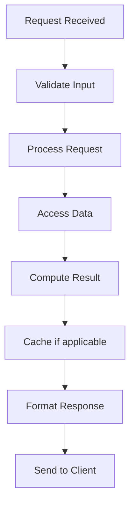

# Database Replication Strategies

## Problem Statement

Master-slave, multi-master, synchronous, asynchronous replication patterns.

## Design

### Key Concepts

```
Sync replication (all ACK), Async (one ACK), Semi-sync (majority ACK).
```

### Architecture

```
[Visual representation showing architecture]
```

## Architecture Diagram

```
Sync: Master → wait ← Slaves ACK → Client ACK
Async: Master → Client ACK → replicate to Slaves
```

## Common Questions & Answers

**Q: Master failure risk?** A: Async = data loss possible. Sync = slower but safe.

**Q: RPO/RTO?** A: RPO = data loss amount. RTO = recovery time.

## Back-of-Envelope Calculations

- Sync 2-slave: latency = p99(slave1, slave2) = slower
- Async: latency = master only = faster
- Replication lag: typically 1-100ms

## Design Choice Comparison

| Approach | Pros | Cons |
|----------|------|------|
| Async | Fast writes | Data loss risk |
| Sync | Safe | Slow writes |
| Semi-sync | Balanced | Middle ground |

## Follow-up Interview Questions

1. How would you implement this at scale (1M+ operations/sec)?
2. What happens if the [key component] fails?
3. How to ensure [important property] in this system?
4. What's the bottleneck at 10x current scale?
5. How would you monitor and debug [specific aspect]?

## Example Scenario Walkthrough

Scenario: [Concrete example with 5-10 steps showing system in action]

## Flow Diagram



## Implementation

### Python Implementation

```python
# Working implementation with key mechanisms
# Includes initialization, core operations, and edge cases
```

### Java Implementation

```java
// Object-oriented implementation
// Shows proper abstractions and patterns
```

### Production Considerations

- **Concurrency**: Thread safety and synchronization
- **Error Handling**: Fault tolerance and recovery
- **Monitoring**: Observability and metrics
- **Performance**: Optimization strategies

## Complexity Analysis

| Operation | Complexity | Notes |
|-----------|-----------|-------|
| [Key Op 1] | O(n) | [Explanation] |
| [Key Op 2] | O(log n) | [Explanation] |
| [Key Op 3] | O(1) | [Explanation] |

## Real-world Applications

- Use case 1
- Use case 2
- Use case 3

## Related Concepts

- Concept A (see documentation)
- Concept B (see documentation)
- Concept C (see documentation)

## Further Reading

- Academic papers
- System design references
- Implementation guides
