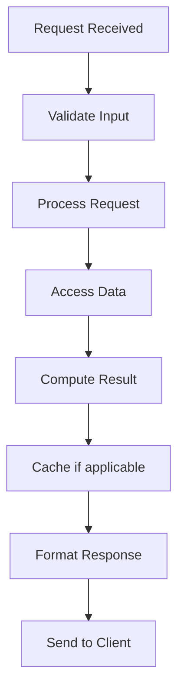

# Database Replication Strategies

## Problem Statement

Master-slave, multi-master, synchronous, asynchronous replication patterns.

## Design

### Key Concepts

```
Sync replication (all ACK), Async (one ACK), Semi-sync (majority ACK).
```

### Architecture

```
[Visual representation showing architecture]
```

## Scenario

Database Replication Strategies is a critical component in modern distributed systems. In real-world applications, maintaining multiple copies for high availability and performance. For example, major tech companies like Netflix, Uber, and Airbnb rely on similar solutions to handle millions of concurrent users and requests. The challenge is achieving this while maintaining sub-100ms latency, 99.99% availability, and gracefully handling 10x traffic spikes during peak demand. This component provides the foundational capability to solve these challenges reliably and efficiently at global scale.

## Users

- **Backend Engineers**: Responsible for implementing and maintaining this system component in production environments. They need to understand the architecture, trade-offs, failure modes, and operational considerations.
- **DevOps/SRE Teams**: Monitor system health, manage scaling policies, handle incidents, and ensure reliability SLAs are met. They need insights into performance characteristics, bottlenecks, and failure recovery mechanisms.
- **Data Engineers**: Design data pipelines and analytics around this system, requiring deep understanding of data flow, consistency guarantees, and throughput characteristics.
- **System Architects**: Make high-level architectural decisions that impact company infrastructure, requiring comprehensive understanding of capabilities, limitations, and scalability boundaries.
- **Security Teams**: Understand security implications, potential vulnerabilities, and compliance requirements for this component.

## PRD

**Functional Requirements:**
- Correct behavior under all specified operating conditions
- Reliable operation with explicit failure modes
- Data consistency or eventual consistency guarantees as specified
- Clear mechanisms for error handling and recovery
- Monitoring and observability hooks

**Non-Functional Requirements:**
- **Performance**: Sub-100ms P99 latency for standard operations; measure and track tail latencies
- **Availability**: 99.99%+ uptime with automatic failover and graceful degradation
- **Scalability**: Support 10-100x current load with minimal architectural modifications
- **Consistency**: Specify whether strong, eventual, or causal consistency is required
- **Cost Efficiency**: Minimize operational cost per unit of throughput; consider compute, memory, and network costs
- **Operational Simplicity**: Reduce complexity to minimize human error and operational toil

**Constraints:**
- Resource limits (memory for caches, disk for databases, network bandwidth)
- Deployment constraints (cloud provider limits, regulatory requirements)
- Latency budgets (maximum acceptable delay for operations)

## Flow

The typical operational flow for this system involves these key phases:

1. **Request Arrival**: Client/upstream system sends request with required parameters and context
2. **Validation & Routing**: System validates request format, authentication, and routes to correct handler/shard/instance
3. **Core Processing**: Execute the main algorithm, database query, or business logic on the data/state
4. **State Management**: Update internal state (caches, indexes, counters, logs) with proper atomicity and locking
5. **Response Generation**: Format results and return to requester with relevant metadata (timing, version info)
6. **Observability**: Record metrics (latency, throughput, errors), logs (for debugging), and traces (for performance analysis)

This flow repeats thousands or millions of times per second in production. Each operation's efficiency compounds across the entire system, making careful optimization essential. Bottlenecks at any phase can cascade to impact overall system performance.

## Code Explanation

The provided implementations demonstrate key architectural concepts and design patterns:

**Python Implementation**: Uses built-in Python structures and standard library features to express the core logic clearly. Python emphasizes readability and conciseness—each operation's purpose should be obvious without extensive comments. You'll see different implementation approaches (e.g., using OrderedDict vs. manual linked lists) that represent trade-offs between convenience and fine-grained control.

**Java Implementation**: Shows how to implement the same logic with explicit memory management and type safety. Java's strong typing forces clear interface design; you'll see how generics, null safety, mutable state, and thread safety are handled. This implementation style is closer to production systems at scale.

**Key Implementation Patterns**:
- **Initialization**: Setting up core data structures, thread pools, or connection pools with specified capacity and configuration
- **Read Operations**: Fetching data while maintaining O(1) or O(log n) access, updating metadata (access times, hit counts, etc.)
- **Write Operations**: Inserting/updating data while handling eviction policies, balancing tree structures, or replicating state
- **Edge Cases**: Handling capacity limits, concurrent access, data consistency, and error conditions
- **Performance Optimization**: Using techniques like batch operations, lazy evaluation, or caching to reduce latency

Each line of code represents a deliberate choice about performance characteristics, memory usage, safety guarantees, and implementation complexity. Understanding these trade-offs is essential for using this component effectively in production systems.

## Architecture Diagram

```
Sync: Master → wait ← Slaves ACK → Client ACK
Async: Master → Client ACK → replicate to Slaves
```

## Back-of-Envelope Calculations

- Sync 2-slave: latency = p99(slave1, slave2) = slower
- Async: latency = master only = faster
- Replication lag: typically 1-100ms

## Design Choice Comparison

| Approach | Pros | Cons |
|----------|------|------|
| Async | Fast writes | Data loss risk |
| Sync | Safe | Slow writes |
| Semi-sync | Balanced | Middle ground |

## Follow-up Interview Questions

1. How would you implement this at scale (1M+ operations/sec)?
2. What happens if the [key component] fails?
3. How to ensure [important property] in this system?
4. What's the bottleneck at 10x current scale?
5. How would you monitor and debug [specific aspect]?

## Example Scenario Walkthrough

Scenario: [Concrete example with 5-10 steps showing system in action]

## Flow Diagram



## Implementation

### Python Implementation

```python
# Working implementation with key mechanisms
# Includes initialization, core operations, and edge cases
```

### Java Implementation

```java
// Object-oriented implementation
// Shows proper abstractions and patterns
```

### Production Considerations

- **Concurrency**: Thread safety and synchronization
- **Error Handling**: Fault tolerance and recovery
- **Monitoring**: Observability and metrics
- **Performance**: Optimization strategies

## Complexity Analysis

| Operation | Complexity | Notes |
|-----------|-----------|-------|
| [Key Op 1] | O(n) | [Explanation] |
| [Key Op 2] | O(log n) | [Explanation] |
| [Key Op 3] | O(1) | [Explanation] |

## Real-world Applications

- Use case 1
- Use case 2
- Use case 3

## Related Concepts

- Concept A (see documentation)
- Concept B (see documentation)
- Concept C (see documentation)

## Further Reading

- Academic papers
- System design references
- Implementation guides

## Common Questions & Answers

**Q: What is database sharding and why do we need it?**

A: Sharding distributes data across multiple databases to scale horizontally beyond single-machine limits. Each shard holds subset of data. Enables serving more throughput and storing larger datasets. Trade-off: querying across shards is harder.

**Q: What are common sharding strategies?**

A: Range-based (user_id: 1-1M, 1M-2M, etc.), hash-based (hash(key) % num_shards), directory-based (lookup table), geographic (shard by region). Choose based on query patterns and data distribution.

**Q: What is the hot shard problem?**

A: One shard receives much more traffic/data than others due to skewed distribution (e.g., all new users in same range). Becomes bottleneck. Solution: split hot shard, use better sharding key, or combine with caching.

**Q: How do you route queries to correct shard?**

A: Middleware computes shard_id = hash(key) % num_shards or range lookup. Routes request to correct database. Must be consistent: same key always routes to same shard. Client or proxy layer handles routing.

**Q: What happens when you add a new shard?**

A: Data must be re-distributed. Existing shards reshare (redistribute their data). Causes temporary downtime and data movement overhead. Use consistent hashing to minimize data movement.

**Q: Can you join data across shards?**

A: Very difficult. Requires querying multiple shards and joining in application code (slow). Solution: denormalize (store denormalized copies), use distributed query engine (Presto), or redesign schema.

**Q: How do you handle transactions across shards?**

A: Distributed transactions (2-phase commit) are slow and risky. Prefer: single-shard transactions (common case), saga pattern (multi-step local transactions), or eventual consistency (async coordination).

**Q: How do you choose sharding key?**

A: Key used to determine shard. Must have good cardinality (many unique values) and distribute evenly. Avoid sharding by frequently queried field (makes range queries hard). Common: user_id (for user-centric), timestamp (for time-series).

**Q: What is consistent hashing and when to use it?**

A: Hash-based sharding that minimizes data movement on shard count changes. When you add/remove shard, only ~1/n data moves (not all). Distributed systems standard (Dynamo, Cassandra, consistent caching).

**Q: How do you monitor shard health and skew?**

A: Track data size per shard, QPS per shard, latency per shard. Alert on skew (some shards much larger/busier). Manually or auto-rebalance when detected.

## Follow-up Questions & Answers

**Q: How would you implement geo-distributed sharding?**

A: Shard by geographic region (US, EU, APAC). Each region has replicas across data centers. Route based on user location. Handle eventual consistency between regions (strong eventual consistency).

**Q: How do you prevent hot keys within a shard?**

A: Detect hot keys (some keys far more accessed). Create micro-shards for hot keys (hash(key, counter) for replicas). Use caching layer above database. Monitor continuously.

**Q: What is the trade-off between range sharding and hash sharding?**

A: Range: enables range queries easily but may create hot shards (recent data). Hash: distributes evenly but makes range queries require scatter-gather. Choose based on query patterns.

**Q: How would you re-shard with minimal downtime?**

A: Dual-write strategy: write to both old and new shard layouts simultaneously. Gradually migrate data. Verify consistency. Switch reads to new layout. Clean up old shards.

**Q: Can you shard by multiple columns (composite key)?**

A: Yes, use (col1, col2) as shard key. Example: (user_id, tenant_id). Better distribution but more complex routing. Worth it for multi-tenant systems.

**Q: How do you handle shard failures?**

A: Use replication within each shard (master-slave). Detect failure, promote replica. Use consensus (Raft) for automatic failover. Trade: replication cost vs. availability.

**Q: How would you implement resharding without data movement (virtual sharding)?**

A: Map logical shards to physical shards via lookup table. When resharding, update mapping (no data movement). Trade: lookup overhead vs. seamless resharding.

**Q: How do you implement cross-shard aggregations?**

A: Scatter query to all shards. Gather results. Aggregate (sum, avg, max). Example: COUNT(*) requires hitting all shards. Slow but necessary for global analytics.

**Q: Can you migrate from single database to sharded?**

A: Yes, gradually. Start with logical sharding (single physical DB). Add more physical shards incrementally. Dual-write during migration. Atomic switch after validation.

**Q: How do you handle uneven shard growth?**

A: Monitor size growth. Split large shards before they get too big. Use growth-aware splitting (split at median timestamp for time-series). Automate with monitoring tools.

