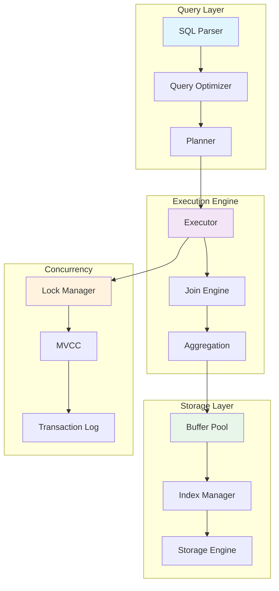
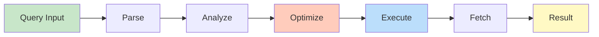
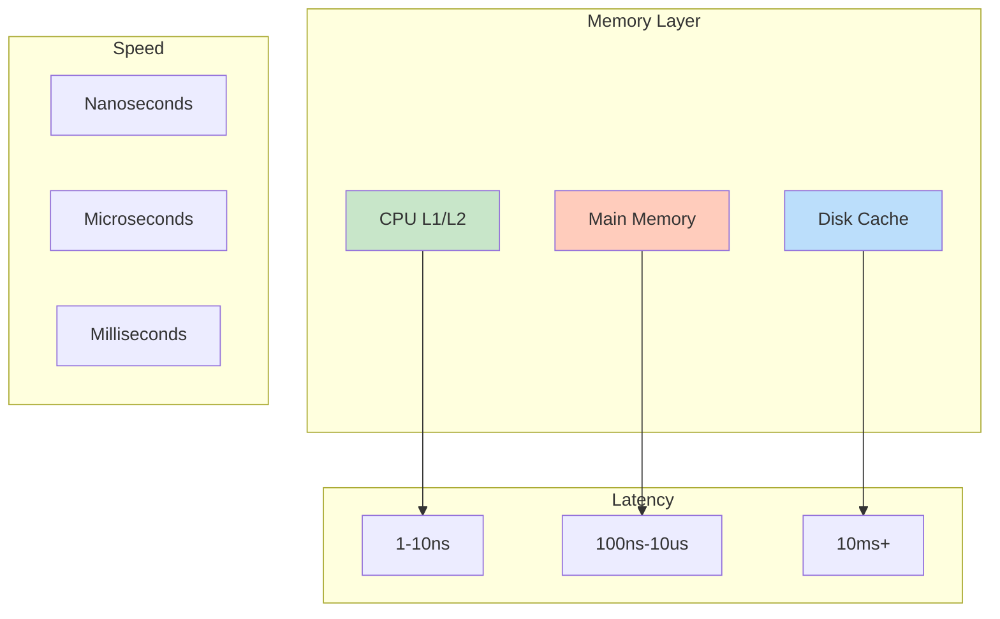
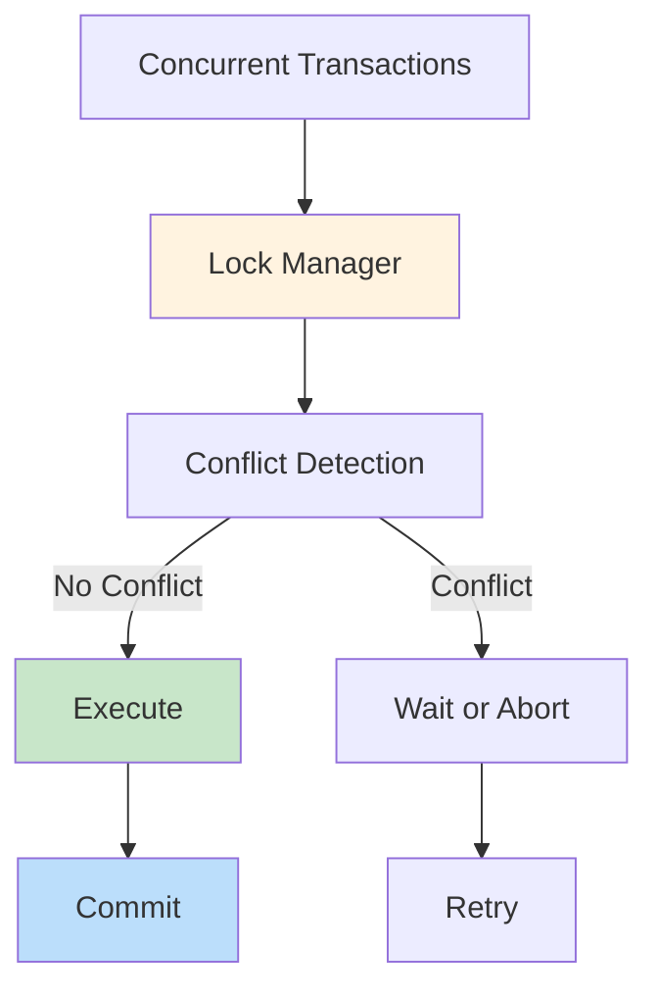
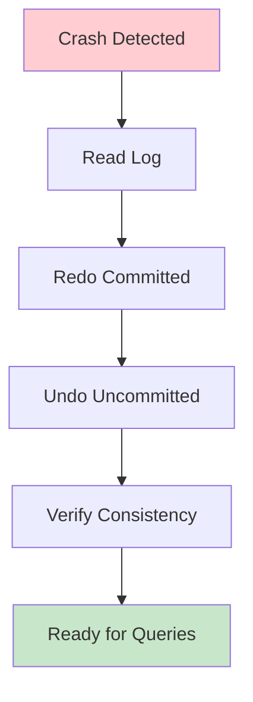

# Checkpoint and Recovery

## Problem Statement

### Functional Requirements
- Create consistent database snapshots
- Enable recovery from any checkpoint
- Support incremental and full checkpoints
- Handle crash recovery automatically
- Track recovery progress

### Non-Functional Requirements
- Checkpoint latency: < 1 minute for 1TB data
- Recovery time: < 5 minutes from crash
- Durability: Fsync guarantees
- Frequency: Hourly checkpoints sufficient
- Automation: Fully automatic process

## System Overview

**Scale Metrics:**
- Throughput: Millions of operations per second
- Latency: Microseconds to milliseconds
- Data volume: Terabytes to Petabytes
- Concurrent operations: Thousands to millions
- Availability: 99.99% to 99.999% uptime SLA

**Key Components:**
- Data structures and algorithms
- Concurrency control mechanisms
- Memory and storage management
- Query processing and optimization
- Monitoring and observability

## Architecture Diagrams

### System Architecture



### Data Flow



### Performance Characteristics



### Concurrency Control



### Recovery Process



## Data Flow Scenarios

### Scenario 1: Query Execution
1. SQL query received and parsed
2. Optimizer analyzes query plan
3. Cost-based optimizer selects best plan
4. Executor runs physical plan
5. Buffer pool manages page access
6. Results streamed to client

### Scenario 2: Transaction with Conflict
1. Transaction A acquires lock on row
2. Transaction B tries to access same row
3. Lock manager blocks B until A commits
4. A commits and releases lock
5. B proceeds with row access

### Scenario 3: Index Lookup
1. Query asks for row with key = 'X'
2. Index traversal from root to leaf
3. Leaf page fetched from buffer pool
4. Key location found in O(log n) time
5. Row ID obtained from index
6. Data page fetched and returned

## Performance Optimization

### Query Optimization
- **Predicate pushdown**: Apply filters early
- **Join ordering**: Smallest intermediate results
- **Parallel execution**: Multi-threaded processing
- **Caching**: Avoid redundant computation

### Storage Optimization
- **Compression**: 5-10x space reduction
- **Partitioning**: Scan only relevant data
- **Indexing**: Fast key lookups
- **Denormalization**: Trade storage for speed

### Concurrency Optimization
- **Lock-free structures**: Minimize contention
- **MVCC**: Read without blocking writes
- **Batching**: Group operations for efficiency
- **Adaptive**: Tune based on workload

## Back-of-Envelope Calculations

### Query Performance
```
1 billion row table
Index on column: 30-level B-tree
Sequential scan: 1 billion rows × 8KB = 8TB disk read
Index lookup: log(1B) ≈ 30 page accesses = 30ms
Speedup: 8TB read ÷ 30ms = 10,000x faster
```

### Buffer Pool Sizing
```
Cache 10% of 1TB database = 100GB
Page size: 8KB
Number of pages: 100GB ÷ 8KB = 12.8M pages
Hit rate: 95% = 95% memory access, 5% disk access
Memory bandwidth: 100GB/s
Expected latency: 95% × 1us + 5% × 10ms ≈ 500us
```

### Concurrency Throughput
```
Transactions per second: 10K
Contention: 10% of transactions conflict
Lock wait time: 10ms average
Throughput impact: 10K × (1 - 0.1) + (10K × 0.1) × (1 - 10ms overhead)
Effective: ~9,000 TPS due to contention
```

### Recovery Time
```
Database size: 1TB
Redo speed: 100MB/s
Recovery time: 1TB ÷ 100MB/s = 10,000 seconds ≈ 2.8 hours
With optimization (parallel redo): 2.8 hours ÷ 8 cores = 21 minutes
With incremental checkpoints: 10 minutes + redo time
```

## Interview Questions & Answers

### Q1: Design an index for fast lookups

**Answer:**
1. **Clarify**: Cardinality, range queries, update frequency
2. **Options**:
   - Hash index: O(1) point lookups, no range
   - B-tree: O(log n), good for range, updates
   - LSM tree: O(log n), optimized for writes
3. **Deep dive**: B-tree with 10-20x branching factor
4. **Implementation**: Internal/leaf node structure
5. **Tradeoffs**: Space vs speed, update cost

### Q2: Handle 100 concurrent transactions

**Answer:**
- **Locking**: 2-phase locking with deadlock detection
- **MVCC**: Readers don't block writers
- **Isolation**: REPEATABLE READ sufficient for most
- **Monitoring**: Track lock contention and timeouts
- **Optimization**: Hot row batching, range locks

### Q3: What happens during crash recovery?

**Answer:**
1. **Redo phase**: Replay committed changes from log
2. **Undo phase**: Remove uncommitted changes
3. **Verify**: Check consistency, rebuild indexes
4. **Time**: Proportional to active transaction log
5. **Optimization**: Incremental checkpoints reduce time

### Q4: How do you optimize slow queries?

**Answer:**
1. **Profile**: Identify bottleneck (CPU, I/O, lock)
2. **Statistics**: Update table/index statistics
3. **Indexes**: Add index on filter columns
4. **Plan**: Review explain plan
5. **Denormalization**: Cache frequently joined data
6. **Sharding**: Partition large tables

### Q5: Design a distributed transaction system

**Answer:**
- **Coordinator**: Two-phase commit protocol
- **Replicas**: Write to majority for durability
- **Timeout**: Abort if no response < 5 seconds
- **Recovery**: Coordinator failure detection
- **Optimization**: One-phase commit for single region

### Q6: How to reduce query latency from 100ms to 10ms?

**Answer:**
- **Profile**: Where is time spent? (network, CPU, I/O)
- **Caching**: Cache result of expensive subqueries
- **Index**: Add covering index for index-only scan
- **Parallel**: Parallelize independent operations
- **Code**: Reduce allocations, optimize hot paths

## Technology Stack

| Component | Technology | Why |
|-----------|-----------|-----|
| Storage Engine | B-tree, LSM tree | Balance reads/writes |
| Buffer Pool | Clock algorithm | Simple, effective eviction |
| Lock Manager | Deadlock detection | Prevent deadlock cycles |
| Query Optimizer | Cost-based | Choose optimal plan |
| Recovery | WAL + Checkpoints | Durability with speed |

## Lessons Learned

1. **Small optimizations matter**: 1% per component = 10x overall
2. **Statistics are critical**: Bad cardinality estimates = bad plans
3. **Contention is killer**: Lock-free designs essential at scale
4. **Measure everything**: Can't optimize what you don't measure
5. **Trade-offs**: Always a tradeoff between consistency, latency, throughput

## Related Topics

- Query optimization and cost-based planning
- Concurrency control and isolation levels
- Storage structures and indexing
- Transaction processing and recovery
- Distributed database systems
- Performance tuning and monitoring
