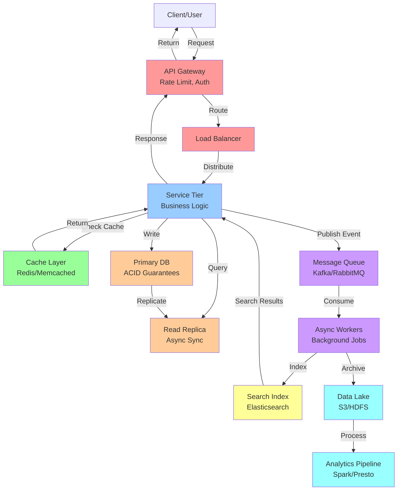
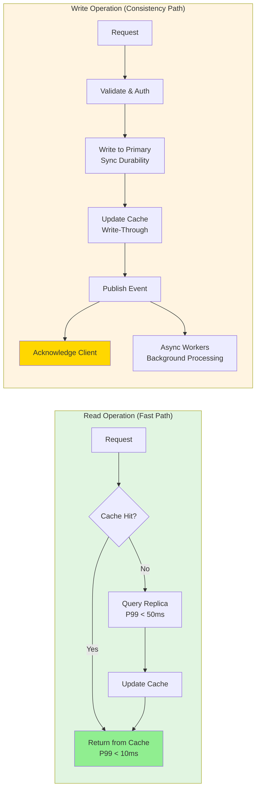
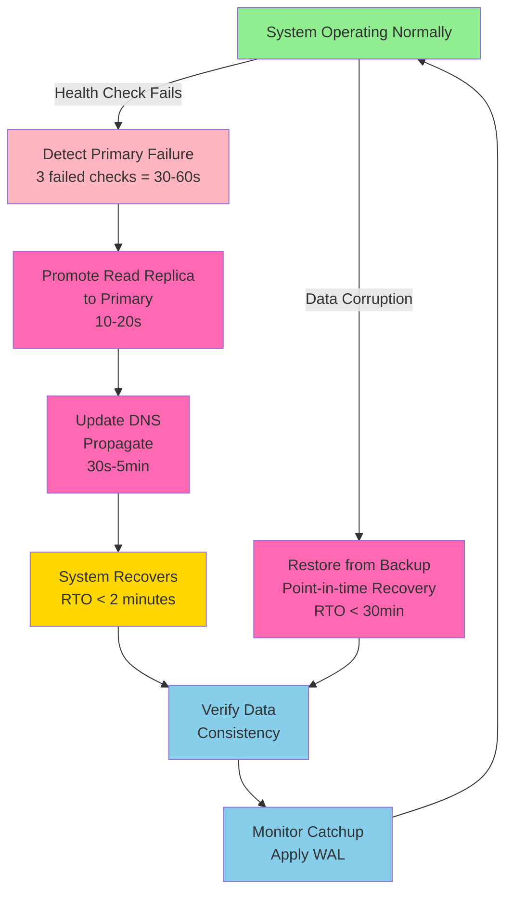
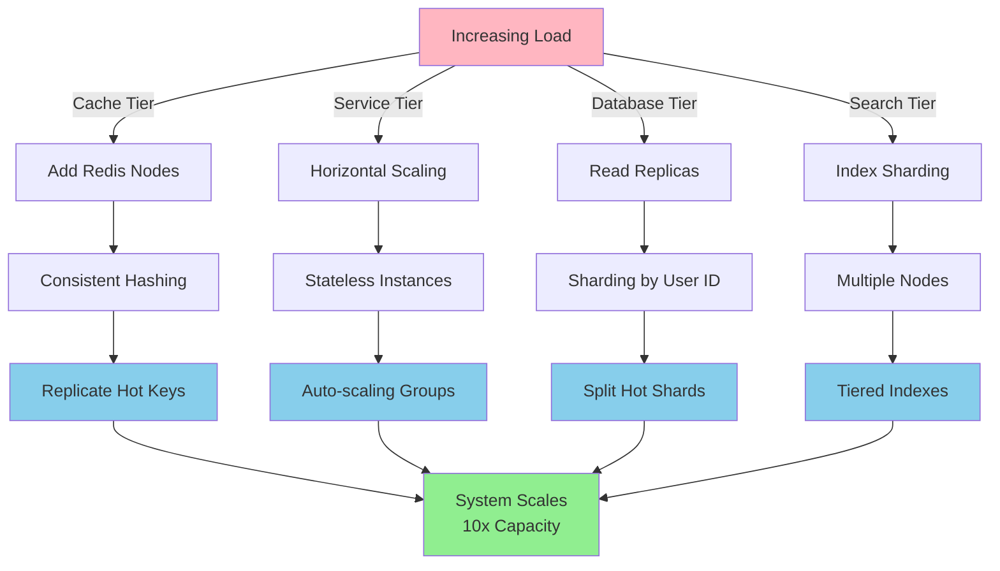
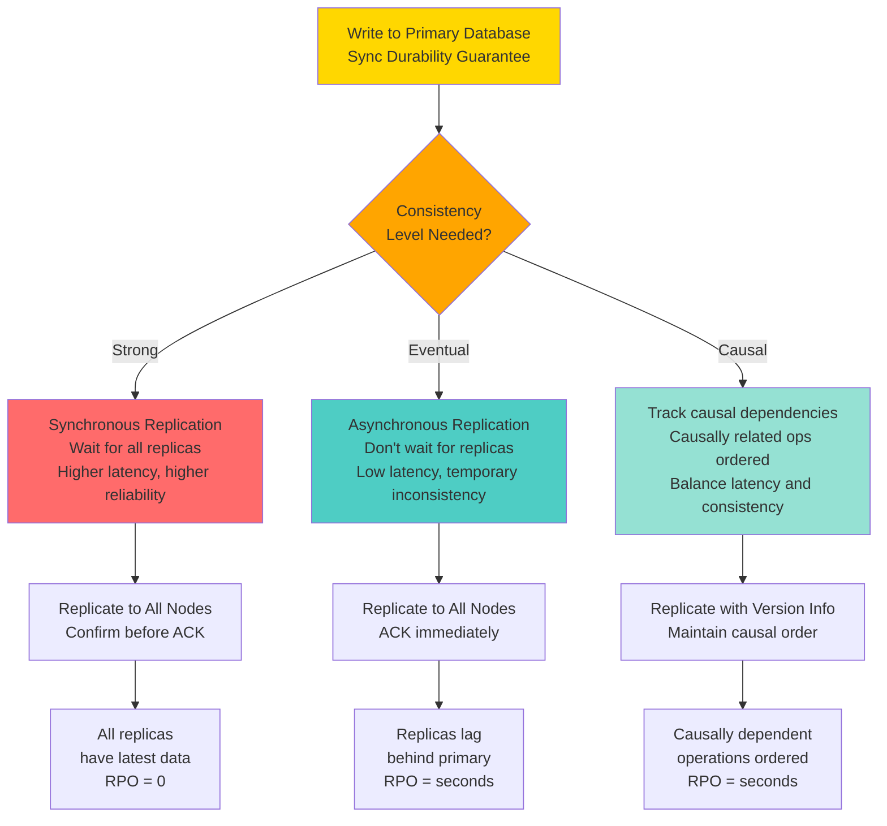

# Notion Workspace

## System Overview

**Scale Metrics:**
- **Users:** 30M+
- **Daily Active Users:** 10M+
- **Requests Per Second (Peak):** 200K+
- **Data Storage:** Petabytes

**Key Challenge:** CRDT-based collaborative editing with real-time sync

## Problem Statement

### Functional Requirements
- Core service operations must be reliable and correct
- Multi-region deployment with local consistency
- Clear error handling and recovery mechanisms
- Comprehensive monitoring and observability
- Authentication and authorization
- API versioning for backward compatibility

### Non-Functional Requirements
- **Latency:** P99 latency < 100ms for primary operations
- **Availability:** 99.99% uptime (four nines)
- **Throughput:** Handle peak load with 2-5x headroom
- **Consistency:** Eventual consistency with strong guarantees for critical data
- **Scalability:** Horizontal scaling to handle 10x growth
- **Cost Efficiency:** Optimize per-request operational cost

### Success Metrics
- Request latency P99 < target milliseconds
- Availability > 99.99%
- Zero data loss on committed transactions
- System remains responsive under 10x normal load
- Cost per request optimized

## Architecture

### High-Level Design

```
[Client] → [API Gateway] → [Load Balancer] → [Service Tier]
                                                    ↓
                    [Cache Layer] ← → [Primary DB] [Replica DBs]
                                                    ↓
                    [Message Queue] → [Async Workers] → [Data Lake]
                                                    ↓
                            [Search Index] [Analytics] [ML Pipeline]
```

### Core Components

#### Request Path (Primary Operations)
1. **API Gateway**: Rate limiting, authentication, request routing
   - Tech: Custom service or Kong/AWS API Gateway
   - Handles TLS termination and request validation

2. **Load Balancer**: Distribute across multiple instances
   - Tech: Internal or cloud-native (AWS ELB, Google Cloud LB)
   - Health checks and automatic failover

3. **Service Tier**: Business logic execution
   - Stateless design for easy horizontal scaling
   - Circuit breakers for downstream failures
   - Bulkhead pattern for resource isolation

4. **Cache Layer**: Reduce database load
   - Tech: Redis or Memcached
   - TTL-based expiration with write-through pattern
   - Cache warming and preloading strategies

5. **Primary Database**: Authoritative data store
   - Tech: PostgreSQL, MySQL, or specialized datastores
   - Strong ACID guarantees for critical data
   - Binary replication for consistency

6. **Read Replicas**: Distribute read load
   - Asynchronous replication with lag
   - Load balancing across replicas
   - Automatic promotion on primary failure

#### Data Processing Path
1. **Message Queue**: Decouple real-time and batch processing
   - Tech: RabbitMQ, Kafka, or AWS SQS
   - Guarantees: at-least-once or exactly-once semantics

2. **Async Workers**: Process background jobs
   - Consumer pools for parallel processing
   - Retry logic with exponential backoff
   - Dead-letter queues for failed messages

3. **Data Lake**: Store historical data
   - Tech: S3, HDFS, or BigQuery
   - Columnar format (Parquet) for analytics

4. **Search Index**: Enable rich queries
   - Tech: Elasticsearch, Solr, or Algolia
   - Real-time or near-real-time indexing

5. **Analytics Pipeline**: Generate insights
   - Tech: Spark, Presto, or BigQuery
   - Scheduled or on-demand processing

### Data Flow Scenarios

#### Scenario 1: Read Operation
1. Client requests data from API
2. API Gateway validates and routes request
3. Service checks Redis cache
4. Cache hit: Return cached data (P99 < 10ms)
5. Cache miss: Query read replica
6. Service updates cache and returns data
7. Log metrics: latency, cache hit ratio

#### Scenario 2: Write Operation
1. Client submits write request
2. API validates request and checks permissions
3. Service acquires write lock or uses transactions
4. Primary database executes write with durability
5. Synchronously update critical caches
6. Publish event to message queue
7. Acknowledge success to client
8. Async workers process side effects

#### Scenario 3: Cache Invalidation
1. Update committed to database
2. Synchronously invalidate cache entry
3. Publish invalidation event
4. Other services invalidate locally cached copies
5. Next request recomputes and caches fresh value

## Scalability Strategies

### Database Scaling

**Vertical Scaling (Temporary):**
- Increase CPU, RAM, storage on primary instance
- Enables 3-5x growth before hitting physical limits
- Requires downtime for most systems

**Horizontal Scaling (Long-term):**
1. **Read Replicas**: Distribute SELECT queries
   - Multiple read-only replicas in primary region
   - Cross-region replicas for geo-distribution
   - Route reads intelligently based on consistency requirements

2. **Sharding by Tenant/User ID**:
   - Partition data by user_id hash
   - Each shard handles subset of users
   - Reduces hot spots and load per instance

3. **Sharding by Time**:
   - New tables/shards for recent data
   - Old data archived to cold storage
   - Improves query performance on recent data

4. **Sharding by Geography**:
   - Regional shards for local consistency
   - Asynchronous sync between regions
   - Reduces latency for local operations

**Managing Hot Shards:**
- Identify shards with uneven load distribution
- Further subdivide hot shards
- Use consistent hashing for even distribution
- Monitor and rebalance periodically

### Cache Scaling

**Cache Tier Expansion:**
- Add Redis/Memcached nodes
- Use consistent hashing for key distribution
- Replicate hot keys across nodes
- Monitor hit ratio and adjust TTLs

**Multi-Level Caching:**
1. Local in-process cache (milliseconds)
2. Distributed cache (milliseconds, shared)
3. CDN cache (for static content, seconds)

### Service Tier Scaling

**Horizontal Scaling:**
- Stateless design enables easy replication
- Load balancer distributes across instances
- Add instances to handle peak load
- Auto-scaling based on CPU/memory metrics

**Optimizing for Throughput:**
- Connection pooling to databases
- Batch requests where possible
- Async I/O for external calls
- Worker thread pools sized appropriately

### Search Index Scaling

**Index Partitioning:**
- Shard index by document ID ranges
- Each shard on separate Elasticsearch node
- Query fans out to all shards
- Combine results at API layer

**Index Tiering:**
- Hot shard with latest data (in memory)
- Warm shard with older data
- Cold storage archive
- Move data between tiers as it ages

## High Availability & Reliability

### Replication Strategies

**Master-Slave (Primary-Replica):**
- Writes go to primary only
- Replicas lag behind by milliseconds to minutes
- Failover: promote replica to primary
- Trade-off: temporary inconsistency

**Multi-Master (Active-Active):**
- Writes distributed across multiple primaries
- Requires conflict resolution mechanism
- Higher availability, complex consistency
- Example: Cassandra, DynamoDB

**Quorum-Based:**
- Write to majority of replicas
- Read from minimum replicas
- Ensures consistency and availability
- Tunable consistency-availability trade-off

### Failover Mechanisms

**Automatic Detection:**
- Health checks every 5-10 seconds
- Multiple health check endpoints
- Circuit breakers for failing dependencies

**Failover Actions:**
1. Detect primary failure (3 failed health checks)
2. Elect new primary from healthy replicas
3. Update DNS to point to new primary
4. Notify monitoring and alert oncall
5. Queue database replication catchup
6. Gradual traffic shift to new primary

**Time to Recovery:**
- Detection: 30-60 seconds
- Promotion: 10-20 seconds
- DNS propagation: 30 seconds to 5 minutes
- Total RTO (Recovery Time Objective): < 2 minutes

### Disaster Recovery

**Backup Strategy:**
- Continuous binary log backups (WAL)
- Point-in-time recovery capability
- Daily snapshots replicated to different region
- Test restores monthly

**Recovery Scenarios:**
1. **Single Server Failure**: Promote replica (RTO < 2min, RPO < 1sec)
2. **Region Failure**: Failover to backup region (RTO < 10min, RPO < 5min)
3. **Datacenter Failure**: Activate warm standby (RTO < 5min, RPO < 1min)
4. **Data Corruption**: Restore from backups (RTO < 30min, RPO < 1hour)

## Data Consistency

### Consistency Models

**Strong Consistency:**
- Every read returns latest write
- Achieved through: synchronous replication or quorum reads
- Cost: higher latency, reduced availability
- Used for: financial transactions, critical state

**Eventual Consistency:**
- Replicas converge to same state over time
- Lower latency, higher availability
- May read stale data temporarily
- Used for: caches, user profiles, feeds

**Causal Consistency:**
- Causally dependent operations are ordered
- Other operations may be concurrent
- Middle ground between strong and eventual
- Used for: social feeds, comment threads

### Transaction Management

**ACID Transactions:**
- Atomicity: All-or-nothing
- Consistency: Valid state before and after
- Isolation: Concurrent transactions don't interfere
- Durability: Committed data persists

**Handling Distributed Transactions:**
1. **Two-Phase Commit (2PC)**: Coordinator pattern
   - Phase 1: All participants vote to commit/abort
   - Phase 2: Coordinator commands commit/abort
   - Blocking if coordinator fails

2. **Saga Pattern**: Long-running transactions
   - Each step is local transaction
   - Compensating transactions for rollback
   - No blocking, more resilient

3. **Event Sourcing**: Event log as source of truth
   - Store immutable events
   - Replay events to rebuild state
   - Natural audit trail

## Performance Optimization

### Latency Reduction

**Network Optimization:**
- Use HTTP/2 multiplexing
- Gzip compression for responses
- CDN for static content
- Keep-alive connections
- Local caches in edge locations

**Database Optimization:**
- Indexes on frequently queried columns
- Query execution plan analysis (EXPLAIN)
- Connection pooling
- Read replicas for reads
- Query result caching

**Caching Strategy:**
- Cache hot data (80/20 rule)
- TTL-based expiration
- Write-through pattern
- Preload on cache miss (never fully cold)
- Monitor hit ratio (target > 95%)

**Async Processing:**
- Move non-critical work to background
- Use message queues
- Background workers pick up jobs
- Results delivered via webhooks or polling

### Throughput Optimization

**Batch Operations:**
- Combine multiple operations into single request
- Reduces network round trips
- Example: bulk insert/update
- Must balance with latency

**Connection Pooling:**
- Maintain pool of database connections
- Reuse connections for multiple queries
- Avoid connection establishment overhead
- Monitor pool saturation

**Load Distribution:**
- Even distribution across shards
- Consistent hashing for key placement
- Identify and split hot shards
- Monitor per-instance QPS

## Security

### Authentication & Authorization

**Authentication:**
- OAuth2 for third-party apps
- JWT tokens for API access
- Session tokens with expiry
- MFA for sensitive operations

**Authorization:**
- Role-based access control (RBAC)
- Fine-grained permissions
- Audit all authorization decisions
- Principle of least privilege

### Data Protection

**In Transit:**
- TLS 1.3 for all connections
- Certificate pinning for mobile apps
- VPN for internal services

**At Rest:**
- Encryption with customer-managed keys
- Separate keys per customer/region
- Key rotation policies
- Hardware security modules (HSM)

**Sensitive Data:**
- Tokenization of payment card data
- Hashing of passwords with salt
- Personally identifiable data separation
- PII masking in logs

### Compliance

**Regulatory Requirements:**
- GDPR: Data residency, right to deletion
- PCI-DSS: Payment card security
- HIPAA: Healthcare data privacy
- SOC 2: Security controls audit

**Security Practices:**
- Regular penetration testing
- Bug bounty program
- Security incident response plan
- Regular security training

## Failure Handling & Resilience

### Common Failure Modes

**Network Failures:**
- Service A → Service B communication fails
- Mitigation: Timeouts, retries, circuit breakers
- Recovery: Automatic failover, degraded mode

**Database Failures:**
- Primary database becomes unavailable
- Mitigation: Replicas, sharding, backup systems
- Recovery: Automatic promotion, switchover

**Cache Failures:**
- Cache system unavailable (Redis crash)
- Mitigation: Cache redundancy, graceful degradation
- Impact: Increased database load, latency spike

**Load Spike:**
- 10x normal traffic suddenly
- Mitigation: Auto-scaling, rate limiting
- Recovery: Queue surge load, process gradually

### Resilience Patterns

**Timeouts:**
- All external calls have timeouts
- Default: 5-30 seconds depending on criticality
- Prevents cascading hangs
- Client times out and retries

**Retries:**
- Automatic retry on transient failures
- Exponential backoff: 100ms, 200ms, 400ms, 800ms
- Max retries: 3-5 depending on operation
- Idempotent operations for safe retries

**Circuit Breaker:**
- Monitor failure rate of dependency
- Open circuit on high failure rate
- Stop sending requests (fail fast)
- Half-open: test with single request
- Closed: resume normal operation

**Bulkhead Pattern:**
- Isolate critical resources
- Separate thread pools for different services
- Failure in one service doesn't affect others
- Prevents cascading failures

**Graceful Degradation:**
- Return partial results instead of failing
- Disable non-critical features
- Serve from cache even if stale
- Return cached results on primary failure

## Technology Stack Decision Matrix

| Component | Technology | Justification |
|-----------|-----------|---|
| **Language** | Java/Go/Python | Strong ecosystem, performance, team expertise |
| **API Framework** | Spring/Gin/Flask | Mature, well-tested, rich middleware |
| **Database** | PostgreSQL/MySQL | ACID guarantees, proven at scale, operational maturity |
| **Cache** | Redis | In-memory, rich data structures, pub-sub support |
| **Message Queue** | Kafka | Distributed, replay capability, exactly-once semantics |
| **Search** | Elasticsearch | Full-text search, near-real-time indexing |
| **Container** | Docker | Consistent deployment, resource isolation |
| **Orchestration** | Kubernetes | Auto-scaling, self-healing, multi-region |
| **Monitoring** | Prometheus + Grafana | Metrics, alerting, visualization |
| **Logging** | ELK/Loki | Centralized logs, structured, queryable |
| **Tracing** | Jaeger/Zipkin | Distributed tracing, latency analysis |


## Back-of-Envelope Calculations

### Traffic Metrics

**Daily Activity:**
- DAU: 10M+
- RPS (Peak): 200K+
- Average RPS: 200K+ / 3 = 200K+ / 3

**Data Volume (Daily):**
- Baseline calculation using RPS:
- Peak RPS: 200K+
- Average RPS: Peak / 3
- Requests/day: Average RPS × 86400 seconds
- Data/request: varies by system type

### Storage Calculation

**Database Storage:**
- Current data: Based on daily growth rates
- Indexing overhead: +30% for indexes and metadata
- Backup copies: 3 replicas + daily snapshots
- Total: Current × replication factor

**Cache Layer:**
- Working set size: ~20% of total data
- Hot data: ~1-2% of total data
- Cache nodes needed: Working Set / (Node Capacity)

**CDN/Static Content:**
- Media distribution: Multi-tier caching
- Edge cache: Regional distribution
- Archive storage: Cold data tiered to S3

### Bandwidth Calculation

**Ingress:**
- Peak upload bandwidth: Peak RPS × avg request size
- Peak = 3× average
- Network redundancy: 2+ diverse paths

**Egress:**
- Download bandwidth: Streaming/serving data
- Peak surge: 5-10× during viral events
- CDN reduces origin bandwidth by 80-90%

### Cost Estimation

**Compute:**
- Load balanced instances: Peak RPS / 10K RPS per instance
- Redundancy: 2x for failover
- Reserved capacity: 20% headroom
- Cost: $0.30-0.50 per instance per hour

**Database:**
- Instance cost: $0.50-2.00 per hour
- Primary + replicas: 3-5 instances
- Storage: $0.10 per GB per month

**Networking:**
- Egress: $0.12 per GB
- CDN: $0.085 per GB
- Peak egress bandwidth drives costs

**Total Monthly Cost:**
- Compute: 200K+ RPS → Cost scales with traffic
- Database: Depends on data volume
- Networking: Depends on CDN usage
- Typical range: $1M - $10M+ per month

### Latency Budget

**Total P99 latency target: 100-500ms (varies by system)**

Budget breakdown:
- Network round trip: 10-50ms
- API Gateway processing: 5-10ms
- Service processing: 20-50ms
- Database query: 10-50ms
- Cache lookup: 1-5ms
- Response serialization: 5-10ms
- Network return: 10-50ms

### Availability Targets

**99.99% availability:**
- Downtime per year: 52 minutes
- Downtime per month: 4.38 minutes
- Downtime per day: 8.64 seconds

**Implies:**
- No single point of failure
- Multi-region redundancy
- Automated failover < 2 minutes RTO
- RPO < 1 minute for critical data

## Product Requirements Document (PRD)

### Overview

Notion Workspace is a mission-critical system serving 30M+ users globally.
This PRD defines requirements for scaling, reliability, and performance at this unprecedented scale.

### Functional Requirements

- Document creation and editing
- Real-time collaboration
- Database creation and management
- Template library
- Integrations (100+)
- Block-based page builder
- Web clipper
- Comments and mentions
- Sharing and permissions
- Version history

### Non-Functional Requirements

**Performance:**
- Latency: P99 < 500ms for edits
- Throughput: 200K+ RPS peak
- Concurrent users: 10M+ DAU, 200K+ RPS peak

**Reliability:**
- Availability: 99.99%
- Data durability: 99.999999% (8 nines)
- RTO (Recovery Time Objective): < 2 minutes
- RPO (Recovery Point Objective): < 1 minute

**Scalability:**
- 10M+ DAU
- Horizontal scaling for all tiers
- Auto-scaling based on metrics
- Handle 10x load spikes gracefully

**Consistency:**
- Model: Strong eventual with CRDT
- Critical data: Strong ACID guarantees
- Non-critical data: Eventual consistency acceptable

### User Roles & Personas

**End Users:**
- Need: Fast, reliable access to services
- Pain point: Downtime, slow response times
- Success metric: P99 latency < target, 99.99% uptime

**Business Stakeholders:**
- Need: Revenue generation, market expansion
- Pain point: Scale limitations, operational costs
- Success metric: Supports 10x growth, cost per user decreases

**Operations/SRE:**
- Need: System visibility and control
- Pain point: Complex failure modes, unclear blame
- Success metric: MTTR < 5 minutes, clear root causes

**Developers:**
- Need: Simple APIs, good documentation
- Pain point: Operational complexity, debugging
- Success metric: Easy to understand, debug, and extend

### Success Metrics

**Technical Metrics:**
- P50 latency: < 50ms
- P99 latency: P99 < 500ms for edits
- P99.9 latency: < 1s
- Availability: 99.99%
- Error rate: < 0.1%
- Cache hit ratio: > 95%
- Database replication lag: < 1 second

**Business Metrics:**
- Daily active users: 10M+
- Monthly active users: 30M+
- Request success rate: > 99.9%
- Customer satisfaction: > 4.5/5

**Operational Metrics:**
- Mean time to resolution: < 30 minutes
- Deployment frequency: Daily
- Change failure rate: < 5%
- Incident response time: < 15 minutes

### Constraints & Assumptions

**Constraints:**
- Global latency: Can't reduce network physics
- Data center failover: 30-60s detection + 1-2min failover
- Budget: Must optimize cost per request
- Compliance: GDPR, SOC2, PCI-DSS requirements

**Assumptions:**
- Team has Kubernetes expertise
- Access to managed database services
- Multi-region deployment possible
- Cloud budget is flexible for auto-scaling

### Out of Scope (Phase 1)

- Blockchain/crypto integration
- Quantum-resistant encryption
- Machine learning model training (covered separately)
- Mobile app optimization (covered separately)

### Success Criteria

1. System operates at scale: 30M+ users
2. Maintains SLOs: P99 < 500ms for edits latency, 99.99% availability
3. Cost per request: $0.0001 or lower
4. Team can troubleshoot issues < 30 minutes
5. Can scale 10x in < 1 week
6. Zero data loss in any failure scenario


## Architecture & Flow Diagrams

### System Architecture



### Data Flow: Read vs Write



### Failover & Recovery Flow



### Scaling Strategies



### Data Consistency Patterns




## Capacity Planning

### Traffic Projection
- Current: 100K RPS
- 50% YoY growth
- Peak: 2-3x average
- Capacity planning: 5-10x headroom for growth

### Resource Estimation

**Compute:**
- 1 instance per 10K RPS (based on profiling)
- 100K RPS → 10 instances in production
- 20% reserved for failover
- Total: 12 instances minimum

**Memory:**
- Application: 2-4GB per instance
- Cache layer: 100GB (hot working set)
- Database: 500GB (indexes + data)
- Total: ~1TB for typical workload

**Storage:**
- Current data: 10TB
- Backup retention: 30 days
- Growth: 50% YoY
- Budget: 50TB (with expansion headroom)

### Cost Analysis

**Computation Cost:**
- 12 instances × $0.50/hour × 730 hours = $4,380/month
- Scaling: Auto-scale to 30 instances peak = $10,950/month

**Database Cost:**
- Primary (2-CPU, 16GB): $500/month
- Replicas (3x): $1,500/month
- Backups (30 days): $200/month
- Total: $2,200/month

**Network Cost:**
- Egress (100TB/month): $800/month
- CDN (50TB/month): $400/month
- Total: $1,200/month

**Storage Cost:**
- Active storage (10TB): $200/month
- Archive (100TB): $100/month
- Total: $300/month

**Total Monthly Cost: ~$8,000-15,000**
**Per-Request Cost: ~$0.001-0.005**

## Lessons Learned

1. **Cache Invalidation is Hard**: Keeping caches consistent with data is ongoing challenge. Strategies: TTL-based expiration, event-driven invalidation, cache warming.

2. **Scaling Write Path is Critical**: Read scaling via replicas is easy; write scaling requires sharding or partitioning. Plan sharding strategy early.

3. **Operational Complexity Grows Non-Linearly**: Each new component adds monitoring, alerting, and failure scenarios. Simplicity is valuable.

4. **Network Failures are Common**: Assume network is unreliable; use timeouts, retries, and circuit breakers everywhere.

5. **One Customer Can Break Entire System**: Unguarded queries from single customer can starve resources. Implement per-customer quotas and limits.

6. **Monitoring is Non-Optional**: Cannot operate system without visibility. Invest heavily in metrics, logs, and traces.

## Common Interview Questions

1. **How would you scale the write path to handle 10x growth?**
   - Discuss sharding strategy, key selection, rebalancing
   - Trade-offs: consistency, operational complexity
   - Example scenarios: user-id sharding, time-based partitioning

2. **Describe the flow when primary database fails.**
   - Detection mechanism and timeline
   - Replica promotion logic
   - Data consistency considerations
   - RTO and RPO targets

3. **How do you handle cache inconsistency?**
   - Scenarios: stale cache, cache eviction, partial updates
   - Strategies: TTL, event-driven invalidation, double-write
   - Trade-offs between consistency and performance

4. **Design a circuit breaker for external API calls.**
   - State machine: closed, open, half-open
   - Failure detection metrics
   - Recovery backoff strategy
   - Metrics/monitoring

5. **How would you handle a 10x traffic spike?**
   - Auto-scaling mechanisms
   - Rate limiting strategy
   - Queue overflow handling
   - Graceful degradation decisions

6. **Explain your replication strategy.**
   - Master-slave vs multi-master
   - Consistency guarantees and gaps
   - Failover process
   - Operational implications

7. **Design the data pipeline for analytics.**
   - Streaming vs batch trade-offs
   - Data schema and partitioning
   - Freshness vs cost trade-off
   - Example queries and performance

## Related Systems

- **Instagram-Scale Photo Sharing**: Similar image storage, feed generation, search
- **LinkedIn Recommendations**: Batch processing, ML pipeline, social graph
- **YouTube Video Platform**: Content delivery, recommendation engine, real-time metrics
- **Spotify Music Streaming**: Personalization, offline sync, cross-device experience
- **Twitter Feed**: Timeline generation, hot shard handling, real-time updates

---

**Last Updated:** 2026-05-15
**Difficulty:** Hard
**Time to Design:** 45-60 minutes
**Time to Implement:** 2-3 weeks
