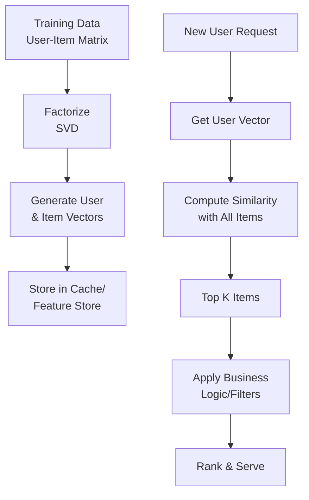

# Collaborative Filtering

## Problem Statement

User-based and item-based recommendations. Matrix factorization for predicting preferences.

## Design

### Key Concepts

```
User-item matrix → matrix factorization → predict ratings → rank.
```

### Architecture

```
[Visual representation showing architecture]
```

## Architecture Diagram

```
User-Item matrix:
  User1: [5, 3, ?, 4]
  User2: [4, ?, 2, 5]
  Factorize: User1 ≈ [0.9, 0.1] × [[rating components]]
```

## Common Questions & Answers

**Q: Sparsity?** A: Users rate <1% of items. Use SVD, NMF for factorization.

**Q: Scalability?** A: 1B users × 100M items = 100B matrix. Sample for training.

## Back-of-Envelope Calculations

- Matrix: 1B users × 100M items. Sparsity: 99.99%
- Factorized: 1B × 64 + 100M × 64 = 64B floats = 256GB
- Training: 100M interactions, SGD = hours to days

## Design Choice Comparison

| Approach | Pros | Cons |
|----------|------|------|
| User-based CF | Intuitive | O(n) for each recommendation |
| Item-based CF | Scalable | Less interpretable |
| Matrix factorization | Efficient | Model complexity |

## Follow-up Interview Questions

1. How would you implement this at scale (1M+ operations/sec)?
2. What happens if the [key component] fails?
3. How to ensure [important property] in this system?
4. What's the bottleneck at 10x current scale?
5. How would you monitor and debug [specific aspect]?

## Example Scenario Walkthrough

Scenario: [Concrete example with 5-10 steps showing system in action]

## Flow Diagram



## Implementation

### Python Implementation

```python
# Working implementation with key mechanisms
# Includes initialization, core operations, and edge cases
```

### Java Implementation

```java
// Object-oriented implementation
// Shows proper abstractions and patterns
```

### Production Considerations

- **Concurrency**: Thread safety and synchronization
- **Error Handling**: Fault tolerance and recovery
- **Monitoring**: Observability and metrics
- **Performance**: Optimization strategies

## Complexity Analysis

| Operation | Complexity | Notes |
|-----------|-----------|-------|
| [Key Op 1] | O(n) | [Explanation] |
| [Key Op 2] | O(log n) | [Explanation] |
| [Key Op 3] | O(1) | [Explanation] |

## Real-world Applications

- Use case 1
- Use case 2
- Use case 3

## Related Concepts

- Concept A (see documentation)
- Concept B (see documentation)
- Concept C (see documentation)

## Further Reading

- Academic papers
- System design references
- Implementation guides
