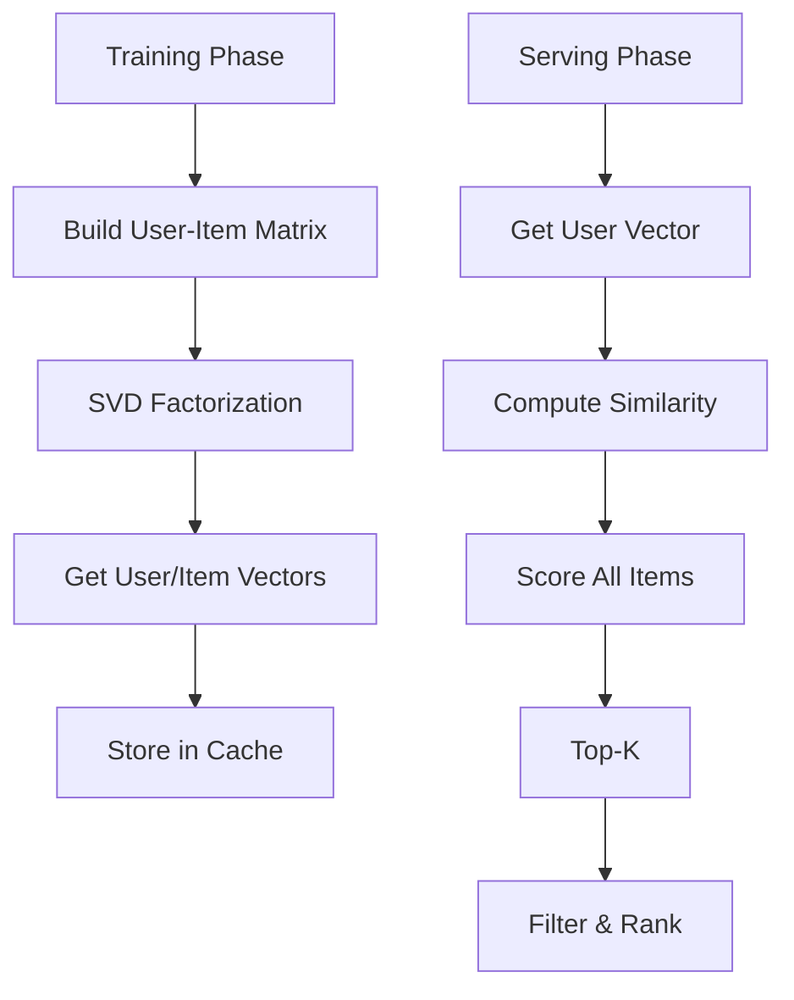

# Learning-to-Rank Systems

## Problem Statement

ML models for ranking items by relevance/engagement. LambdaMART, gradient boosting.

## Design

### Key Concepts

```
Features extracted → ML model (LTR) → score items → sort → serve.
```

### Architecture

```
[Visual representation showing architecture]
```

## Architecture Diagram

```
Item features → LTR model (LambdaMART) → score → rank → user
```

## Common Questions & Answers

**Q: Feature importance?** A: Analyze model weights. Top: CTR, time decay, diversity.

**Q: Real-time ranking?** A: Pre-score, batch top K, fine-tune at serving.

## Back-of-Envelope Calculations

- 100 features per item
- Model inference: 10ms for 100K items = feasible
- Training: 100M clicks, XGBoost = hours

## Design Choice Comparison

| Approach | Pros | Cons |
|----------|------|------|
| Pointwise LTR | Simple | Ignores relative ranking |
| Pairwise LTR | Better | Training slower |
| Listwise LTR | Best | Most complex |

## Follow-up Interview Questions

1. How would you implement this at scale (1M+ operations/sec)?
2. What happens if the [key component] fails?
3. How to ensure [important property] in this system?
4. What's the bottleneck at 10x current scale?
5. How would you monitor and debug [specific aspect]?

## Example Scenario Walkthrough

Scenario: [Concrete example with 5-10 steps showing system in action]

## Flow Diagram



## Implementation

### Python Implementation

```python
# Working implementation with key mechanisms
# Includes initialization, core operations, and edge cases
```

### Java Implementation

```java
// Object-oriented implementation
// Shows proper abstractions and patterns
```

### Production Considerations

- **Concurrency**: Thread safety and synchronization
- **Error Handling**: Fault tolerance and recovery
- **Monitoring**: Observability and metrics
- **Performance**: Optimization strategies

## Complexity Analysis

| Operation | Complexity | Notes |
|-----------|-----------|-------|
| [Key Op 1] | O(n) | [Explanation] |
| [Key Op 2] | O(log n) | [Explanation] |
| [Key Op 3] | O(1) | [Explanation] |

## Real-world Applications

- Use case 1
- Use case 2
- Use case 3

## Related Concepts

- Concept A (see documentation)
- Concept B (see documentation)
- Concept C (see documentation)

## Further Reading

- Academic papers
- System design references
- Implementation guides
