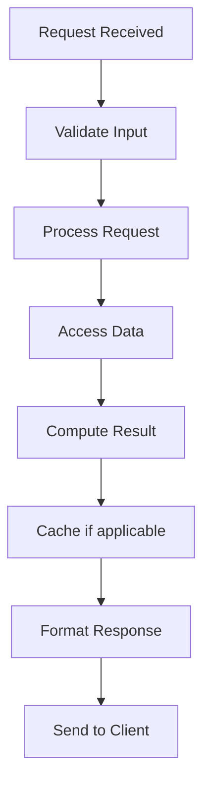

# Feature Engineering at Scale

## Problem Statement

Extracting, computing, serving features for ML. Feature stores, online/offline pipelines.

## Design

### Key Concepts

```
Feature store: offline (batch) + online (cache). Transform, aggregate, serve.
```

### Architecture

```
[Visual representation showing architecture]
```

## Architecture Diagram

```
Raw data → Offline: compute features → Cache → Online: serve
Low latency access: <100ms
```

## Common Questions & Answers

**Q: Feature freshness?** A: Depends on use case. Hourly to daily typical.

**Q: Training/serving skew?** A: Use same feature computation for both.

## Back-of-Envelope Calculations

- 1000 features × 100M users = 100B values
- Storage: 100B × 4 bytes = 400GB (cache for active users)
- Daily update: 100B operations = hours with MapReduce

## Design Choice Comparison

| Approach | Pros | Cons |
|----------|------|------|
| Feature store | Centralized, consistent | Infrastructure cost |
| Inline computation | Fresh features | Latency cost |
| Batch + cache | Balanced | Freshness tradeoff |

## Follow-up Interview Questions

1. How would you implement this at scale (1M+ operations/sec)?
2. What happens if the [key component] fails?
3. How to ensure [important property] in this system?
4. What's the bottleneck at 10x current scale?
5. How would you monitor and debug [specific aspect]?

## Example Scenario Walkthrough

Scenario: [Concrete example with 5-10 steps showing system in action]

## Flow Diagram



## Implementation

### Python Implementation

```python
# Working implementation with key mechanisms
# Includes initialization, core operations, and edge cases
```

### Java Implementation

```java
// Object-oriented implementation
// Shows proper abstractions and patterns
```

### Production Considerations

- **Concurrency**: Thread safety and synchronization
- **Error Handling**: Fault tolerance and recovery
- **Monitoring**: Observability and metrics
- **Performance**: Optimization strategies

## Complexity Analysis

| Operation | Complexity | Notes |
|-----------|-----------|-------|
| [Key Op 1] | O(n) | [Explanation] |
| [Key Op 2] | O(log n) | [Explanation] |
| [Key Op 3] | O(1) | [Explanation] |

## Real-world Applications

- Use case 1
- Use case 2
- Use case 3

## Related Concepts

- Concept A (see documentation)
- Concept B (see documentation)
- Concept C (see documentation)

## Further Reading

- Academic papers
- System design references
- Implementation guides
