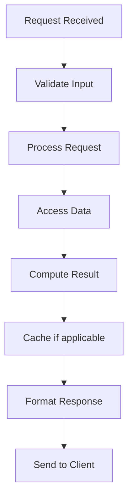

# A/B Testing & Experimentation Framework

## Problem Statement

Running controlled experiments, statistical significance, multi-armed bandits.

## Design

### Key Concepts

```
Assign users to variants → track metrics → analyze statistics → decide.
```

### Architecture

```
[Visual representation showing architecture]
```

## Architecture Diagram

```
Users split [Control: 50%, Variant A: 25%, Variant B: 25%]
Track: CTR, conversion, revenue → Statistical test
```

## Common Questions & Answers

**Q: Sample size?** A: Calculate for 80% power, 5% significance.

**Q: Early stopping?** A: Risk of false positives. Run for full duration.

## Back-of-Envelope Calculations

- 1M users/day per variant
- 2% baseline conversion, 10% lift target
- Sample needed: 100K/variant (1 day)
- Confidence: 95% after 7 days of control

## Design Choice Comparison

| Approach | Pros | Cons |
|----------|------|------|
| Frequentist | Standard statistical tests | Fixed sample size |
| Bayesian | Prior knowledge, stopping rules | More complex |
| Sequential | Early stopping possible | Higher false positive risk |

## Follow-up Interview Questions

1. How would you implement this at scale (1M+ operations/sec)?
2. What happens if the [key component] fails?
3. How to ensure [important property] in this system?
4. What's the bottleneck at 10x current scale?
5. How would you monitor and debug [specific aspect]?

## Example Scenario Walkthrough

Scenario: [Concrete example with 5-10 steps showing system in action]

## Flow Diagram



## Implementation

### Python Implementation

```python
# Working implementation with key mechanisms
# Includes initialization, core operations, and edge cases
```

### Java Implementation

```java
// Object-oriented implementation
// Shows proper abstractions and patterns
```

### Production Considerations

- **Concurrency**: Thread safety and synchronization
- **Error Handling**: Fault tolerance and recovery
- **Monitoring**: Observability and metrics
- **Performance**: Optimization strategies

## Complexity Analysis

| Operation | Complexity | Notes |
|-----------|-----------|-------|
| [Key Op 1] | O(n) | [Explanation] |
| [Key Op 2] | O(log n) | [Explanation] |
| [Key Op 3] | O(1) | [Explanation] |

## Real-world Applications

- Use case 1
- Use case 2
- Use case 3

## Related Concepts

- Concept A (see documentation)
- Concept B (see documentation)
- Concept C (see documentation)

## Further Reading

- Academic papers
- System design references
- Implementation guides
