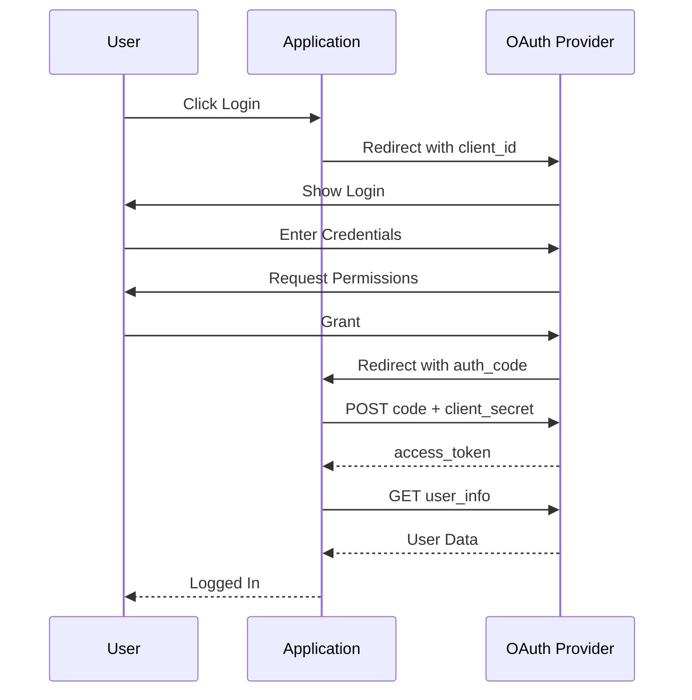

# OAuth 2.0 & Single Sign-On

## Problem Statement

Delegated authorization, federated identity, social login, enterprise SSO.

## Design

### Key Concepts

```
OAuth provider → delegate auth → access token → authorize resource access.
```

### Architecture

```
[Visual representation showing architecture]
```

## Architecture Diagram

```
User → App → OAuth provider → Login → Token → Access resource
```

## Common Questions & Answers

**Q: Security?** A: PKCE for mobile. Refresh tokens for long access.

**Q: Multi-provider?** A: Use federated identity (OIDC).

## Back-of-Envelope Calculations

- Token lifespan: 1 hour access, 30 day refresh
- Token storage: Redis, ~1KB per token
- 100M users, 50% active daily = 50M tokens = 50GB

## Design Choice Comparison

| Approach | Pros | Cons |
|----------|------|------|
| OAuth 2.0 | Industry standard, secure | Complex spec |
| Custom JWT | Simple | Reinventing security |
| Session cookies | Classic | Stateful, scaling issues |

## Follow-up Interview Questions

1. How would you implement this at scale (1M+ operations/sec)?
2. What happens if the [key component] fails?
3. How to ensure [important property] in this system?
4. What's the bottleneck at 10x current scale?
5. How would you monitor and debug [specific aspect]?

## Example Scenario Walkthrough

Scenario: [Concrete example with 5-10 steps showing system in action]

## Flow Diagram



## Implementation

### Python Implementation

```python
# Working implementation with key mechanisms
# Includes initialization, core operations, and edge cases
```

### Java Implementation

```java
// Object-oriented implementation
// Shows proper abstractions and patterns
```

### Production Considerations

- **Concurrency**: Thread safety and synchronization
- **Error Handling**: Fault tolerance and recovery
- **Monitoring**: Observability and metrics
- **Performance**: Optimization strategies

## Complexity Analysis

| Operation | Complexity | Notes |
|-----------|-----------|-------|
| [Key Op 1] | O(n) | [Explanation] |
| [Key Op 2] | O(log n) | [Explanation] |
| [Key Op 3] | O(1) | [Explanation] |

## Real-world Applications

- Use case 1
- Use case 2
- Use case 3

## Related Concepts

- Concept A (see documentation)
- Concept B (see documentation)
- Concept C (see documentation)

## Further Reading

- Academic papers
- System design references
- Implementation guides
