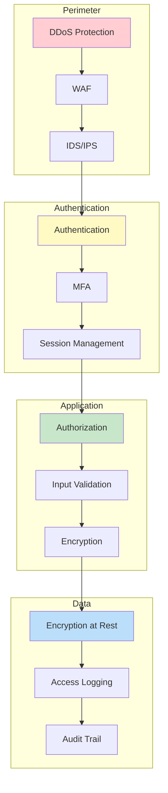
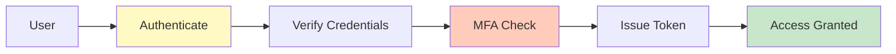
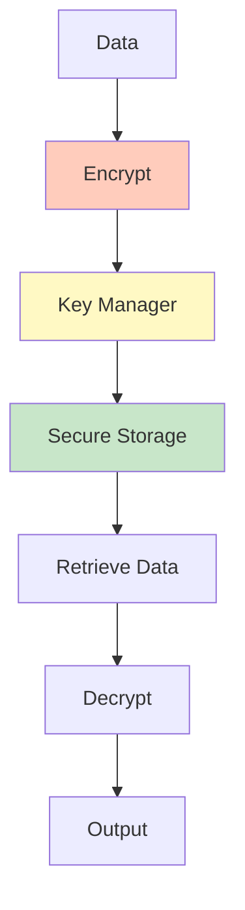
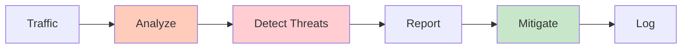
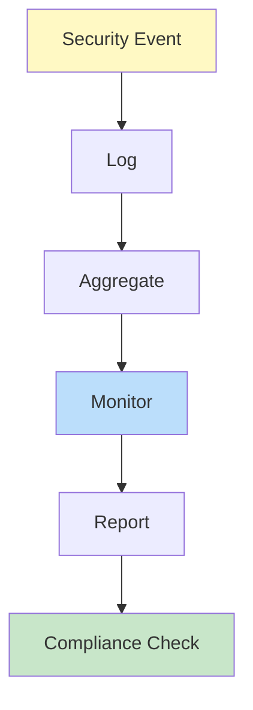

# Network Security Architecture

## Problem Statement

### Functional Requirements
- Isolate networks with firewalls
- Segment networks by trust level
- Control traffic flow
- Monitor for intrusions
- Support VPN and tunneling

### Non-Functional Requirements
- Throughput: 100 Gbps+ firewall
- Latency: < 1ms packet processing
- Detection: Identify threats < 10ms
- Scalability: Support 1M+ rules
- Compliance: PCI-DSS requirements

## System Overview

**Scale Metrics:**
- Throughput: Millions of security operations per second
- Latency: Milliseconds for security processing
- Data volume: Petabytes of security logs
- User population: Billions of users
- Availability: 99.99%+ uptime SLA

**Key Components:**
- Identity and authentication
- Encryption and key management
- Access control and authorization
- Threat detection and prevention
- Audit and compliance tracking

## Architecture Diagrams

### Security Architecture Layers



### Authentication Flow



### Encryption and Key Management



### Threat Detection Pipeline



### Audit and Compliance



## Data Flow Scenarios

### Scenario 1: Secure Authentication
1. User submits credentials
2. Hash password and compare
3. If match, generate MFA challenge
4. User provides MFA code
5. Issue signed security token
6. Grant authenticated access

### Scenario 2: Encryption and Decryption
1. Plaintext data arrives
2. Generate random IV
3. Encrypt with session key
4. Store encrypted data
5. On retrieval, get IV
6. Decrypt with session key
7. Return plaintext

### Scenario 3: Threat Detection
1. Monitor incoming traffic
2. Analyze packet patterns
3. Check against threat rules
4. If match detected, alert
5. Activate mitigation rules
6. Log security event

## Security Best Practices

### Defense in Depth
- **Multiple layers**: Never rely on single defense
- **Redundancy**: Multiple detection mechanisms
- **Isolation**: Minimize blast radius
- **Monitoring**: Detect at each layer

### Principle of Least Privilege
- **Minimal access**: Grant only needed permissions
- **Role-based**: Use roles not individuals
- **Time-limited**: Revoke access after use
- **Auditable**: Track all access

### Security by Design
- **Early**: Integrate security from start
- **Default secure**: Secure defaults, explicit to weaken
- **Testing**: Security testing in CI/CD
- **Review**: Regular security reviews

## Back-of-Envelope Calculations

### User Authentication Scale
```
Daily active users: 100M
Auth requests per user: 5
Daily auth: 500M requests
RPS: 500M / 86400 ≈ 5,787 RPS
Peak hour (10x): 57,870 RPS
Auth servers: 57,870 / 10K per server ≈ 6 servers
```

### Encryption Operations
```
Data per transaction: 1 KB
Daily transactions: 10B
Daily encryption: 10B × 1 KB = 10 TB
Encryption throughput: 100 MB/s
Hours needed: 10TB / 100MB/s = 100K seconds ≈ 28 hours
Requires parallel: 10 concurrent processes
```

### Audit Log Storage
```
Log entries per day: 100B
Bytes per entry: 500 bytes
Daily log: 100B × 500 = 50 TB
Storage per year: 50 TB × 365 = 18.25 PB
Retention: 7 years = 127.75 PB
Compression: 10x → 12.8 PB
```

## Interview Questions & Answers

### Q1: Design authentication system for 1B users

**Answer:**
1. **Architecture**: Distributed auth servers across regions
2. **Password storage**: Bcrypt with salt, not plaintext
3. **MFA**: Support TOTP, SMS, push notifications
4. **Tokens**: Short-lived access, long-lived refresh
5. **Session**: Track across services with JWT
6. **Recovery**: Backup codes, email verification

### Q2: Implement end-to-end encryption

**Answer:**
- **Client-side**: Encrypt before sending
- **Key management**: User controls keys
- **Server**: Cannot decrypt even with access
- **Key exchange**: ECDH for secure sharing
- **Forward secrecy**: Derive keys per message
- **Compliance**: Support key recovery for legal

### Q3: Prevent common web vulnerabilities

**Answer:**
- **SQL injection**: Parameterized queries always
- **XSS**: Sanitize and escape output
- **CSRF**: Token validation on state changes
- **Clickjacking**: X-Frame-Options header
- **Insecure deserialization**: Validate input
- **Weak crypto**: AES-256, TLS 1.2+

### Q4: Design DDoS protection system

**Answer:**
- **Detection**: Monitor traffic patterns
- **Filtering**: Block at CDN/ISP level
- **Rate limiting**: Per IP or user
- **Captcha**: Challenge suspicious traffic
- **Scaling**: Absorb attack with capacity
- **Failover**: Automatic to mitigation

### Q5: Ensure data privacy and compliance

**Answer:**
- **Encryption**: At rest and in transit
- **Anonymization**: Remove PII when possible
- **Access control**: RBAC for data access
- **Audit**: Log all access and changes
- **Retention**: Delete per policy
- **Compliance**: GDPR, CCPA, HIPAA

### Q6: Implement secure API design

**Answer:**
- **Authentication**: OAuth 2.0 or mutual TLS
- **Authorization**: Scope-based permissions
- **Rate limiting**: Prevent abuse
- **Input validation**: Strict validation rules
- **Output encoding**: Prevent injection
- **Logging**: Complete audit trail

## Technology Stack

| Component | Technology | Why |
|-----------|-----------|-----|
| Authentication | OAuth 2.0, OpenID Connect | Industry standard |
| Encryption | TLS 1.3, AES-256-GCM | Strong, fast |
| Key Management | AWS KMS, HashiCorp Vault | Secure, managed |
| Identity | LDAP, Active Directory | Enterprise standard |
| Monitoring | SIEM, ELK Stack | Threat detection |
| Compliance | Keycloak, Okta | Centralized identity |
| WAF | ModSecurity, WAF rules | Attack prevention |

## Lessons Learned

1. **Security is not optional**: Build in from start, not after
2. **Assume breach**: Design for recovery, not prevention alone
3. **People matter**: Training prevents more attacks than technology
4. **Measure security**: Track metrics, improve continuously
5. **Keep it simple**: Complex systems have more flaws

## Related Topics

- Cryptography and encryption algorithms
- Identity and access management (IAM)
- Threat detection and response
- Incident management and forensics
- Security compliance and standards
- Secure software development
- Cloud security and multi-tenancy
