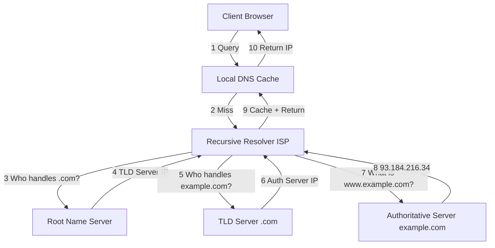
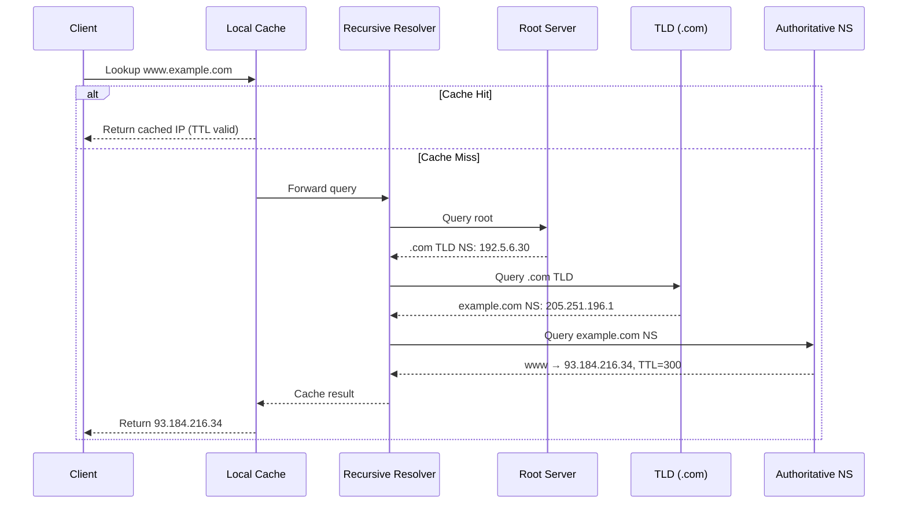

# DNS Resolution

## Problem Statement

Design the Domain Name System (DNS) — a distributed hierarchical system that translates human-readable domain names (e.g., `www.example.com`) into IP addresses.

**Requirements:**
- Fast lookups (< 10ms for cached, < 100ms for recursive)
- Highly available (no single point of failure)
- Globally distributed
- Support millions of domains and billions of queries/day

## Architecture Diagram



## Flow Diagram



## Design

### DNS Record Types

```
A      → IPv4 address         (www.example.com → 1.2.3.4)
AAAA   → IPv6 address         (www.example.com → ::1)
CNAME  → Canonical alias      (blog.example.com → example.com)
MX     → Mail server          (example.com → mail.example.com)
TXT    → Text/verification    (SPF, DKIM records)
NS     → Name server          (who handles this domain)
SOA    → Zone authority info  (primary NS, serial, TTL)
```

### Caching Hierarchy

```
Browser cache (5-300s TTL)
  → OS cache (/etc/hosts, nscd)
    → Resolver cache (ISP/corporate)
      → Recursive resolver (Google 8.8.8.8, Cloudflare 1.1.1.1)
        → Root servers (13 clusters, anycast)
          → TLD servers (.com, .org, .net)
            → Authoritative servers (origin of truth)
```

### DNS Resolution Modes

| Mode | Description | RTT |
|------|-------------|-----|
| Recursive | Resolver does all the work | 1 RTT to client |
| Iterative | Client contacts each server | Multiple RTTs |
| Caching | Return cached answer | < 1ms |

## Common Questions & Answers

**Q: Why 13 root servers?** A: Fits in a single UDP packet (512 bytes). Each "server" is actually hundreds of machines via anycast.

**Q: What happens if TTL expires mid-connection?** A: Connection continues using cached IP. New DNS query happens on next connection attempt.

**Q: DNS over HTTPS (DoH) vs traditional?** A: DoH encrypts DNS queries (port 443), prevents ISP snooping. Traditional DNS is plaintext on port 53.

**Q: How does DNS load balance?** A: Round-robin DNS — returns multiple A records in rotating order. Weighted: return more IPs for higher-capacity servers.

**Q: What is negative caching?** A: Cache NXDOMAIN (non-existent domain) responses to avoid hammering nameservers for bad names.

**Q: DNS propagation delay?** A: TTL determines how long old record survives. After NS change, up to 48h for full propagation (max TTL across resolvers).

## Back-of-Envelope Calculations

```
Google handles ~1 trillion DNS queries/day:
  1T / 86400s ≈ 11.6M queries/sec

Cache hit rate ~85%:
  Miss rate: 11.6M × 0.15 = 1.7M recursive lookups/sec

Average DNS response size: 100 bytes
Bandwidth: 11.6M × 100B = 1.16 GB/s

Root server queries (small % since resolvers cache TLD answers):
  ~1.7M × 0.001 = 1,700 root queries/sec per 13-cluster root

Recursive resolution latency:
  Root RTT: 20ms + TLD: 40ms + Auth: 30ms = ~90ms total
  Cached: <1ms
```

## Design Choices

| Approach | Pros | Cons |
|---|---|---|
| Anycast routing | Geographically close server, DDoS resilience | Harder to debug routing |
| High TTL (3600s) | Less DNS traffic, faster | Slow propagation of changes |
| Low TTL (60s) | Fast failover | More DNS load |
| Round-robin DNS | Simple LB | No health checks, stale |
| GeoDNS | Route to nearest DC | Complex setup |

## Follow-up Questions

1. How would you implement DNSSEC for DNS response validation?
2. How does Cloudflare's 1.1.1.1 achieve sub-1ms responses globally?
3. Design a DNS resolver that blocks malicious domains.
4. How would you handle DNS amplification DDoS attacks?
5. What's the difference between authoritative and recursive resolver?

## Python Implementation

```python
from typing import Dict, Optional, Tuple
import time

class DNSRecord:
    def __init__(self, record_type: str, value: str, ttl: int):
        self.record_type = record_type
        self.value = value
        self.ttl = ttl
        self.created_at = time.time()

    def is_expired(self) -> bool:
        return time.time() - self.created_at > self.ttl

class DNSCache:
    def __init__(self):
        self._cache: Dict[Tuple[str, str], DNSRecord] = {}

    def get(self, domain: str, record_type: str = "A") -> Optional[str]:
        key = (domain, record_type)
        record = self._cache.get(key)
        if record and not record.is_expired():
            return record.value
        if record:
            del self._cache[key]
        return None

    def set(self, domain: str, record_type: str, value: str, ttl: int):
        self._cache[(domain, record_type)] = DNSRecord(record_type, value, ttl)

class DNSResolver:
    def __init__(self):
        self._cache = DNSCache()
        self._zone: Dict[str, Dict[str, str]] = {
            "example.com": {"A": "93.184.216.34", "MX": "mail.example.com"},
            "www.example.com": {"A": "93.184.216.34", "CNAME": "example.com"},
            "mail.example.com": {"A": "93.184.216.100"},
        }

    def resolve(self, domain: str, record_type: str = "A") -> Optional[str]:
        cached = self._cache.get(domain, record_type)
        if cached:
            print(f"[CACHE HIT] {domain} → {cached}")
            return cached

        result = self._recursive_resolve(domain, record_type)
        if result:
            self._cache.set(domain, record_type, result, ttl=300)
        return result

    def _recursive_resolve(self, domain: str, record_type: str) -> Optional[str]:
        zone = self._zone.get(domain, {})
        if record_type in zone:
            return zone[record_type]
        if "CNAME" in zone:
            return self._recursive_resolve(zone["CNAME"], record_type)
        return None

# Usage
resolver = DNSResolver()
print(resolver.resolve("www.example.com"))       # 93.184.216.34
print(resolver.resolve("www.example.com"))       # [CACHE HIT] 93.184.216.34
print(resolver.resolve("example.com", "MX"))     # mail.example.com
```

## Java Implementation

```java
import java.util.*;

public class DNSResolver {
    record DNSRecord(String type, String value, int ttl, long createdAt) {
        boolean isExpired() { return (System.currentTimeMillis() / 1000 - createdAt) > ttl; }
    }

    private Map<String, DNSRecord> cache = new HashMap<>();
    private Map<String, Map<String, String>> zone = Map.of(
        "example.com", Map.of("A", "93.184.216.34", "MX", "mail.example.com"),
        "www.example.com", Map.of("A", "93.184.216.34")
    );

    public Optional<String> resolve(String domain, String type) {
        String key = domain + ":" + type;
        DNSRecord cached = cache.get(key);
        if (cached != null && !cached.isExpired()) {
            System.out.println("[CACHE HIT] " + domain);
            return Optional.of(cached.value());
        }
        return zone.getOrDefault(domain, Map.of()).entrySet().stream()
            .filter(e -> e.getKey().equals(type))
            .map(e -> {
                cache.put(key, new DNSRecord(type, e.getValue(), 300, System.currentTimeMillis() / 1000));
                return e.getValue();
            }).findFirst();
    }
}
```

## Complexity

| Operation | Time | Notes |
|---|---|---|
| Cache lookup | O(1) | Hash map |
| Recursive resolve | O(depth) | Typically 3 hops |
| Zone transfer | O(n) | n = number of records |
| Space | O(n) | Cached records |
