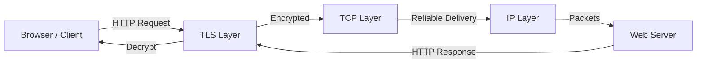
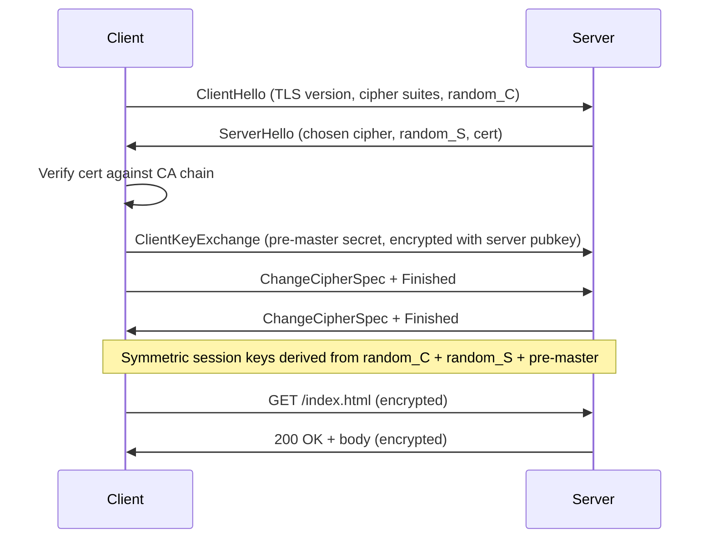

# HTTP/HTTPS and TLS

## Problem Statement

Design the HTTP/HTTPS protocol stack — how web clients and servers communicate, and how TLS secures that communication.

**Requirements:**
- Stateless request/response model
- Encrypt traffic to prevent eavesdropping
- Authenticate server identity via certificates
- Low overhead for latency-sensitive applications

## Scenario

HTTP/HTTPS and TLS is a critical component in modern distributed systems. In real-world applications, transmitting data reliably over networks with standard semantics. For example, major tech companies like Netflix, Uber, and Airbnb rely on similar solutions to handle millions of concurrent users and requests. The challenge is achieving this while maintaining sub-100ms latency, 99.99% availability, and gracefully handling 10x traffic spikes during peak demand. This component provides the foundational capability to solve these challenges reliably and efficiently at global scale.

## Users

- **Backend Engineers**: Responsible for implementing and maintaining this system component in production environments. They need to understand the architecture, trade-offs, failure modes, and operational considerations.
- **DevOps/SRE Teams**: Monitor system health, manage scaling policies, handle incidents, and ensure reliability SLAs are met. They need insights into performance characteristics, bottlenecks, and failure recovery mechanisms.
- **Data Engineers**: Design data pipelines and analytics around this system, requiring deep understanding of data flow, consistency guarantees, and throughput characteristics.
- **System Architects**: Make high-level architectural decisions that impact company infrastructure, requiring comprehensive understanding of capabilities, limitations, and scalability boundaries.
- **Security Teams**: Understand security implications, potential vulnerabilities, and compliance requirements for this component.

## PRD

**Functional Requirements:**
- Correct behavior under all specified operating conditions
- Reliable operation with explicit failure modes
- Data consistency or eventual consistency guarantees as specified
- Clear mechanisms for error handling and recovery
- Monitoring and observability hooks

**Non-Functional Requirements:**
- **Performance**: Sub-100ms P99 latency for standard operations; measure and track tail latencies
- **Availability**: 99.99%+ uptime with automatic failover and graceful degradation
- **Scalability**: Support 10-100x current load with minimal architectural modifications
- **Consistency**: Specify whether strong, eventual, or causal consistency is required
- **Cost Efficiency**: Minimize operational cost per unit of throughput; consider compute, memory, and network costs
- **Operational Simplicity**: Reduce complexity to minimize human error and operational toil

**Constraints:**
- Resource limits (memory for caches, disk for databases, network bandwidth)
- Deployment constraints (cloud provider limits, regulatory requirements)
- Latency budgets (maximum acceptable delay for operations)

## Flow

The typical operational flow for this system involves these key phases:

1. **Request Arrival**: Client/upstream system sends request with required parameters and context
2. **Validation & Routing**: System validates request format, authentication, and routes to correct handler/shard/instance
3. **Core Processing**: Execute the main algorithm, database query, or business logic on the data/state
4. **State Management**: Update internal state (caches, indexes, counters, logs) with proper atomicity and locking
5. **Response Generation**: Format results and return to requester with relevant metadata (timing, version info)
6. **Observability**: Record metrics (latency, throughput, errors), logs (for debugging), and traces (for performance analysis)

This flow repeats thousands or millions of times per second in production. Each operation's efficiency compounds across the entire system, making careful optimization essential. Bottlenecks at any phase can cascade to impact overall system performance.

## Code Explanation

The provided implementations demonstrate key architectural concepts and design patterns:

**Python Implementation**: Uses built-in Python structures and standard library features to express the core logic clearly. Python emphasizes readability and conciseness—each operation's purpose should be obvious without extensive comments. You'll see different implementation approaches (e.g., using OrderedDict vs. manual linked lists) that represent trade-offs between convenience and fine-grained control.

**Java Implementation**: Shows how to implement the same logic with explicit memory management and type safety. Java's strong typing forces clear interface design; you'll see how generics, null safety, mutable state, and thread safety are handled. This implementation style is closer to production systems at scale.

**Key Implementation Patterns**:
- **Initialization**: Setting up core data structures, thread pools, or connection pools with specified capacity and configuration
- **Read Operations**: Fetching data while maintaining O(1) or O(log n) access, updating metadata (access times, hit counts, etc.)
- **Write Operations**: Inserting/updating data while handling eviction policies, balancing tree structures, or replicating state
- **Edge Cases**: Handling capacity limits, concurrent access, data consistency, and error conditions
- **Performance Optimization**: Using techniques like batch operations, lazy evaluation, or caching to reduce latency

Each line of code represents a deliberate choice about performance characteristics, memory usage, safety guarantees, and implementation complexity. Understanding these trade-offs is essential for using this component effectively in production systems.

## Architecture Diagram



## TLS Handshake Flow



## Design

### HTTP Status Code Categories

```
1xx — Informational  (100 Continue, 101 Switching Protocols)
2xx — Success        (200 OK, 201 Created, 204 No Content)
3xx — Redirect       (301 Permanent, 302 Temp, 304 Not Modified)
4xx — Client Error   (400 Bad Request, 401 Unauth, 403 Forbidden, 404 Not Found, 429 Rate Limited)
5xx — Server Error   (500 Internal, 502 Bad Gateway, 503 Unavailable, 504 Timeout)
```

### HTTP Methods

```
GET    — Retrieve resource (idempotent, safe)
POST   — Create resource (not idempotent)
PUT    — Replace resource (idempotent)
PATCH  — Partial update (not necessarily idempotent)
DELETE — Remove resource (idempotent)
HEAD   — GET but no body (metadata only)
OPTIONS— Describe supported methods (CORS preflight)
```

### TLS Key Exchange (TLS 1.3 simplified)

```
1. Client → Server: supported algorithms, nonce
2. Server → Client: certificate, chosen algorithm, DH public key
3. Client verifies certificate with trusted CA
4. Both derive shared secret via ECDHE (no key transmitted)
5. Session keys derived: encrypt_key, mac_key, IV
6. All subsequent traffic AES-256-GCM encrypted
```

### HTTPS vs HTTP

| Feature | HTTP | HTTPS |
|---|---|---|
| Port | 80 | 443 |
| Encryption | None | TLS |
| Certificate | Not required | Required |
| SEO | Lower rank | Higher rank |
| Performance | Slightly faster | +10-50ms (TLS handshake once) |

## Common Questions & Answers

**Q: What is HSTS?** A: HTTP Strict Transport Security — tells browser to always use HTTPS for this domain, even if user types http://. Prevents SSL stripping attacks.

**Q: Session resumption?** A: TLS session tickets — server sends encrypted session state to client; client presents on reconnect. Avoids full handshake. Saves ~1 RTT.

**Q: Difference between TLS 1.2 and 1.3?** A: 1.3 removes weak ciphers, mandatory forward secrecy, 1-RTT handshake (vs 2-RTT), 0-RTT resumption for subsequent connections.

**Q: What is certificate pinning?** A: Client hardcodes expected server cert/public key hash. Prevents MITM even with rogue CA-signed cert. Hard to update.

**Q: How does mutual TLS (mTLS) work?** A: Both client and server present certificates. Used for service-to-service auth (e.g., Kubernetes, Istio service mesh).

**Q: What is SNI?** A: Server Name Indication — client sends hostname in TLS ClientHello, so a single IP can host multiple TLS certificates (virtual hosting).

## Back-of-Envelope Calculations

```
TLS handshake cost:
  Round trips: 1 RTT (TLS 1.3), 2 RTT (TLS 1.2)
  At 50ms RTT: TLS 1.3 adds 50ms per new connection
  TLS session resumption: 0ms extra (0-RTT)

Certificate verification:
  Chain of trust: ~2-3 certs verified
  OCSP stapling: pre-verified by server, adds ~0ms to client

Encryption throughput (AES-256-GCM with AES-NI):
  Single core: ~3-5 GB/s
  100Gbps link: needs ~2-4 cores for encryption

HTTPS overhead vs HTTP:
  CPU: +1-5% (modern hardware with AES-NI)
  Latency: +0ms after session established
  Initial connection: +1 RTT (TLS 1.3)
```

## Design Choices

| Choice | Pros | Cons |
|---|---|---|
| TLS 1.3 | Faster, more secure | Less compatible with old clients |
| TLS session tickets | Fast resumption | Ticket key rotation complexity |
| Certificate pinning | MITM protection | Hard key rotation |
| OCSP stapling | No client-to-CA round trip | Server must refresh staple |
| Wildcard cert (*.example.com) | One cert for all subdomains | Compromise exposes all |

## Follow-up Questions

1. How does certificate revocation work at scale (OCSP, CRL)?
2. Design a system to automatically renew TLS certificates (like Let's Encrypt).
3. How does HTTPS work in a CDN (edge terminates TLS)?
4. What is TLS offloading and why do load balancers do it?
5. How does HTTP/2 multiplexing change connection management?

## Python Implementation

```python
import ssl
import socket
import urllib.parse
from typing import Optional, Dict, Tuple

class HTTPSClient:
    def __init__(self, verify_certs: bool = True):
        self._context = ssl.create_default_context()
        if not verify_certs:
            self._context.check_hostname = False
            self._context.verify_mode = ssl.CERT_NONE

    def get(self, url: str, headers: Optional[Dict[str, str]] = None) -> Tuple[int, str]:
        parsed = urllib.parse.urlparse(url)
        host = parsed.hostname
        port = parsed.port or (443 if parsed.scheme == "https" else 80)
        path = parsed.path or "/"

        with socket.create_connection((host, port)) as raw_sock:
            if parsed.scheme == "https":
                sock = self._context.wrap_socket(raw_sock, server_hostname=host)
            else:
                sock = raw_sock

            request = (
                f"GET {path} HTTP/1.1\r\n"
                f"Host: {host}\r\n"
                f"Connection: close\r\n"
            )
            if headers:
                for k, v in headers.items():
                    request += f"{k}: {v}\r\n"
            request += "\r\n"

            sock.sendall(request.encode())
            response = b""
            while chunk := sock.recv(4096):
                response += chunk

        lines = response.decode(errors="replace").split("\r\n")
        status_line = lines[0]
        status_code = int(status_line.split(" ")[1])
        body_start = response.find(b"\r\n\r\n") + 4
        body = response[body_start:].decode(errors="replace")
        return status_code, body

class TLSHandshakeSimulator:
    """Simplified TLS 1.3 handshake state machine."""
    def __init__(self):
        self.state = "INITIAL"
        self.session_key: Optional[bytes] = None

    def client_hello(self) -> dict:
        self.state = "HELLO_SENT"
        return {
            "type": "ClientHello",
            "tls_version": "1.3",
            "cipher_suites": ["TLS_AES_256_GCM_SHA384", "TLS_CHACHA20_POLY1305_SHA256"],
            "random": b"client_random_32_bytes_placeholder",
        }

    def process_server_hello(self, server_hello: dict) -> dict:
        self.state = "KEYS_DERIVED"
        # In real TLS: ECDHE key exchange happens here
        self.session_key = b"derived_symmetric_key_placeholder"
        return {"type": "Finished", "verify_data": "handshake_hash"}

    def is_established(self) -> bool:
        return self.state == "KEYS_DERIVED"

# Usage (simulated)
sim = TLSHandshakeSimulator()
ch = sim.client_hello()
print("Sent:", ch["type"], "with", len(ch["cipher_suites"]), "cipher suites")
sh = {"type": "ServerHello", "cipher": "TLS_AES_256_GCM_SHA384", "cert": "..."}
finished = sim.process_server_hello(sh)
print("Handshake complete:", sim.is_established())  # True
```

## Java Implementation

```java
import javax.net.ssl.*;
import java.io.*;
import java.net.*;
import java.security.cert.X509Certificate;

public class HTTPSClient {
    private SSLContext sslContext;

    public HTTPSClient() throws Exception {
        this.sslContext = SSLContext.getDefault();
    }

    public String get(String urlStr) throws Exception {
        URL url = new URL(urlStr);
        HttpsURLConnection conn = (HttpsURLConnection) url.openConnection();
        conn.setSSLSocketFactory(sslContext.getSocketFactory());
        conn.setRequestMethod("GET");
        conn.setConnectTimeout(5000);
        conn.setReadTimeout(10000);

        int status = conn.getResponseCode();
        try (BufferedReader reader = new BufferedReader(
                new InputStreamReader(conn.getInputStream()))) {
            StringBuilder sb = new StringBuilder();
            String line;
            while ((line = reader.readLine()) != null) sb.append(line).append("\n");
            System.out.println("Status: " + status);
            return sb.toString();
        }
    }

    // TLS info from an established connection
    public void printCertInfo(String host) throws Exception {
        SSLSocket socket = (SSLSocket) sslContext.getSocketFactory()
            .createSocket(host, 443);
        socket.startHandshake();
        SSLSession session = socket.getSession();
        System.out.println("Protocol: " + session.getProtocol());
        System.out.println("Cipher: " + session.getCipherSuite());
        for (java.security.cert.Certificate cert : session.getPeerCertificates()) {
            System.out.println("Cert: " + ((X509Certificate) cert).getSubjectDN());
        }
        socket.close();
    }
}
```

## Complexity

| Operation | Latency | Notes |
|---|---|---|
| TLS 1.3 handshake | 1 RTT | First connection |
| TLS 1.3 0-RTT | 0 RTT | Session resumption |
| AES-256-GCM encrypt | O(n) | n = payload bytes, ~3GB/s with AES-NI |
| Cert verification | O(depth) | Typical chain: 2-3 certs |
