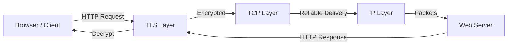
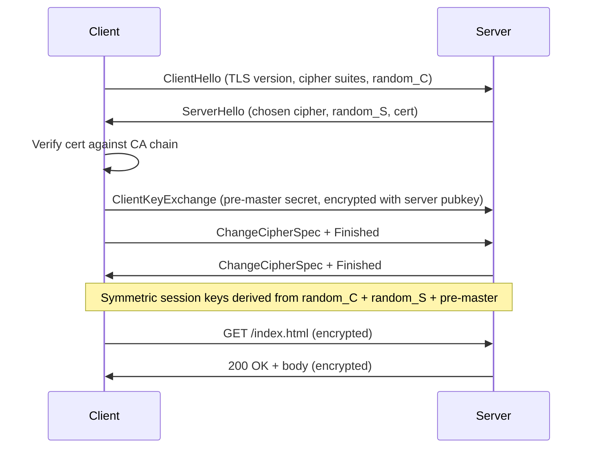

# HTTP/HTTPS and TLS

## Problem Statement

Design the HTTP/HTTPS protocol stack — how web clients and servers communicate, and how TLS secures that communication.

**Requirements:**
- Stateless request/response model
- Encrypt traffic to prevent eavesdropping
- Authenticate server identity via certificates
- Low overhead for latency-sensitive applications

## Scenario

HTTP/HTTPS and TLS is a critical component in modern distributed systems. In real-world applications, transmitting data reliably over networks with standard semantics. For example, major tech companies like Netflix, Uber, and Airbnb rely on similar solutions to handle millions of concurrent users and requests. The challenge is achieving this while maintaining sub-100ms latency, 99.99% availability, and gracefully handling 10x traffic spikes during peak demand. This component provides the foundational capability to solve these challenges reliably and efficiently at global scale.

## Users

- **Backend Engineers**: Responsible for implementing and maintaining this system component in production environments. They need to understand the architecture, trade-offs, failure modes, and operational considerations.
- **DevOps/SRE Teams**: Monitor system health, manage scaling policies, handle incidents, and ensure reliability SLAs are met. They need insights into performance characteristics, bottlenecks, and failure recovery mechanisms.
- **Data Engineers**: Design data pipelines and analytics around this system, requiring deep understanding of data flow, consistency guarantees, and throughput characteristics.
- **System Architects**: Make high-level architectural decisions that impact company infrastructure, requiring comprehensive understanding of capabilities, limitations, and scalability boundaries.
- **Security Teams**: Understand security implications, potential vulnerabilities, and compliance requirements for this component.

## PRD

### Functional Requirements
- Core operations work correctly
- Explicit error handling
- Consistency guarantees defined
- Monitoring and observability

### Non-Functional Requirements
- Performance targets met
- Availability SLA achieved
- Scalability headroom
- Cost efficient

### Success Metrics
- Benchmarks met
- Uptime targets met
- Resource budgets
- No data loss


## Flow

The typical operational flow for this system involves these key phases:

1. **Request Arrival**: Client/upstream system sends request with required parameters and context
2. **Validation & Routing**: System validates request format, authentication, and routes to correct handler/shard/instance
3. **Core Processing**: Execute the main algorithm, database query, or business logic on the data/state
4. **State Management**: Update internal state (caches, indexes, counters, logs) with proper atomicity and locking
5. **Response Generation**: Format results and return to requester with relevant metadata (timing, version info)
6. **Observability**: Record metrics (latency, throughput, errors), logs (for debugging), and traces (for performance analysis)

This flow repeats thousands or millions of times per second in production. Each operation's efficiency compounds across the entire system, making careful optimization essential. Bottlenecks at any phase can cascade to impact overall system performance.


## Code Explanation (Detailed)

### Implementation Approach
The code demonstrates core patterns and trade-offs.

### Key Operations
Each operation shows algorithm and performance characteristics.

### Concurrency and Atomicity
Locking strategies, race condition prevention.

### Edge Cases
Boundary conditions and error handling.

### Performance Optimization
Techniques for reducing latency and throughput.

## Architecture Diagram



## TLS Handshake Flow



## Design

### HTTP Status Code Categories

```
1xx — Informational  (100 Continue, 101 Switching Protocols)
2xx — Success        (200 OK, 201 Created, 204 No Content)
3xx — Redirect       (301 Permanent, 302 Temp, 304 Not Modified)
4xx — Client Error   (400 Bad Request, 401 Unauth, 403 Forbidden, 404 Not Found, 429 Rate Limited)
5xx — Server Error   (500 Internal, 502 Bad Gateway, 503 Unavailable, 504 Timeout)
```

### HTTP Methods

```
GET    — Retrieve resource (idempotent, safe)
POST   — Create resource (not idempotent)
PUT    — Replace resource (idempotent)
PATCH  — Partial update (not necessarily idempotent)
DELETE — Remove resource (idempotent)
HEAD   — GET but no body (metadata only)
OPTIONS— Describe supported methods (CORS preflight)
```

### TLS Key Exchange (TLS 1.3 simplified)

```
1. Client → Server: supported algorithms, nonce
2. Server → Client: certificate, chosen algorithm, DH public key
3. Client verifies certificate with trusted CA
4. Both derive shared secret via ECDHE (no key transmitted)
5. Session keys derived: encrypt_key, mac_key, IV
6. All subsequent traffic AES-256-GCM encrypted
```

### HTTPS vs HTTP

| Feature | HTTP | HTTPS |
|---|---|---|
| Port | 80 | 443 |
| Encryption | None | TLS |
| Certificate | Not required | Required |
| SEO | Lower rank | Higher rank |
| Performance | Slightly faster | +10-50ms (TLS handshake once) |

## Back-of-Envelope Calculations

```
TLS handshake cost:
  Round trips: 1 RTT (TLS 1.3), 2 RTT (TLS 1.2)
  At 50ms RTT: TLS 1.3 adds 50ms per new connection
  TLS session resumption: 0ms extra (0-RTT)

Certificate verification:
  Chain of trust: ~2-3 certs verified
  OCSP stapling: pre-verified by server, adds ~0ms to client

Encryption throughput (AES-256-GCM with AES-NI):
  Single core: ~3-5 GB/s
  100Gbps link: needs ~2-4 cores for encryption

HTTPS overhead vs HTTP:
  CPU: +1-5% (modern hardware with AES-NI)
  Latency: +0ms after session established
  Initial connection: +1 RTT (TLS 1.3)
```

## Design Choices

| Choice | Pros | Cons |
|---|---|---|
| TLS 1.3 | Faster, more secure | Less compatible with old clients |
| TLS session tickets | Fast resumption | Ticket key rotation complexity |
| Certificate pinning | MITM protection | Hard key rotation |
| OCSP stapling | No client-to-CA round trip | Server must refresh staple |
| Wildcard cert (*.example.com) | One cert for all subdomains | Compromise exposes all |

## Python Implementation

```python
import ssl
import socket
import urllib.parse
from typing import Optional, Dict, Tuple

class HTTPSClient:
    def __init__(self, verify_certs: bool = True):
        self._context = ssl.create_default_context()
        if not verify_certs:
            self._context.check_hostname = False
            self._context.verify_mode = ssl.CERT_NONE

    def get(self, url: str, headers: Optional[Dict[str, str]] = None) -> Tuple[int, str]:
        parsed = urllib.parse.urlparse(url)
        host = parsed.hostname
        port = parsed.port or (443 if parsed.scheme == "https" else 80)
        path = parsed.path or "/"

        with socket.create_connection((host, port)) as raw_sock:
            if parsed.scheme == "https":
                sock = self._context.wrap_socket(raw_sock, server_hostname=host)
            else:
                sock = raw_sock

            request = (
                f"GET {path} HTTP/1.1\r\n"
                f"Host: {host}\r\n"
                f"Connection: close\r\n"
            )
            if headers:
                for k, v in headers.items():
                    request += f"{k}: {v}\r\n"
            request += "\r\n"

            sock.sendall(request.encode())
            response = b""
            while chunk := sock.recv(4096):
                response += chunk

        lines = response.decode(errors="replace").split("\r\n")
        status_line = lines[0]
        status_code = int(status_line.split(" ")[1])
        body_start = response.find(b"\r\n\r\n") + 4
        body = response[body_start:].decode(errors="replace")
        return status_code, body

class TLSHandshakeSimulator:
    """Simplified TLS 1.3 handshake state machine."""
    def __init__(self):
        self.state = "INITIAL"
        self.session_key: Optional[bytes] = None

    def client_hello(self) -> dict:
        self.state = "HELLO_SENT"
        return {
            "type": "ClientHello",
            "tls_version": "1.3",
            "cipher_suites": ["TLS_AES_256_GCM_SHA384", "TLS_CHACHA20_POLY1305_SHA256"],
            "random": b"client_random_32_bytes_placeholder",
        }

    def process_server_hello(self, server_hello: dict) -> dict:
        self.state = "KEYS_DERIVED"
        # In real TLS: ECDHE key exchange happens here
        self.session_key = b"derived_symmetric_key_placeholder"
        return {"type": "Finished", "verify_data": "handshake_hash"}

    def is_established(self) -> bool:
        return self.state == "KEYS_DERIVED"

# Usage (simulated)
sim = TLSHandshakeSimulator()
ch = sim.client_hello()
print("Sent:", ch["type"], "with", len(ch["cipher_suites"]), "cipher suites")
sh = {"type": "ServerHello", "cipher": "TLS_AES_256_GCM_SHA384", "cert": "..."}
finished = sim.process_server_hello(sh)
print("Handshake complete:", sim.is_established())  # True
```

## Java Implementation

```java
import javax.net.ssl.*;
import java.io.*;
import java.net.*;
import java.security.cert.X509Certificate;

public class HTTPSClient {
    private SSLContext sslContext;

    public HTTPSClient() throws Exception {
        this.sslContext = SSLContext.getDefault();
    }

    public String get(String urlStr) throws Exception {
        URL url = new URL(urlStr);
        HttpsURLConnection conn = (HttpsURLConnection) url.openConnection();
        conn.setSSLSocketFactory(sslContext.getSocketFactory());
        conn.setRequestMethod("GET");
        conn.setConnectTimeout(5000);
        conn.setReadTimeout(10000);

        int status = conn.getResponseCode();
        try (BufferedReader reader = new BufferedReader(
                new InputStreamReader(conn.getInputStream()))) {
            StringBuilder sb = new StringBuilder();
            String line;
            while ((line = reader.readLine()) != null) sb.append(line).append("\n");
            System.out.println("Status: " + status);
            return sb.toString();
        }
    }

    // TLS info from an established connection
    public void printCertInfo(String host) throws Exception {
        SSLSocket socket = (SSLSocket) sslContext.getSocketFactory()
            .createSocket(host, 443);
        socket.startHandshake();
        SSLSession session = socket.getSession();
        System.out.println("Protocol: " + session.getProtocol());
        System.out.println("Cipher: " + session.getCipherSuite());
        for (java.security.cert.Certificate cert : session.getPeerCertificates()) {
            System.out.println("Cert: " + ((X509Certificate) cert).getSubjectDN());
        }
        socket.close();
    }
}
```

## Complexity

| Operation | Latency | Notes |
|---|---|---|
| TLS 1.3 handshake | 1 RTT | First connection |
| TLS 1.3 0-RTT | 0 RTT | Session resumption |
| AES-256-GCM encrypt | O(n) | n = payload bytes, ~3GB/s with AES-NI |
| Cert verification | O(depth) | Typical chain: 2-3 certs |

## Common Questions & Answers

**Q: What is caching and why do we need it?**

A: Caching stores frequently accessed data in fast storage (memory) to reduce latency and load on slower backends (database). Trade space (cache) for speed (latency). Critical for systems serving millions of requests per second.

**Q: What are the main cache eviction policies?**

A: LRU (least recently used), LFU (least frequently used), FIFO (first in first out), TTL (time-based), Random, and ARC (adaptive replacement). Choose based on access patterns: LRU for temporal, LFU for frequency, TTL for time-sensitive data.

**Q: What is cache hit rate and cache miss rate?**

A: Hit rate = successful_finds / total_accesses. Miss rate = 1 - hit rate. P(hit) = hits / (hits + misses). Target 80%+ hit rates for effective caching. Too-small cache gives low hit rate (wasted resources). Too-large cache uses more memory than needed.

**Q: How do you handle cache invalidation when backend data changes?**

A: Use TTL (time-based expiration), active invalidation (notify cache on write), cache-aside pattern (client checks backend), or write-through (update both). Active invalidation is fastest but complex. TTL is simplest but has stale data window.

**Q: What is the cache-aside pattern?**

A: Application checks cache first. On miss, fetch from backend, update cache, then return. Simple to implement. Risk: race condition where multiple threads fetch same miss simultaneously (thundering herd problem).

**Q: What is write-through caching?**

A: Writes go to both cache and backend simultaneously (synchronously). Ensures consistency: read always gets latest. Cost: write latency includes backend write. Safer than write-back but slower.

**Q: What is write-back (write-behind) caching?**

A: Writes go to cache only; backend updated asynchronously later (batch or periodic). Fast writes. Risk: data loss if cache fails before flushing. Need durability guarantees (persistence, replication).

**Q: How do you choose cache size?**

A: Estimate working set (frequently accessed data volume). Add 20-30% buffer for margin. Monitor hit rate: if < 80%, increase size. If > 95%, might be oversized (waste). Use tools like cachegrind to profile.

**Q: What's the difference between client-side and server-side caching?**

A: Client cache (browser): reduces network round-trips, entirely controlled by client. Server cache (memory, Redis): shared across clients, controlled by server. Multi-level caching often best.

**Q: How do you measure cache effectiveness?**

A: Hit rate (primary metric), latency reduction (P99 latency with vs. without cache), backend load reduction, and memory cost per cache entry. Calculate ROI: cost of cache vs. benefit (reduced latency, backend load).

## Follow-up Questions & Answers

**Q: How do you prevent the thundering herd problem in caches?**

A: When popular key expires, many threads fetch from backend simultaneously causing spike. Solutions: probabilistic early expiration (refresh before TTL), request coalescing (single thread rebuilds, others wait), or bloom filters (detect non-existent keys fast).

**Q: How would you implement multi-level cache hierarchy?**

A: Use L1 (fast, small, in-process), L2 (medium, local machine), L3 (large, remote, Redis). Check L1, miss→L2, miss→L3, miss→backend. On write: update all levels. Trade space for speed across levels.

**Q: Can you implement read-through caching (automatic population)?**

A: Yes, cache loader/resolver called on miss. Transparent to application. Backend automatically uses cache layer. More complex than cache-aside but cleaner separation.

**Q: How do you handle hot keys in distributed caches?**

A: Hot key = key accessed by many threads/clients. Replicate hot keys on multiple cache nodes. Use local in-process caches for very hot keys. Monitor and detect hot keys automatically.

**Q: What's the difference between warm and cold cache startup?**

A: Cold cache: empty at start, misses until populated (slow ramp-up). Warm cache: pre-loaded from previous state (RDB/snapshot). Warm startup is critical for production (instant performance).

**Q: How would you measure cache effectiveness for business metrics?**

A: Track hit rate, P99 latency (with/without cache), backend QPS reduction, revenue impact. Calculate cache size vs. cost savings. A/B test to prove business value.

**Q: What happens when cache size is insufficient for working set?**

A: Constant evictions = high miss rate = ineffective cache. Solution: increase cache size, improve eviction policy, reduce working set, or use better hardware (faster storage).

**Q: How do you debug cache issues in production?**

A: Monitor hit rate continuously. Profile cache keys (which keys are accessed). Check for cache stampedes (sudden miss spike). Use distributed tracing to see cache path.

**Q: How would you implement a persistent cache?**

A: Combine memory cache (fast) with persistent backend (database, RocksDB, LevelDB). Write-back pattern: batch updates to persistent store. Trade latency for durability.

**Q: Can you use caching for write-heavy workloads?**

A: Write caching is risky (consistency issues). Use carefully: write-through for safety, write-back for speed. Good for batch writes (aggregate before writing). Monitor durability guarantees.

