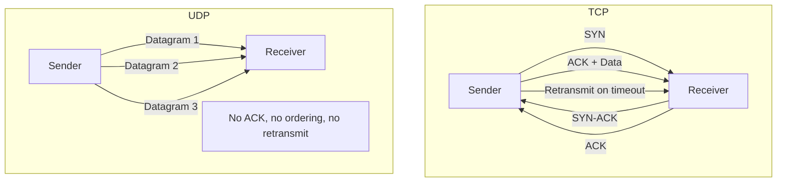
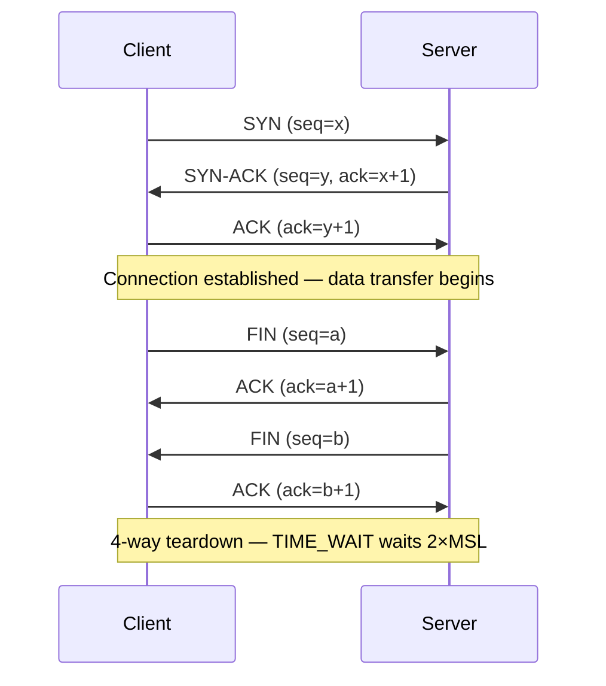

# TCP vs UDP

## Problem Statement

Compare TCP (Transmission Control Protocol) and UDP (User Datagram Protocol) — understand when to use each and how TCP achieves reliable delivery.

**Key questions:**
- How does TCP guarantee delivery and order?
- What does TCP's 3-way handshake add?
- When is UDP the better choice?

## Scenario

TCP vs UDP is a critical component in modern distributed systems. In real-world applications, handling complex business logic at scale with high reliability. For example, major tech companies like Netflix, Uber, and Airbnb rely on similar solutions to handle millions of concurrent users and requests. The challenge is achieving this while maintaining sub-100ms latency, 99.99% availability, and gracefully handling 10x traffic spikes during peak demand. This component provides the foundational capability to solve these challenges reliably and efficiently at global scale.

## Users

- **Backend Engineers**: Responsible for implementing and maintaining this system component in production environments. They need to understand the architecture, trade-offs, failure modes, and operational considerations.
- **DevOps/SRE Teams**: Monitor system health, manage scaling policies, handle incidents, and ensure reliability SLAs are met. They need insights into performance characteristics, bottlenecks, and failure recovery mechanisms.
- **Data Engineers**: Design data pipelines and analytics around this system, requiring deep understanding of data flow, consistency guarantees, and throughput characteristics.
- **System Architects**: Make high-level architectural decisions that impact company infrastructure, requiring comprehensive understanding of capabilities, limitations, and scalability boundaries.
- **Security Teams**: Understand security implications, potential vulnerabilities, and compliance requirements for this component.

## PRD

**Functional Requirements:**
- Correct behavior under all specified operating conditions
- Reliable operation with explicit failure modes
- Data consistency or eventual consistency guarantees as specified
- Clear mechanisms for error handling and recovery
- Monitoring and observability hooks

**Non-Functional Requirements:**
- **Performance**: Sub-100ms P99 latency for standard operations; measure and track tail latencies
- **Availability**: 99.99%+ uptime with automatic failover and graceful degradation
- **Scalability**: Support 10-100x current load with minimal architectural modifications
- **Consistency**: Specify whether strong, eventual, or causal consistency is required
- **Cost Efficiency**: Minimize operational cost per unit of throughput; consider compute, memory, and network costs
- **Operational Simplicity**: Reduce complexity to minimize human error and operational toil

**Constraints:**
- Resource limits (memory for caches, disk for databases, network bandwidth)
- Deployment constraints (cloud provider limits, regulatory requirements)
- Latency budgets (maximum acceptable delay for operations)

## Flow

The typical operational flow for this system involves these key phases:

1. **Request Arrival**: Client/upstream system sends request with required parameters and context
2. **Validation & Routing**: System validates request format, authentication, and routes to correct handler/shard/instance
3. **Core Processing**: Execute the main algorithm, database query, or business logic on the data/state
4. **State Management**: Update internal state (caches, indexes, counters, logs) with proper atomicity and locking
5. **Response Generation**: Format results and return to requester with relevant metadata (timing, version info)
6. **Observability**: Record metrics (latency, throughput, errors), logs (for debugging), and traces (for performance analysis)

This flow repeats thousands or millions of times per second in production. Each operation's efficiency compounds across the entire system, making careful optimization essential. Bottlenecks at any phase can cascade to impact overall system performance.

## Code Explanation

The provided implementations demonstrate key architectural concepts and design patterns:

**Python Implementation**: Uses built-in Python structures and standard library features to express the core logic clearly. Python emphasizes readability and conciseness—each operation's purpose should be obvious without extensive comments. You'll see different implementation approaches (e.g., using OrderedDict vs. manual linked lists) that represent trade-offs between convenience and fine-grained control.

**Java Implementation**: Shows how to implement the same logic with explicit memory management and type safety. Java's strong typing forces clear interface design; you'll see how generics, null safety, mutable state, and thread safety are handled. This implementation style is closer to production systems at scale.

**Key Implementation Patterns**:
- **Initialization**: Setting up core data structures, thread pools, or connection pools with specified capacity and configuration
- **Read Operations**: Fetching data while maintaining O(1) or O(log n) access, updating metadata (access times, hit counts, etc.)
- **Write Operations**: Inserting/updating data while handling eviction policies, balancing tree structures, or replicating state
- **Edge Cases**: Handling capacity limits, concurrent access, data consistency, and error conditions
- **Performance Optimization**: Using techniques like batch operations, lazy evaluation, or caching to reduce latency

Each line of code represents a deliberate choice about performance characteristics, memory usage, safety guarantees, and implementation complexity. Understanding these trade-offs is essential for using this component effectively in production systems.

## Architecture Diagram



## TCP 3-Way Handshake



## Design

### TCP Reliability Mechanisms

```
Sequence numbers    — Order packets, detect gaps
ACKs                — Receiver confirms receipt
Retransmission      — Sender resends unACKed packets (RTO timer)
Flow control        — Receiver advertises window size (rwnd)
Congestion control  — Sender limits rate based on network feedback
  Slow start        — Increase cwnd exponentially until ssthresh
  AIMD              — Additive increase, multiplicative decrease on loss
Nagle's algorithm   — Buffer small writes to reduce packet count
```

### TCP vs UDP Comparison

| Feature | TCP | UDP |
|---|---|---|
| Connection | Yes (3-way handshake) | No |
| Reliability | Guaranteed delivery | Best effort |
| Ordering | Yes | No |
| Flow control | Yes (window) | No |
| Congestion control | Yes | No |
| Header size | 20-60 bytes | 8 bytes |
| Latency | Higher | Lower |
| Throughput | High (but variable) | Potentially higher |
| Use cases | HTTP, email, file transfer | DNS, video, gaming, VoIP |

### TCP Congestion Control States

```
Slow Start:        cwnd doubles each RTT until ssthresh
Congestion Avoidance: cwnd += 1 per RTT (linear)
Fast Retransmit:   3 duplicate ACKs → retransmit immediately
Fast Recovery:     ssthresh = cwnd/2, cwnd = ssthresh + 3
```

## Common Questions & Answers

**Q: What is the TIME_WAIT state?** A: After active closer sends final ACK, waits 2×MSL (max segment lifetime, ~60s) to handle delayed duplicates. Prevents port reuse confusion.

**Q: TCP head-of-line blocking?** A: If packet N is lost, packets N+1, N+2... wait in buffer. HTTP/2 over TCP still suffers this. QUIC/HTTP/3 solves it per-stream.

**Q: What is Nagle's algorithm?** A: Buffers small TCP writes until ACK received for outstanding data. Reduces chattiness. Disable with `TCP_NODELAY` for latency-sensitive apps.

**Q: How does TCP handle packet reordering?** A: Sequence numbers allow receiver to reorder. Buffer out-of-order segments until gap fills.

**Q: UDP vs TCP for video streaming?** A: Real-time: UDP (tolerate loss, not delay). VOD: TCP (reliable, adaptive bitrate over HTTP/DASH).

**Q: What is SCTP?** A: Stream Control Transmission Protocol — multi-homing, multi-streaming, message-oriented. Used in telecom. Less common than TCP/UDP.

## Back-of-Envelope Calculations

```
TCP 3-way handshake overhead:
  1.5 RTT before data (SYN, SYN-ACK, ACK+data)
  At 100ms RTT: 150ms wasted per new connection
  Solution: connection pooling, HTTP keep-alive, HTTP/2 multiplexing

TCP window size impact on throughput:
  Throughput = window_size / RTT
  Window = 65535 bytes (default), RTT = 100ms
  Throughput = 65535 / 0.1 = 655 KB/s = ~5.2 Mbps
  With window scaling (1MB window): 1MB / 0.1s = 80 Mbps

Retransmission timeout (RTO):
  RTO = SRTT + 4 × RTTVAR (Jacobson's algorithm)
  Typical: 200ms–1s, doubles on each timeout (exponential backoff)
  Max retries: ~15 (Linux default), total timeout: ~30 minutes

UDP packet loss tolerance:
  VoIP: tolerate up to 5% loss with PLC (packet loss concealment)
  Video: up to 2% loss (FEC can recover ~5% with 20% overhead)
  DNS: retry at application layer after timeout
```

## Design Choices

| Scenario | Choice | Reason |
|---|---|---|
| File download | TCP | Need complete, ordered data |
| DNS query | UDP | Single request/response, retry at app layer |
| Video call | UDP | Latency > reliability; late packet = useless |
| Game state | UDP | Frequent updates; old state irrelevant |
| Database replication | TCP | Consistency requires reliability |
| Live video (HLS/DASH) | TCP | Buffered, HTTP-based adaptive streaming |

## Follow-up Questions

1. How does QUIC (HTTP/3) combine UDP reliability?
2. What is BBR congestion control and why does Google use it?
3. How does TCP Fast Open (TFO) eliminate the handshake RTT?
4. Design a reliable messaging protocol over UDP.
5. How do firewalls handle UDP differently from TCP?

## Python Implementation

```python
import socket
import struct
import threading
from typing import Optional

class TCPServer:
    def __init__(self, host: str = "127.0.0.1", port: int = 9090):
        self._host = host
        self._port = port
        self._sock = socket.socket(socket.AF_INET, socket.SOCK_STREAM)
        self._sock.setsockopt(socket.SOL_SOCKET, socket.SO_REUSEADDR, 1)

    def start(self):
        self._sock.bind((self._host, self._port))
        self._sock.listen(5)
        print(f"TCP server listening on {self._host}:{self._port}")
        while True:
            conn, addr = self._sock.accept()
            threading.Thread(target=self._handle, args=(conn, addr), daemon=True).start()

    def _handle(self, conn: socket.socket, addr):
        with conn:
            while data := conn.recv(1024):
                print(f"[TCP] Received from {addr}: {data.decode()}")
                conn.sendall(b"ACK: " + data)

class UDPServer:
    def __init__(self, host: str = "127.0.0.1", port: int = 9091):
        self._host = host
        self._port = port
        self._sock = socket.socket(socket.AF_INET, socket.SOCK_DGRAM)

    def start(self):
        self._sock.bind((self._host, self._port))
        print(f"UDP server listening on {self._host}:{self._port}")
        while True:
            data, addr = self._sock.recvfrom(1024)
            print(f"[UDP] Received from {addr}: {data.decode()}")
            self._sock.sendto(b"ACK: " + data, addr)

class ReliableUDP:
    """Simple reliable UDP — sequence numbers + ACKs."""
    SEQ_FMT = "!I"  # 4-byte sequence number

    def __init__(self, sock: socket.socket):
        self._sock = sock
        self._seq = 0
        self._expected_seq = 0

    def send(self, data: bytes, addr: tuple):
        packet = struct.pack(self.SEQ_FMT, self._seq) + data
        self._sock.sendto(packet, addr)
        self._seq += 1

    def receive(self) -> tuple[Optional[bytes], tuple]:
        raw, addr = self._sock.recvfrom(4096)
        seq = struct.unpack(self.SEQ_FMT, raw[:4])[0]
        payload = raw[4:]
        if seq == self._expected_seq:
            self._expected_seq += 1
            ack = struct.pack(self.SEQ_FMT, seq)
            self._sock.sendto(ack, addr)
            return payload, addr
        return None, addr  # out-of-order — drop

# TCP connection teardown states
TCP_STATES = ["LISTEN", "SYN_SENT", "SYN_RECEIVED", "ESTABLISHED",
              "FIN_WAIT_1", "FIN_WAIT_2", "TIME_WAIT", "CLOSE_WAIT", "LAST_ACK", "CLOSED"]

def simulate_tcp_handshake():
    state = "LISTEN"
    print(f"Server: {state}")
    state = "SYN_RECEIVED"
    print(f"Server (got SYN, sent SYN-ACK): {state}")
    state = "ESTABLISHED"
    print(f"Server (got ACK): {state}")
    return state

print(simulate_tcp_handshake())  # ESTABLISHED
```

## Java Implementation

```java
import java.io.*;
import java.net.*;
import java.util.concurrent.*;

public class TCPUDPComparison {

    // TCP Echo Server
    static class TCPServer implements Runnable {
        private int port;
        TCPServer(int port) { this.port = port; }

        public void run() {
            try (ServerSocket ss = new ServerSocket(port)) {
                System.out.println("TCP listening on " + port);
                while (true) {
                    Socket conn = ss.accept();
                    new Thread(() -> {
                        try (BufferedReader in = new BufferedReader(new InputStreamReader(conn.getInputStream()));
                             PrintWriter out = new PrintWriter(conn.getOutputStream(), true)) {
                            String line;
                            while ((line = in.readLine()) != null) {
                                System.out.println("[TCP] " + line);
                                out.println("ACK: " + line);
                            }
                        } catch (IOException e) { e.printStackTrace(); }
                    }).start();
                }
            } catch (IOException e) { e.printStackTrace(); }
        }
    }

    // UDP Echo Server
    static class UDPServer implements Runnable {
        private int port;
        UDPServer(int port) { this.port = port; }

        public void run() {
            try (DatagramSocket sock = new DatagramSocket(port)) {
                System.out.println("UDP listening on " + port);
                byte[] buf = new byte[1024];
                while (true) {
                    DatagramPacket pkt = new DatagramPacket(buf, buf.length);
                    sock.receive(pkt);
                    String msg = new String(pkt.getData(), 0, pkt.getLength());
                    System.out.println("[UDP] " + msg);
                    byte[] reply = ("ACK: " + msg).getBytes();
                    sock.send(new DatagramPacket(reply, reply.length, pkt.getAddress(), pkt.getPort()));
                }
            } catch (IOException e) { e.printStackTrace(); }
        }
    }

    public static void main(String[] args) {
        ExecutorService pool = Executors.newFixedThreadPool(2);
        pool.submit(new TCPServer(9090));
        pool.submit(new UDPServer(9091));
    }
}
```

## Complexity

| Metric | TCP | UDP |
|---|---|---|
| Connection setup | 1.5 RTT | 0 |
| Header overhead | 20-60 bytes/packet | 8 bytes/packet |
| Throughput (ideal) | ~80% of link | ~95% of link |
| Retransmission delay | 1+ RTT (RTO) | Application-defined |
