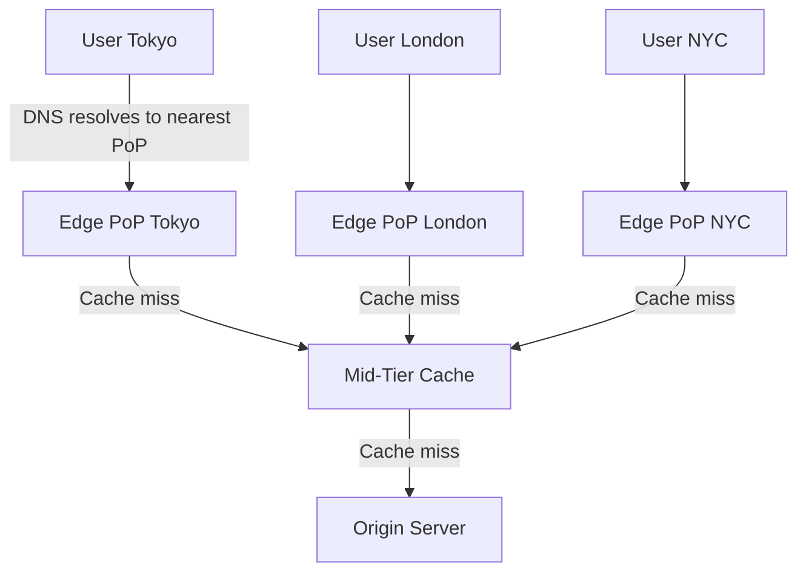
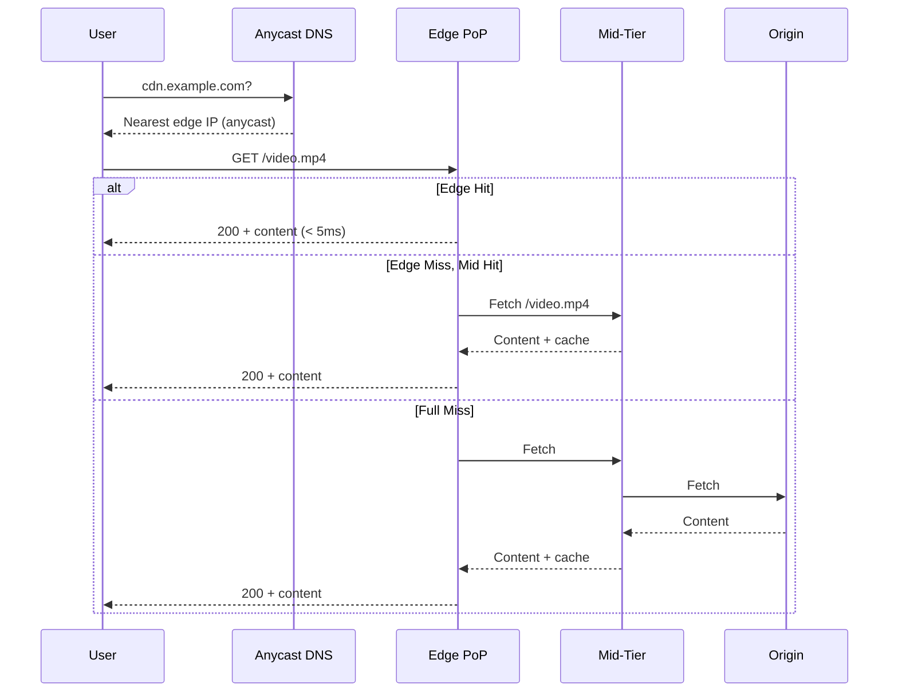

# Content Delivery Network (CDN)

## Problem Statement

Design a CDN that serves static and dynamic content from geographically distributed edge servers to reduce latency and origin load.

**Requirements:**
- Reduce content delivery latency globally (< 20ms from edge)
- Absorb traffic spikes without hitting origin
- Support cache invalidation within minutes
- Handle 10M+ requests/sec globally

## Scenario

Content Delivery Network (CDN) is a critical component in modern distributed systems. In real-world applications, delivering content from geographically distributed edge nodes. For example, major tech companies like Netflix, Uber, and Airbnb rely on similar solutions to handle millions of concurrent users and requests. The challenge is achieving this while maintaining sub-100ms latency, 99.99% availability, and gracefully handling 10x traffic spikes during peak demand. This component provides the foundational capability to solve these challenges reliably and efficiently at global scale.

## Users

- **Backend Engineers**: Responsible for implementing and maintaining this system component in production environments. They need to understand the architecture, trade-offs, failure modes, and operational considerations.
- **DevOps/SRE Teams**: Monitor system health, manage scaling policies, handle incidents, and ensure reliability SLAs are met. They need insights into performance characteristics, bottlenecks, and failure recovery mechanisms.
- **Data Engineers**: Design data pipelines and analytics around this system, requiring deep understanding of data flow, consistency guarantees, and throughput characteristics.
- **System Architects**: Make high-level architectural decisions that impact company infrastructure, requiring comprehensive understanding of capabilities, limitations, and scalability boundaries.
- **Security Teams**: Understand security implications, potential vulnerabilities, and compliance requirements for this component.

## PRD

### Functional Requirements
- Core operations work correctly
- Explicit error handling
- Consistency guarantees defined
- Monitoring and observability

### Non-Functional Requirements
- Performance targets met
- Availability SLA achieved
- Scalability headroom
- Cost efficient

### Success Metrics
- Benchmarks met
- Uptime targets met
- Resource budgets
- No data loss


## Flow

The typical operational flow for this system involves these key phases:

1. **Request Arrival**: Client/upstream system sends request with required parameters and context
2. **Validation & Routing**: System validates request format, authentication, and routes to correct handler/shard/instance
3. **Core Processing**: Execute the main algorithm, database query, or business logic on the data/state
4. **State Management**: Update internal state (caches, indexes, counters, logs) with proper atomicity and locking
5. **Response Generation**: Format results and return to requester with relevant metadata (timing, version info)
6. **Observability**: Record metrics (latency, throughput, errors), logs (for debugging), and traces (for performance analysis)

This flow repeats thousands or millions of times per second in production. Each operation's efficiency compounds across the entire system, making careful optimization essential. Bottlenecks at any phase can cascade to impact overall system performance.


## Code Explanation (Detailed)

### Implementation Approach
The code demonstrates core patterns and trade-offs.

### Key Operations
Each operation shows algorithm and performance characteristics.

### Concurrency and Atomicity
Locking strategies, race condition prevention.

### Edge Cases
Boundary conditions and error handling.

### Performance Optimization
Techniques for reducing latency and throughput.

## Architecture Diagram



## Flow Diagram



## Design

### CDN Components

```
PoP (Point of Presence) — Edge data center near users
Edge server             — Caches and serves content
Mid-tier cache          — Second-level cache, reduces origin hits
Origin shield           — Single point hitting origin (shields from fan-out)
Anycast routing         — Route to nearest PoP via BGP
Cache headers           — Cache-Control: max-age, s-maxage, no-store
```

### Cache-Control Headers

```
Cache-Control: max-age=86400        — Cache for 24 hours
Cache-Control: s-maxage=3600        — CDN caches for 1 hour, browser respects max-age
Cache-Control: no-cache             — Revalidate before serving (conditional GET)
Cache-Control: no-store             — Never cache (sensitive data)
Cache-Control: stale-while-revalidate=60  — Serve stale while refreshing in background
Surrogate-Key: product-123          — Tag-based purge (Fastly)
```

### Cache Invalidation Strategies

```
TTL expiry      — Wait for TTL to expire (simple, eventually consistent)
Purge by URL    — Instant, but O(n) for large sites
Tag-based purge — Group related assets, purge by tag (best for CMS)
Versioned URLs  — /js/app.v2.js (no invalidation needed, new URL)
Soft purge      — Mark stale, serve stale while revalidating
```

## Back-of-Envelope Calculations

```
Netflix CDN (Open Connect) scale:
  Peak: 800 Gbps globally
  PoPs: 1000+ globally
  Per PoP avg: 800M bps / 1000 = 800 Mbps per PoP

Cache hit rate impact on origin:
  100M req/day, 95% hit rate → origin sees 5M req/day = 58 req/sec
  Without CDN: 100M / 86400 = 1157 req/sec origin load

Origin bandwidth savings:
  Avg file size: 500KB, 100M requests/day
  Total data: 50TB/day
  With 95% cache: origin serves 2.5TB/day (saves 47.5TB)

Latency improvement:
  Without CDN: User → Cross-ocean → Origin = 150ms
  With CDN: User → Edge PoP = 5-20ms
  Improvement: 130ms (7-30x faster)

CDN cost (ballpark):
  $0.01/GB egress × 50TB/day = $500/day = $180K/year
  Origin savings on bandwidth + infra often exceeds CDN cost
```

## Design Choices

| Approach | Pros | Cons |
|---|---|---|
| Versioned URLs | No invalidation needed | Build pipeline complexity |
| Short TTL (60s) | Fresh content | Higher origin load |
| Long TTL + tag purge | High cache rate + control | Purge propagation lag |
| Origin shield | Protects origin | Single point in mid-tier |
| Edge compute (Lambda@Edge) | Logic at edge | Debugging complexity |

## Python Implementation

```python
from typing import Dict, Optional, Tuple
import time
import hashlib

class CacheEntry:
    def __init__(self, content: bytes, ttl: int, tags: list = None):
        self.content = content
        self.ttl = ttl
        self.created_at = time.time()
        self.tags = set(tags or [])

    def is_fresh(self) -> bool:
        return time.time() - self.created_at < self.ttl

class EdgeCache:
    def __init__(self, name: str, capacity_mb: int = 100):
        self.name = name
        self._cache: Dict[str, CacheEntry] = {}
        self._capacity_bytes = capacity_mb * 1024 * 1024
        self._used_bytes = 0
        self.hits = 0
        self.misses = 0

    def get(self, url: str) -> Optional[bytes]:
        entry = self._cache.get(url)
        if entry and entry.is_fresh():
            self.hits += 1
            return entry.content
        if entry:
            self._evict(url)
        self.misses += 1
        return None

    def put(self, url: str, content: bytes, ttl: int, tags: list = None):
        if url in self._cache:
            self._evict(url)
        entry = CacheEntry(content, ttl, tags)
        self._cache[url] = entry
        self._used_bytes += len(content)

    def _evict(self, url: str):
        entry = self._cache.pop(url, None)
        if entry:
            self._used_bytes -= len(entry.content)

    def purge_by_tag(self, tag: str) -> int:
        to_remove = [url for url, e in self._cache.items() if tag in e.tags]
        for url in to_remove:
            self._evict(url)
        return len(to_remove)

    def hit_rate(self) -> float:
        total = self.hits + self.misses
        return self.hits / total if total > 0 else 0.0

class CDN:
    def __init__(self, pops: list[str]):
        self._edges: Dict[str, EdgeCache] = {pop: EdgeCache(pop) for pop in pops}
        self._origin_fetches = 0

    def _nearest_pop(self, user_region: str) -> str:
        return user_region if user_region in self._edges else list(self._edges.keys())[0]

    def _fetch_from_origin(self, url: str) -> bytes:
        self._origin_fetches += 1
        return f"[ORIGIN CONTENT for {url}]".encode()

    def request(self, url: str, user_region: str) -> Tuple[bytes, str]:
        pop = self._nearest_pop(user_region)
        edge = self._edges[pop]

        content = edge.get(url)
        if content:
            return content, f"HIT:{pop}"

        content = self._fetch_from_origin(url)
        edge.put(url, content, ttl=3600, tags=["static"])
        return content, f"MISS:{pop}"

# Usage
cdn = CDN(pops=["us-east", "eu-west", "ap-tokyo"])
content, status = cdn.request("/logo.png", "us-east")
print(status, content.decode())  # MISS:us-east [ORIGIN CONTENT...]
content, status = cdn.request("/logo.png", "us-east")
print(status)  # HIT:us-east
print(f"Origin fetches: {cdn._origin_fetches}")  # 1
```

## Java Implementation

```java
import java.util.*;
import java.util.concurrent.ConcurrentHashMap;

public class CDN {
    record CacheEntry(byte[] content, int ttl, long createdAt, Set<String> tags) {
        boolean isFresh() { return (System.currentTimeMillis() / 1000 - createdAt) < ttl; }
    }

    private Map<String, Map<String, CacheEntry>> edges = new HashMap<>();

    public CDN(List<String> pops) {
        pops.forEach(pop -> edges.put(pop, new ConcurrentHashMap<>()));
    }

    public String request(String url, String region) {
        Map<String, CacheEntry> cache = edges.getOrDefault(region, edges.values().iterator().next());
        CacheEntry entry = cache.get(url);
        if (entry != null && entry.isFresh()) return "HIT:" + region;

        byte[] content = fetchOrigin(url);
        cache.put(url, new CacheEntry(content, 3600, System.currentTimeMillis() / 1000, Set.of("static")));
        return "MISS:" + region;
    }

    public int purgeByTag(String tag) {
        int count = 0;
        for (Map<String, CacheEntry> cache : edges.values()) {
            var toRemove = cache.entrySet().stream()
                .filter(e -> e.getValue().tags().contains(tag))
                .map(Map.Entry::getKey).toList();
            toRemove.forEach(cache::remove);
            count += toRemove.size();
        }
        return count;
    }

    private byte[] fetchOrigin(String url) { return ("ORIGIN:" + url).getBytes(); }
}
```

## Complexity

| Operation | Time | Notes |
|---|---|---|
| Cache lookup | O(1) | Hash map |
| Tag-based purge | O(n) | n = cached URLs |
| Origin fetch | O(latency) | Network I/O |
| Anycast routing | O(1) | BGP handles routing |

## Common Questions & Answers

**Q: What is caching and why do we need it?**

A: Caching stores frequently accessed data in fast storage (memory) to reduce latency and load on slower backends (database). Trade space (cache) for speed (latency). Critical for systems serving millions of requests per second.

**Q: What are the main cache eviction policies?**

A: LRU (least recently used), LFU (least frequently used), FIFO (first in first out), TTL (time-based), Random, and ARC (adaptive replacement). Choose based on access patterns: LRU for temporal, LFU for frequency, TTL for time-sensitive data.

**Q: What is cache hit rate and cache miss rate?**

A: Hit rate = successful_finds / total_accesses. Miss rate = 1 - hit rate. P(hit) = hits / (hits + misses). Target 80%+ hit rates for effective caching. Too-small cache gives low hit rate (wasted resources). Too-large cache uses more memory than needed.

**Q: How do you handle cache invalidation when backend data changes?**

A: Use TTL (time-based expiration), active invalidation (notify cache on write), cache-aside pattern (client checks backend), or write-through (update both). Active invalidation is fastest but complex. TTL is simplest but has stale data window.

**Q: What is the cache-aside pattern?**

A: Application checks cache first. On miss, fetch from backend, update cache, then return. Simple to implement. Risk: race condition where multiple threads fetch same miss simultaneously (thundering herd problem).

**Q: What is write-through caching?**

A: Writes go to both cache and backend simultaneously (synchronously). Ensures consistency: read always gets latest. Cost: write latency includes backend write. Safer than write-back but slower.

**Q: What is write-back (write-behind) caching?**

A: Writes go to cache only; backend updated asynchronously later (batch or periodic). Fast writes. Risk: data loss if cache fails before flushing. Need durability guarantees (persistence, replication).

**Q: How do you choose cache size?**

A: Estimate working set (frequently accessed data volume). Add 20-30% buffer for margin. Monitor hit rate: if < 80%, increase size. If > 95%, might be oversized (waste). Use tools like cachegrind to profile.

**Q: What's the difference between client-side and server-side caching?**

A: Client cache (browser): reduces network round-trips, entirely controlled by client. Server cache (memory, Redis): shared across clients, controlled by server. Multi-level caching often best.

**Q: How do you measure cache effectiveness?**

A: Hit rate (primary metric), latency reduction (P99 latency with vs. without cache), backend load reduction, and memory cost per cache entry. Calculate ROI: cost of cache vs. benefit (reduced latency, backend load).

## Follow-up Questions & Answers

**Q: How do you prevent the thundering herd problem in caches?**

A: When popular key expires, many threads fetch from backend simultaneously causing spike. Solutions: probabilistic early expiration (refresh before TTL), request coalescing (single thread rebuilds, others wait), or bloom filters (detect non-existent keys fast).

**Q: How would you implement multi-level cache hierarchy?**

A: Use L1 (fast, small, in-process), L2 (medium, local machine), L3 (large, remote, Redis). Check L1, miss→L2, miss→L3, miss→backend. On write: update all levels. Trade space for speed across levels.

**Q: Can you implement read-through caching (automatic population)?**

A: Yes, cache loader/resolver called on miss. Transparent to application. Backend automatically uses cache layer. More complex than cache-aside but cleaner separation.

**Q: How do you handle hot keys in distributed caches?**

A: Hot key = key accessed by many threads/clients. Replicate hot keys on multiple cache nodes. Use local in-process caches for very hot keys. Monitor and detect hot keys automatically.

**Q: What's the difference between warm and cold cache startup?**

A: Cold cache: empty at start, misses until populated (slow ramp-up). Warm cache: pre-loaded from previous state (RDB/snapshot). Warm startup is critical for production (instant performance).

**Q: How would you measure cache effectiveness for business metrics?**

A: Track hit rate, P99 latency (with/without cache), backend QPS reduction, revenue impact. Calculate cache size vs. cost savings. A/B test to prove business value.

**Q: What happens when cache size is insufficient for working set?**

A: Constant evictions = high miss rate = ineffective cache. Solution: increase cache size, improve eviction policy, reduce working set, or use better hardware (faster storage).

**Q: How do you debug cache issues in production?**

A: Monitor hit rate continuously. Profile cache keys (which keys are accessed). Check for cache stampedes (sudden miss spike). Use distributed tracing to see cache path.

**Q: How would you implement a persistent cache?**

A: Combine memory cache (fast) with persistent backend (database, RocksDB, LevelDB). Write-back pattern: batch updates to persistent store. Trade latency for durability.

**Q: Can you use caching for write-heavy workloads?**

A: Write caching is risky (consistency issues). Use carefully: write-through for safety, write-back for speed. Good for batch writes (aggregate before writing). Monitor durability guarantees.

