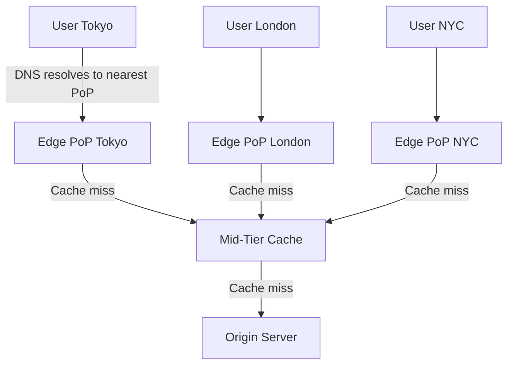
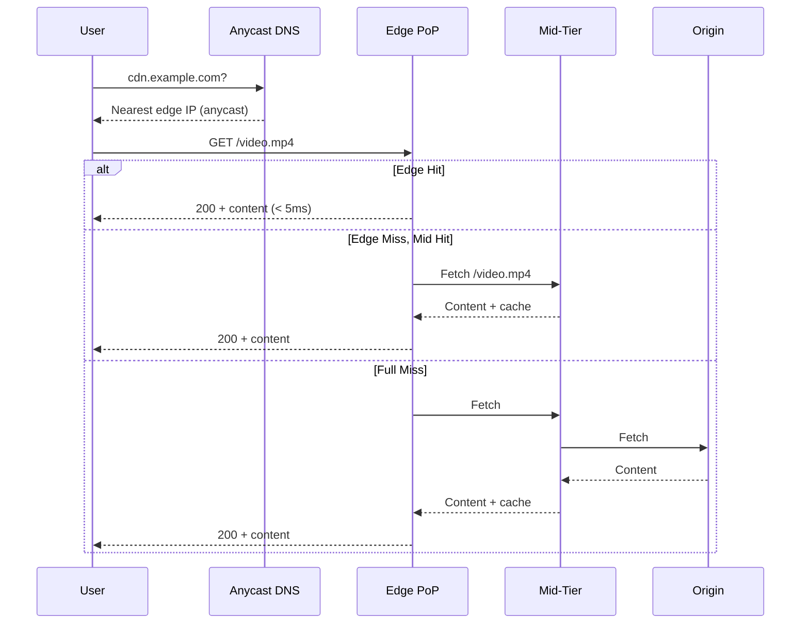

# Content Delivery Network (CDN)

## Problem Statement

Design a CDN that serves static and dynamic content from geographically distributed edge servers to reduce latency and origin load.

**Requirements:**
- Reduce content delivery latency globally (< 20ms from edge)
- Absorb traffic spikes without hitting origin
- Support cache invalidation within minutes
- Handle 10M+ requests/sec globally

## Architecture Diagram



## Flow Diagram



## Design

### CDN Components

```
PoP (Point of Presence) — Edge data center near users
Edge server             — Caches and serves content
Mid-tier cache          — Second-level cache, reduces origin hits
Origin shield           — Single point hitting origin (shields from fan-out)
Anycast routing         — Route to nearest PoP via BGP
Cache headers           — Cache-Control: max-age, s-maxage, no-store
```

### Cache-Control Headers

```
Cache-Control: max-age=86400        — Cache for 24 hours
Cache-Control: s-maxage=3600        — CDN caches for 1 hour, browser respects max-age
Cache-Control: no-cache             — Revalidate before serving (conditional GET)
Cache-Control: no-store             — Never cache (sensitive data)
Cache-Control: stale-while-revalidate=60  — Serve stale while refreshing in background
Surrogate-Key: product-123          — Tag-based purge (Fastly)
```

### Cache Invalidation Strategies

```
TTL expiry      — Wait for TTL to expire (simple, eventually consistent)
Purge by URL    — Instant, but O(n) for large sites
Tag-based purge — Group related assets, purge by tag (best for CMS)
Versioned URLs  — /js/app.v2.js (no invalidation needed, new URL)
Soft purge      — Mark stale, serve stale while revalidating
```

## Common Questions & Answers

**Q: How does CDN handle dynamic content?** A: Edge Side Includes (ESI), vary by cookie/header, dynamic routing to origin with edge caching of partial responses.

**Q: How does cache invalidation propagate?** A: CDN control plane pushes purge commands to all edges. Propagation: seconds to minutes (e.g., Cloudflare < 150ms globally).

**Q: What is origin shield?** A: A single CDN mid-tier node that all edges query for misses. Reduces origin fanout from N edges to 1. Critical for preventing thundering herd.

**Q: How does CDN handle personalized content?** A: Vary header (Vary: Cookie) or bypass CDN for authenticated requests. Edge computing (Cloudflare Workers) allows per-user logic at edge.

**Q: CDN vs reverse proxy?** A: CDN is globally distributed reverse proxy with caching. Reverse proxy is single-location. CDN solves last-mile latency; reverse proxy solves local traffic management.

## Back-of-Envelope Calculations

```
Netflix CDN (Open Connect) scale:
  Peak: 800 Gbps globally
  PoPs: 1000+ globally
  Per PoP avg: 800M bps / 1000 = 800 Mbps per PoP

Cache hit rate impact on origin:
  100M req/day, 95% hit rate → origin sees 5M req/day = 58 req/sec
  Without CDN: 100M / 86400 = 1157 req/sec origin load

Origin bandwidth savings:
  Avg file size: 500KB, 100M requests/day
  Total data: 50TB/day
  With 95% cache: origin serves 2.5TB/day (saves 47.5TB)

Latency improvement:
  Without CDN: User → Cross-ocean → Origin = 150ms
  With CDN: User → Edge PoP = 5-20ms
  Improvement: 130ms (7-30x faster)

CDN cost (ballpark):
  $0.01/GB egress × 50TB/day = $500/day = $180K/year
  Origin savings on bandwidth + infra often exceeds CDN cost
```

## Design Choices

| Approach | Pros | Cons |
|---|---|---|
| Versioned URLs | No invalidation needed | Build pipeline complexity |
| Short TTL (60s) | Fresh content | Higher origin load |
| Long TTL + tag purge | High cache rate + control | Purge propagation lag |
| Origin shield | Protects origin | Single point in mid-tier |
| Edge compute (Lambda@Edge) | Logic at edge | Debugging complexity |

## Follow-up Questions

1. How would you implement cache warming before a major content release?
2. Design a CDN that supports streaming video with adaptive bitrate.
3. How do you handle cache poisoning attacks?
4. How does a CDN handle WebSockets or SSE (non-cacheable)?
5. Explain how Anycast routing ensures users reach the nearest PoP.

## Python Implementation

```python
from typing import Dict, Optional, Tuple
import time
import hashlib

class CacheEntry:
    def __init__(self, content: bytes, ttl: int, tags: list = None):
        self.content = content
        self.ttl = ttl
        self.created_at = time.time()
        self.tags = set(tags or [])

    def is_fresh(self) -> bool:
        return time.time() - self.created_at < self.ttl

class EdgeCache:
    def __init__(self, name: str, capacity_mb: int = 100):
        self.name = name
        self._cache: Dict[str, CacheEntry] = {}
        self._capacity_bytes = capacity_mb * 1024 * 1024
        self._used_bytes = 0
        self.hits = 0
        self.misses = 0

    def get(self, url: str) -> Optional[bytes]:
        entry = self._cache.get(url)
        if entry and entry.is_fresh():
            self.hits += 1
            return entry.content
        if entry:
            self._evict(url)
        self.misses += 1
        return None

    def put(self, url: str, content: bytes, ttl: int, tags: list = None):
        if url in self._cache:
            self._evict(url)
        entry = CacheEntry(content, ttl, tags)
        self._cache[url] = entry
        self._used_bytes += len(content)

    def _evict(self, url: str):
        entry = self._cache.pop(url, None)
        if entry:
            self._used_bytes -= len(entry.content)

    def purge_by_tag(self, tag: str) -> int:
        to_remove = [url for url, e in self._cache.items() if tag in e.tags]
        for url in to_remove:
            self._evict(url)
        return len(to_remove)

    def hit_rate(self) -> float:
        total = self.hits + self.misses
        return self.hits / total if total > 0 else 0.0

class CDN:
    def __init__(self, pops: list[str]):
        self._edges: Dict[str, EdgeCache] = {pop: EdgeCache(pop) for pop in pops}
        self._origin_fetches = 0

    def _nearest_pop(self, user_region: str) -> str:
        return user_region if user_region in self._edges else list(self._edges.keys())[0]

    def _fetch_from_origin(self, url: str) -> bytes:
        self._origin_fetches += 1
        return f"[ORIGIN CONTENT for {url}]".encode()

    def request(self, url: str, user_region: str) -> Tuple[bytes, str]:
        pop = self._nearest_pop(user_region)
        edge = self._edges[pop]

        content = edge.get(url)
        if content:
            return content, f"HIT:{pop}"

        content = self._fetch_from_origin(url)
        edge.put(url, content, ttl=3600, tags=["static"])
        return content, f"MISS:{pop}"

# Usage
cdn = CDN(pops=["us-east", "eu-west", "ap-tokyo"])
content, status = cdn.request("/logo.png", "us-east")
print(status, content.decode())  # MISS:us-east [ORIGIN CONTENT...]
content, status = cdn.request("/logo.png", "us-east")
print(status)  # HIT:us-east
print(f"Origin fetches: {cdn._origin_fetches}")  # 1
```

## Java Implementation

```java
import java.util.*;
import java.util.concurrent.ConcurrentHashMap;

public class CDN {
    record CacheEntry(byte[] content, int ttl, long createdAt, Set<String> tags) {
        boolean isFresh() { return (System.currentTimeMillis() / 1000 - createdAt) < ttl; }
    }

    private Map<String, Map<String, CacheEntry>> edges = new HashMap<>();

    public CDN(List<String> pops) {
        pops.forEach(pop -> edges.put(pop, new ConcurrentHashMap<>()));
    }

    public String request(String url, String region) {
        Map<String, CacheEntry> cache = edges.getOrDefault(region, edges.values().iterator().next());
        CacheEntry entry = cache.get(url);
        if (entry != null && entry.isFresh()) return "HIT:" + region;

        byte[] content = fetchOrigin(url);
        cache.put(url, new CacheEntry(content, 3600, System.currentTimeMillis() / 1000, Set.of("static")));
        return "MISS:" + region;
    }

    public int purgeByTag(String tag) {
        int count = 0;
        for (Map<String, CacheEntry> cache : edges.values()) {
            var toRemove = cache.entrySet().stream()
                .filter(e -> e.getValue().tags().contains(tag))
                .map(Map.Entry::getKey).toList();
            toRemove.forEach(cache::remove);
            count += toRemove.size();
        }
        return count;
    }

    private byte[] fetchOrigin(String url) { return ("ORIGIN:" + url).getBytes(); }
}
```

## Complexity

| Operation | Time | Notes |
|---|---|---|
| Cache lookup | O(1) | Hash map |
| Tag-based purge | O(n) | n = cached URLs |
| Origin fetch | O(latency) | Network I/O |
| Anycast routing | O(1) | BGP handles routing |
