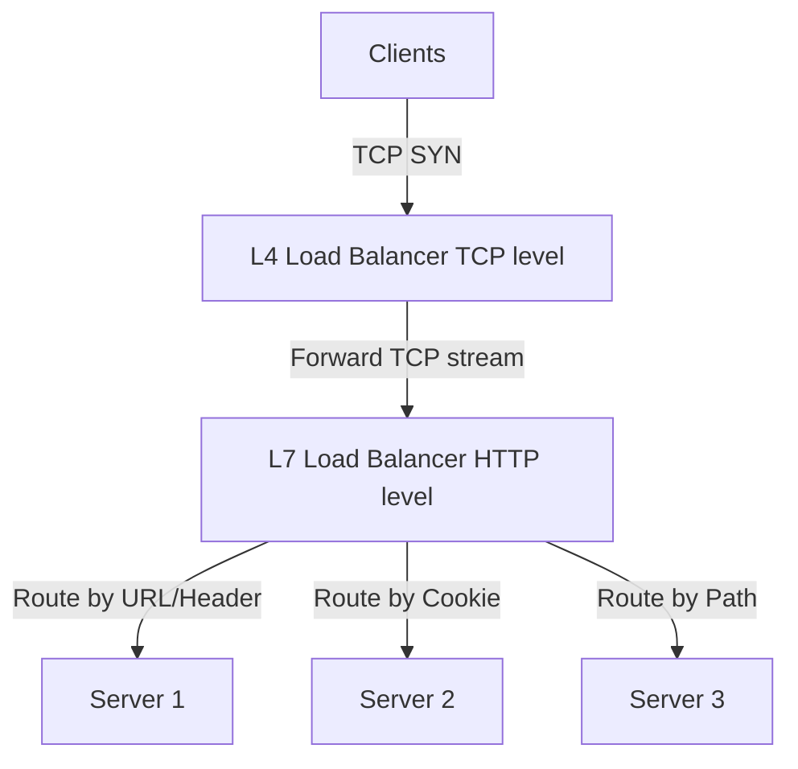
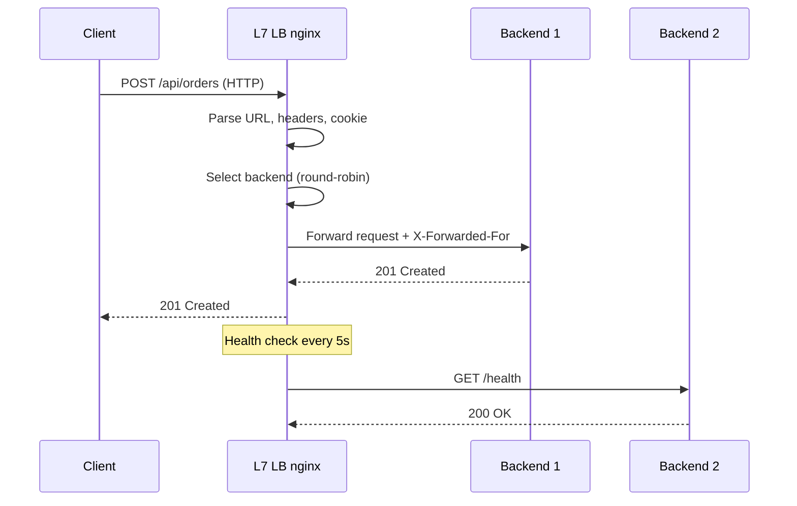

# Load Balancer: Layer 4 vs Layer 7

## Problem Statement

Design a load balancer that distributes incoming traffic across multiple backend servers to maximize availability and throughput.

**Requirements:**
- Distribute requests evenly across healthy backends
- Detect and route around unhealthy backends
- Support sticky sessions, SSL termination, content routing
- Handle 1M+ connections/sec

## Architecture Diagram



## Flow Diagram



## Design

### L4 vs L7 Comparison

| Feature | L4 (Transport) | L7 (Application) |
|---|---|---|
| Protocol | TCP/UDP | HTTP/HTTPS/gRPC |
| Visibility | IP + port only | URL, headers, cookies |
| SSL | Pass-through | Terminate + re-encrypt |
| Routing granularity | IP/port hash | Content-based |
| Performance | Higher (less parsing) | Slightly lower |
| Sticky sessions | IP-hash | Cookie-based |
| Use case | Raw TCP, databases | Web APIs |

### Balancing Algorithms

```
Round Robin       - Even distribution, O(1), simple
Weighted RR       - Server capacity-aware
Least Connections - Route to backend with fewest active connections
IP Hash           - Same client IP always hits same backend (sticky)
Random            - Surprisingly effective at scale (power of two choices)
Least Response    - Route to fastest responding backend
Consistent Hash   - Minimize remapping when backends change
```

### Health Checks

```
Active:  LB sends probe to /health every N seconds
Passive: Monitor real traffic errors, mark down on N failures
Thresholds:
  Mark down: 2-3 consecutive failures
  Mark up:   3 consecutive successes
Protocols: TCP connect, HTTP 200, gRPC health check
```

## Common Questions & Answers

**Q: What is DSR (Direct Server Return)?** A: Backend sends response directly to client, bypassing LB. LB only handles inbound. Reduces LB bandwidth 10-100x for high-throughput (video, downloads).

**Q: Sticky sessions vs stateless backends?** A: Sticky (cookie/IP-hash) ties user to one backend — breaks on backend failure. Stateless (session in Redis) is more resilient — prefer it.

**Q: Connection draining?** A: When removing a backend, LB stops new requests but lets existing connections complete (grace period: 30-300s). Prevents in-flight request failures during deploys.

**Q: AWS NLB vs ALB?** A: NLB (L4) handles millions connections/sec, preserves source IP, ultra-low latency. ALB (L7) adds routing rules, authentication, WAF integration.

**Q: What is a global load balancer?** A: Routes across regions (AWS Route53, GCP GCLB). Uses Anycast, GeoDNS, or latency-based routing to send users to nearest healthy region.

## Back-of-Envelope Calculations

```
Load balancer capacity:
  Nginx: ~50K concurrent connections per core
  HAProxy: ~100K connections/sec per core
  AWS NLB: millions of connections/sec (managed)

Health check overhead:
  100 backends x 1 check/5s = 20 checks/sec (negligible)

Latency added by L7 LB:
  HTTP header parsing: ~0.1ms
  Backend selection: ~0.01ms
  Total LB overhead: ~0.5ms

Bandwidth for L7 LB (both directions flow through):
  1M req/sec x 10KB avg = 10 GB/s through single LB
  DSR eliminates outbound, reducing to ~1 GB/s
```

## Design Choices

| Approach | Pros | Cons |
|---|---|---|
| L4 (NLB) | Ultra-high throughput | No content routing |
| L7 (ALB) | Smart routing, WAF | More CPU overhead |
| DSR | Saves LB bandwidth | Complex network config |
| Active health checks | Proactive failover | False positives possible |
| Consistent hashing | Minimize cache misses | Rebalancing on change |

## Follow-up Questions

1. How would you implement a global load balancer across regions?
2. Design a LB that supports WebSocket connections.
3. How does Kubernetes' kube-proxy implement L4 load balancing?
4. How do you prevent a single backend from getting overwhelmed?
5. What is GSLB (Global Server Load Balancing)?

## Python Implementation

```python
from typing import List, Optional
import itertools
import time

class Backend:
    def __init__(self, host: str, port: int, weight: int = 1):
        self.host = host
        self.port = port
        self.weight = weight
        self.healthy = True
        self.active_conns = 0
        self.failures = 0

    def address(self) -> str:
        return f"{self.host}:{self.port}"

class LoadBalancer:
    def __init__(self, algorithm: str = "round_robin"):
        self._backends: List[Backend] = []
        self._algorithm = algorithm
        self._rr_idx = 0

    def add_backend(self, backend: Backend):
        self._backends.append(backend)

    def healthy(self) -> List[Backend]:
        return [b for b in self._backends if b.healthy]

    def select(self) -> Optional[Backend]:
        alive = self.healthy()
        if not alive:
            return None
        if self._algorithm == "round_robin":
            b = alive[self._rr_idx % len(alive)]
            self._rr_idx += 1
            return b
        if self._algorithm == "least_connections":
            return min(alive, key=lambda b: b.active_conns)
        return alive[0]

    def handle(self, path: str) -> str:
        b = self.select()
        if not b:
            return "503 Service Unavailable"
        b.active_conns += 1
        try:
            return f"200 OK from {b.address()}"
        finally:
            b.active_conns -= 1

    def mark_down(self, addr: str):
        for b in self._backends:
            if b.address() == addr:
                b.healthy = False
                print(f"[LB] {addr} marked DOWN")

# Usage
lb = LoadBalancer("least_connections")
for i in range(1, 4):
    lb.add_backend(Backend(f"10.0.0.{i}", 8080))

for _ in range(6):
    print(lb.handle("/api/data"))

lb.mark_down("10.0.0.1:8080")
print(lb.handle("/api/data"))  # routes only to 10.0.0.2 or 10.0.0.3
```

## Java Implementation

```java
import java.util.*;
import java.util.concurrent.atomic.*;

public class LoadBalancer {
    static class Backend {
        String host; int port; AtomicInteger conns = new AtomicInteger(); volatile boolean healthy = true;
        Backend(String h, int p) { host = h; port = p; }
        String addr() { return host + ":" + port; }
    }

    private List<Backend> backends = new ArrayList<>();
    private AtomicInteger idx = new AtomicInteger();

    public void add(Backend b) { backends.add(b); }

    public Optional<Backend> selectRoundRobin() {
        List<Backend> up = backends.stream().filter(b -> b.healthy).toList();
        if (up.isEmpty()) return Optional.empty();
        return Optional.of(up.get(idx.getAndIncrement() % up.size()));
    }

    public Optional<Backend> selectLeastConn() {
        return backends.stream().filter(b -> b.healthy)
            .min(Comparator.comparingInt(b -> b.conns.get()));
    }

    public String handle(String path) {
        return selectLeastConn().map(b -> {
            b.conns.incrementAndGet();
            String r = "200 OK from " + b.addr();
            b.conns.decrementAndGet();
            return r;
        }).orElse("503 Service Unavailable");
    }
}
```

## Complexity

| Operation | Time |
|---|---|
| Round robin select | O(1) |
| Least connections | O(n) |
| Health check | O(backends) |
| Request routing | O(1) after selection |
