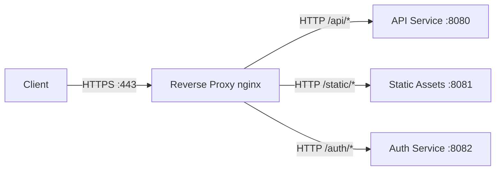
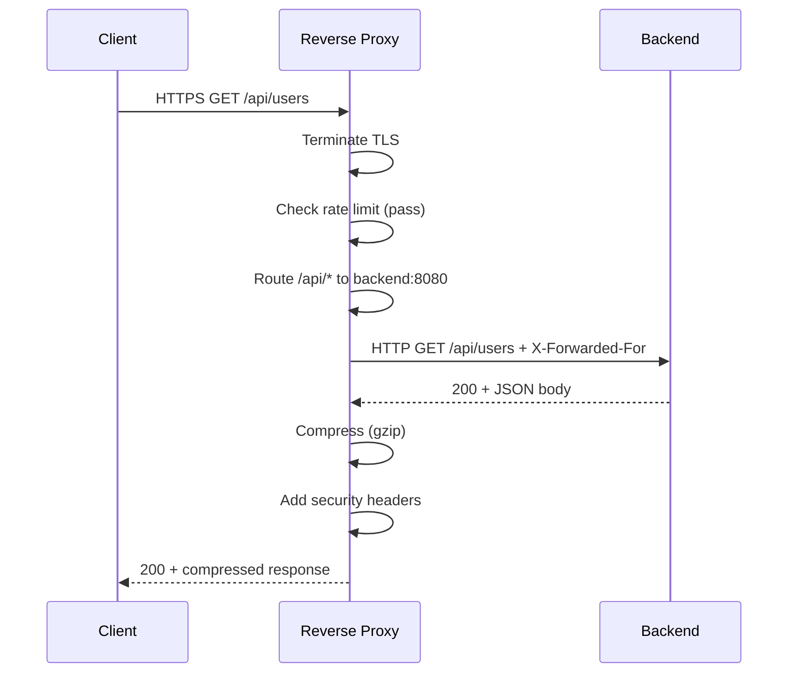

# Reverse Proxy

## Problem Statement

Design a reverse proxy that sits in front of backend servers to provide SSL termination, caching, compression, rate limiting, and content routing.

## Architecture Diagram



## Flow Diagram



## Design

### Headers Added by Reverse Proxy

```
X-Forwarded-For:    <client-ip>    - Original client IP
X-Forwarded-Proto:  https          - Original scheme
X-Real-IP:          <client-ip>    - Simplified client IP
X-Request-ID:       <uuid>         - Distributed tracing
X-Response-Time:    42ms           - Proxy latency
```

### Reverse Proxy vs Forward Proxy

| | Reverse Proxy | Forward Proxy |
|---|---|---|
| Hides | Backend servers from clients | Clients from servers |
| Used by | Server operators | Clients, enterprises |
| Examples | nginx, HAProxy, Envoy | Squid, corporate proxies |
| Purpose | LB, SSL, caching | Content filtering, privacy |

### Nginx Upstream Config

```nginx
upstream api_backend {
    least_conn;
    server 10.0.0.1:8080 weight=3;
    server 10.0.0.2:8080 weight=1;
    keepalive 32;
}

server {
    listen 443 ssl http2;
    ssl_certificate /certs/cert.pem;

    location /api/ {
        proxy_pass http://api_backend;
        proxy_set_header X-Forwarded-For $remote_addr;
        proxy_set_header Connection "";
        proxy_http_version 1.1;
    }

    gzip on;
    gzip_types application/json text/html;
}
```

## Common Questions & Answers

**Q: How does nginx achieve C10K?** A: Event-driven (epoll), async I/O. Single worker handles thousands of connections without per-connection threads.

**Q: What is proxy buffering?** A: Proxy buffers backend response in memory before sending to client. Frees backend connection faster. Disable for streaming/SSE with `proxy_buffering off`.

**Q: Reverse proxy vs API gateway?** A: Reverse proxy: low-level routing, SSL, compression. API gateway adds: auth, rate limiting, request transformation, API versioning, developer portal.

**Q: How does keepalive help performance?** A: Reverse proxy maintains persistent HTTP connections to backends. Eliminates TCP+TLS setup per upstream request. Configure `keepalive 32` in upstream block.

**Q: What is PROXY protocol?** A: Sends original client IP as first bytes of TCP connection (before HTTP). Allows backends to see real client IP even through multiple proxies.

## Back-of-Envelope Calculations

```
Nginx throughput:
  Single core: ~50K req/sec (simple proxying)
  4 cores: ~200K req/sec
  Memory: ~2.5KB per connection x 50K = 125MB

SSL termination overhead:
  Modern AES-NI CPUs: <1% CPU per HTTPS connection
  Without AES-NI: 5-10% CPU

Compression savings:
  JSON/HTML: 70-80% smaller with gzip
  1KB JSON -> 200-300 bytes over wire
  CPU cost: ~5ms/MB on modern hardware (negligible)

Connection reuse savings:
  Without keepalive: TCP + TLS = 150ms per request (at 50ms RTT)
  With keepalive: 0ms after first connection
  10 requests per connection = 1350ms saved
```

## Design Choices

| Feature | Option A | Option B |
|---|---|---|
| SSL termination | At proxy (offloading) | End-to-end (mTLS) |
| Caching | At proxy | At CDN layer |
| Compression | At proxy | At application |
| Auth | At API gateway | At backend |
| Buffering | On (default) | Off (streaming, SSE) |

## Follow-up Questions

1. How do you configure nginx for zero-downtime rolling deploys?
2. How does HAProxy differ from nginx for TCP load balancing?
3. How do you handle WebSocket connections through a reverse proxy?
4. What is the difference between Envoy and nginx?
5. Design a reverse proxy with per-client dynamic rate limiting.

## Python Implementation

```python
from http.server import HTTPServer, BaseHTTPRequestHandler
from urllib.request import urlopen, Request as URLReq
from typing import Dict
import gzip
import re

class ReverseProxyHandler(BaseHTTPRequestHandler):
    ROUTES: Dict[str, str] = {
        r"^/api/": "http://localhost:8081",
        r"^/static/": "http://localhost:8082",
    }

    def _route(self, path: str) -> str:
        for pattern, backend in self.ROUTES.items():
            if re.match(pattern, path):
                return backend
        return "http://localhost:8080"

    def do_GET(self):
        backend_url = self._route(self.path) + self.path
        req = URLReq(backend_url)
        req.add_header("X-Forwarded-For", self.client_address[0])
        req.add_header("X-Forwarded-Proto", "https")

        try:
            with urlopen(req, timeout=5) as resp:
                body = resp.read()
                status = resp.status
        except Exception:
            self.send_response(502)
            self.end_headers()
            self.wfile.write(b"Bad Gateway")
            return

        accept_enc = self.headers.get("Accept-Encoding", "")
        if "gzip" in accept_enc:
            body = gzip.compress(body)
            self.send_response(status)
            self.send_header("Content-Encoding", "gzip")
        else:
            self.send_response(status)

        self.send_header("Content-Length", str(len(body)))
        self.send_header("X-Proxy", "python-reverse-proxy")
        self.end_headers()
        self.wfile.write(body)

    def log_message(self, fmt, *args):
        print(f"[PROXY] {self.path} -> {self._route(self.path)}")

# Run: HTTPServer(("0.0.0.0", 8080), ReverseProxyHandler).serve_forever()
```

## Java Implementation

```java
import com.sun.net.httpserver.*;
import java.io.*;
import java.net.*;
import java.util.Map;
import java.util.regex.*;

public class ReverseProxy {
    private static final Map<String, String> ROUTES = Map.of(
        "/api/", "http://localhost:8081",
        "/static/", "http://localhost:8082"
    );

    static String route(String path) {
        return ROUTES.entrySet().stream()
            .filter(e -> path.startsWith(e.getKey()))
            .map(Map.Entry::getValue)
            .findFirst().orElse("http://localhost:8080");
    }

    public static void main(String[] args) throws Exception {
        HttpServer server = HttpServer.create(new InetSocketAddress(8080), 0);
        server.createContext("/", exchange -> {
            String path = exchange.getRequestURI().getPath();
            URL url = new URL(route(path) + path);
            HttpURLConnection conn = (HttpURLConnection) url.openConnection();
            conn.setRequestProperty("X-Forwarded-For",
                exchange.getRemoteAddress().getAddress().getHostAddress());
            byte[] body = conn.getInputStream().readAllBytes();
            exchange.sendResponseHeaders(conn.getResponseCode(), body.length);
            exchange.getResponseBody().write(body);
            exchange.close();
        });
        server.start();
    }
}
```

## Complexity

| Operation | Time |
|---|---|
| Route matching | O(routes) |
| Proxy pass | O(1) + network I/O |
| Gzip compression | O(n) response size |
| SSL termination | O(1) amortized |
