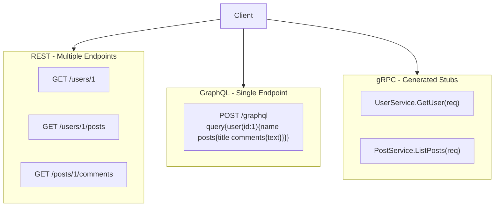
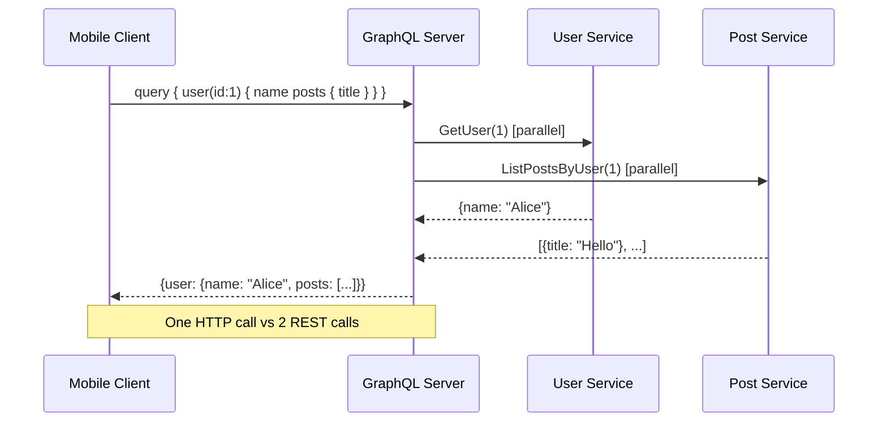

# REST vs GraphQL vs gRPC

## Problem Statement

Compare and choose between REST, GraphQL, and gRPC for different API use cases in distributed systems.

## Scenario

REST vs GraphQL vs gRPC is a critical component in modern distributed systems. In real-world applications, allowing clients to request exactly the data they need. For example, major tech companies like Netflix, Uber, and Airbnb rely on similar solutions to handle millions of concurrent users and requests. The challenge is achieving this while maintaining sub-100ms latency, 99.99% availability, and gracefully handling 10x traffic spikes during peak demand. This component provides the foundational capability to solve these challenges reliably and efficiently at global scale.

## Users

- **Backend Engineers**: Responsible for implementing and maintaining this system component in production environments. They need to understand the architecture, trade-offs, failure modes, and operational considerations.
- **DevOps/SRE Teams**: Monitor system health, manage scaling policies, handle incidents, and ensure reliability SLAs are met. They need insights into performance characteristics, bottlenecks, and failure recovery mechanisms.
- **Data Engineers**: Design data pipelines and analytics around this system, requiring deep understanding of data flow, consistency guarantees, and throughput characteristics.
- **System Architects**: Make high-level architectural decisions that impact company infrastructure, requiring comprehensive understanding of capabilities, limitations, and scalability boundaries.
- **Security Teams**: Understand security implications, potential vulnerabilities, and compliance requirements for this component.

## PRD

**Functional Requirements:**
- Correct behavior under all specified operating conditions
- Reliable operation with explicit failure modes
- Data consistency or eventual consistency guarantees as specified
- Clear mechanisms for error handling and recovery
- Monitoring and observability hooks

**Non-Functional Requirements:**
- **Performance**: Sub-100ms P99 latency for standard operations; measure and track tail latencies
- **Availability**: 99.99%+ uptime with automatic failover and graceful degradation
- **Scalability**: Support 10-100x current load with minimal architectural modifications
- **Consistency**: Specify whether strong, eventual, or causal consistency is required
- **Cost Efficiency**: Minimize operational cost per unit of throughput; consider compute, memory, and network costs
- **Operational Simplicity**: Reduce complexity to minimize human error and operational toil

**Constraints:**
- Resource limits (memory for caches, disk for databases, network bandwidth)
- Deployment constraints (cloud provider limits, regulatory requirements)
- Latency budgets (maximum acceptable delay for operations)

## Flow

The typical operational flow for this system involves these key phases:

1. **Request Arrival**: Client/upstream system sends request with required parameters and context
2. **Validation & Routing**: System validates request format, authentication, and routes to correct handler/shard/instance
3. **Core Processing**: Execute the main algorithm, database query, or business logic on the data/state
4. **State Management**: Update internal state (caches, indexes, counters, logs) with proper atomicity and locking
5. **Response Generation**: Format results and return to requester with relevant metadata (timing, version info)
6. **Observability**: Record metrics (latency, throughput, errors), logs (for debugging), and traces (for performance analysis)

This flow repeats thousands or millions of times per second in production. Each operation's efficiency compounds across the entire system, making careful optimization essential. Bottlenecks at any phase can cascade to impact overall system performance.

## Code Explanation

The provided implementations demonstrate key architectural concepts and design patterns:

**Python Implementation**: Uses built-in Python structures and standard library features to express the core logic clearly. Python emphasizes readability and conciseness—each operation's purpose should be obvious without extensive comments. You'll see different implementation approaches (e.g., using OrderedDict vs. manual linked lists) that represent trade-offs between convenience and fine-grained control.

**Java Implementation**: Shows how to implement the same logic with explicit memory management and type safety. Java's strong typing forces clear interface design; you'll see how generics, null safety, mutable state, and thread safety are handled. This implementation style is closer to production systems at scale.

**Key Implementation Patterns**:
- **Initialization**: Setting up core data structures, thread pools, or connection pools with specified capacity and configuration
- **Read Operations**: Fetching data while maintaining O(1) or O(log n) access, updating metadata (access times, hit counts, etc.)
- **Write Operations**: Inserting/updating data while handling eviction policies, balancing tree structures, or replicating state
- **Edge Cases**: Handling capacity limits, concurrent access, data consistency, and error conditions
- **Performance Optimization**: Using techniques like batch operations, lazy evaluation, or caching to reduce latency

Each line of code represents a deliberate choice about performance characteristics, memory usage, safety guarantees, and implementation complexity. Understanding these trade-offs is essential for using this component effectively in production systems.

## Architecture Diagram



## Flow Diagram



## Design

### REST Principles

```
Resources   - Nouns, not verbs (/users, /posts)
HTTP verbs  - GET (safe), POST, PUT, PATCH, DELETE
Stateless   - No server-side session
Cacheable   - GET responses can be cached (ETags, Cache-Control)
HATEOAS     - Links to related resources in response (optional)

Problems:
  Over-fetching - endpoint returns unused fields
  Under-fetching - N+1 requests for related data
```

### GraphQL

```
Single endpoint:   POST /graphql
Schema SDL:        type User { id: ID!, name: String!, posts: [Post!]! }
Client controls:   Specify exact fields needed
Resolvers:         Per-field data fetching functions
DataLoader:        Batch + cache resolver calls within request

Benefits: No over/under fetching, strongly typed, introspection
Problems: Caching harder (all POST), N+1 resolver problem, complex tooling
```

### gRPC

```
Interface Definition Language (IDL):
  .proto files define service + message types
  Code generation for 10+ languages

Transport: HTTP/2 (multiplexing, headers compression)
Encoding:  Protocol Buffers (binary, 3-10x smaller than JSON)
Streaming: Unary, server-streaming, client-streaming, bidirectional

Benefits: High performance, type safety, streaming, cross-language
Problems: Not human-readable, limited browser support (need grpc-web proxy)
```

### Comparison

| Feature | REST | GraphQL | gRPC |
|---|---|---|---|
| Protocol | HTTP/1.1 | HTTP/1.1 | HTTP/2 |
| Serialization | JSON | JSON | Protobuf (binary) |
| Type system | None (OpenAPI optional) | Strongly typed | Strongly typed |
| Caching | Native HTTP (GET) | Complex (POST) | Not built-in |
| Streaming | SSE/WebSocket | Subscriptions | Native |
| Browser support | Native | Native | grpc-web only |
| Payload size | Large | Medium | Small |
| Best for | Public APIs | Mobile/complex | Internal services |

## Common Questions & Answers

**Q: When to choose REST?** A: Public APIs, simple CRUD, when HTTP caching matters, external developers, small teams new to API design.

**Q: GraphQL N+1 problem?** A: Each field resolver fires independently. 1 query for user list + N queries for each user's posts. Solution: DataLoader (batch + deduplicate within one request tick).

**Q: What makes gRPC fast?** A: HTTP/2 (multiplexed requests, header compression), Protobuf (binary encoding, no parsing overhead), connection reuse.

**Q: Can you mix all three?** A: Yes. Common pattern: public REST API + mobile GraphQL + internal gRPC microservices (BFF - Backend For Frontend pattern).

**Q: How do you handle versioning in each?** A: REST: URL versioning (/v2/users). GraphQL: deprecate fields, add new fields (schema evolution). gRPC: field numbers never change, add new fields (backward compatible).

## Back-of-Envelope Calculations

```
Payload size (user + 10 posts):
  REST (over-fetching): ~5KB per call, 2 calls = 10KB
  GraphQL (exact fields): ~1KB
  gRPC (binary): ~300 bytes
  Savings: gRPC saves ~97% bandwidth vs REST

Mobile app homepage (5 API calls -> 1 GraphQL):
  5 REST calls x 100ms RTT = 500ms sequential (or parallel with overhead)
  1 GraphQL query = 100ms
  Improvement: 5x for sequential

gRPC vs REST throughput:
  JSON serialization: ~300 MB/s
  Protobuf serialization: ~1.5 GB/s (5x faster)
  At 100K req/sec x 1KB: gRPC saves 1.2GB/s CPU work

GraphQL operation complexity:
  Unlimited depth queries can be abusive (SELECT * of your data)
  Mitigation: query depth limit (10), complexity scoring, persisted queries
```

## Design Choices

| Scenario | Recommendation | Reason |
|---|---|---|
| Public API | REST | Simple, well-understood, cacheable |
| Mobile with complex data | GraphQL | One request, exact fields |
| Internal microservices | gRPC | Performance, type safety |
| Real-time feeds | GraphQL subscriptions | Unified schema |
| File uploads | REST (multipart) | Simpler than gRPC streaming |
| Low-latency trading | gRPC | Binary, streaming |

## Follow-up Questions

1. How do you implement pagination in REST vs GraphQL?
2. How does DataLoader work internally to batch resolver calls?
3. What is gRPC server streaming and when would you use it?
4. How do you protect a GraphQL API from introspection attacks?
5. Design a BFF (Backend for Frontend) for mobile vs web clients.

## Python Implementation

```python
# REST with Flask-style routing
from dataclasses import dataclass, asdict
from typing import List, Dict, Optional

@dataclass
class Post:
    post_id: int
    title: str
    user_id: int

@dataclass
class User:
    user_id: int
    name: str
    email: str

# Simulated data store
users_db: Dict[int, User] = {1: User(1, "Alice", "alice@example.com")}
posts_db: Dict[int, List[Post]] = {1: [Post(1, "Hello World", 1), Post(2, "Second post", 1)]}

# REST pattern
class RESTUserAPI:
    def get_user(self, user_id: int) -> Optional[dict]:
        user = users_db.get(user_id)
        return asdict(user) if user else None

    def get_user_posts(self, user_id: int) -> List[dict]:
        return [asdict(p) for p in posts_db.get(user_id, [])]

# GraphQL resolver pattern
class GraphQLResolver:
    def resolve_user(self, user_id: int, fields: List[str]) -> dict:
        user = users_db.get(user_id)
        if not user:
            return {}
        result = {}
        if "name" in fields:
            result["name"] = user.name
        if "email" in fields:
            result["email"] = user.email
        if "posts" in fields:
            result["posts"] = [{"title": p.title} for p in posts_db.get(user_id, [])]
        return result

    def execute(self, query: dict) -> dict:
        result = {}
        if "user" in query:
            uid = query["user"]["id"]
            fields = query["user"].get("fields", ["name"])
            result["user"] = self.resolve_user(uid, fields)
        return result

# gRPC stub simulation
@dataclass
class GetUserRequest:
    user_id: int

@dataclass
class UserResponse:
    user_id: int
    name: str

@dataclass
class ListPostsRequest:
    user_id: int

@dataclass
class PostsResponse:
    posts: List[dict]

class UserServiceStub:
    def GetUser(self, req: GetUserRequest) -> UserResponse:
        user = users_db.get(req.user_id)
        return UserResponse(user.user_id, user.name) if user else UserResponse(0, "")

    def ListPosts(self, req: ListPostsRequest) -> PostsResponse:
        return PostsResponse([asdict(p) for p in posts_db.get(req.user_id, [])])

# Usage comparison
rest = RESTUserAPI()
gql = GraphQLResolver()
grpc = UserServiceStub()

# REST: 2 round trips
user = rest.get_user(1)
posts = rest.get_user_posts(1)
print("REST:", user["name"], len(posts), "posts")

# GraphQL: 1 round trip
result = gql.execute({"user": {"id": 1, "fields": ["name", "posts"]}})
print("GraphQL:", result["user"]["name"], len(result["user"]["posts"]), "posts")

# gRPC: separate service calls, binary protocol
u = grpc.GetUser(GetUserRequest(1))
p = grpc.ListPosts(ListPostsRequest(1))
print("gRPC:", u.name, len(p.posts), "posts")
```

## Java Implementation

```java
import java.util.*;

public class APIComparison {
    record User(int id, String name, String email) {}
    record Post(int id, String title, int userId) {}

    static Map<Integer, User> users = Map.of(1, new User(1, "Alice", "alice@example.com"));
    static Map<Integer, List<Post>> posts = Map.of(1, List.of(
        new Post(1, "Hello", 1), new Post(2, "World", 1)
    ));

    // REST pattern
    static User getUser(int id) { return users.get(id); }
    static List<Post> getUserPosts(int userId) { return posts.getOrDefault(userId, List.of()); }

    // GraphQL resolver pattern
    static Map<String, Object> resolveUser(int id, List<String> fields) {
        User u = users.get(id);
        if (u == null) return Map.of();
        Map<String, Object> result = new HashMap<>();
        if (fields.contains("name")) result.put("name", u.name());
        if (fields.contains("posts")) result.put("posts", getUserPosts(id));
        return result;
    }

    // gRPC-style stub
    record GetUserReq(int userId) {}
    record GetUserResp(int id, String name) {}
    static GetUserResp rpcGetUser(GetUserReq req) {
        User u = users.get(req.userId());
        return u != null ? new GetUserResp(u.id(), u.name()) : new GetUserResp(0, "");
    }

    public static void main(String[] args) {
        System.out.println("REST user: " + getUser(1).name());
        System.out.println("GraphQL: " + resolveUser(1, List.of("name", "posts")));
        System.out.println("gRPC: " + rpcGetUser(new GetUserReq(1)));
    }
}
```

## Complexity

| Metric | REST | GraphQL | gRPC |
|---|---|---|---|
| Payload size | Large (over-fetch) | Medium (exact) | Small (binary) |
| Round trips (complex page) | N | 1 | N (parallel) |
| Schema validation | Manual | Automatic | Automatic |
| Throughput | Medium | Medium | High |
