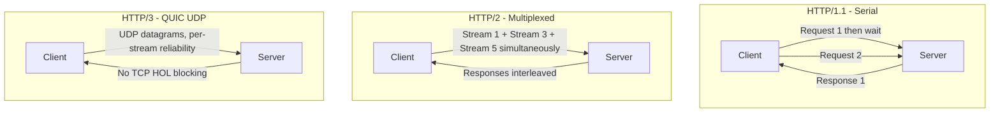
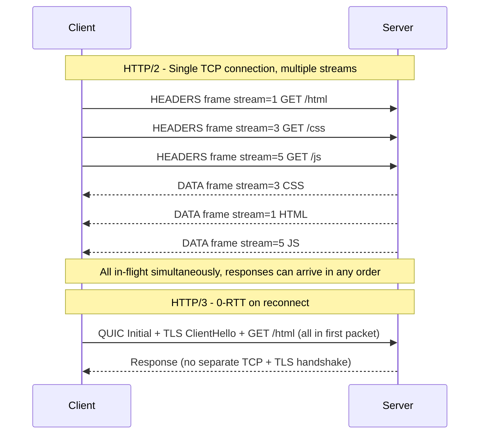

# HTTP/2, HTTP/3, and QUIC

## Problem Statement

Understand how HTTP has evolved to solve head-of-line blocking, connection overhead, and latency for modern web applications.

## Architecture Diagram



## Flow Diagram



## Design

### HTTP/1.1 Limitations

```
Head-of-line blocking   - Request 2 waits for Request 1 to complete
Connection limit        - Browsers open 6 connections per origin as workaround
Header repetition       - Same headers sent on every request (Cookie, User-Agent)
Text protocol           - Verbose, parsing overhead
```

### HTTP/2 Improvements

```
Binary framing         - Efficient parsing, no text ambiguity
Multiplexing           - Multiple streams on one TCP connection
HPACK compression      - Huffman + reference table, 80% smaller headers
Stream prioritization  - Weight-based ordering for critical resources
Server push            - Send resources before client asks (deprecated in practice)
```

### HTTP/3 / QUIC

```
Transport: UDP (not TCP)
Per-stream reliability: Loss in stream A doesn't block stream B
0-RTT resumption:       Send data in first packet on known servers
Connection IDs:         Survives IP change (mobile WiFi -> 4G handoff)
Built-in TLS 1.3:       No separate TLS handshake layer
```

### Protocol Comparison

| Feature | HTTP/1.1 | HTTP/2 | HTTP/3 |
|---|---|---|---|
| Transport | TCP | TCP | UDP (QUIC) |
| HOL blocking | App + TCP level | TCP level | None |
| Connections per origin | 6 (browsers) | 1 | 1 |
| Header compression | None | HPACK | QPACK |
| First-byte latency | 2 RTT | 2 RTT | 0 RTT (resume) |
| Mobile network changes | Breaks TCP | Breaks TCP | Survives |

## Common Questions & Answers

**Q: Why did HTTP/2 server push get deprecated?** A: Servers couldn't know what client already caches. Chrome removed support in 2022. Better alternatives: `103 Early Hints`, `<link rel=preload>` headers.

**Q: What is TCP head-of-line blocking in HTTP/2?** A: HTTP/2 has multiple streams per TCP connection. If one TCP packet is lost, all streams wait for retransmission. QUIC fixes this — each stream is independently reliable.

**Q: What is 0-RTT and the replay attack risk?** A: Client sends request in first QUIC packet without waiting for handshake. Risk: attacker replays the 0-RTT data. Mitigation: only use for idempotent GET requests, server-side anti-replay tokens.

**Q: What is connection migration in QUIC?** A: QUIC identifies connections by connection ID, not IP:port tuple. When user switches WiFi to cellular, QUIC continues seamlessly. TCP would reset.

**Q: HPACK vs QPACK?** A: HPACK (HTTP/2): head-of-line blocking in header compression — decoder must process in order. QPACK (HTTP/3): allows out-of-order processing, designed for QUIC streams.

## Back-of-Envelope Calculations

```
HTTP/1.1 header overhead:
  Average headers: ~800 bytes per request
  100K req/sec: 80 MB/s just on headers

HTTP/2 HPACK savings:
  First request: ~800 bytes (no compression benefit)
  Subsequent: ~50-100 bytes (reference table)
  Savings: 85-90% on header traffic
  At 100K req/sec: saves 70+ MB/s

Connection setup overhead:
  HTTP/1.1 new connection: TCP(1 RTT) + TLS(1 RTT) = 2 RTT = 100ms at 50ms RTT
  HTTP/2: same 2 RTT but one connection handles all requests
  HTTP/3 0-RTT: 0 RTT extra = 100ms saved per reconnect

HTTP/3 improvement on lossy networks:
  1% packet loss with HTTP/2: all streams stall
  1% packet loss with HTTP/3: only affected stream stalls
  Real-world: 3-15% faster page loads (Google data)

QUIC overhead vs TCP:
  UDP + QUIC headers: ~8 + 20 bytes = 28 bytes
  TCP + IP headers: 20 + 20 bytes = 40 bytes
  QUIC is actually more compact on the wire
```

## Design Choices

| Scenario | Protocol |
|---|---|
| Public web with many resources | HTTP/2 or HTTP/3 |
| High packet loss (mobile, satellite) | HTTP/3 |
| Simple single API call | HTTP/1.1 or HTTP/2 |
| Internal microservices | gRPC over HTTP/2 |
| Real-time streaming | HTTP/2 or WebSocket |
| Legacy clients (IE, old Android) | HTTP/1.1 fallback |

## Follow-up Questions

1. How does QPACK handle out-of-order stream processing?
2. How do CDNs support HTTP/3 while origin only speaks HTTP/2?
3. What is the impact of packet reordering on QUIC vs TCP?
4. How does HTTP/2 prioritization help page loading?
5. Design a content negotiation system that picks HTTP version per client.

## Python Implementation

```python
import asyncio
from typing import List, Dict, Optional

class HTTP2Stream:
    def __init__(self, stream_id: int, method: str, path: str):
        self.stream_id = stream_id
        self.method = method
        self.path = path
        self.state = "open"
        self.response: Optional[dict] = None

class HTTP2Connection:
    def __init__(self):
        self._streams: Dict[int, HTTP2Stream] = {}
        self._next_id = 1  # Client uses odd stream IDs
        self._hpack_table: Dict[str, str] = {}  # Simplified header compression

    def open_stream(self, method: str, path: str) -> HTTP2Stream:
        stream = HTTP2Stream(self._next_id, method, path)
        self._streams[self._next_id] = stream
        self._next_id += 2
        return stream

    async def send_request(self, method: str, path: str) -> dict:
        stream = self.open_stream(method, path)
        await asyncio.sleep(0.01)  # Simulated RTT
        return {"stream_id": stream.stream_id, "status": 200, "path": path}

    async def multiplex(self, requests: List[tuple]) -> List[dict]:
        tasks = [self.send_request(m, p) for m, p in requests]
        return await asyncio.gather(*tasks)

class HPackCompressor:
    STATIC_TABLE = {
        ":method:GET": 2,
        ":method:POST": 3,
        ":path:/": 4,
        ":scheme:https": 7,
        ":status:200": 8,
        ":status:404": 13,
    }

    def __init__(self):
        self._dynamic: list = []

    def encode_headers(self, headers: Dict[str, str]) -> bytes:
        out = bytearray()
        for name, value in headers.items():
            key = f"{name}:{value}"
            if key in self.STATIC_TABLE:
                # Indexed representation: 1 byte
                out.append(0x80 | self.STATIC_TABLE[key])
            else:
                # Literal representation with indexing
                encoded = f"{name}: {value}".encode()
                out.extend([0x40, len(encoded)] + list(encoded))
                self._dynamic.append((name, value))
        return bytes(out)

async def demo():
    conn = HTTP2Connection()
    # HTTP/2: all 3 requests in-flight simultaneously
    results = await conn.multiplex([
        ("GET", "/index.html"),
        ("GET", "/style.css"),
        ("GET", "/app.js"),
    ])
    for r in results:
        print(f"Stream {r['stream_id']}: {r['path']} -> {r['status']}")

    # HPACK compression demo
    hpack = HPackCompressor()
    headers = {":method": "GET", ":path": "/api/users", ":scheme": "https"}
    compressed = hpack.encode_headers(headers)
    original_size = sum(len(f"{k}: {v}") for k, v in headers.items())
    print(f"\nHeaders: {original_size}B -> Compressed: {len(compressed)}B ({len(compressed)/original_size*100:.0f}%)")

asyncio.run(demo())
```

## Java Implementation

```java
import java.util.*;
import java.util.concurrent.*;

public class HTTP2Simulation {
    record Stream(int id, String path, CompletableFuture<Map<String, Object>> response) {}

    static class Connection {
        private int nextId = 1;
        private Map<Integer, Stream> streams = new ConcurrentHashMap<>();

        Stream openStream(String path) {
            var future = CompletableFuture.supplyAsync(() -> {
                try { Thread.sleep(10); } catch (InterruptedException e) {}
                return Map.<String, Object>of("status", 200, "path", path);
            });
            Stream s = new Stream(nextId, path, future);
            streams.put(nextId, s);
            nextId += 2;
            return s;
        }
    }

    public static void main(String[] args) throws Exception {
        Connection conn = new Connection();
        // Multiplex 3 streams simultaneously
        var s1 = conn.openStream("/html");
        var s2 = conn.openStream("/css");
        var s3 = conn.openStream("/js");

        CompletableFuture.allOf(s1.response(), s2.response(), s3.response()).join();
        System.out.println("Stream " + s1.id() + ": " + s1.response().get());
        System.out.println("Stream " + s2.id() + ": " + s2.response().get());
        System.out.println("Stream " + s3.id() + ": " + s3.response().get());
    }
}
```

## Complexity

| Metric | HTTP/1.1 | HTTP/2 | HTTP/3 |
|---|---|---|---|
| RTT to first byte (new) | 2 | 2 | 1 |
| RTT to first byte (resume) | 1 (keepalive) | 1 | 0 |
| Concurrent streams | 6 connections | Unlimited | Unlimited |
| Header size | 200-800B | 20-100B | 20-100B |
| HOL blocking | App level | TCP level | None |
