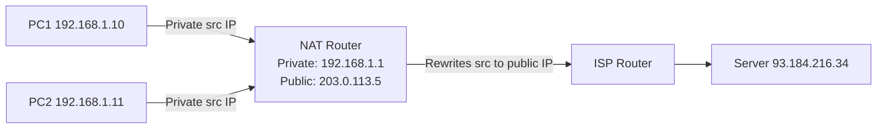
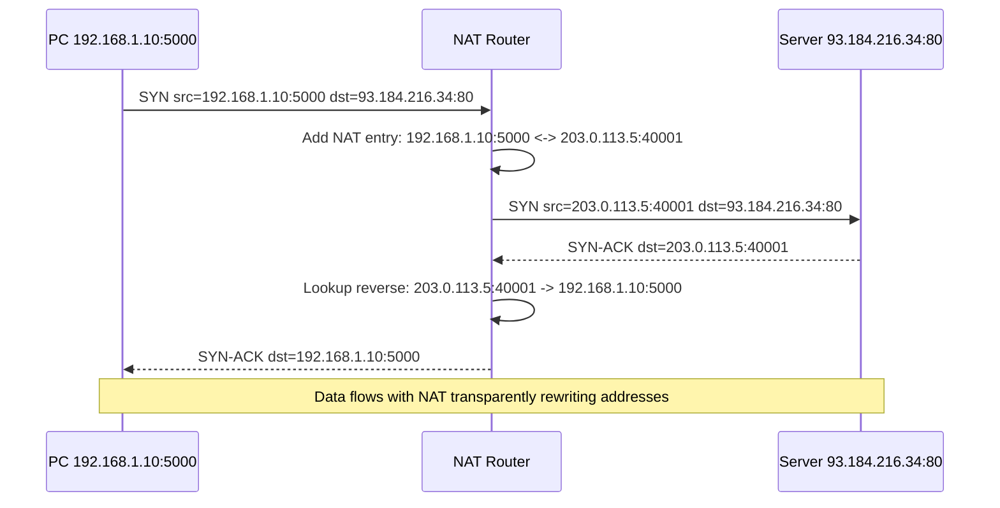

# NAT and IP Routing

## Problem Statement

Understand how NAT (Network Address Translation) enables private IP networks to reach the internet, and how IP routing directs packets across networks.

## Architecture Diagram



## Flow Diagram



## Design

### NAT Translation Table

```
Private IP:Port          Public IP:Port          Protocol  TTL
192.168.1.10:5000   ->  203.0.113.5:40001       TCP       300s
192.168.1.11:6000   ->  203.0.113.5:40002       TCP       300s
192.168.1.10:5001   ->  203.0.113.5:40003       UDP       30s
```

### IP Routing - Longest Prefix Match

```
Routing table entries (sorted by prefix length):
  0.0.0.0/0      -> gateway (default, lowest priority)
  10.0.0.0/8     -> eth1
  10.0.1.0/24    -> eth2   (more specific, wins for 10.0.1.x)
  192.168.0.0/16 -> eth3

Lookup for 10.0.1.5:
  Check /24: 10.0.1.0/24 matches -> route via eth2 (WINNER)
  (Does not use /8 even though it also matches)
```

### Private IP Ranges (RFC 1918)

```
10.0.0.0/8      -> 16.7M addresses (large orgs)
172.16.0.0/12   -> 1M addresses   (medium orgs)
192.168.0.0/16  -> 65K addresses  (home/small office)
127.0.0.0/8     -> Loopback (localhost)
169.254.0.0/16  -> Link-local (APIPA, no DHCP)
```

## Common Questions & Answers

**Q: What is CGNAT?** A: Carrier-Grade NAT - ISPs NAT multiple customers behind shared public IPs. 100+ customers share one IP. Breaks peer-to-peer, complicates abuse logging (need port logs too).

**Q: How does NAT break peer-to-peer?** A: Inbound connections can't reach NAT'd device - no port mapping exists. Solution: STUN (discover public IP:port), TURN (relay server), ICE (tries both).

**Q: What is a /24 subnet?** A: 255.255.255.0 mask = 24 bits network + 8 bits host = 256 IPs (254 usable). A /16 = 65,536 IPs. A /32 = single IP.

**Q: IPv4 exhaustion - where are we?** A: IPv4 (4.3B addresses) exhausted by IANA in 2011. Regions rely on NAT and IPv6. IPv6 has 340 undecillion addresses - no NAT needed.

**Q: What is CIDR?** A: Classless Inter-Domain Routing - replaces class A/B/C. Variable-length prefix (10.0.0.0/22 = 1024 IPs). Enables route aggregation (summarization).

## Back-of-Envelope Calculations

```
IPv4 exhaustion math:
  Total: 2^32 = 4.29B addresses
  Reserved: ~592M (private, loopback, multicast, reserved)
  Usable public: ~3.7B
  Active internet devices: 15B+ -> NAT essential

NAT port capacity:
  Ports per public IP: 65,535 (minus reserved 0-1023 = 64,512)
  Average TCP connection duration: 60s
  Connections/sec per IP: 64,512/60 = 1,075/sec
  CGNAT with 100 users/IP: 10 connections/sec/user

Subnet planning example:
  New office: 200 employees + IoT + servers
  Needed: ~400 IPs (2x buffer)
  Use /23 = 512 IPs (255.255.254.0 mask)

BGP routing table:
  2024 full table: ~950K routes
  Memory per route: ~200 bytes
  Total per router: 950K x 200B = 190MB (manageable)
```

## Design Choices

| Approach | Pros | Cons |
|---|---|---|
| NAT44 (IPv4-IPv4) | Extends IPv4, security boundary | Breaks P2P, complex logging |
| IPv6 native | Unlimited addresses, no NAT | Legacy IPv4 compatibility |
| Dual stack (IPv4+IPv6) | Full compatibility | Operational complexity |
| CGNAT | Extends IPv4 life | Port exhaustion, no inbound |

## Follow-up Questions

1. How does NAT-PMP/UPnP allow devices to request port mappings?
2. How does BGP prevent routing loops (AS path attribute)?
3. What is ECMP (Equal-Cost Multi-Path) routing and when is it used?
4. How does SDN separate control plane from data plane?
5. Explain what happens to a packet crossing 10 router hops (traceroute).

## Python Implementation

```python
from dataclasses import dataclass
from typing import Dict, Optional, Tuple
import hashlib

@dataclass
class NATEntry:
    private_ip: str
    private_port: int
    public_ip: str
    public_port: int

class NATRouter:
    def __init__(self, public_ip: str):
        self.public_ip = public_ip
        self._table: Dict[Tuple[str, int], NATEntry] = {}
        self._reverse: Dict[Tuple[str, int], NATEntry] = {}
        self._next_port = 40000

    def outbound(self, src_ip: str, src_port: int) -> Tuple[str, int]:
        key = (src_ip, src_port)
        if key not in self._table:
            pub_port = self._next_port
            self._next_port += 1
            entry = NATEntry(src_ip, src_port, self.public_ip, pub_port)
            self._table[key] = entry
            self._reverse[(self.public_ip, pub_port)] = entry
            print(f"[NAT] New mapping: {src_ip}:{src_port} -> {self.public_ip}:{pub_port}")
        e = self._table[key]
        return e.public_ip, e.public_port

    def inbound(self, dst_ip: str, dst_port: int) -> Optional[Tuple[str, int]]:
        entry = self._reverse.get((dst_ip, dst_port))
        return (entry.private_ip, entry.private_port) if entry else None

class IPRouter:
    def __init__(self):
        self._routes: list = []  # (network_int, mask_int, prefix_len, next_hop)

    def add_route(self, network: str, prefix_len: int, next_hop: str):
        net_int = self._to_int(network)
        mask = (0xFFFFFFFF << (32 - prefix_len)) & 0xFFFFFFFF
        self._routes.append((net_int, mask, prefix_len, next_hop))
        self._routes.sort(key=lambda r: -r[2])  # Longest prefix first

    def lookup(self, dst: str) -> Optional[str]:
        dst_int = self._to_int(dst)
        for net, mask, prefix, hop in self._routes:
            if dst_int & mask == net & mask:
                return hop
        return None

    def _to_int(self, ip: str) -> int:
        parts = ip.split(".")
        return sum(int(p) << (24 - 8*i) for i, p in enumerate(parts))

# Usage
nat = NATRouter("203.0.113.5")
pub_ip, pub_port = nat.outbound("192.168.1.10", 5000)
print(f"Outbound: {pub_ip}:{pub_port}")
priv = nat.inbound(pub_ip, pub_port)
print(f"Inbound reverse: {priv[0]}:{priv[1]}")

router = IPRouter()
router.add_route("0.0.0.0", 0, "default-gateway")
router.add_route("10.0.0.0", 8, "eth1")
router.add_route("10.0.1.0", 24, "eth2")  # More specific

print(router.lookup("10.0.1.5"))   # eth2 (longest prefix match)
print(router.lookup("10.0.2.5"))   # eth1
print(router.lookup("8.8.8.8"))    # default-gateway
```

## Java Implementation

```java
import java.util.*;

public class IPRouter {
    record Route(long net, long mask, int prefix, String hop) {}

    private List<Route> routes = new ArrayList<>();

    public void addRoute(String network, int prefix, String nextHop) {
        long mask = prefix == 0 ? 0 : (-1L << (32 - prefix)) & 0xFFFFFFFFL;
        routes.add(new Route(ipToLong(network), mask, prefix, nextHop));
        routes.sort((a, b) -> b.prefix() - a.prefix());
    }

    public Optional<String> lookup(String dst) {
        long d = ipToLong(dst);
        return routes.stream()
            .filter(r -> (d & r.mask()) == (r.net() & r.mask()))
            .map(Route::hop)
            .findFirst();
    }

    private long ipToLong(String ip) {
        String[] p = ip.split("\\.");
        return (Long.parseLong(p[0]) << 24) | (Long.parseLong(p[1]) << 16)
             | (Long.parseLong(p[2]) << 8)  |  Long.parseLong(p[3]);
    }

    public static void main(String[] args) {
        IPRouter r = new IPRouter();
        r.addRoute("0.0.0.0", 0, "gateway");
        r.addRoute("10.0.0.0", 8, "eth1");
        r.addRoute("10.0.1.0", 24, "eth2");
        System.out.println(r.lookup("10.0.1.5"));  // eth2
        System.out.println(r.lookup("10.0.2.5"));  // eth1
        System.out.println(r.lookup("8.8.8.8"));   // gateway
    }
}
```

## Complexity

| Operation | Time |
|---|---|
| NAT lookup | O(1) hash map |
| NAT reverse lookup | O(1) hash map |
| LPM route lookup | O(routes) linear scan |
| Hardware TCAM lookup | O(1) |
