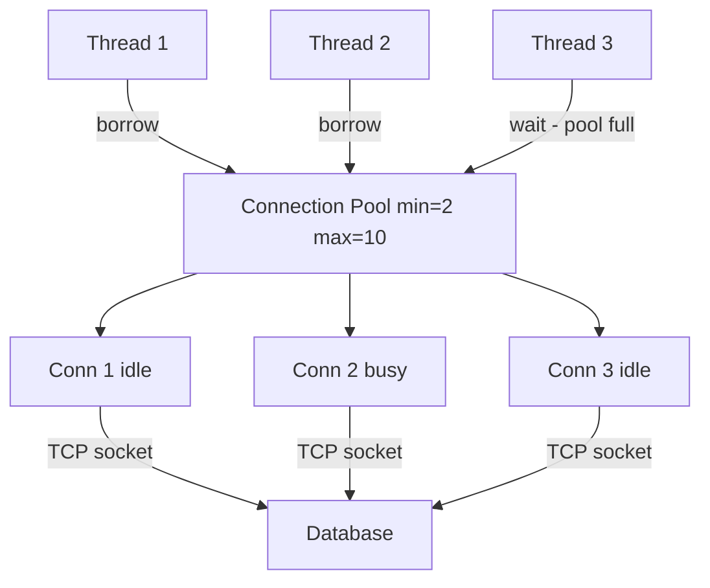
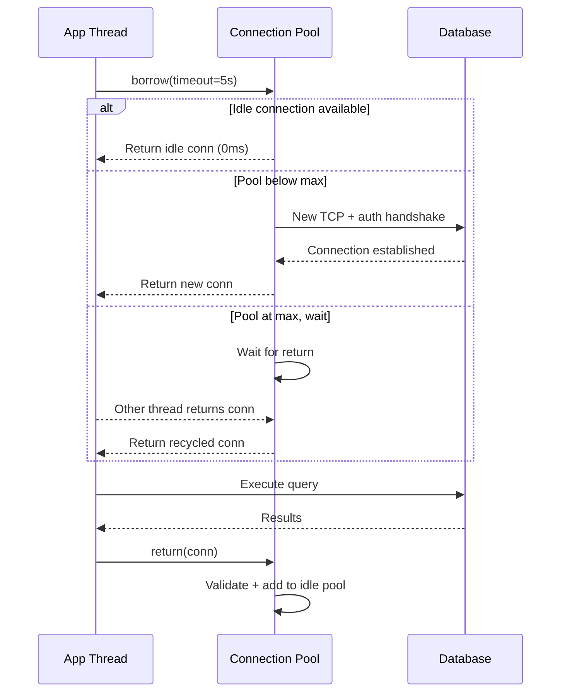

# Connection Pooling

## Problem Statement

Design a connection pool to reuse expensive database/HTTP connections, reducing per-request setup overhead.

## Architecture Diagram



## Flow Diagram



## Design

### Pool Configuration

```
min_size          - Pre-warm N connections at startup
max_size          - Hard cap (prevents DB overload)
idle_timeout      - Close idle connections after N seconds
max_lifetime      - Replace connection after N seconds (avoid stale state)
checkout_timeout  - Raise error if can't borrow in N seconds
validation_query  - "SELECT 1" to verify connection health

Sizing rule of thumb:
  max_pool = (threads * avg_query_ms) / 1000
  Example: 100 threads, 10ms avg query -> max = 1 (perfect pool)
  Add buffer: max = 10-20 per service instance
```

### Health Check Modes

```
Passive:   Try to use; discard and reconnect on error
Active:    Ping before returning to caller (adds latency)
Periodic:  Background thread pings idle connections every 30s
Test-on-borrow: SELECT 1 before each checkout (safest, +1ms)
```

## Common Questions & Answers

**Q: What happens when pool hits max_size?** A: Threads queue up waiting. After checkout_timeout, throw TimeoutException. This is backpressure - prevents thundering herd on DB.

**Q: What is connection leaking?** A: Thread borrows connection but never returns (exception path skips return). Always use try-with-resources or context manager. Use timeout-based leak detection.

**Q: Pool max_size vs DB max_connections?** A: Sum of (instances x pool_max) must be less than DB's max_connections. Leave headroom for DBA tools, replication, migrations.

**Q: pgBouncer vs application pool?** A: pgBouncer transaction mode: connection returned to pool after each transaction (very efficient, ~1000 app connections -> 20 DB connections). App pool: connection held per thread for session.

**Q: What is the HikariCP "pool locking" trick?** A: Uses lock-free CopyOnWriteArrayList, borrow without lock on happy path. Dramatically reduces contention vs synchronized pools.

## Back-of-Envelope Calculations

```
Without connection pooling:
  Each request: TCP connect (1 RTT) + DB auth (1 RTT) = 100ms at 50ms RTT
  1000 req/sec: 1000 new connections/sec -> DB overwhelmed

With pooling (pool=20, 10ms queries):
  20 connections x 100 queries/conn/sec = 2000 queries/sec
  Checkout time: ~0.01ms
  20x throughput improvement

PostgreSQL limits:
  Default max_connections: 100
  Idle connection RAM: 5MB each
  100 connections: 500MB overhead
  pgBouncer transaction mode: 10000 app connections -> 20 DB connections = 20x reduction

Connection creation cost:
  TCP handshake: 1 RTT = 50ms (cross-DC)
  DB auth (MD5): 1 RTT = 50ms
  Total: ~100ms per new connection
  Pool eliminates this 99%+ of the time
```

## Design Choices

| Approach | Pros | Cons |
|---|---|---|
| Fixed-size pool | Predictable resource use | Under/over-provisioned |
| Dynamic pool | Adapts to load | Complexity, thundering herd |
| pgBouncer (proxy) | Transparent, huge multiplexing | No prepared statements across tx |
| HikariCP (Java) | Best performance | JVM only |
| Connection validation | Eliminates stale errors | Adds latency per borrow |

## Follow-up Questions

1. How do you detect and alert on connection pool exhaustion?
2. How does HikariCP achieve lock-free connection borrowing?
3. Design a pool that prioritizes VIP requests.
4. What happens to pooled connections when the DB server restarts?
5. How does read/write splitting work with connection pools?

## Python Implementation

```python
import threading
import queue
import time
from contextlib import contextmanager
from typing import Optional

class MockDBConn:
    _counter = 0

    def __init__(self):
        MockDBConn._counter += 1
        self.id = MockDBConn._counter
        self.created_at = time.time()
        self._alive = True

    def execute(self, sql: str) -> list:
        if not self._alive:
            raise ConnectionError("Dead connection")
        return [{"row": f"result from conn {self.id}"}]

    def ping(self) -> bool:
        return self._alive

    def close(self):
        self._alive = False

class ConnectionPool:
    def __init__(self, min_size: int = 2, max_size: int = 10,
                 checkout_timeout: float = 5.0, max_lifetime: float = 3600.0):
        self._min = min_size
        self._max = max_size
        self._timeout = checkout_timeout
        self._max_lifetime = max_lifetime
        self._idle: queue.Queue = queue.Queue()
        self._lock = threading.Lock()
        self._total = 0

        for _ in range(min_size):
            conn = MockDBConn()
            self._idle.put(conn)
            self._total += 1

    def _valid(self, c: MockDBConn) -> bool:
        return c.ping() and (time.time() - c.created_at) < self._max_lifetime

    def _create(self) -> MockDBConn:
        conn = MockDBConn()
        with self._lock:
            self._total += 1
        return conn

    def borrow(self) -> MockDBConn:
        # Try idle pool first (non-blocking)
        try:
            c = self._idle.get_nowait()
            if self._valid(c):
                return c
            c.close()
            with self._lock:
                self._total -= 1
        except queue.Empty:
            pass

        # Create new if below max
        with self._lock:
            if self._total < self._max:
                return self._create()

        # Wait for one to be returned
        try:
            c = self._idle.get(timeout=self._timeout)
            return c if self._valid(c) else self.borrow()
        except queue.Empty:
            raise TimeoutError(f"No connection available after {self._timeout}s")

    def release(self, c: MockDBConn):
        if self._valid(c):
            self._idle.put(c)
        else:
            c.close()
            with self._lock:
                self._total -= 1

    @contextmanager
    def connection(self):
        c = self.borrow()
        try:
            yield c
        finally:
            self.release(c)

    def stats(self) -> dict:
        return {"total": self._total, "idle": self._idle.qsize()}

# Usage
pool = ConnectionPool(min_size=2, max_size=5)

def worker(tid: int):
    with pool.connection() as c:
        result = c.execute("SELECT * FROM users")
        print(f"Thread {tid}: conn={c.id}, rows={len(result)}")

threads = [threading.Thread(target=worker, args=(i,)) for i in range(8)]
for t in threads: t.start()
for t in threads: t.join()
print("Pool stats:", pool.stats())
```

## Java Implementation

```java
import java.util.concurrent.*;

public class ConnectionPool {
    static class Conn {
        static int cnt = 0;
        final int id = ++cnt;
        final long createdAt = System.currentTimeMillis();
        boolean alive = true;

        boolean isValid() { return alive && (System.currentTimeMillis() - createdAt) < 3_600_000L; }
        void close() { alive = false; }
        String execute(String sql) { return "Result from conn " + id; }
    }

    private final BlockingQueue<Conn> idle;
    private final int maxSize;
    private int total = 0;
    private final Object lock = new Object();

    public ConnectionPool(int min, int max) {
        this.maxSize = max;
        this.idle = new LinkedBlockingQueue<>();
        for (int i = 0; i < min; i++) { idle.offer(new Conn()); total++; }
    }

    public Conn borrow(long timeoutMs) throws Exception {
        Conn c = idle.poll();
        if (c != null && c.isValid()) return c;

        synchronized (lock) {
            if (total < maxSize) { total++; return new Conn(); }
        }
        c = idle.poll(timeoutMs, TimeUnit.MILLISECONDS);
        if (c == null) throw new TimeoutException("Pool exhausted");
        return c.isValid() ? c : borrow(timeoutMs);
    }

    public void release(Conn c) {
        if (c.isValid()) idle.offer(c);
        else synchronized (lock) { c.close(); total--; }
    }
}
```

## Complexity

| Operation | Time |
|---|---|
| Borrow (idle available) | O(1) |
| Borrow (create new) | O(connect_time) |
| Return | O(1) |
| Health check | O(1) |
| Pool exhausted wait | O(checkout_timeout) |
