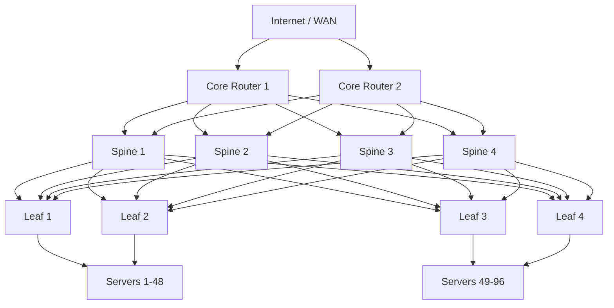
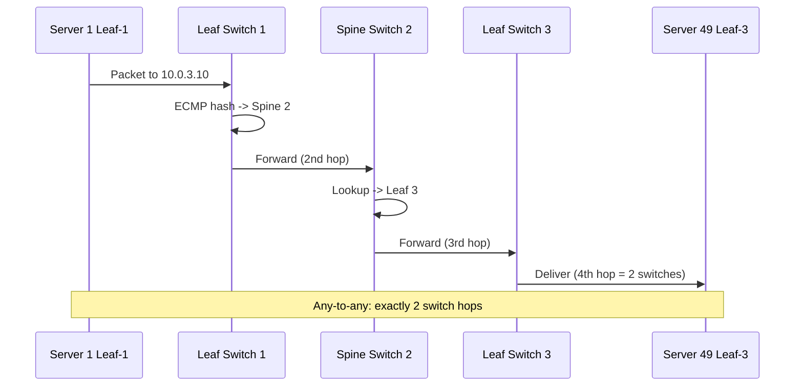

# Data Center Network Topology

## Problem Statement

Design the physical and logical network topology for a large data center supporting thousands of servers with high bisectional bandwidth, low latency, and resilience.

## Architecture Diagram



## Flow Diagram



## Design

### Spine-Leaf Architecture

```
Why Spine-Leaf over traditional 3-tier:
  3-tier (Core-Aggregation-Access): STP, unequal paths, oversubscription
  Spine-Leaf: ECMP, equal latency, full bisectional bandwidth

Properties:
  Any two servers: exactly 2 switch hops
  ECMP: every leaf has equal-cost paths to all spines
  No STP: routed fabric (L3 all the way to the server)
  Bandwidth: N spines * link_speed per server
  Redundancy: any N-1 spines can fail (degraded, not down)
```

### Oversubscription Ratios

```
Leaf switch:
  Downlinks: 48 x 25Gbps = 1.2Tbps to servers
  Uplinks:    8 x 100Gbps = 800Gbps to spines
  Oversubscription: 1200/800 = 1.5:1

For databases/storage (I/O intensive): target 1:1
For compute (batch jobs): 4:1 acceptable
For ML training: 1:1 required (all-reduce needs full bandwidth)
```

### East-West vs North-South Traffic

```
North-South: External clients <-> servers (CDN, load balancer, NAT)
East-West:   Server <-> server within DC (microservices, replication)

Modern DC: 80%+ East-West (why Spine-Leaf matters)
Traditional DC: 70%+ North-South (why 3-tier was fine before)
```

## Common Questions & Answers

**Q: What is bisectional bandwidth?** A: Bandwidth available when you split the network in half (N/2 left, N/2 right). Full bisection = no bottleneck anywhere. Oversubscription = less than full.

**Q: How does ECMP work?** A: Equal-Cost Multi-Path - multiple routes with same metric. Hash (src_ip, dst_ip, src_port, dst_port) to pick one path per flow. Provides bandwidth AND redundancy.

**Q: Why not mesh topology?** A: Mesh is O(n^2) links. 100 servers = 9900 links. Spine-leaf: much fewer links with same connectivity guarantees.

**Q: What is MLAG?** A: Multi-Chassis Link Aggregation - server bonds to two leaf switches (active-active). Single leaf failure doesn't impact server. Requires MLAG control plane between leaves.

**Q: Facebook Fabric vs AWS VPC networking?** A: Facebook: custom ASIC switches (Wedge), SONiC OS, open-source. AWS: custom Nitro silicon, VPC overlay with VXLAN/Geneve for tenant isolation.

## Back-of-Envelope Calculations

```
Data center with 1000 servers:
  Server NIC: 25Gbps each
  Total server bandwidth: 1000 x 25Gbps = 25Tbps

Spine-Leaf design:
  20 leaf switches x 48 servers = 960 servers
  8 spines, each with 20x100Gbps ports
  Spine capacity: 8 x 20 x 100Gbps = 16Tbps (some oversubscription)

Cross-rack latency:
  Within rack (same leaf): ~100us
  Cross-rack same pod (2 hops): ~300us
  Cross-pod (spine hop): ~500us
  Target: <1ms for most East-West traffic

Power:
  Average server: 300-500W
  1000 servers: 300-500kW just for compute
  Cooling: 1.0-1.5x PUE (Power Usage Effectiveness)
  Total facility power: 450-750kW

Cable count:
  20 leaves x 8 uplinks = 160 leaf-to-spine cables
  vs 3-tier: similar but with STP complexity
```

## Design Choices

| Topology | Pros | Cons |
|---|---|---|
| Spine-Leaf (2-tier) | Equal latency, ECMP, scalable | More inter-switch cabling |
| 3-tier (Core-Agg-Access) | Familiar, hierarchical | STP loops, oversubscription |
| Fat-Tree | Non-blocking, full bisection | Complex routing |
| Mesh | Maximum redundancy | O(n^2) cabling |

## Follow-up Questions

1. How does VXLAN provide network virtualization for multi-tenant DCs?
2. What is BGP EVPN and why is it replacing traditional L2 fabrics?
3. How does SR-IOV reduce network overhead for VMs?
4. Design the network for a GPU cluster doing distributed training.
5. How do hyperscalers (Google, Facebook) build 100Tbps+ data center fabrics?

## Python Implementation

```python
from dataclasses import dataclass, field
from typing import List, Dict, Set, Tuple
from itertools import product

@dataclass
class Switch:
    name: str
    layer: str
    uplinks: List[str] = field(default_factory=list)
    downlinks: List[str] = field(default_factory=list)

@dataclass
class Server:
    name: str
    ip: str
    leaf: str

class SpineLeafFabric:
    def __init__(self, num_spines: int, num_leaves: int, servers_per_leaf: int):
        self.spines = [Switch(f"spine-{i}", "spine") for i in range(num_spines)]
        self.leaves = [Switch(f"leaf-{i}", "leaf") for i in range(num_leaves)]
        self.servers: List[Server] = []
        self._links: List[Tuple[str, str]] = []
        self._build(servers_per_leaf)

    def _build(self, spl: int):
        # Full mesh: every leaf connects to every spine
        for leaf, spine in product(self.leaves, self.spines):
            self._links.append((leaf.name, spine.name))
            leaf.uplinks.append(spine.name)
            spine.downlinks.append(leaf.name)

        # Attach servers to leaves
        server_id = 0
        for leaf in self.leaves:
            for _ in range(spl):
                s = Server(
                    name=f"server-{server_id}",
                    ip=f"10.{server_id//256}.{server_id%256}.1",
                    leaf=leaf.name
                )
                self.servers.append(s)
                leaf.downlinks.append(s.name)
                server_id += 1

    def hops(self, src_leaf: str, dst_leaf: str) -> int:
        return 0 if src_leaf == dst_leaf else 2

    def ecmp_paths(self) -> int:
        return len(self.spines)

    def bisectional_bandwidth_gbps(self, uplink_gbps: float = 100) -> float:
        # Each leaf's total uplink / 2 (half the fabric)
        total_uplink = len(self.leaves) * len(self.spines) * uplink_gbps
        return total_uplink / 2

    def summary(self) -> dict:
        return {
            "spines": len(self.spines),
            "leaves": len(self.leaves),
            "servers": len(self.servers),
            "total_links": len(self._links),
            "max_hops_any_to_any": 2,
            "ecmp_paths": self.ecmp_paths(),
            "bisectional_bw_tbps": self.bisectional_bandwidth_gbps() / 1000,
        }

# Usage
fabric = SpineLeafFabric(num_spines=4, num_leaves=8, servers_per_leaf=48)
s = fabric.summary()
for k, v in s.items():
    print(f"  {k}: {v}")

# ECMP path selection simulation
import hashlib
def ecmp_pick(src_ip: str, dst_ip: str, num_spines: int) -> int:
    h = int(hashlib.md5(f"{src_ip}-{dst_ip}".encode()).hexdigest(), 16)
    return h % num_spines

spine = ecmp_pick("10.0.1.5", "10.0.3.10", 4)
print(f"\nECMP: server at 10.0.1.5 -> spine-{spine} -> server at 10.0.3.10")
```

## Java Implementation

```java
import java.util.*;
import java.util.stream.*;

public class SpineLeafFabric {
    record Switch(String name, String layer, List<String> uplinks, List<String> downlinks) {}
    record Server(String name, String ip, String leaf) {}

    private List<Switch> spines, leaves;
    private List<Server> servers = new ArrayList<>();

    public SpineLeafFabric(int numSpines, int numLeaves, int spl) {
        spines = IntStream.range(0, numSpines)
            .mapToObj(i -> new Switch("spine-" + i, "spine", new ArrayList<>(), new ArrayList<>()))
            .collect(Collectors.toList());
        leaves = IntStream.range(0, numLeaves)
            .mapToObj(i -> new Switch("leaf-" + i, "leaf", new ArrayList<>(), new ArrayList<>()))
            .collect(Collectors.toList());

        // Full mesh
        for (Switch leaf : leaves)
            for (Switch spine : spines) {
                leaf.uplinks().add(spine.name());
                spine.downlinks().add(leaf.name());
            }

        // Attach servers
        int id = 0;
        for (Switch leaf : leaves)
            for (int i = 0; i < spl; i++)
                servers.add(new Server("srv-" + id++, "10.0." + id/256 + "." + id%256, leaf.name()));
    }

    public int ecmpPaths() { return spines.size(); }
    public int hops(String srcLeaf, String dstLeaf) { return srcLeaf.equals(dstLeaf) ? 0 : 2; }
    public int totalServers() { return servers.size(); }
}
```

## Complexity

| Metric | Spine-Leaf |
|---|---|
| Max hops (any-to-any) | 2 |
| ECMP paths | = num_spines |
| Total inter-switch links | leaves x spines |
| Failure tolerance | N-1 spines, dual-homed leaves |
