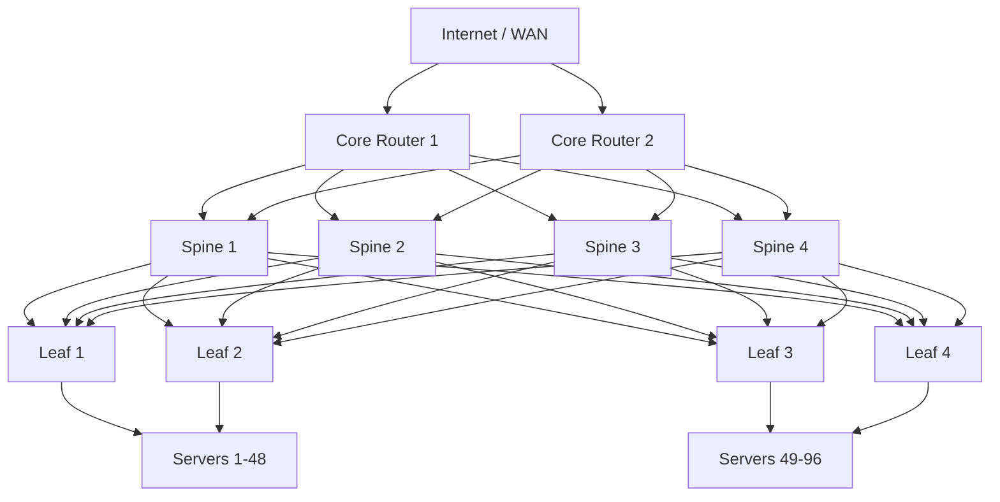
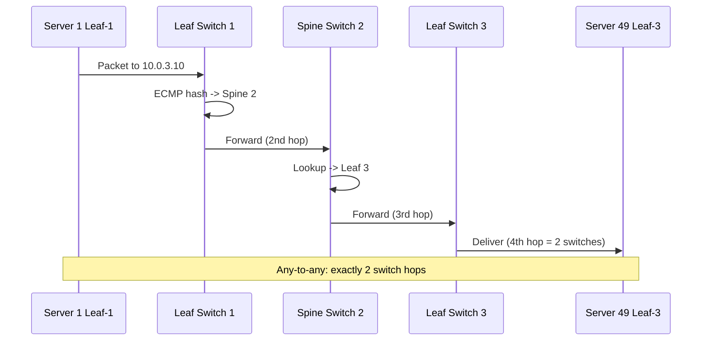

# Data Center Network Topology

## Problem Statement

Design the physical and logical network topology for a large data center supporting thousands of servers with high bisectional bandwidth, low latency, and resilience.

## Scenario

Data Center Network Topology is a critical component in modern distributed systems. In real-world applications, handling complex business logic at scale with high reliability. For example, major tech companies like Netflix, Uber, and Airbnb rely on similar solutions to handle millions of concurrent users and requests. The challenge is achieving this while maintaining sub-100ms latency, 99.99% availability, and gracefully handling 10x traffic spikes during peak demand. This component provides the foundational capability to solve these challenges reliably and efficiently at global scale.

## Users

- **Backend Engineers**: Responsible for implementing and maintaining this system component in production environments. They need to understand the architecture, trade-offs, failure modes, and operational considerations.
- **DevOps/SRE Teams**: Monitor system health, manage scaling policies, handle incidents, and ensure reliability SLAs are met. They need insights into performance characteristics, bottlenecks, and failure recovery mechanisms.
- **Data Engineers**: Design data pipelines and analytics around this system, requiring deep understanding of data flow, consistency guarantees, and throughput characteristics.
- **System Architects**: Make high-level architectural decisions that impact company infrastructure, requiring comprehensive understanding of capabilities, limitations, and scalability boundaries.
- **Security Teams**: Understand security implications, potential vulnerabilities, and compliance requirements for this component.

## PRD

### Functional Requirements
- Core operations work correctly
- Explicit error handling
- Consistency guarantees defined
- Monitoring and observability

### Non-Functional Requirements
- Performance targets met
- Availability SLA achieved
- Scalability headroom
- Cost efficient

### Success Metrics
- Benchmarks met
- Uptime targets met
- Resource budgets
- No data loss


## Flow

The typical operational flow for this system involves these key phases:

1. **Request Arrival**: Client/upstream system sends request with required parameters and context
2. **Validation & Routing**: System validates request format, authentication, and routes to correct handler/shard/instance
3. **Core Processing**: Execute the main algorithm, database query, or business logic on the data/state
4. **State Management**: Update internal state (caches, indexes, counters, logs) with proper atomicity and locking
5. **Response Generation**: Format results and return to requester with relevant metadata (timing, version info)
6. **Observability**: Record metrics (latency, throughput, errors), logs (for debugging), and traces (for performance analysis)

This flow repeats thousands or millions of times per second in production. Each operation's efficiency compounds across the entire system, making careful optimization essential. Bottlenecks at any phase can cascade to impact overall system performance.


## Code Explanation (Detailed)

### Implementation Approach
The code demonstrates core patterns and trade-offs.

### Key Operations
Each operation shows algorithm and performance characteristics.

### Concurrency and Atomicity
Locking strategies, race condition prevention.

### Edge Cases
Boundary conditions and error handling.

### Performance Optimization
Techniques for reducing latency and throughput.

## Architecture Diagram



## Flow Diagram



## Design

### Spine-Leaf Architecture

```
Why Spine-Leaf over traditional 3-tier:
  3-tier (Core-Aggregation-Access): STP, unequal paths, oversubscription
  Spine-Leaf: ECMP, equal latency, full bisectional bandwidth

Properties:
  Any two servers: exactly 2 switch hops
  ECMP: every leaf has equal-cost paths to all spines
  No STP: routed fabric (L3 all the way to the server)
  Bandwidth: N spines * link_speed per server
  Redundancy: any N-1 spines can fail (degraded, not down)
```

### Oversubscription Ratios

```
Leaf switch:
  Downlinks: 48 x 25Gbps = 1.2Tbps to servers
  Uplinks:    8 x 100Gbps = 800Gbps to spines
  Oversubscription: 1200/800 = 1.5:1

For databases/storage (I/O intensive): target 1:1
For compute (batch jobs): 4:1 acceptable
For ML training: 1:1 required (all-reduce needs full bandwidth)
```

### East-West vs North-South Traffic

```
North-South: External clients <-> servers (CDN, load balancer, NAT)
East-West:   Server <-> server within DC (microservices, replication)

Modern DC: 80%+ East-West (why Spine-Leaf matters)
Traditional DC: 70%+ North-South (why 3-tier was fine before)
```

## Back-of-Envelope Calculations

```
Data center with 1000 servers:
  Server NIC: 25Gbps each
  Total server bandwidth: 1000 x 25Gbps = 25Tbps

Spine-Leaf design:
  20 leaf switches x 48 servers = 960 servers
  8 spines, each with 20x100Gbps ports
  Spine capacity: 8 x 20 x 100Gbps = 16Tbps (some oversubscription)

Cross-rack latency:
  Within rack (same leaf): ~100us
  Cross-rack same pod (2 hops): ~300us
  Cross-pod (spine hop): ~500us
  Target: <1ms for most East-West traffic

Power:
  Average server: 300-500W
  1000 servers: 300-500kW just for compute
  Cooling: 1.0-1.5x PUE (Power Usage Effectiveness)
  Total facility power: 450-750kW

Cable count:
  20 leaves x 8 uplinks = 160 leaf-to-spine cables
  vs 3-tier: similar but with STP complexity
```

## Design Choices

| Topology | Pros | Cons |
|---|---|---|
| Spine-Leaf (2-tier) | Equal latency, ECMP, scalable | More inter-switch cabling |
| 3-tier (Core-Agg-Access) | Familiar, hierarchical | STP loops, oversubscription |
| Fat-Tree | Non-blocking, full bisection | Complex routing |
| Mesh | Maximum redundancy | O(n^2) cabling |

## Python Implementation

```python
from dataclasses import dataclass, field
from typing import List, Dict, Set, Tuple
from itertools import product

@dataclass
class Switch:
    name: str
    layer: str
    uplinks: List[str] = field(default_factory=list)
    downlinks: List[str] = field(default_factory=list)

@dataclass
class Server:
    name: str
    ip: str
    leaf: str

class SpineLeafFabric:
    def __init__(self, num_spines: int, num_leaves: int, servers_per_leaf: int):
        self.spines = [Switch(f"spine-{i}", "spine") for i in range(num_spines)]
        self.leaves = [Switch(f"leaf-{i}", "leaf") for i in range(num_leaves)]
        self.servers: List[Server] = []
        self._links: List[Tuple[str, str]] = []
        self._build(servers_per_leaf)

    def _build(self, spl: int):
        # Full mesh: every leaf connects to every spine
        for leaf, spine in product(self.leaves, self.spines):
            self._links.append((leaf.name, spine.name))
            leaf.uplinks.append(spine.name)
            spine.downlinks.append(leaf.name)

        # Attach servers to leaves
        server_id = 0
        for leaf in self.leaves:
            for _ in range(spl):
                s = Server(
                    name=f"server-{server_id}",
                    ip=f"10.{server_id//256}.{server_id%256}.1",
                    leaf=leaf.name
                )
                self.servers.append(s)
                leaf.downlinks.append(s.name)
                server_id += 1

    def hops(self, src_leaf: str, dst_leaf: str) -> int:
        return 0 if src_leaf == dst_leaf else 2

    def ecmp_paths(self) -> int:
        return len(self.spines)

    def bisectional_bandwidth_gbps(self, uplink_gbps: float = 100) -> float:
        # Each leaf's total uplink / 2 (half the fabric)
        total_uplink = len(self.leaves) * len(self.spines) * uplink_gbps
        return total_uplink / 2

    def summary(self) -> dict:
        return {
            "spines": len(self.spines),
            "leaves": len(self.leaves),
            "servers": len(self.servers),
            "total_links": len(self._links),
            "max_hops_any_to_any": 2,
            "ecmp_paths": self.ecmp_paths(),
            "bisectional_bw_tbps": self.bisectional_bandwidth_gbps() / 1000,
        }

# Usage
fabric = SpineLeafFabric(num_spines=4, num_leaves=8, servers_per_leaf=48)
s = fabric.summary()
for k, v in s.items():
    print(f"  {k}: {v}")

# ECMP path selection simulation
import hashlib
def ecmp_pick(src_ip: str, dst_ip: str, num_spines: int) -> int:
    h = int(hashlib.md5(f"{src_ip}-{dst_ip}".encode()).hexdigest(), 16)
    return h % num_spines

spine = ecmp_pick("10.0.1.5", "10.0.3.10", 4)
print(f"\nECMP: server at 10.0.1.5 -> spine-{spine} -> server at 10.0.3.10")
```

## Java Implementation

```java
import java.util.*;
import java.util.stream.*;

public class SpineLeafFabric {
    record Switch(String name, String layer, List<String> uplinks, List<String> downlinks) {}
    record Server(String name, String ip, String leaf) {}

    private List<Switch> spines, leaves;
    private List<Server> servers = new ArrayList<>();

    public SpineLeafFabric(int numSpines, int numLeaves, int spl) {
        spines = IntStream.range(0, numSpines)
            .mapToObj(i -> new Switch("spine-" + i, "spine", new ArrayList<>(), new ArrayList<>()))
            .collect(Collectors.toList());
        leaves = IntStream.range(0, numLeaves)
            .mapToObj(i -> new Switch("leaf-" + i, "leaf", new ArrayList<>(), new ArrayList<>()))
            .collect(Collectors.toList());

        // Full mesh
        for (Switch leaf : leaves)
            for (Switch spine : spines) {
                leaf.uplinks().add(spine.name());
                spine.downlinks().add(leaf.name());
            }

        // Attach servers
        int id = 0;
        for (Switch leaf : leaves)
            for (int i = 0; i < spl; i++)
                servers.add(new Server("srv-" + id++, "10.0." + id/256 + "." + id%256, leaf.name()));
    }

    public int ecmpPaths() { return spines.size(); }
    public int hops(String srcLeaf, String dstLeaf) { return srcLeaf.equals(dstLeaf) ? 0 : 2; }
    public int totalServers() { return servers.size(); }
}
```

## Complexity

| Metric | Spine-Leaf |
|---|---|
| Max hops (any-to-any) | 2 |
| ECMP paths | = num_spines |
| Total inter-switch links | leaves x spines |
| Failure tolerance | N-1 spines, dual-homed leaves |

## Common Questions & Answers

**Q: What is caching and why do we need it?**

A: Caching stores frequently accessed data in fast storage (memory) to reduce latency and load on slower backends (database). Trade space (cache) for speed (latency). Critical for systems serving millions of requests per second.

**Q: What are the main cache eviction policies?**

A: LRU (least recently used), LFU (least frequently used), FIFO (first in first out), TTL (time-based), Random, and ARC (adaptive replacement). Choose based on access patterns: LRU for temporal, LFU for frequency, TTL for time-sensitive data.

**Q: What is cache hit rate and cache miss rate?**

A: Hit rate = successful_finds / total_accesses. Miss rate = 1 - hit rate. P(hit) = hits / (hits + misses). Target 80%+ hit rates for effective caching. Too-small cache gives low hit rate (wasted resources). Too-large cache uses more memory than needed.

**Q: How do you handle cache invalidation when backend data changes?**

A: Use TTL (time-based expiration), active invalidation (notify cache on write), cache-aside pattern (client checks backend), or write-through (update both). Active invalidation is fastest but complex. TTL is simplest but has stale data window.

**Q: What is the cache-aside pattern?**

A: Application checks cache first. On miss, fetch from backend, update cache, then return. Simple to implement. Risk: race condition where multiple threads fetch same miss simultaneously (thundering herd problem).

**Q: What is write-through caching?**

A: Writes go to both cache and backend simultaneously (synchronously). Ensures consistency: read always gets latest. Cost: write latency includes backend write. Safer than write-back but slower.

**Q: What is write-back (write-behind) caching?**

A: Writes go to cache only; backend updated asynchronously later (batch or periodic). Fast writes. Risk: data loss if cache fails before flushing. Need durability guarantees (persistence, replication).

**Q: How do you choose cache size?**

A: Estimate working set (frequently accessed data volume). Add 20-30% buffer for margin. Monitor hit rate: if < 80%, increase size. If > 95%, might be oversized (waste). Use tools like cachegrind to profile.

**Q: What's the difference between client-side and server-side caching?**

A: Client cache (browser): reduces network round-trips, entirely controlled by client. Server cache (memory, Redis): shared across clients, controlled by server. Multi-level caching often best.

**Q: How do you measure cache effectiveness?**

A: Hit rate (primary metric), latency reduction (P99 latency with vs. without cache), backend load reduction, and memory cost per cache entry. Calculate ROI: cost of cache vs. benefit (reduced latency, backend load).

## Follow-up Questions & Answers

**Q: How do you prevent the thundering herd problem in caches?**

A: When popular key expires, many threads fetch from backend simultaneously causing spike. Solutions: probabilistic early expiration (refresh before TTL), request coalescing (single thread rebuilds, others wait), or bloom filters (detect non-existent keys fast).

**Q: How would you implement multi-level cache hierarchy?**

A: Use L1 (fast, small, in-process), L2 (medium, local machine), L3 (large, remote, Redis). Check L1, miss→L2, miss→L3, miss→backend. On write: update all levels. Trade space for speed across levels.

**Q: Can you implement read-through caching (automatic population)?**

A: Yes, cache loader/resolver called on miss. Transparent to application. Backend automatically uses cache layer. More complex than cache-aside but cleaner separation.

**Q: How do you handle hot keys in distributed caches?**

A: Hot key = key accessed by many threads/clients. Replicate hot keys on multiple cache nodes. Use local in-process caches for very hot keys. Monitor and detect hot keys automatically.

**Q: What's the difference between warm and cold cache startup?**

A: Cold cache: empty at start, misses until populated (slow ramp-up). Warm cache: pre-loaded from previous state (RDB/snapshot). Warm startup is critical for production (instant performance).

**Q: How would you measure cache effectiveness for business metrics?**

A: Track hit rate, P99 latency (with/without cache), backend QPS reduction, revenue impact. Calculate cache size vs. cost savings. A/B test to prove business value.

**Q: What happens when cache size is insufficient for working set?**

A: Constant evictions = high miss rate = ineffective cache. Solution: increase cache size, improve eviction policy, reduce working set, or use better hardware (faster storage).

**Q: How do you debug cache issues in production?**

A: Monitor hit rate continuously. Profile cache keys (which keys are accessed). Check for cache stampedes (sudden miss spike). Use distributed tracing to see cache path.

**Q: How would you implement a persistent cache?**

A: Combine memory cache (fast) with persistent backend (database, RocksDB, LevelDB). Write-back pattern: batch updates to persistent store. Trade latency for durability.

**Q: Can you use caching for write-heavy workloads?**

A: Write caching is risky (consistency issues). Use carefully: write-through for safety, write-back for speed. Good for batch writes (aggregate before writing). Monitor durability guarantees.

