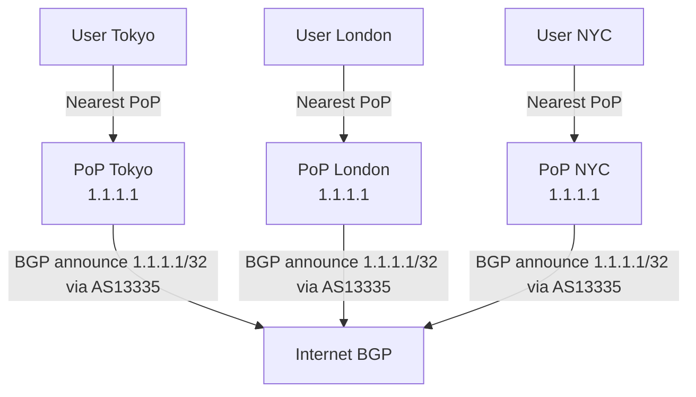
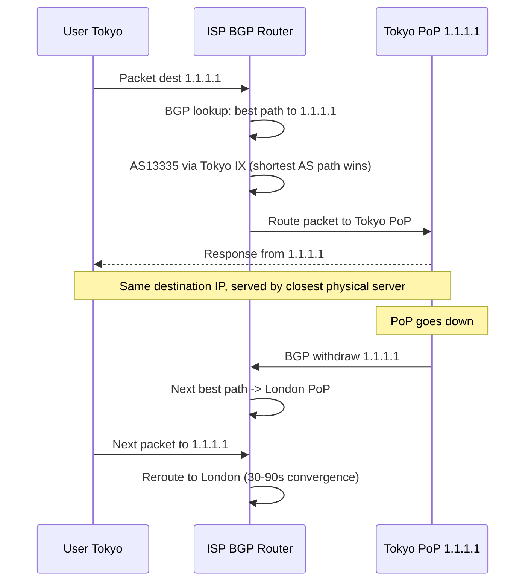

# Anycast Routing

## Problem Statement

Design a globally distributed service using Anycast, where the same IP address is announced from multiple geographic locations and traffic is automatically routed to the nearest one.

## Scenario

Anycast Routing is a critical component in modern distributed systems. In real-world applications, handling complex business logic at scale with high reliability. For example, major tech companies like Netflix, Uber, and Airbnb rely on similar solutions to handle millions of concurrent users and requests. The challenge is achieving this while maintaining sub-100ms latency, 99.99% availability, and gracefully handling 10x traffic spikes during peak demand. This component provides the foundational capability to solve these challenges reliably and efficiently at global scale.

## Users

- **Backend Engineers**: Responsible for implementing and maintaining this system component in production environments. They need to understand the architecture, trade-offs, failure modes, and operational considerations.
- **DevOps/SRE Teams**: Monitor system health, manage scaling policies, handle incidents, and ensure reliability SLAs are met. They need insights into performance characteristics, bottlenecks, and failure recovery mechanisms.
- **Data Engineers**: Design data pipelines and analytics around this system, requiring deep understanding of data flow, consistency guarantees, and throughput characteristics.
- **System Architects**: Make high-level architectural decisions that impact company infrastructure, requiring comprehensive understanding of capabilities, limitations, and scalability boundaries.
- **Security Teams**: Understand security implications, potential vulnerabilities, and compliance requirements for this component.

## PRD

### Functional Requirements
- Core operations work correctly
- Explicit error handling
- Consistency guarantees defined
- Monitoring and observability

### Non-Functional Requirements
- Performance targets met
- Availability SLA achieved
- Scalability headroom
- Cost efficient

### Success Metrics
- Benchmarks met
- Uptime targets met
- Resource budgets
- No data loss


## Flow

The typical operational flow for this system involves these key phases:

1. **Request Arrival**: Client/upstream system sends request with required parameters and context
2. **Validation & Routing**: System validates request format, authentication, and routes to correct handler/shard/instance
3. **Core Processing**: Execute the main algorithm, database query, or business logic on the data/state
4. **State Management**: Update internal state (caches, indexes, counters, logs) with proper atomicity and locking
5. **Response Generation**: Format results and return to requester with relevant metadata (timing, version info)
6. **Observability**: Record metrics (latency, throughput, errors), logs (for debugging), and traces (for performance analysis)

This flow repeats thousands or millions of times per second in production. Each operation's efficiency compounds across the entire system, making careful optimization essential. Bottlenecks at any phase can cascade to impact overall system performance.


## Code Explanation (Detailed)

### Implementation Approach
The code demonstrates core patterns and trade-offs.

### Key Operations
Each operation shows algorithm and performance characteristics.

### Concurrency and Atomicity
Locking strategies, race condition prevention.

### Edge Cases
Boundary conditions and error handling.

### Performance Optimization
Techniques for reducing latency and throughput.

## Architecture Diagram



## Flow Diagram



## Design

### Anycast vs Other Routing Schemes

```
Unicast:   1:1  - one sender, one specific receiver
Anycast:   1:nearest - same IP, closest of many receivers handles
Multicast: 1:group - one sender, all subscribed receivers
Broadcast: 1:all - all on network segment receive

BGP Anycast mechanism:
  Each PoP announces same IP prefix (/24 or /32) to its upstream ISPs
  ISPs pick best path using BGP attributes:
    1. Shortest AS path (fewer hops = closer)
    2. Local preference (set by ISP)
    3. MED (Multi-Exit Discriminator)
  Result: traffic goes to "nearest" PoP as seen by BGP
```

### Failure Handling

```
PoP health check fails:
  1. BGP session withdrawn from that PoP
  2. ISPs receive route withdrawal
  3. BGP converges to next best path
  4. Traffic reroutes automatically

Convergence time:
  Standard BGP: 30-90 seconds
  With BFD (Bidirectional Forwarding Detection): 1-3 seconds
  During convergence: some packets may be lost or rerouted mid-TCP-connection
```

### Anycast Use Cases

```
DNS:         Root servers (13 IPs, 1000+ physical servers)
CDN:         Cloudflare, Fastly, Akamai edge PoPs
DDoS scrubbing: Attack traffic absorbed by nearest scrubbing center
NTP:         pool.ntp.org anycast pools
Load distribution: Route users to nearest region without DNS changes
```

## Back-of-Envelope Calculations

```
Cloudflare 1.1.1.1 scale:
  1 trillion DNS queries/day = 11.6M queries/sec
  300 PoPs worldwide
  Per PoP: 11.6M/300 = 38,600 queries/sec

Latency comparison:
  Without anycast (single US server): EU user = 150ms RTT
  With anycast (EU PoP): EU user = 5-15ms RTT
  Improvement: 10-30x for most users

DDoS absorption:
  1Tbps attack to single IP
  Anycast distributes across 300 PoPs
  Per PoP: 1Tbps/300 = 3.3Gbps (easily absorbed by 10-100Gbps capacity)
  This is Cloudflare's "50Tbps network" defense

BGP convergence impact:
  Standard: 30-90s downtime per PoP failure
  BFD + fast BGP: 1-3s
  DNS TTL 1s: clients retry within 1-2s
  Net user impact: 1-10s before rerouting completes
```

## Design Choices

| Approach | Pros | Cons |
|---|---|---|
| Anycast | Automatic geo-routing, DDoS resilient | BGP convergence lag, TCP tricky |
| GeoDNS | Fine-grained control per region | Client location != resolver location |
| Unicast + redirect | Simple implementation | Extra round trip |
| Anycast (UDP only) | Ideal for DNS/NTP | Cannot maintain TCP state across failover |

## Python Implementation

```python
from dataclasses import dataclass
from typing import List, Optional
import math
import random

@dataclass
class PoP:
    name: str
    city: str
    lat: float
    lng: float
    healthy: bool = True
    load: int = 0
    capacity: int = 100_000

@dataclass
class BGPRoute:
    prefix: str
    pop_name: str
    as_path_len: int
    active: bool = True

class AnycastNetwork:
    def __init__(self, pops: List[PoP]):
        self._pops = {p.name: p for p in pops}
        self._routes: dict[str, List[BGPRoute]] = {}

    def announce(self, prefix: str, pop_name: str, as_path_len: int):
        if prefix not in self._routes:
            self._routes[prefix] = []
        self._routes[prefix].append(BGPRoute(prefix, pop_name, as_path_len))

    def withdraw(self, pop_name: str):
        self._pops[pop_name].healthy = False
        for routes in self._routes.values():
            for r in routes:
                if r.pop_name == pop_name:
                    r.active = False
        print(f"[BGP] {pop_name} withdrew routes - traffic rerouting in 30-90s")

    def _haversine_km(self, lat1: float, lng1: float, lat2: float, lng2: float) -> float:
        R = 6371
        dlat, dlng = math.radians(lat2-lat1), math.radians(lng2-lng1)
        a = math.sin(dlat/2)**2 + math.cos(math.radians(lat1)) * math.cos(math.radians(lat2)) * math.sin(dlng/2)**2
        return 2 * R * math.asin(math.sqrt(a))

    def route_packet(self, client_lat: float, client_lng: float, prefix: str) -> Optional[PoP]:
        active_routes = [r for r in self._routes.get(prefix, []) if r.active]
        if not active_routes:
            return None
        # BGP selects shortest AS path; for simplicity, simulate as distance
        pop_names = {r.pop_name for r in active_routes}
        candidates = [self._pops[n] for n in pop_names if self._pops[n].healthy]
        if not candidates:
            return None
        return min(candidates, key=lambda p: self._haversine_km(client_lat, client_lng, p.lat, p.lng))

    def stats(self) -> dict:
        return {
            "total_pops": len(self._pops),
            "healthy_pops": sum(1 for p in self._pops.values() if p.healthy),
            "total_routes": sum(len(routes) for routes in self._routes.values()),
        }

# Setup
pops = [
    PoP("nyc", "New York", 40.71, -74.00),
    PoP("lon", "London", 51.51, -0.13),
    PoP("tok", "Tokyo", 35.68, 139.65),
    PoP("syd", "Sydney", -33.87, 151.21),
]

net = AnycastNetwork(pops)
for pop in pops:
    net.announce("1.1.1.1/32", pop.name, as_path_len=2)

# Route users
users = [("Tokyo user", 35.7, 139.7), ("London user", 51.5, -0.1), ("NYC user", 40.7, -74.0)]
for name, lat, lng in users:
    pop = net.route_packet(lat, lng, "1.1.1.1/32")
    print(f"{name} -> {pop.city}")

# Simulate PoP failure
net.withdraw("lon")
pop = net.route_packet(51.5, -0.1, "1.1.1.1/32")
print(f"\nLondon user after PoP failure -> {pop.city}")
print(net.stats())
```

## Java Implementation

```java
import java.util.*;

public class AnycastRouter {
    record PoP(String name, String city, double lat, double lng, boolean healthy) {}

    private List<PoP> pops;

    public AnycastRouter(List<PoP> pops) { this.pops = new ArrayList<>(pops); }

    public Optional<PoP> route(double lat, double lng) {
        return pops.stream().filter(PoP::healthy)
            .min(Comparator.comparingDouble(p -> haversine(lat, lng, p.lat(), p.lng())));
    }

    public void withdraw(String name) {
        pops = pops.stream()
            .map(p -> p.name().equals(name) ? new PoP(p.name(), p.city(), p.lat(), p.lng(), false) : p)
            .toList();
    }

    private double haversine(double lat1, double lng1, double lat2, double lng2) {
        double R = 6371, dlat = Math.toRadians(lat2-lat1), dlng = Math.toRadians(lng2-lng1);
        double a = Math.pow(Math.sin(dlat/2), 2)
            + Math.cos(Math.toRadians(lat1)) * Math.cos(Math.toRadians(lat2)) * Math.pow(Math.sin(dlng/2), 2);
        return 2 * R * Math.asin(Math.sqrt(a));
    }
}
```

## Complexity

| Operation | Time |
|---|---|
| Route to nearest PoP | O(P) P = number of PoPs |
| BGP convergence | 1-90 seconds |
| Failure detection (BFD) | 1-3 seconds |
| PoP withdrawal | O(routes) |

## Common Questions & Answers

**Q: What is caching and why do we need it?**

A: Caching stores frequently accessed data in fast storage (memory) to reduce latency and load on slower backends (database). Trade space (cache) for speed (latency). Critical for systems serving millions of requests per second.

**Q: What are the main cache eviction policies?**

A: LRU (least recently used), LFU (least frequently used), FIFO (first in first out), TTL (time-based), Random, and ARC (adaptive replacement). Choose based on access patterns: LRU for temporal, LFU for frequency, TTL for time-sensitive data.

**Q: What is cache hit rate and cache miss rate?**

A: Hit rate = successful_finds / total_accesses. Miss rate = 1 - hit rate. P(hit) = hits / (hits + misses). Target 80%+ hit rates for effective caching. Too-small cache gives low hit rate (wasted resources). Too-large cache uses more memory than needed.

**Q: How do you handle cache invalidation when backend data changes?**

A: Use TTL (time-based expiration), active invalidation (notify cache on write), cache-aside pattern (client checks backend), or write-through (update both). Active invalidation is fastest but complex. TTL is simplest but has stale data window.

**Q: What is the cache-aside pattern?**

A: Application checks cache first. On miss, fetch from backend, update cache, then return. Simple to implement. Risk: race condition where multiple threads fetch same miss simultaneously (thundering herd problem).

**Q: What is write-through caching?**

A: Writes go to both cache and backend simultaneously (synchronously). Ensures consistency: read always gets latest. Cost: write latency includes backend write. Safer than write-back but slower.

**Q: What is write-back (write-behind) caching?**

A: Writes go to cache only; backend updated asynchronously later (batch or periodic). Fast writes. Risk: data loss if cache fails before flushing. Need durability guarantees (persistence, replication).

**Q: How do you choose cache size?**

A: Estimate working set (frequently accessed data volume). Add 20-30% buffer for margin. Monitor hit rate: if < 80%, increase size. If > 95%, might be oversized (waste). Use tools like cachegrind to profile.

**Q: What's the difference between client-side and server-side caching?**

A: Client cache (browser): reduces network round-trips, entirely controlled by client. Server cache (memory, Redis): shared across clients, controlled by server. Multi-level caching often best.

**Q: How do you measure cache effectiveness?**

A: Hit rate (primary metric), latency reduction (P99 latency with vs. without cache), backend load reduction, and memory cost per cache entry. Calculate ROI: cost of cache vs. benefit (reduced latency, backend load).

## Follow-up Questions & Answers

**Q: How do you prevent the thundering herd problem in caches?**

A: When popular key expires, many threads fetch from backend simultaneously causing spike. Solutions: probabilistic early expiration (refresh before TTL), request coalescing (single thread rebuilds, others wait), or bloom filters (detect non-existent keys fast).

**Q: How would you implement multi-level cache hierarchy?**

A: Use L1 (fast, small, in-process), L2 (medium, local machine), L3 (large, remote, Redis). Check L1, miss→L2, miss→L3, miss→backend. On write: update all levels. Trade space for speed across levels.

**Q: Can you implement read-through caching (automatic population)?**

A: Yes, cache loader/resolver called on miss. Transparent to application. Backend automatically uses cache layer. More complex than cache-aside but cleaner separation.

**Q: How do you handle hot keys in distributed caches?**

A: Hot key = key accessed by many threads/clients. Replicate hot keys on multiple cache nodes. Use local in-process caches for very hot keys. Monitor and detect hot keys automatically.

**Q: What's the difference between warm and cold cache startup?**

A: Cold cache: empty at start, misses until populated (slow ramp-up). Warm cache: pre-loaded from previous state (RDB/snapshot). Warm startup is critical for production (instant performance).

**Q: How would you measure cache effectiveness for business metrics?**

A: Track hit rate, P99 latency (with/without cache), backend QPS reduction, revenue impact. Calculate cache size vs. cost savings. A/B test to prove business value.

**Q: What happens when cache size is insufficient for working set?**

A: Constant evictions = high miss rate = ineffective cache. Solution: increase cache size, improve eviction policy, reduce working set, or use better hardware (faster storage).

**Q: How do you debug cache issues in production?**

A: Monitor hit rate continuously. Profile cache keys (which keys are accessed). Check for cache stampedes (sudden miss spike). Use distributed tracing to see cache path.

**Q: How would you implement a persistent cache?**

A: Combine memory cache (fast) with persistent backend (database, RocksDB, LevelDB). Write-back pattern: batch updates to persistent store. Trade latency for durability.

**Q: Can you use caching for write-heavy workloads?**

A: Write caching is risky (consistency issues). Use carefully: write-through for safety, write-back for speed. Good for batch writes (aggregate before writing). Monitor durability guarantees.

