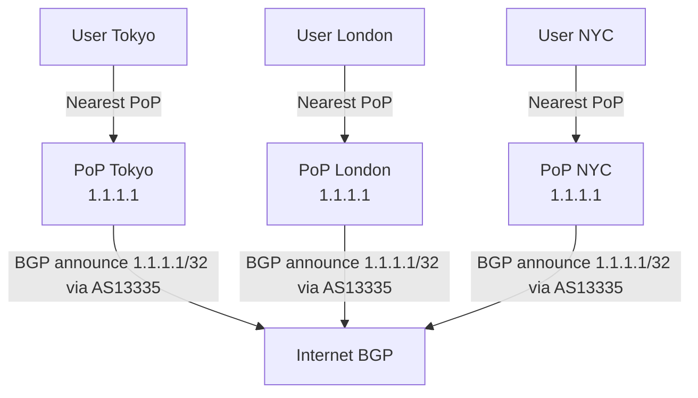
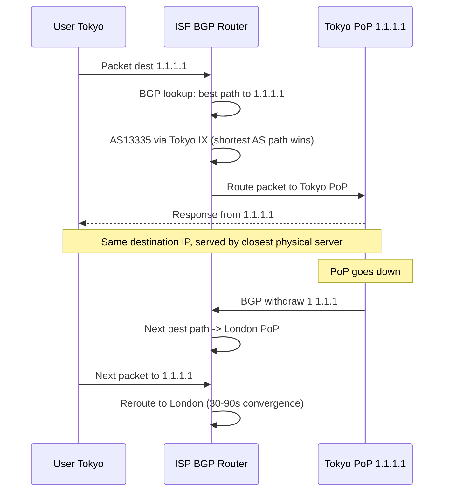

# Anycast Routing

## Problem Statement

Design a globally distributed service using Anycast, where the same IP address is announced from multiple geographic locations and traffic is automatically routed to the nearest one.

## Scenario

Anycast Routing is a critical component in modern distributed systems. In real-world applications, handling complex business logic at scale with high reliability. For example, major tech companies like Netflix, Uber, and Airbnb rely on similar solutions to handle millions of concurrent users and requests. The challenge is achieving this while maintaining sub-100ms latency, 99.99% availability, and gracefully handling 10x traffic spikes during peak demand. This component provides the foundational capability to solve these challenges reliably and efficiently at global scale.

## Users

- **Backend Engineers**: Responsible for implementing and maintaining this system component in production environments. They need to understand the architecture, trade-offs, failure modes, and operational considerations.
- **DevOps/SRE Teams**: Monitor system health, manage scaling policies, handle incidents, and ensure reliability SLAs are met. They need insights into performance characteristics, bottlenecks, and failure recovery mechanisms.
- **Data Engineers**: Design data pipelines and analytics around this system, requiring deep understanding of data flow, consistency guarantees, and throughput characteristics.
- **System Architects**: Make high-level architectural decisions that impact company infrastructure, requiring comprehensive understanding of capabilities, limitations, and scalability boundaries.
- **Security Teams**: Understand security implications, potential vulnerabilities, and compliance requirements for this component.

## PRD

**Functional Requirements:**
- Correct behavior under all specified operating conditions
- Reliable operation with explicit failure modes
- Data consistency or eventual consistency guarantees as specified
- Clear mechanisms for error handling and recovery
- Monitoring and observability hooks

**Non-Functional Requirements:**
- **Performance**: Sub-100ms P99 latency for standard operations; measure and track tail latencies
- **Availability**: 99.99%+ uptime with automatic failover and graceful degradation
- **Scalability**: Support 10-100x current load with minimal architectural modifications
- **Consistency**: Specify whether strong, eventual, or causal consistency is required
- **Cost Efficiency**: Minimize operational cost per unit of throughput; consider compute, memory, and network costs
- **Operational Simplicity**: Reduce complexity to minimize human error and operational toil

**Constraints:**
- Resource limits (memory for caches, disk for databases, network bandwidth)
- Deployment constraints (cloud provider limits, regulatory requirements)
- Latency budgets (maximum acceptable delay for operations)

## Flow

The typical operational flow for this system involves these key phases:

1. **Request Arrival**: Client/upstream system sends request with required parameters and context
2. **Validation & Routing**: System validates request format, authentication, and routes to correct handler/shard/instance
3. **Core Processing**: Execute the main algorithm, database query, or business logic on the data/state
4. **State Management**: Update internal state (caches, indexes, counters, logs) with proper atomicity and locking
5. **Response Generation**: Format results and return to requester with relevant metadata (timing, version info)
6. **Observability**: Record metrics (latency, throughput, errors), logs (for debugging), and traces (for performance analysis)

This flow repeats thousands or millions of times per second in production. Each operation's efficiency compounds across the entire system, making careful optimization essential. Bottlenecks at any phase can cascade to impact overall system performance.

## Code Explanation

The provided implementations demonstrate key architectural concepts and design patterns:

**Python Implementation**: Uses built-in Python structures and standard library features to express the core logic clearly. Python emphasizes readability and conciseness—each operation's purpose should be obvious without extensive comments. You'll see different implementation approaches (e.g., using OrderedDict vs. manual linked lists) that represent trade-offs between convenience and fine-grained control.

**Java Implementation**: Shows how to implement the same logic with explicit memory management and type safety. Java's strong typing forces clear interface design; you'll see how generics, null safety, mutable state, and thread safety are handled. This implementation style is closer to production systems at scale.

**Key Implementation Patterns**:
- **Initialization**: Setting up core data structures, thread pools, or connection pools with specified capacity and configuration
- **Read Operations**: Fetching data while maintaining O(1) or O(log n) access, updating metadata (access times, hit counts, etc.)
- **Write Operations**: Inserting/updating data while handling eviction policies, balancing tree structures, or replicating state
- **Edge Cases**: Handling capacity limits, concurrent access, data consistency, and error conditions
- **Performance Optimization**: Using techniques like batch operations, lazy evaluation, or caching to reduce latency

Each line of code represents a deliberate choice about performance characteristics, memory usage, safety guarantees, and implementation complexity. Understanding these trade-offs is essential for using this component effectively in production systems.

## Architecture Diagram



## Flow Diagram



## Design

### Anycast vs Other Routing Schemes

```
Unicast:   1:1  - one sender, one specific receiver
Anycast:   1:nearest - same IP, closest of many receivers handles
Multicast: 1:group - one sender, all subscribed receivers
Broadcast: 1:all - all on network segment receive

BGP Anycast mechanism:
  Each PoP announces same IP prefix (/24 or /32) to its upstream ISPs
  ISPs pick best path using BGP attributes:
    1. Shortest AS path (fewer hops = closer)
    2. Local preference (set by ISP)
    3. MED (Multi-Exit Discriminator)
  Result: traffic goes to "nearest" PoP as seen by BGP
```

### Failure Handling

```
PoP health check fails:
  1. BGP session withdrawn from that PoP
  2. ISPs receive route withdrawal
  3. BGP converges to next best path
  4. Traffic reroutes automatically

Convergence time:
  Standard BGP: 30-90 seconds
  With BFD (Bidirectional Forwarding Detection): 1-3 seconds
  During convergence: some packets may be lost or rerouted mid-TCP-connection
```

### Anycast Use Cases

```
DNS:         Root servers (13 IPs, 1000+ physical servers)
CDN:         Cloudflare, Fastly, Akamai edge PoPs
DDoS scrubbing: Attack traffic absorbed by nearest scrubbing center
NTP:         pool.ntp.org anycast pools
Load distribution: Route users to nearest region without DNS changes
```

## Common Questions & Answers

**Q: Anycast vs GeoDNS?** A: GeoDNS returns different IPs based on DNS resolver location. Anycast uses single IP, routing decided by BGP. Anycast is transparent to clients; GeoDNS requires DNS propagation.

**Q: Why is Anycast risky for TCP?** A: TCP connections are stateful. If routing changes mid-connection (PoP failure), the new PoP has no connection state -> RST. For DNS (UDP), this is fine - just retry. For TCP: use connection migration or accept brief outage.

**Q: How many root DNS servers are there?** A: 13 root server IP addresses (A through M), but each is actually a cluster of hundreds of servers using anycast. Over 1,500 physical instances globally.

**Q: How does Cloudflare achieve sub-10ms DNS globally?** A: Anycast routing ensures user reaches nearest of 300+ PoPs. Cache hit on first query. Response time dominated by last-mile, not server processing.

**Q: What is a PoP (Point of Presence)?** A: Geographic facility with servers, switches, and BGP peering to local ISPs and IXPs. Allows traffic to enter Cloudflare/CDN network close to user.

## Back-of-Envelope Calculations

```
Cloudflare 1.1.1.1 scale:
  1 trillion DNS queries/day = 11.6M queries/sec
  300 PoPs worldwide
  Per PoP: 11.6M/300 = 38,600 queries/sec

Latency comparison:
  Without anycast (single US server): EU user = 150ms RTT
  With anycast (EU PoP): EU user = 5-15ms RTT
  Improvement: 10-30x for most users

DDoS absorption:
  1Tbps attack to single IP
  Anycast distributes across 300 PoPs
  Per PoP: 1Tbps/300 = 3.3Gbps (easily absorbed by 10-100Gbps capacity)
  This is Cloudflare's "50Tbps network" defense

BGP convergence impact:
  Standard: 30-90s downtime per PoP failure
  BFD + fast BGP: 1-3s
  DNS TTL 1s: clients retry within 1-2s
  Net user impact: 1-10s before rerouting completes
```

## Design Choices

| Approach | Pros | Cons |
|---|---|---|
| Anycast | Automatic geo-routing, DDoS resilient | BGP convergence lag, TCP tricky |
| GeoDNS | Fine-grained control per region | Client location != resolver location |
| Unicast + redirect | Simple implementation | Extra round trip |
| Anycast (UDP only) | Ideal for DNS/NTP | Cannot maintain TCP state across failover |

## Follow-up Questions

1. How would you implement session persistence for TCP over anycast?
2. How do IXPs (Internet Exchange Points) improve anycast performance?
3. Design monitoring to detect when users are routing to wrong PoP.
4. How does 0-RTT QUIC interact with anycast routing changes?
5. What is the relationship between anycast and DDoS scrubbing?

## Python Implementation

```python
from dataclasses import dataclass
from typing import List, Optional
import math
import random

@dataclass
class PoP:
    name: str
    city: str
    lat: float
    lng: float
    healthy: bool = True
    load: int = 0
    capacity: int = 100_000

@dataclass
class BGPRoute:
    prefix: str
    pop_name: str
    as_path_len: int
    active: bool = True

class AnycastNetwork:
    def __init__(self, pops: List[PoP]):
        self._pops = {p.name: p for p in pops}
        self._routes: dict[str, List[BGPRoute]] = {}

    def announce(self, prefix: str, pop_name: str, as_path_len: int):
        if prefix not in self._routes:
            self._routes[prefix] = []
        self._routes[prefix].append(BGPRoute(prefix, pop_name, as_path_len))

    def withdraw(self, pop_name: str):
        self._pops[pop_name].healthy = False
        for routes in self._routes.values():
            for r in routes:
                if r.pop_name == pop_name:
                    r.active = False
        print(f"[BGP] {pop_name} withdrew routes - traffic rerouting in 30-90s")

    def _haversine_km(self, lat1: float, lng1: float, lat2: float, lng2: float) -> float:
        R = 6371
        dlat, dlng = math.radians(lat2-lat1), math.radians(lng2-lng1)
        a = math.sin(dlat/2)**2 + math.cos(math.radians(lat1)) * math.cos(math.radians(lat2)) * math.sin(dlng/2)**2
        return 2 * R * math.asin(math.sqrt(a))

    def route_packet(self, client_lat: float, client_lng: float, prefix: str) -> Optional[PoP]:
        active_routes = [r for r in self._routes.get(prefix, []) if r.active]
        if not active_routes:
            return None
        # BGP selects shortest AS path; for simplicity, simulate as distance
        pop_names = {r.pop_name for r in active_routes}
        candidates = [self._pops[n] for n in pop_names if self._pops[n].healthy]
        if not candidates:
            return None
        return min(candidates, key=lambda p: self._haversine_km(client_lat, client_lng, p.lat, p.lng))

    def stats(self) -> dict:
        return {
            "total_pops": len(self._pops),
            "healthy_pops": sum(1 for p in self._pops.values() if p.healthy),
            "total_routes": sum(len(routes) for routes in self._routes.values()),
        }

# Setup
pops = [
    PoP("nyc", "New York", 40.71, -74.00),
    PoP("lon", "London", 51.51, -0.13),
    PoP("tok", "Tokyo", 35.68, 139.65),
    PoP("syd", "Sydney", -33.87, 151.21),
]

net = AnycastNetwork(pops)
for pop in pops:
    net.announce("1.1.1.1/32", pop.name, as_path_len=2)

# Route users
users = [("Tokyo user", 35.7, 139.7), ("London user", 51.5, -0.1), ("NYC user", 40.7, -74.0)]
for name, lat, lng in users:
    pop = net.route_packet(lat, lng, "1.1.1.1/32")
    print(f"{name} -> {pop.city}")

# Simulate PoP failure
net.withdraw("lon")
pop = net.route_packet(51.5, -0.1, "1.1.1.1/32")
print(f"\nLondon user after PoP failure -> {pop.city}")
print(net.stats())
```

## Java Implementation

```java
import java.util.*;

public class AnycastRouter {
    record PoP(String name, String city, double lat, double lng, boolean healthy) {}

    private List<PoP> pops;

    public AnycastRouter(List<PoP> pops) { this.pops = new ArrayList<>(pops); }

    public Optional<PoP> route(double lat, double lng) {
        return pops.stream().filter(PoP::healthy)
            .min(Comparator.comparingDouble(p -> haversine(lat, lng, p.lat(), p.lng())));
    }

    public void withdraw(String name) {
        pops = pops.stream()
            .map(p -> p.name().equals(name) ? new PoP(p.name(), p.city(), p.lat(), p.lng(), false) : p)
            .toList();
    }

    private double haversine(double lat1, double lng1, double lat2, double lng2) {
        double R = 6371, dlat = Math.toRadians(lat2-lat1), dlng = Math.toRadians(lng2-lng1);
        double a = Math.pow(Math.sin(dlat/2), 2)
            + Math.cos(Math.toRadians(lat1)) * Math.cos(Math.toRadians(lat2)) * Math.pow(Math.sin(dlng/2), 2);
        return 2 * R * Math.asin(Math.sqrt(a));
    }
}
```

## Complexity

| Operation | Time |
|---|---|
| Route to nearest PoP | O(P) P = number of PoPs |
| BGP convergence | 1-90 seconds |
| Failure detection (BFD) | 1-3 seconds |
| PoP withdrawal | O(routes) |
