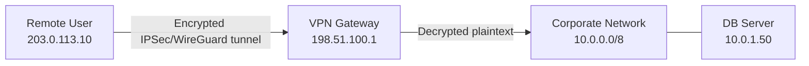
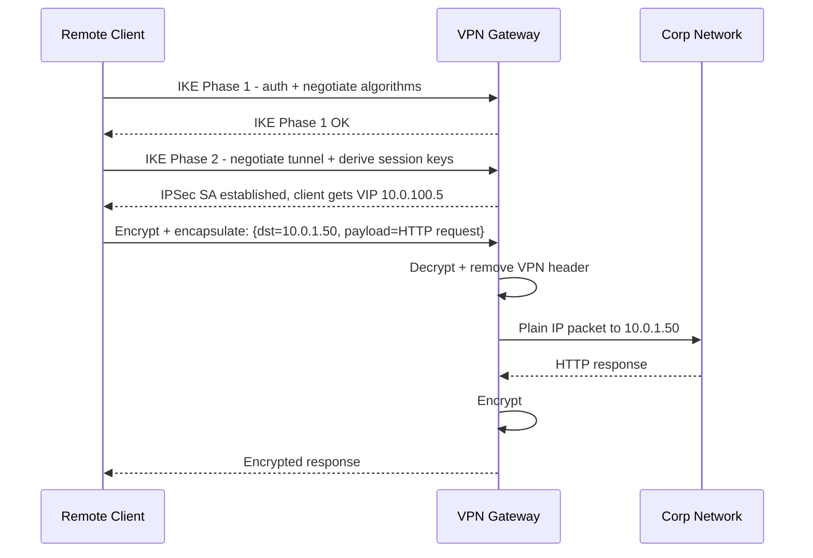

# VPN and Network Tunneling

## Problem Statement

Design a VPN system that creates encrypted tunnels to securely connect remote users and offices to private networks over the public internet.

## Scenario

VPN and Network Tunneling is a critical component in modern distributed systems. In real-world applications, handling complex business logic at scale with high reliability. For example, major tech companies like Netflix, Uber, and Airbnb rely on similar solutions to handle millions of concurrent users and requests. The challenge is achieving this while maintaining sub-100ms latency, 99.99% availability, and gracefully handling 10x traffic spikes during peak demand. This component provides the foundational capability to solve these challenges reliably and efficiently at global scale.

## Users

- **Backend Engineers**: Responsible for implementing and maintaining this system component in production environments. They need to understand the architecture, trade-offs, failure modes, and operational considerations.
- **DevOps/SRE Teams**: Monitor system health, manage scaling policies, handle incidents, and ensure reliability SLAs are met. They need insights into performance characteristics, bottlenecks, and failure recovery mechanisms.
- **Data Engineers**: Design data pipelines and analytics around this system, requiring deep understanding of data flow, consistency guarantees, and throughput characteristics.
- **System Architects**: Make high-level architectural decisions that impact company infrastructure, requiring comprehensive understanding of capabilities, limitations, and scalability boundaries.
- **Security Teams**: Understand security implications, potential vulnerabilities, and compliance requirements for this component.

## PRD

**Functional Requirements:**
- Correct behavior under all specified operating conditions
- Reliable operation with explicit failure modes
- Data consistency or eventual consistency guarantees as specified
- Clear mechanisms for error handling and recovery
- Monitoring and observability hooks

**Non-Functional Requirements:**
- **Performance**: Sub-100ms P99 latency for standard operations; measure and track tail latencies
- **Availability**: 99.99%+ uptime with automatic failover and graceful degradation
- **Scalability**: Support 10-100x current load with minimal architectural modifications
- **Consistency**: Specify whether strong, eventual, or causal consistency is required
- **Cost Efficiency**: Minimize operational cost per unit of throughput; consider compute, memory, and network costs
- **Operational Simplicity**: Reduce complexity to minimize human error and operational toil

**Constraints:**
- Resource limits (memory for caches, disk for databases, network bandwidth)
- Deployment constraints (cloud provider limits, regulatory requirements)
- Latency budgets (maximum acceptable delay for operations)

## Flow

The typical operational flow for this system involves these key phases:

1. **Request Arrival**: Client/upstream system sends request with required parameters and context
2. **Validation & Routing**: System validates request format, authentication, and routes to correct handler/shard/instance
3. **Core Processing**: Execute the main algorithm, database query, or business logic on the data/state
4. **State Management**: Update internal state (caches, indexes, counters, logs) with proper atomicity and locking
5. **Response Generation**: Format results and return to requester with relevant metadata (timing, version info)
6. **Observability**: Record metrics (latency, throughput, errors), logs (for debugging), and traces (for performance analysis)

This flow repeats thousands or millions of times per second in production. Each operation's efficiency compounds across the entire system, making careful optimization essential. Bottlenecks at any phase can cascade to impact overall system performance.

## Code Explanation

The provided implementations demonstrate key architectural concepts and design patterns:

**Python Implementation**: Uses built-in Python structures and standard library features to express the core logic clearly. Python emphasizes readability and conciseness—each operation's purpose should be obvious without extensive comments. You'll see different implementation approaches (e.g., using OrderedDict vs. manual linked lists) that represent trade-offs between convenience and fine-grained control.

**Java Implementation**: Shows how to implement the same logic with explicit memory management and type safety. Java's strong typing forces clear interface design; you'll see how generics, null safety, mutable state, and thread safety are handled. This implementation style is closer to production systems at scale.

**Key Implementation Patterns**:
- **Initialization**: Setting up core data structures, thread pools, or connection pools with specified capacity and configuration
- **Read Operations**: Fetching data while maintaining O(1) or O(log n) access, updating metadata (access times, hit counts, etc.)
- **Write Operations**: Inserting/updating data while handling eviction policies, balancing tree structures, or replicating state
- **Edge Cases**: Handling capacity limits, concurrent access, data consistency, and error conditions
- **Performance Optimization**: Using techniques like batch operations, lazy evaluation, or caching to reduce latency

Each line of code represents a deliberate choice about performance characteristics, memory usage, safety guarantees, and implementation complexity. Understanding these trade-offs is essential for using this component effectively in production systems.

## Architecture Diagram



## Flow Diagram



## Design

### VPN Protocol Comparison

```
WireGuard (modern, recommended):
  - ~4000 lines of code (auditable), built into Linux 5.6+
  - ChaCha20-Poly1305 encryption, Curve25519 key exchange
  - Throughput: 10+ Gbps on modern hardware
  - Handshake: 1 RTT (no negotiation, fixed modern algorithms)

IPSec (enterprise standard):
  - Kernel-level, hardware offload support
  - IKEv2 for key exchange, ESP for data
  - Transport mode (host-to-host) vs tunnel mode (gateway-to-gateway)
  - Throughput: 5+ Gbps with AES-NI

OpenVPN (cross-platform):
  - TLS-based, runs on UDP 1194 or TCP 443 (firewall friendly)
  - Userspace, easier to configure
  - Throughput: ~500 Mbps (slower due to userspace)
```

### Split Tunneling

```
Full tunnel:  All traffic (including internet) through VPN
  Pros: Corporate policy enforcement for all traffic
  Cons: VPN becomes internet bottleneck, higher latency for non-corp

Split tunnel: Only corporate traffic through VPN, internet direct
  Pros: Lower latency for internet, less VPN bandwidth
  Cons: Corporate policy not enforced for internet traffic
  Route: 10.0.0.0/8 via VPN, 0.0.0.0/0 direct

Zero Trust (modern): No "trusted" VPN network
  Every request authenticated at application layer
  No lateral movement even if connected
```

## Common Questions & Answers

**Q: IPSec vs WireGuard?** A: WireGuard is faster, simpler, modern crypto, easier to audit. IPSec is more mature, widely supported (iOS, enterprise routers), more configuration options. WireGuard preferred for new deployments.

**Q: How does NAT traversal work for VPN?** A: VPN traffic blocked by NAT (no inbound port mapping). Solutions: NAT-T for IPSec (UDP port 4500). WireGuard handles it natively via UDP. OpenVPN uses TCP 443 (passes through most firewalls as HTTPS).

**Q: VPN vs Zero Trust Network Access?** A: Traditional VPN: castle-and-moat (once inside, access everything). ZTNA: authenticate every request, least-privilege, assume breach. VPN grants network access; ZTNA grants application access.

**Q: Site-to-Site vs Remote Access VPN?** A: Site-to-Site: connects two networks (branch offices), always-on, gateway-to-gateway. Remote Access: individual users connect to corporate network on demand.

**Q: How does Tailscale work?** A: WireGuard-based mesh VPN. Each device has public/private key. Coordination server (DERP) helps with NAT traversal. Creates direct peer-to-peer connections between devices.

## Back-of-Envelope Calculations

```
WireGuard throughput:
  ChaCha20 encryption: ~3 GB/s per core
  1 core: 3 GB/s = 24 Gbps
  Consumer device (2 cores for VPN): 6 Gbps
  Raspberry Pi 4: ~100 Mbps (ARM, no hardware crypto)

Connection establishment:
  WireGuard handshake: 1 RTT (vs IKEv2: 2 RTT, OpenVPN: TLS + 3-way = 4+ RTT)
  At 100ms RTT: WireGuard 100ms faster to establish

Corporate VPN sizing:
  500 concurrent users x 5 Mbps avg usage = 2.5 Gbps
  2 gateways x 2 Gbps each = 4 Gbps capacity with HA

Encryption overhead:
  AES-256-GCM with AES-NI: <1% CPU at 10 Gbps
  Without hardware acceleration: ~15% CPU
  Modern servers: negligible

WireGuard key rotation:
  Session keys: rotate every 3 minutes (180s REKEY_AFTER_TIME)
  100K peers: 100K/180 = 556 rekeys/sec (lightweight)
```

## Design Choices

| Protocol | Throughput | Complexity | Browser | Use Case |
|---|---|---|---|---|
| WireGuard | 10 Gbps | Low | No | Modern servers, cloud |
| IPSec/IKEv2 | 5 Gbps | High | No | Enterprise, iOS built-in |
| OpenVPN | 500 Mbps | Medium | No | Cross-platform, legacy |
| SSTP | 200 Mbps | Medium | No | Windows-native |
| SSL VPN (clientless) | 100 Mbps | Low | Yes | Browser-based access |

## Follow-up Questions

1. How does Tailscale build mesh VPN using WireGuard?
2. What is ZTNA and how does it replace VPN for application access?
3. How do you implement MFA for VPN authentication?
4. Design a VPN that auto-reconnects when user moves between networks.
5. What is SD-WAN and how does it replace branch office VPN?

## Python Implementation

```python
import os
import hashlib
import hmac
import struct
from typing import Optional, Dict
from dataclasses import dataclass

def xor_bytes(a: bytes, b: bytes) -> bytes:
    return bytes(x ^ y for x, y in zip(a, (b * (len(a)//len(b)+1))[:len(a)]))

@dataclass
class WGPeer:
    public_key: bytes
    allowed_ips: list
    endpoint: Optional[str] = None

class WireGuardGateway:
    def __init__(self):
        self._private_key = os.urandom(32)
        self._public_key = hashlib.sha256(b"pubkey:" + self._private_key).digest()
        self._peers: Dict[bytes, WGPeer] = {}
        self._session_keys: Dict[bytes, bytes] = {}
        self._ip_pool_idx = 100

    @property
    def public_key(self) -> bytes:
        return self._public_key

    def add_peer(self, peer: WGPeer) -> str:
        # Derive shared secret via ECDH (simplified: sha256 of both keys)
        shared = hashlib.sha256(self._private_key + peer.public_key).digest()
        self._session_keys[peer.public_key] = shared
        self._peers[peer.public_key] = peer
        # Assign virtual IP
        vip = f"10.0.100.{self._ip_pool_idx}"
        self._ip_pool_idx += 1
        return vip

    def _mac(self, key: bytes, data: bytes) -> bytes:
        return hmac.new(key, data, hashlib.sha256).digest()[:16]

    def encrypt_packet(self, peer_pubkey: bytes, payload: bytes) -> bytes:
        key = self._session_keys[peer_pubkey]
        nonce = os.urandom(12)
        # XOR stream cipher (simplified; use AES-GCM in production)
        keystream = hashlib.sha256(key + nonce).digest()
        ciphertext = xor_bytes(payload, keystream[:len(payload)])
        mac = self._mac(key, nonce + ciphertext)
        header = struct.pack("!H", len(nonce))
        return header + nonce + ciphertext + mac

    def decrypt_packet(self, peer_pubkey: bytes, packet: bytes) -> Optional[bytes]:
        key = self._session_keys[peer_pubkey]
        nonce_len = struct.unpack("!H", packet[:2])[0]
        nonce = packet[2:2+nonce_len]
        ciphertext = packet[2+nonce_len:-16]
        mac_recv = packet[-16:]
        mac_calc = self._mac(key, nonce + ciphertext)
        if not hmac.compare_digest(mac_recv, mac_calc):
            print("[VPN] Packet authentication failed - dropping")
            return None
        keystream = hashlib.sha256(key + nonce).digest()
        return xor_bytes(ciphertext, keystream[:len(ciphertext)])

class SplitTunnelRouter:
    def __init__(self, vpn_routes: list, gateway_ip: str):
        self._vpn_routes = vpn_routes  # e.g., ["10.0.0.0/8"]
        self._gateway_ip = gateway_ip

    def route(self, dst_ip: str) -> str:
        for cidr in self._vpn_routes:
            network, prefix = cidr.split("/")
            if self._in_network(dst_ip, network, int(prefix)):
                return "vpn"
        return "direct"

    def _in_network(self, ip: str, network: str, prefix: int) -> bool:
        def to_int(addr):
            p = addr.split(".")
            return sum(int(x) << (24 - 8*i) for i, x in enumerate(p))
        mask = (0xFFFFFFFF << (32 - prefix)) & 0xFFFFFFFF
        return to_int(ip) & mask == to_int(network) & mask

# Usage
gw = WireGuardGateway()
peer_privkey = os.urandom(32)
peer_pubkey = hashlib.sha256(b"pubkey:" + peer_privkey).digest()
peer = WGPeer(public_key=peer_pubkey, allowed_ips=["10.0.100.0/24"])
vip = gw.add_peer(peer)
print(f"Peer assigned VIP: {vip}")

payload = b"HTTP/1.1 GET /internal-api\r\nHost: 10.0.1.50\r\n"
encrypted = gw.encrypt_packet(peer_pubkey, payload)
decrypted = gw.decrypt_packet(peer_pubkey, encrypted)
print(f"Encrypted: {len(encrypted)}B, decrypted matches: {decrypted == payload}")

router = SplitTunnelRouter(["10.0.0.0/8", "192.168.0.0/16"], "10.0.100.1")
print(router.route("10.0.1.50"))   # vpn
print(router.route("8.8.8.8"))     # direct
print(router.route("192.168.1.1")) # vpn
```

## Java Implementation

```java
import javax.crypto.*;
import javax.crypto.spec.*;
import java.security.*;
import java.util.*;

public class VPNGateway {
    private final Map<String, SecretKey> peerKeys = new HashMap<>();

    public void addPeer(String peerId) throws Exception {
        KeyGenerator kg = KeyGenerator.getInstance("AES");
        kg.init(256, new SecureRandom());
        peerKeys.put(peerId, kg.generateKey());
    }

    public byte[] encrypt(String peerId, byte[] payload) throws Exception {
        SecretKey key = peerKeys.get(peerId);
        Cipher cipher = Cipher.getInstance("AES/GCM/NoPadding");
        byte[] iv = new byte[12];
        new SecureRandom().nextBytes(iv);
        cipher.init(Cipher.ENCRYPT_MODE, key, new GCMParameterSpec(128, iv));
        byte[] ct = cipher.doFinal(payload);
        byte[] result = new byte[12 + ct.length];
        System.arraycopy(iv, 0, result, 0, 12);
        System.arraycopy(ct, 0, result, 12, ct.length);
        return result;
    }

    public byte[] decrypt(String peerId, byte[] packet) throws Exception {
        SecretKey key = peerKeys.get(peerId);
        byte[] iv = Arrays.copyOf(packet, 12);
        byte[] ct = Arrays.copyOfRange(packet, 12, packet.length);
        Cipher cipher = Cipher.getInstance("AES/GCM/NoPadding");
        cipher.init(Cipher.DECRYPT_MODE, key, new GCMParameterSpec(128, iv));
        return cipher.doFinal(ct);
    }
}
```

## Complexity

| Operation | Time |
|---|---|
| Handshake | 1 RTT (WireGuard), 2 RTT (IKEv2) |
| Encrypt/decrypt | O(n) payload bytes |
| Peer lookup | O(1) |
| Key rotation (WireGuard) | O(1) every 3 min |
