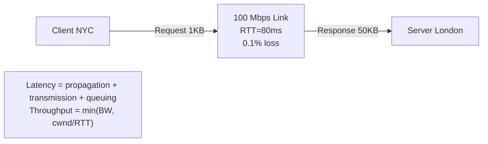
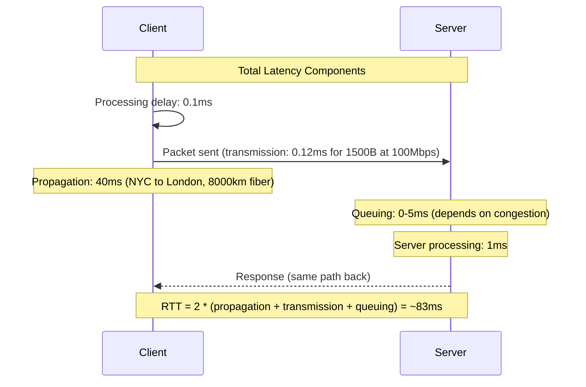

# Bandwidth, Latency, and Network Performance Math

## Problem Statement

Master fundamental network performance metrics for system design back-of-envelope calculations and capacity planning.

## Scenario

Bandwidth, Latency, and Network Performance Math is a critical component in modern distributed systems. In real-world applications, handling complex business logic at scale with high reliability. For example, major tech companies like Netflix, Uber, and Airbnb rely on similar solutions to handle millions of concurrent users and requests. The challenge is achieving this while maintaining sub-100ms latency, 99.99% availability, and gracefully handling 10x traffic spikes during peak demand. This component provides the foundational capability to solve these challenges reliably and efficiently at global scale.

## Users

- **Backend Engineers**: Responsible for implementing and maintaining this system component in production environments. They need to understand the architecture, trade-offs, failure modes, and operational considerations.
- **DevOps/SRE Teams**: Monitor system health, manage scaling policies, handle incidents, and ensure reliability SLAs are met. They need insights into performance characteristics, bottlenecks, and failure recovery mechanisms.
- **Data Engineers**: Design data pipelines and analytics around this system, requiring deep understanding of data flow, consistency guarantees, and throughput characteristics.
- **System Architects**: Make high-level architectural decisions that impact company infrastructure, requiring comprehensive understanding of capabilities, limitations, and scalability boundaries.
- **Security Teams**: Understand security implications, potential vulnerabilities, and compliance requirements for this component.

## PRD

### Functional Requirements
- Core operations work correctly
- Explicit error handling
- Consistency guarantees defined
- Monitoring and observability

### Non-Functional Requirements
- Performance targets met
- Availability SLA achieved
- Scalability headroom
- Cost efficient

### Success Metrics
- Benchmarks met
- Uptime targets met
- Resource budgets
- No data loss


## Flow

The typical operational flow for this system involves these key phases:

1. **Request Arrival**: Client/upstream system sends request with required parameters and context
2. **Validation & Routing**: System validates request format, authentication, and routes to correct handler/shard/instance
3. **Core Processing**: Execute the main algorithm, database query, or business logic on the data/state
4. **State Management**: Update internal state (caches, indexes, counters, logs) with proper atomicity and locking
5. **Response Generation**: Format results and return to requester with relevant metadata (timing, version info)
6. **Observability**: Record metrics (latency, throughput, errors), logs (for debugging), and traces (for performance analysis)

This flow repeats thousands or millions of times per second in production. Each operation's efficiency compounds across the entire system, making careful optimization essential. Bottlenecks at any phase can cascade to impact overall system performance.


## Code Explanation (Detailed)

### Implementation Approach
The code demonstrates core patterns and trade-offs.

### Key Operations
Each operation shows algorithm and performance characteristics.

### Concurrency and Atomicity
Locking strategies, race condition prevention.

### Edge Cases
Boundary conditions and error handling.

### Performance Optimization
Techniques for reducing latency and throughput.

## Architecture Diagram



## Flow Diagram



## Design

### Latency Components

```
Total = Propagation + Transmission + Queuing + Processing

Propagation delay:
  Speed in fiber: ~200,000 km/s (66% speed of light)
  NYC to London (8,000km): 40ms one-way, 80ms RTT
  NYC to Tokyo (11,000km): 55ms one-way, 110ms RTT

Transmission delay:
  Time to push bits onto wire
  1500 byte packet at 1 Gbps: (1500 x 8) / 10^9 = 12 microseconds
  1500 byte packet at 10 Mbps: 1.2 milliseconds

Queuing delay:
  Packets waiting in router queue
  Minimal when lightly loaded, severe under congestion (bufferbloat)

Processing delay:
  Route lookup, checksum verification
  Modern hardware: <1 microsecond
```

### Bandwidth-Delay Product (BDP)

```
BDP = Bandwidth x RTT

Example - 1 Gbps transatlantic link (RTT=80ms):
  BDP = 1 Gbps x 80ms = 80 Mb = 10 MB

Meaning: 10MB of data can be "in flight" at once
For full utilization: TCP window must be >= 10MB
Default TCP window: 65535 bytes (64KB) -- bottleneck!
TCP window scaling (RFC 1323): up to 1GB window

Practical impact:
  64KB window at 80ms RTT: 64KB/0.08s = 6.4 Mbps effective throughput
  On a 1 Gbps link: 6.4/1000 = 0.64% utilization!
  With 10MB window: 10MB/0.08s = 1000 Mbps = full utilization
```

### TCP Throughput Formula

```
Mathis formula (with packet loss):
  Throughput = (MSS / RTT) x C / sqrt(p)
  MSS = 1460 bytes (max segment size)
  RTT = round-trip time
  p = packet loss rate
  C = constant (~1.22 for standard TCP)

At 1% loss, 80ms RTT:
  Throughput = (1460 / 0.08) x 1.22 / sqrt(0.01)
             = 18250 x 1.22 / 0.1
             = 222,650 bytes/sec = 1.78 Mbps
  (Even on a 1 Gbps link, 1% loss limits to ~1.78 Mbps)
```

### Network Performance Rules of Thumb

```
Speed of light in fiber: ~200,000 km/s
NYC to London RTT: ~80ms
NYC to SF RTT: ~70ms
Same coast US: ~20ms
Same datacenter: ~0.5ms
Same rack: ~0.1ms
Cross-rack (spine hop): ~0.5ms

Bandwidth units:
  1 Gbps = 125 MB/s
  1 TB/hour = 2.2 Gbps
  Netflix peak (2024): ~800 Gbps globally
```

## Back-of-Envelope Calculations

```
File transfer over internet:
  1 GB file, 100 Mbps link, 80ms RTT
  Pure transmission: 1GB x 8 / 100M = 80 seconds
  TCP slow start: ~1.5-2x slowdown for short flows
  Realistic: ~90-100 seconds

API latency budget (SLA: 100ms p99):
  Client to LB: 20ms (same region)
  LB to app: 5ms
  App to DB: 10ms
  DB query: 15ms
  Response path: 20ms
  Total: 70ms -> 30ms budget for processing overhead

Video streaming bandwidth:
  720p: 5 Mbps, 1080p: 8 Mbps, 4K HDR: 25 Mbps
  1M concurrent 1080p streams: 1M x 8 Mbps = 8 Tbps
  Netflix at peak: ~800 Gbps (100M users, avg 8 Mbps = most from CDN)

Data transfer cost (AWS):
  S3 to internet: $0.09/GB
  1PB/month: $90,000/month
  CDN (CloudFront): $0.01/GB after 10TB -> $10,000/month
  Savings: 89%!

TCP throughput at different loss rates:
  0.0% loss: ~950 Mbps (1 Gbps link, TCP overhead)
  0.1% loss: ~56 Mbps
  1.0% loss: ~1.8 Mbps
  5.0% loss: ~0.36 Mbps
  -> Even 0.1% loss is catastrophic on high-BW links
```

## Design Choices

| Optimization | Latency Impact | Bandwidth Impact |
|---|---|---|
| CDN / Edge caching | 10-100x improvement | Reduces origin traffic 90%+ |
| Connection pooling | Eliminates 2 RTT per request | No direct impact |
| TCP window scaling | No latency improvement | Enables full BW utilization |
| HTTP/2 multiplexing | Eliminates N x RTT | Reduces header overhead |
| Compression | No direct impact | 50-80% reduction |
| Binary protocols (gRPC) | Slight improvement | 3-10x reduction |
| QUIC/HTTP3 | -1 RTT (0-RTT) | Reduces HOL blocking impact |

## Python Implementation

```python
import math
from dataclasses import dataclass
from typing import Optional

FIBER_SPEED_KM_S = 200_000  # km/s (66% speed of light in fiber)

@dataclass
class NetworkLink:
    bandwidth_mbps: float
    distance_km: float
    packet_loss_pct: float = 0.0
    buffer_ms: float = 0.0  # Additional queuing delay

    @property
    def propagation_one_way_ms(self) -> float:
        return (self.distance_km / FIBER_SPEED_KM_S) * 1000

    @property
    def rtt_ms(self) -> float:
        return 2 * self.propagation_one_way_ms + 2 * self.buffer_ms

    def transmission_ms(self, size_bytes: int) -> float:
        return (size_bytes * 8) / (self.bandwidth_mbps * 1_000) * 1000

    def bdp_bytes(self) -> float:
        return (self.bandwidth_mbps * 1_000_000 / 8) * (self.rtt_ms / 1000)

    def tcp_throughput_mbps(self, window_bytes: int = 65535) -> float:
        tput = (window_bytes * 8) / (self.rtt_ms / 1000) / 1_000_000
        return min(self.bandwidth_mbps, tput)

    def tcp_throughput_with_loss_mbps(self) -> float:
        loss = self.packet_loss_pct / 100
        if loss <= 0:
            return self.bandwidth_mbps * 0.95
        mss = 1460
        rtt_s = self.rtt_ms / 1000
        return (mss * 8 / 1_000_000) * 1.22 / (rtt_s * math.sqrt(loss))

    def file_transfer_sec(self, size_gb: float) -> float:
        bits = size_gb * 8 * 1_000_000_000
        return bits / (self.bandwidth_mbps * 1_000_000)

class CapacityPlanner:
    def __init__(self, link: NetworkLink):
        self.link = link

    def required_bandwidth_mbps(self, req_per_sec: int, avg_size_kb: float) -> float:
        return req_per_sec * avg_size_kb * 8 / 1000

    def concurrent_streams(self, per_stream_mbps: float) -> int:
        return int(self.link.bandwidth_mbps / per_stream_mbps)

    def latency_budget_ms(self, total_budget_ms: float) -> dict:
        net_used = self.link.rtt_ms
        remaining = total_budget_ms - net_used
        return {
            "network_rtt_ms": round(net_used, 1),
            "remaining_ms": round(remaining, 1),
            "feasible": remaining > 10,  # At least 10ms for processing
        }

    def report(self) -> dict:
        return {
            "link_bandwidth_mbps": self.link.bandwidth_mbps,
            "rtt_ms": round(self.link.rtt_ms, 1),
            "bdp_mb": round(self.link.bdp_bytes() / 1_000_000, 2),
            "tcp_tput_default_window_mbps": round(self.link.tcp_throughput_mbps(), 1),
            "tcp_tput_scaled_8mb_window_mbps": round(self.link.tcp_throughput_mbps(8*1024*1024), 1),
            "tcp_tput_with_loss_mbps": round(self.link.tcp_throughput_with_loss_mbps(), 1),
            "1gb_file_transfer_sec": round(self.link.file_transfer_sec(1), 1),
        }

# Example 1: Transatlantic (NYC to London)
link = NetworkLink(bandwidth_mbps=1000, distance_km=8000, packet_loss_pct=0.1)
planner = CapacityPlanner(link)
print("=== NYC to London (1 Gbps, 0.1% loss) ===")
for k, v in planner.report().items():
    print(f"  {k}: {v}")

# Example 2: Video streaming capacity
print("\n=== Streaming Capacity ===")
cdn_link = NetworkLink(bandwidth_mbps=100_000, distance_km=100)  # 100Gbps CDN edge
cdn_planner = CapacityPlanner(cdn_link)
print(f"  4K streams (25Mbps): {cdn_planner.concurrent_streams(25):,}")
print(f"  1080p streams (8Mbps): {cdn_planner.concurrent_streams(8):,}")
print(f"  100ms budget remaining after network: {cdn_planner.latency_budget_ms(100)}")

# Example 3: API capacity planning
print("\n=== API Server BW Requirements ===")
for rps, size in [(1000, 10), (10_000, 1), (100_000, 0.1)]:
    bw = cdn_planner.required_bandwidth_mbps(rps, size)
    print(f"  {rps:,} req/sec x {size}KB = {bw:.0f} Mbps required")
```

## Java Implementation

```java
public class NetworkMath {
    static final double FIBER_KM_PER_S = 200_000.0;

    record Link(double bandwidthMbps, double distanceKm, double lossPercent) {
        double propagationMs() { return distanceKm / FIBER_KM_PER_S * 1000; }
        double rttMs() { return 2 * propagationMs(); }
        double bdpMb() { return (bandwidthMbps * 1e6 / 8) * (rttMs() / 1000) / 1e6; }

        double tcpThroughputMbps(int windowBytes) {
            return Math.min(bandwidthMbps, (windowBytes * 8.0) / (rttMs() / 1000) / 1e6);
        }

        double transferTimeSec(double sizeGb) {
            return sizeGb * 8 * 1e9 / (bandwidthMbps * 1e6);
        }

        double tcpThroughputWithLoss() {
            double loss = lossPercent / 100;
            if (loss <= 0) return bandwidthMbps;
            return (1460 * 8.0 / 1e6) * 1.22 / (rttMs() / 1000 * Math.sqrt(loss));
        }
    }

    public static void main(String[] args) {
        Link transatlantic = new Link(1000, 8000, 0.1);
        System.out.printf("RTT: %.0f ms%n", transatlantic.rttMs());
        System.out.printf("BDP: %.1f MB%n", transatlantic.bdpMb());
        System.out.printf("TCP throughput (64KB window): %.1f Mbps%n",
            transatlantic.tcpThroughputMbps(65535));
        System.out.printf("TCP throughput (8MB window): %.1f Mbps%n",
            transatlantic.tcpThroughputMbps(8 * 1024 * 1024));
        System.out.printf("TCP throughput (0.1%% loss): %.1f Mbps%n",
            transatlantic.tcpThroughputWithLoss());
        System.out.printf("1GB file transfer: %.1f seconds%n",
            transatlantic.transferTimeSec(1));
    }
}
```

## Complexity / Reference Formulas

| Formula | Use |
|---|---|
| Propagation = dist / fiber_speed | Physical minimum latency |
| Transmission = bits / bandwidth | Time to send packet |
| BDP = bandwidth x RTT | Required window size |
| Throughput = window / RTT | TCP performance limit |
| Throughput = 1.22 x MSS / (RTT x sqrt(loss)) | Loss impact formula |
| File time = size / bandwidth | Transfer estimation |

## Common Questions & Answers

**Q: What is caching and why do we need it?**

A: Caching stores frequently accessed data in fast storage (memory) to reduce latency and load on slower backends (database). Trade space (cache) for speed (latency). Critical for systems serving millions of requests per second.

**Q: What are the main cache eviction policies?**

A: LRU (least recently used), LFU (least frequently used), FIFO (first in first out), TTL (time-based), Random, and ARC (adaptive replacement). Choose based on access patterns: LRU for temporal, LFU for frequency, TTL for time-sensitive data.

**Q: What is cache hit rate and cache miss rate?**

A: Hit rate = successful_finds / total_accesses. Miss rate = 1 - hit rate. P(hit) = hits / (hits + misses). Target 80%+ hit rates for effective caching. Too-small cache gives low hit rate (wasted resources). Too-large cache uses more memory than needed.

**Q: How do you handle cache invalidation when backend data changes?**

A: Use TTL (time-based expiration), active invalidation (notify cache on write), cache-aside pattern (client checks backend), or write-through (update both). Active invalidation is fastest but complex. TTL is simplest but has stale data window.

**Q: What is the cache-aside pattern?**

A: Application checks cache first. On miss, fetch from backend, update cache, then return. Simple to implement. Risk: race condition where multiple threads fetch same miss simultaneously (thundering herd problem).

**Q: What is write-through caching?**

A: Writes go to both cache and backend simultaneously (synchronously). Ensures consistency: read always gets latest. Cost: write latency includes backend write. Safer than write-back but slower.

**Q: What is write-back (write-behind) caching?**

A: Writes go to cache only; backend updated asynchronously later (batch or periodic). Fast writes. Risk: data loss if cache fails before flushing. Need durability guarantees (persistence, replication).

**Q: How do you choose cache size?**

A: Estimate working set (frequently accessed data volume). Add 20-30% buffer for margin. Monitor hit rate: if < 80%, increase size. If > 95%, might be oversized (waste). Use tools like cachegrind to profile.

**Q: What's the difference between client-side and server-side caching?**

A: Client cache (browser): reduces network round-trips, entirely controlled by client. Server cache (memory, Redis): shared across clients, controlled by server. Multi-level caching often best.

**Q: How do you measure cache effectiveness?**

A: Hit rate (primary metric), latency reduction (P99 latency with vs. without cache), backend load reduction, and memory cost per cache entry. Calculate ROI: cost of cache vs. benefit (reduced latency, backend load).

## Follow-up Questions & Answers

**Q: How do you prevent the thundering herd problem in caches?**

A: When popular key expires, many threads fetch from backend simultaneously causing spike. Solutions: probabilistic early expiration (refresh before TTL), request coalescing (single thread rebuilds, others wait), or bloom filters (detect non-existent keys fast).

**Q: How would you implement multi-level cache hierarchy?**

A: Use L1 (fast, small, in-process), L2 (medium, local machine), L3 (large, remote, Redis). Check L1, miss→L2, miss→L3, miss→backend. On write: update all levels. Trade space for speed across levels.

**Q: Can you implement read-through caching (automatic population)?**

A: Yes, cache loader/resolver called on miss. Transparent to application. Backend automatically uses cache layer. More complex than cache-aside but cleaner separation.

**Q: How do you handle hot keys in distributed caches?**

A: Hot key = key accessed by many threads/clients. Replicate hot keys on multiple cache nodes. Use local in-process caches for very hot keys. Monitor and detect hot keys automatically.

**Q: What's the difference between warm and cold cache startup?**

A: Cold cache: empty at start, misses until populated (slow ramp-up). Warm cache: pre-loaded from previous state (RDB/snapshot). Warm startup is critical for production (instant performance).

**Q: How would you measure cache effectiveness for business metrics?**

A: Track hit rate, P99 latency (with/without cache), backend QPS reduction, revenue impact. Calculate cache size vs. cost savings. A/B test to prove business value.

**Q: What happens when cache size is insufficient for working set?**

A: Constant evictions = high miss rate = ineffective cache. Solution: increase cache size, improve eviction policy, reduce working set, or use better hardware (faster storage).

**Q: How do you debug cache issues in production?**

A: Monitor hit rate continuously. Profile cache keys (which keys are accessed). Check for cache stampedes (sudden miss spike). Use distributed tracing to see cache path.

**Q: How would you implement a persistent cache?**

A: Combine memory cache (fast) with persistent backend (database, RocksDB, LevelDB). Write-back pattern: batch updates to persistent store. Trade latency for durability.

**Q: Can you use caching for write-heavy workloads?**

A: Write caching is risky (consistency issues). Use carefully: write-through for safety, write-back for speed. Good for batch writes (aggregate before writing). Monitor durability guarantees.

